# AELIA Creator Commerce Platform: System Requirements & Design Document

<!-- Source of truth for the SRDD PDF. Build: cd build && npm install && node build-pdf.cjs -->

## Document Control

| Item | Detail |
|---|---|
| Document | AELIA Creator Commerce Platform: System Requirements & Design Document (SRDD) |
| Version | 1.0, the baseline for development |
| Date | 28 September 2026 |
| Status | For AELIA product-owner sign-off before development starts on 5 October 2026 |
| Classification | Confidential |
| Prepared by | Codevertex Africa Limited (Technical Lead: Titus Owuor) |
| Prepared for | Aelia Holdings Limited (Product Owner: Erick Wanga) |
| Platform | AELIA Creator Commerce: a brand and creator marketplace for influence and content |
| Technology stack | Go backend services; Next.js Progressive Web App; PostgreSQL; Redis; NATS JetStream; Codevertex shared libraries |
| Ecosystem services used by default | Codevertex SSO (auth-api), Notifications, Subscriptions, Treasury (payments, payouts, ledger, eTIMS), MarketFlow AI runtime (Vera) |
| New components | `aelia-api`, `aelia-worker`, `aelia-ui`, and a dedicated AELIA PostgreSQL database |
| Delivery | MVP pilot live at month 3 (week 13); Version 1 live at month 6 (week 24); handover at week 26 |

### Purpose of this document

This SRDD is the single consolidated specification for the AELIA Creator Commerce Platform. It merges the approved product requirements, the technical feasibility findings and the delivery plan into one baseline. It also includes all eight technical documents listed in §5.4 of the requirements specification as numbered Parts. Commercial arrangements between the parties are governed by a separate agreement and are out of scope here.

### Source documents and traceability

| Source document | Content taken into this SRDD | Where in this SRDD |
|---|---|---|
| AELIA System Requirements & MVP Specification v1.0 (Sep 2026) | Platform model, users, objectives, 18 functional modules, journeys, MVP scope, technical/data/trust requirements, ownership, API documentation standard, pilot targets, Definition of Done, next technical documents | Parts A, E, I, K, L |
| Codevertex Technical Partnership & Feasibility Report (21 Sep 2026) | Ecosystem reuse assessment, reference-plus-cache pattern, integration architecture, transaction swimlane, 10-step campaign sequence, payout schedules, Campaign Composer lanes, withholding tax, data protection, content disclosure, phased roadmap, technical risks | Parts A, C, D, G, J |
| Codevertex Project Proposal (26 Sep 2026): technical and delivery content only | Scope by release, team and responsibilities, agile methodology, sprint cycle, Definition of Done, change control, phases and gates, work breakdown, delivery KPIs, support model | Parts A, B, K, L |

### The eight technical documents, as Parts of this SRDD

| Spec §5.4 document | Purpose | This SRDD |
|---|---|---|
| Technical Architecture Specification | How the platform will be built | Part C and Part D |
| API Specification | How systems will communicate | Part E |
| Database / Data Model Specification | How platform data will be structured | Part F |
| UI/UX Design Specification | Screens, workflows and user experience | Part H (workflows in Parts A and G) |
| Security & Data Protection Specification | Security and privacy controls | Part I |
| Payment Integration Specification | Payment and transaction architecture | Part J |
| Test & UAT Plan | Testing and acceptance | Part K |
| Deployment & Support Runbook | Operations, maintenance and support | Part L |

## Resolved Decisions Register

These pre-development decisions (requirements specification §5.3) are resolved for the purposes of this design. Items governed by the separate commercial agreement are referenced but not detailed.

| # | Decision | Resolution applied in this SRDD |
|---|---|---|
| D1 | Legal structure and ownership model | Governed by the separate agreement. The system design is entity-agnostic: the operating entity, its merchant accounts and its tax registration are configuration values. |
| D2 | Operating entity (Aelia Holdings or a dedicated entity) | Same as D1. The operating entity is modelled as the AELIA platform tenant, and a future separate entity is only a configuration change. |
| D3 | Payment provider and transaction architecture | Payments run through licensed rails only (Paystack, M-Pesa) via the **Codevertex Treasury service**, using merchant accounts held in AELIA's name. AELIA never operates escrow or a stored-value balance. See Part J. |
| D4 | Tax treatment and withholding logic | A configurable tax engine. The default rule is 5% digital-content withholding on gross creator fees, and rates and categories are effective-dated settings. Withholding certificates are issued monthly. |
| D5 | Codevertex shared services reused | SSO (auth-api), Notifications, Subscriptions (entitlements), **Treasury only** (not the wider ERP suite), the MarketFlow AI runtime (Vera), and the shared Go and UI libraries. Each is bound through the pluggable integration framework in Part D and can be replaced. |
| D6 | Data controller and processor | AELIA is the data controller and Codevertex is the data processor under a written data-processing agreement. See Part I. |
| D7 | Commission and pricing model | Governed by the separate agreement. The system models commission rates, plan tiers and fees as configurable, effective-dated settings with no hard-coded values. |
| D8 | Pilot brands and creators | Pilot targets are set in §7.3. Recruitment is led by AELIA. |
| D9–D10 | Brand Agreement and Creator Agreement | Legal text is prepared by AELIA's counsel. The platform versions each agreement, records acceptance and links it to every campaign (Part F, entity `AGREEMENT_TEMPLATE`). |
| D11 | Infrastructure, SLA, support and maintenance | Codevertex-managed Kubernetes hosting, with the SLAs in §6 and the support model in Part L. |
| D12 | Source code, data, account and access arrangements | These follow the ownership and access matrix in §31.4: AELIA-controlled domain, repository access, database, analytics, merchant accounts and backups. |
| D13 | Technology stack | Resolved by Codevertex as the platform standard: a Go backend (chi, Ent, Atlas), a Next.js PWA, PostgreSQL, Redis, NATS JetStream, and the Codevertex shared libraries and event standards. |
| D14 | Mobile channel | A responsive, installable PWA for MVP and v1. Native Android and iOS apps are a Later enhancement on the same APIs. |

## Glossary

| Term | Meaning |
|---|---|
| Brand | An organisation that commissions creator campaigns. It can have several team members. |
| Creator | An individual who offers influence (publishing to their own audience) and/or content (producing assets for the brand). |
| Creator Passport / Brand Passport | The verified professional profile of each side. It covers identity, capability, commercial terms and track record. |
| Influence campaign | The creator publishes content to their own audience on behalf of a brand. |
| Content (UGC) campaign | The creator produces content for the brand's use, with or without publishing it themselves. |
| AELIA Match | Creator recommendations for a brief. The rule is "the platform recommends, the brand decides". |
| Campaign Composer | The option screen that shows the Human Creator, Hybrid and AI-Generated lanes for a brief. |
| Campaign Workspace | The single place where a campaign's brief, creators, agreements, messages, deliverables, approvals, payments and performance are managed. |
| Funding | A brand's payment for a campaign, collected through a licensed payment rail. |
| Payout schedule | The agreed release timing for the creator's share: full on approval, a starting fee then the balance, or full upfront. |
| Withholding (WHT) | Tax deducted from a creator's gross fee and remitted to KRA by AELIA as payer. |
| Port / Adapter | A port is an interface AELIA code depends on (for example `PaymentProvider`). An adapter is a concrete implementation of it (for example Codevertex Treasury, direct Paystack, or a generic REST provider). |
| Integration profile | The set of provider bindings for every capability. The **Codevertex default profile** is seeded at install. |
| Tenant | A Codevertex auth-api tenant. AELIA operates as a platform tenant (slug `aelia`). Brands and creators are AELIA-domain entities, not Codevertex tenants. |
| Outbox | A transactional table from which domain events are published to NATS, so that no event is lost. |
| [MVP] [v1] [Later] | Release tags. MVP means the month-3 pilot. v1 means version 1 at month 6. Later means a future enhancement that is not scheduled in the 6-month plan. |

## Part A · Product & Requirements

What the platform must do for brands, creators and AELIA operations, specified for the fully developed platform, with each requirement tagged to the release that delivers it.

## 1. Introduction & Platform Overview

### 1.1 Purpose

AELIA Creator Commerce is a technology-enabled marketplace connecting **brands** with **creators** for influence and content. It provides the tools to match, collaborate, contract, pay, measure and build repeat commercial relationships.

> **Core commercial journey:** Marketing Objective → Creator Match → Campaign → Content → Commerce → Measurement → Relationship.
>
> **Core MVP principle:** connect a real brand with a suitable creator, manage the campaign, facilitate payment, measure the outcome, and create the basis for repeat business.

### 1.2 Platform model

| Component | Requirement |
|---|---|
| Influence Marketplace | Creators publish content to their own audiences on behalf of brands. |
| Content Marketplace | Creators produce content for brands, whether or not they publish it to their own audiences. |
| Brand Side | Brands discover creators, create campaigns, collaborate, manage content, fund campaigns and measure results. |
| Creator Side | Creators build professional profiles, discover opportunities, deliver campaigns, get paid and build commercial relationships. |
| AELIA Operations | Verification, matching support, campaign administration, payment monitoring, disputes, reporting and platform management. |
| Fulfilment lanes | Each brief can be fulfilled by an external creator, by AELIA Creative & Digital (the in-house production arm), or through the AI-generated lane. AELIA is accountable in all three. |

### 1.3 Scope boundary

This SRDD covers the **Creator Commerce Platform** and its dedicated web application and domain. The general Aelia Brand House website, which introduces AELIA Marketing, AELIA Creative & Digital (with its Academy) and this platform, is a separate build and is outside this specification. The platform links to it only through public navigation.

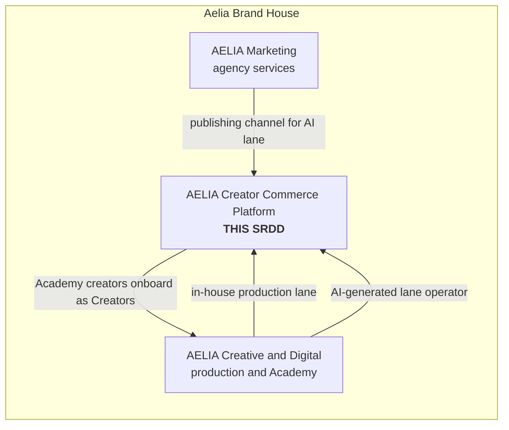
<p class="fig">Figure 1. The platform within the Aelia Brand House. Only the Creator Commerce Platform is in scope.</p>

## 2. Stakeholders & Actors

### 2.1 Human actors

| Actor | Primary role | Key capabilities | Codevertex identity |
|---|---|---|---|
| Brand Owner | Creates and manages creator campaigns and the brand's team | Register the organisation, verify, brief, shortlist, agree, fund, approve, review, rebook | SSO user with the AELIA role `brand_owner` |
| Brand Member | A team member acting for a brand | Permissions delegated by the Brand Owner (for example approver or viewer) | SSO user with the AELIA role `brand_member` |
| Creator | Offers influence, content and creative services | Passport, socials, rates, availability, apply or accept, deliver, get paid, review | SSO user with the AELIA role `creator` |
| AELIA Admin | Operates the marketplace and assures quality | Verification, curated matching, campaign administration, moderation, disputes | SSO user with the AELIA role `aelia_admin` |
| Finance / Administration | Monitors money and reconciliation | Verify bank-transfer proofs, approve payouts, reconcile, issue withholding certificates | SSO user with the AELIA role `aelia_finance`; OTP required on approvals |
| Super Administrator | System-level configuration | Integration profiles, tax and fee settings, roles, feature flags, audit | SSO user with the AELIA role `super_admin`; 2FA enforced |
| Agency Manager [Later] | Manages several brands from one account | Portfolio switching, consolidated reporting, bulk campaign tools | SSO user with the AELIA role `agency_manager` |

A single person may hold several roles, for example a creator who also owns a small brand. The platform supports one login with a role switcher.

### 2.2 System actors

| System actor | Role in AELIA |
|---|---|
| Identity Provider (default: Codevertex SSO) | Authentication, sessions, MFA, user profile |
| Notification Provider (default: Codevertex Notifications) | Email, SMS, WhatsApp and push delivery |
| Billing / Entitlements Provider (default: Codevertex Subscriptions) | Brand plans, feature gates, usage limits |
| Payment & Payout Provider (default: Codevertex Treasury over Paystack and M-Pesa) | Funding collection, payouts, GL posting, eTIMS |
| AI Runtime (default: MarketFlow Vera) | Brief builder assistance, AELIA Match scoring and explanations |
| Social Platforms (Meta, TikTok, YouTube, LinkedIn) | Creator account verification and audience and performance metrics |
| AI Video Vendors (HeyGen, Creatify) | Generation for the AI-content lane |

### 2.3 Use-case overview

<div class="uc"><div class="uc-col"><div class="uc-actor">Brand</div><div class="uc-item">Register and verify organisation</div><div class="uc-item">Invite brand team</div><div class="uc-item">Create campaign brief</div><div class="uc-item">Review AELIA Match shortlist</div><div class="uc-item">Choose lane in Composer</div><div class="uc-item">Agree terms and rights</div><div class="uc-item">Fund campaign</div><div class="uc-item">Review, revise, approve content</div><div class="uc-item">Measure performance</div><div class="uc-item">Rate creator and rebook</div></div><div class="uc-col"><div class="uc-actor">Creator</div><div class="uc-item">Register and verify identity</div><div class="uc-item">Build Creator Passport</div><div class="uc-item">Connect social accounts</div><div class="uc-item">Set rates and availability</div><div class="uc-item">Discover and apply to briefs</div><div class="uc-item">Accept engagement terms</div><div class="uc-item">Create and submit content</div><div class="uc-item">Submit publication proof</div><div class="uc-item">Track payout and tax</div><div class="uc-item">Rate brand</div></div><div class="uc-col"><div class="uc-actor">AELIA Admin</div><div class="uc-item">Verify brands and creators</div><div class="uc-item">Curate shortlists</div><div class="uc-item">Confirm matches and introduce</div><div class="uc-item">Administer campaigns</div><div class="uc-item">Moderate content and reviews</div><div class="uc-item">Resolve disputes</div><div class="uc-item">Run AI content lane</div></div><div class="uc-col"><div class="uc-actor">Finance</div><div class="uc-item">Verify bank-transfer proofs</div><div class="uc-item">Approve payout batches (OTP)</div><div class="uc-item">Monitor failed transactions</div><div class="uc-item">Reconcile ledger to providers</div><div class="uc-item">Export withholding register</div><div class="uc-item">Issue WHT certificates</div></div><div class="uc-col"><div class="uc-actor">Super Admin</div><div class="uc-item">Configure integration providers</div><div class="uc-item">Manage webhooks and callbacks</div><div class="uc-item">Set tax, fee and plan settings</div><div class="uc-item">Tune match weights</div><div class="uc-item">Manage roles and flags</div><div class="uc-item">Review audit log</div></div></div>
<p class="fig">Figure 2. Use-case overview by actor.</p>

## 3. Business Objectives & Product Principles

| # | Business objective (spec §1.4) | Product capability that serves it | Measured by |
|---|---|---|---|
| O1 | Connect brands with relevant creators | Passports, discovery, AELIA Match | Shortlists per brief, match acceptance rate |
| O2 | Turn marketing objectives into structured creator campaigns | Brief builder, Campaign Composer, workspace | Briefs published and completed |
| O3 | Create professional commercial opportunities for creators | Opportunity feed, invitations, agreements | Invitations and acceptances per creator |
| O4 | Facilitate campaign collaboration and payment | Workspace, licensed-rail funding, payouts | Funded campaigns, on-time payouts |
| O5 | Measure campaign and commercial outcomes | Performance tracking, reporting | Reports generated, metrics captured |
| O6 | Build two-sided reputation and trust | Verification, two-way reviews, disputes | Review coverage, dispute rate |
| O7 | Enable repeat bookings and relationships | Saved creators, rebooking | Repeat-booking rate |
| O8 | Build creator-commerce data and intelligence | Event stream, analytics store, match feedback loop | Match quality over time |
| O9 | Generate sustainable platform revenue | Configurable commission, fees and plans captured in the ledger | Ledger-reconciled platform revenue |

**Product principles**

1. **The platform recommends and the brand decides.** Matching explains its reasoning and never auto-books.
2. **Human in the loop for MVP.** AELIA staff confirm matches and introductions before money or a creator's time is committed.
3. **Money only moves on licensed rails.** AELIA records intents, splits and payouts and never holds client money.
4. **Compliance by default.** Withholding tax, data-protection consent and sponsored-content disclosure are built in from the MVP.
5. **KES-native, multi-currency-ready.** Currency, country and tax rules are per-account settings from day one.
6. **Everything configurable.** Rates, fees, plans, templates and integration providers are settings, not code.
7. **Differentiate on integration.** The differentiators are KES contracts and payouts, automatic withholding, cross-platform matching from one brief, a reconcilable audit trail, and the Influence plus Content dual marketplace.

## 4. Functional Requirements

Requirements are grouped by platform module (spec Part 2), plus the modules the feasibility review added: tax, AI content lane, integrations hub and compliance. They are specified for the **fully developed platform**. Each requirement carries a release tag, and only [MVP] and [v1] items are scheduled in the 6-month delivery plan (Part B). [Later] items make up the Future Enhancements Backlog (§7.4). Priorities follow MoSCoW: every [MVP] item is a *Must*, [v1] items are *Should*, and [Later] items are *Could*.

### 4.1 User Registration & Verification (REG)

| ID | Requirement | Release | Acceptance criteria |
|---|---|---|---|
| REG-01 | Brands, creators and AELIA staff sign up and sign in through the configured Identity Provider (default Codevertex SSO, OIDC + PKCE). | [MVP] | A new user completes SSO sign-up and lands on role onboarding; the AELIA user is provisioned just-in-time on first valid token. |
| REG-02 | Role selection at onboarding (Brand or Creator); one person may hold both, with a role switcher. | [MVP] | A user can create a Brand and a Creator profile under one login and switch context without re-authenticating. |
| REG-03 | Brand organisation registration: legal name, registration number, KRA PIN, industry, country, address, billing contact. | [MVP] | Required fields validated; KRA PIN format checked; organisation in `pending_verification`. |
| REG-04 | Creator registration: legal name, national ID or passport, date of birth (18+ gate), phone, email, KRA PIN, payout method. | [MVP] | Under-18 blocked; KRA PIN mandatory before any payout; payout method validated against provider. |
| REG-05 | Document upload for verification (certificate of incorporation, ID) to encrypted object storage. | [MVP] | Files ≤ 10 MB, PDF/JPG/PNG, virus-scanned, visible only to owner and verifiers. |
| REG-06 | Admin verification queue with approve / reject / request-more-info and reason codes; verified badge on Passport. | [MVP] | Decision is audited and notifies the applicant; unverified brands cannot fund and unverified creators cannot be booked. |
| REG-07 | Brand team management: invite members by email, assign brand roles (owner, approver, finance, viewer). | [MVP] | Invitee accepts via SSO; permissions enforced on every brand-scoped endpoint. |
| REG-08 | Two-step login (MFA) enforced for AELIA Admin, Finance and Super Admin; optional for others. | [v1] | Staff roles cannot reach admin routes without an MFA-asserted session (`amr` claim). |
| REG-09 | Automated KYC/KYB checks via a pluggable verification provider (ID and company registry lookups). | [Later] | Provider result is attached to the verification case; manual override retained. |
| REG-10 | Social sign-in (Google, Apple) through the Identity Provider. | [Later] | Enabled per IdP configuration with no AELIA code change. |

### 4.2 Creator Passport (CPP)

| ID | Requirement | Release | Acceptance criteria |
|---|---|---|---|
| CPP-01 | Profile: display name, bio, photo, location, languages, niches (taxonomy), skills, content formats. | [MVP] | Passport completeness score shown; publishable at ≥ 70%. |
| CPP-02 | Platforms and audience entered manually: handle, URL, follower count, average views, engagement rate, audience geography, age and gender split. | [MVP] | Values marked "self-declared" until verified. |
| CPP-03 | Rates and packages: per-deliverable rate cards (post, reel, story, video, UGC asset, usage-rights add-ons) in account currency. | [MVP] | Packages selectable in briefs and agreements; the currency follows account settings. |
| CPP-04 | Availability calendar and capacity (maximum concurrent campaigns). | [MVP] | Matching excludes unavailable creators for the brief window. |
| CPP-05 | Portfolio: uploaded samples and external links, tagged by niche and format. | [MVP] | Media stored in object storage, with thumbnails generated. |
| CPP-06 | Usage-rights preferences: default licence terms offered (duration, territory, paid-media allowance, exclusivity). | [MVP] | Defaults prefill the agreement and can be edited per deal. |
| CPP-07 | Campaign history and on-platform track record: completed campaigns, on-time rate, approval rate, average rating. | [v1] | Computed from platform events and not editable by the creator. |
| CPP-08 | Connected social accounts via OAuth (Instagram, Facebook, TikTok, YouTube, LinkedIn) with verified metrics refresh. | [v1] | Verified badge per platform; tokens encrypted; metrics refreshed daily; revocation honoured. |
| CPP-09 | Academy credential badge for AELIA Academy graduates. | [v1] | Badge set by admin or by an integration event. |
| CPP-10 | Deeper audience analytics (audience quality, fake-follower signals, brand-affinity). | [Later] | Scores sourced through a pluggable analytics provider. |

### 4.3 Brand Passport (BPP)

| ID | Requirement | Release | Acceptance criteria |
|---|---|---|---|
| BPP-01 | Organisation profile: logo, description, industry, locations, website, social links, verification status. | [MVP] | Visible to invited and applied creators. |
| BPP-02 | Commercial reputation: payment reliability (on-time funding and approval), campaign count, creator ratings. | [v1] | Computed from ledger and review events. |
| BPP-03 | Brand guidelines library (tone, do/don't, assets) reusable across briefs. | [v1] | Attachable to any brief. |
| BPP-04 | Agency portfolio: one agency account managing several brand passports. | [Later] | Agency users switch brand context; consolidated reporting. |

### 4.4 Creator Discovery (DIS)

| ID | Requirement | Release | Acceptance criteria |
|---|---|---|---|
| DIS-01 | Search creators by keyword, niche, platform, location, language, follower band, engagement band, rate band and availability. | [MVP] | Results in < 1 s p95 for 10k creators; filters combinable. |
| DIS-02 | Creator cards and a full Passport view with portfolio and rates (visible only to verified brands). | [MVP] | Contact details hidden until an agreement exists. |
| DIS-03 | Shortlists: save creators to named lists per campaign or globally. | [MVP] | Shortlists shared with brand team members. |
| DIS-04 | Opportunity discovery for creators: open briefs matching their niche and platform. | [MVP] | Creators see only open, funded-intent briefs they qualify for. |
| DIS-05 | Admin-curated shortlist attached to a brief by AELIA staff. | [MVP] | The brand sees an "AELIA curated" label and the admin's note per creator. |
| DIS-06 | Saved searches and alerts for new matching creators. | [v1] | Notification when a new verified creator matches. |

### 4.5 Creator Matching: AELIA Match (MAT)

| ID | Requirement | Release | Acceptance criteria |
|---|---|---|---|
| MAT-01 | Human-curated matching: an AELIA Admin reviews each brief and publishes a shortlist with rationale. | [MVP] | Every submitted brief has a curated shortlist within the configured SLA (default 2 business days). |
| MAT-02 | Rules-based scoring across niche, platform, geography, audience fit, performance, budget fit, reliability, suitability and availability, with configurable weights. | [v1] | Every brief gets a ranked shortlist with a per-factor score breakdown; weights editable by Super Admin. |
| MAT-03 | Explanations: "why this creator" text generated by the AI runtime from the score factors. | [v1] | Explanation shown per recommendation; no automated booking. |
| MAT-04 | Human confirmation step: an admin confirms or adjusts the brand's selection before agreement. | [MVP] | Selection cannot move to agreement without an admin confirmation record. |
| MAT-05 | Feedback loop: brand accept/reject reasons are captured to tune weights. | [v1] | Reasons stored and reported in admin match-quality analytics. |
| MAT-06 | Predictive matching model trained on platform outcomes. | [Later] | Delivered through the same `AIMatchProvider` port; A/B tested against the rules engine. |

### 4.6 Campaign Creation & Campaign Composer (CMP)

| ID | Requirement | Release | Acceptance criteria |
|---|---|---|---|
| CMP-01 | Brief builder: objective, target audience, platforms, deliverables (type, quantity, specs), timeline, budget, content requirements, usage rights, disclosure requirements. | [MVP] | Brief validates required fields; saved as draft, then submitted. |
| CMP-02 | Campaign type: Influence, Content (UGC) or both. | [MVP] | Deliverable templates adapt to the type. |
| CMP-03 | Budget and currency, with an automatic fee preview (commission, taxes) from current settings. | [MVP] | Preview matches ledger computation for the same inputs. |
| CMP-04 | Creator invitation (direct) and open call (applications) modes. | [MVP] | Invited creators get notifications; open-call applications are listed for the brand. |
| CMP-05 | AI Brief Builder: assisted drafting of objective, deliverables and messaging from a short prompt. | [v1] | Suggestions are editable; nothing is saved without brand confirmation. |
| CMP-06 | Campaign Composer: side-by-side options per brief across the lanes: Human Creator, AELIA Creative & Digital in-house production, Hybrid, and AI-Generated. | [v1] | Each lane shows indicative cost and timeline computed from settings and rate cards. |
| CMP-07 | Campaign templates and duplicate-campaign. | [v1] | Duplicate copies the brief without agreements or payments. |
| CMP-08 | Multi-market campaigns (several countries or currencies in one campaign). | [Later] | Per-market sub-budgets and tax rules. |

### 4.7 Campaign Workspace (WSP)

| ID | Requirement | Release | Acceptance criteria |
|---|---|---|---|
| WSP-01 | A single workspace per campaign showing brief, participants, agreements, messages, deliverables, deadlines, content, approvals, payments and performance. | [MVP] | All tabs available and permission-scoped. |
| WSP-02 | Deliverable tracker with due dates, status and overdue flags. | [MVP] | Overdue items trigger reminders at configurable offsets. |
| WSP-03 | Activity timeline (audit of state changes) visible to participants. | [MVP] | Every state transition appears with actor and time. |
| WSP-04 | Per-creator sub-workspaces in multi-creator campaigns. | [MVP] | Creators see only their own thread, deliverables and payout. |
| WSP-05 | Shared files area with version history. | [v1] | Previous versions retained and downloadable. |

### 4.8 Content Marketplace, Submission & Approval (CNT)

| ID | Requirement | Release | Acceptance criteria |
|---|---|---|---|
| CNT-01 | Creators submit drafts (video, image, copy, links) per deliverable. | [MVP] | Upload up to 1 GB via resumable, direct-to-storage upload; preview generated. |
| CNT-02 | Brand review: approve, or request revision with comments, within the agreed revision allowance. | [MVP] | Revision counter enforced; exceeding the allowance needs creator consent or a change fee. |
| CNT-03 | Approval locks the approved version (hash recorded) and triggers payout eligibility. | [MVP] | Approved asset is immutable; the SHA-256 is stored on the approval record. |
| CNT-04 | Publication proof for influence deliverables: live post URL and screenshot; platform verification where the API permits. | [MVP] | Proof is required before a deliverable is marked "published". |
| CNT-05 | Sponsored-content disclosure check: required disclosure tag present (for example #ad, a paid-partnership label). | [MVP] | Checklist is mandatory at submission; admin brand-safety report path available. |
| CNT-06 | Time-coded comments on video drafts. | [v1] | Comments pinned to timestamps. |
| CNT-07 | Content library for brands with licence metadata (rights, expiry, territory). | [v1] | Expiry reminders sent before the licence ends. |
| CNT-08 | Automated brand-safety and content moderation scanning. | [Later] | Via a pluggable moderation provider; flags go to the admin queue. |

### 4.9 Contracts & Rights (AGR)

| ID | Requirement | Release | Acceptance criteria |
|---|---|---|---|
| AGR-01 | Versioned platform terms (Brand Terms, Creator Terms, Privacy Policy, Acceptable Use) with recorded acceptance (user, version, time, IP). | [MVP] | No brief submission or application without acceptance of the current terms. |
| AGR-02 | Per-campaign engagement records: AELIA–Brand campaign order and AELIA–Creator engagement, linked by one campaign reference. | [MVP] | Both records are generated from agreed terms; each party accepts its own record. |
| AGR-03 | Terms captured: deliverables, fees, deadlines, revisions, cancellation, ownership, usage, territory, duration, exclusivity, payout schedule, disclosure. | [MVP] | Fields are structured, not free text only; rendered to PDF with a hash. |
| AGR-04 | Content-rights chain: the creator licences rights to AELIA, and AELIA passes them to the brand, recorded per deliverable. | [MVP] | The rights record is visible on each approved asset. |
| AGR-05 | Amendments with re-acceptance and version history. | [v1] | Prior versions immutable; the diff is visible. |
| AGR-06 | Qualified electronic signature via a pluggable e-signature provider. | [Later] | The provider is selectable in the Integrations Hub. |

### 4.10 Communication & Notifications (COM)

| ID | Requirement | Release | Acceptance criteria |
|---|---|---|---|
| COM-01 | Campaign-scoped messaging between brand, creator and AELIA staff, with attachments. | [MVP] | Messages delivered in real time (SSE) with read receipts; no off-campaign DMs. |
| COM-02 | In-platform notification centre (bell) for all state changes. | [MVP] | Unread counter; mark-all-read; deep links. |
| COM-03 | Email and SMS notifications for key events via the configured Notification Provider. | [MVP] | Templates `aelia/*` for every event in the catalogue (§23). |
| COM-04 | WhatsApp notifications where AELIA has an active WhatsApp configuration. | [v1] | Meta-approved templates with button links. |
| COM-05 | Web push via the PWA. | [v1] | Opt-in prompt; delivery via the configured push channel. |
| COM-06 | Per-user notification preferences by channel and category. | [v1] | Transactional and security messages cannot be disabled. |
| COM-07 | Contact-detail masking in messages until an agreement exists. | [MVP] | Phone numbers and emails redacted with a notice. |

### 4.11 Payments (PAY)

| ID | Requirement | Release | Acceptance criteria |
|---|---|---|---|
| PAY-01 | Campaign funding by card or M-Pesa through the configured Payment Provider (default Codevertex Treasury). | [MVP] | Funding intent created; brand pays; campaign moves to `funded` only on a verified provider event. |
| PAY-02 | Bank transfer with proof-of-payment upload and Finance verification. | [MVP] | Finance approves with OTP; the ledger posts on approval; rejection notifies the brand. |
| PAY-03 | Per-transaction commission ledger (double-entry) for funding, commission, withholding, payouts, refunds and fees. | [MVP] | Every movement balances; the ledger reconciles to provider statements to the shilling. |
| PAY-04 | Creator payouts via M-Pesa (B2C or Pochi) or bank, per payout schedule: full on approval, starting fee then balance, or full upfront (eligibility-gated). | [MVP] | Payout amount = gross share − withholding − fees; idempotent; status visible to both sides. |
| PAY-05 | Refunds and cancellations per agreement terms (full, partial, pro-rata). | [MVP] | Refund routed through the original rail; ledger reversal posted. |
| PAY-06 | Transaction statuses and receipts on brand and creator dashboards. | [MVP] | Receipts downloadable as PDF. |
| PAY-07 | Configurable fee settings: commission rates by plan or campaign type, AI-lane fees, processing-fee pass-through. | [v1] | Effective-dated; changes audited; never retroactive to funded campaigns. |
| PAY-08 | Bulk payouts and a payout approval batch for Finance. | [v1] | Batch approval with OTP; partial-failure handling. |
| PAY-09 | Multi-currency collection and payout (UGX, TZS, RWF, NGN and others). | [Later] | Currency per account and campaign; FX recorded at transaction. |
| PAY-10 | Affiliate and promo-code commissions paid to creators. | [Later] | See AFF module. |

### 4.12 Tax & Compliance (TAX)

| ID | Requirement | Release | Acceptance criteria |
|---|---|---|---|
| TAX-01 | Configurable tax engine: work categories, rates, thresholds and effective dates; default rule is digital-content withholding at 5% of the gross creator fee. | [MVP] | Tax computed at payout from the rule effective on the payout date; the rule version is stored on the payout. |
| TAX-02 | KRA PIN capture and validation for creators and brands before the first payout or funding. | [MVP] | Payout blocked without a validated PIN. |
| TAX-03 | Withholding register and a remittance export for Finance. | [MVP] | Monthly export totals equal the ledger WHT account balance. |
| TAX-04 | Monthly withholding certificates per creator (PDF), downloadable and emailed. | [v1] | A certificate is issued for every creator with WHT in the month. |
| TAX-05 | eTIMS invoice for AELIA's commission and fees via Treasury eTIMS. | [v1] | Invoice transmitted; failures retried and flagged. |
| TAX-06 | VAT treatment of platform fees as a configurable rule. | [v1] | VAT applied per rule; shown on receipts. |
| TAX-07 | Country tax packs for regional expansion. | [Later] | Tax rules loaded per country configuration. |

### 4.13 Performance Tracking (PRF)

| ID | Requirement | Release | Acceptance criteria |
|---|---|---|---|
| PRF-01 | Manual performance entry by the creator (reach, views, engagement, clicks) with screenshot evidence. | [MVP] | Required for influence deliverables at +7 days after publication. |
| PRF-02 | API-based metrics for connected accounts (views, likes, comments, shares, saves, reach) where platform permissions allow. | [v1] | Metrics refreshed daily for 30 days after publication. |
| PRF-03 | Tracked links (UTM plus short link) per creator and deliverable, to count clicks and conversions. | [v1] | Clicks attributed to the creator and campaign. |
| PRF-04 | Leads, conversions and sales via brand pixel or server-to-server postback. | [Later] | Postback URL per campaign; signed. |

### 4.14 Reputation (REP)

| ID | Requirement | Release | Acceptance criteria |
|---|---|---|---|
| REP-01 | Two-sided reviews after completion: the brand rates the creator and the creator rates the brand (1–5 stars across criteria, plus text). | [v1] | Double-blind: revealed when both submit or after 14 days. |
| REP-02 | Reputation scores feed Passports and matching. | [v1] | Scores recomputed on each new review. |
| REP-03 | Review moderation and a right of reply. | [v1] | Flagged reviews go to the admin queue. |

### 4.15 Rebooking (RBK)

| ID | Requirement | Release | Acceptance criteria |
|---|---|---|---|
| RBK-01 | Saved creators and "work again" lists. | [MVP] | Available from any completed campaign. |
| RBK-02 | Rebook flow: new campaign pre-filled with the same creator, terms and deliverables. | [v1] | Completed in ≤ 3 steps; admin confirmation optional for trusted pairings. |
| RBK-03 | Retainers and recurring campaigns (monthly deliverables). | [Later] | Recurring schedule with per-cycle funding. |

### 4.16 Reporting & Analytics (RPT)

| ID | Requirement | Release | Acceptance criteria |
|---|---|---|---|
| RPT-01 | Basic dashboards: brand (campaigns, spend, status), creator (earnings, pending payouts), admin (queues, volumes). | [MVP] | Loaded in < 2 s p95. |
| RPT-02 | Campaign performance report per campaign (deliverables, metrics, cost per engagement). | [v1] | Exportable as PDF and CSV. |
| RPT-03 | Financial reports: funding, commission, WHT, payouts and refunds by period; reconciliation report. | [MVP] | Totals equal ledger balances. |
| RPT-04 | Platform analytics: GMV, active brands and creators, repeat-booking rate, AI-lane orders, match acceptance. | [v1] | Computed from the event store; daily refresh. |
| RPT-05 | Self-service BI and data export to AELIA's own warehouse. | [Later] | Scheduled export via the data connector. |

### 4.17 Administration (ADM)

| ID | Requirement | Release | Acceptance criteria |
|---|---|---|---|
| ADM-01 | Verification queue and user management (suspend, reinstate, role changes). | [MVP] | Every action audited with reason. |
| ADM-02 | Campaign administration: view any campaign, curate shortlists, confirm matches, intervene in state. | [MVP] | Interventions require a reason and are visible in the timeline. |
| ADM-03 | Payment monitoring: funding, payouts, failed transactions, manual-payment verification. | [MVP] | Failures alert Finance within 5 minutes. |
| ADM-04 | Dispute case management: open, evidence, messages, decision, financial outcome (release, partial refund, full refund). | [v1] | The decision posts the correct ledger entries; parties notified. |
| ADM-05 | Moderation: flagged content, reviews and messages; brand-safety reports. | [v1] | SLA timers shown on the queue. |
| ADM-06 | Platform configuration: taxonomies, fee and tax settings, templates, feature flags, match weights. | [MVP] | Effective-dated changes; audit trail. |
| ADM-07 | Integrations Hub (see INT). | [MVP] | See Part D. |
| ADM-08 | Full audit log explorer with export. | [v1] | Filter by actor, entity and time; tamper-evident. |

### 4.18 AI-Generated Content Lane (AIC)

| ID | Requirement | Release | Acceptance criteria |
|---|---|---|---|
| AIC-01 | Managed-service request: a brand selects the AI lane; the order is fulfilled by AELIA Creative & Digital off-platform, then delivered and approved in the workspace. | [MVP] | The order follows the same brief, funding and approval flow; operator is an internal role. |
| AIC-02 | Integrated AI video vendor (HeyGen or Creatify first) via the `AIVideoVendor` port: script or product URL to draft clip. | [v1] | Clip generated, stored and routed to human review before delivery. |
| AIC-03 | Automatic cost per clip (vendor cost, operator time, infrastructure share) and brand price from settings. | [v1] | Cost and price recorded on every order. |
| AIC-04 | Publishing through AELIA Marketing channels as an add-on. | [v1] | Publication proof recorded like CNT-04. |
| AIC-05 | Hybrid lane: creator brief plus AI-assisted cut-downs, variants and dubbing. | [v1] | Extra cuts itemised per deliverable. |
| AIC-06 | Cinematic tier (Sora, Veo, Kling, Runway) gated behind human review. | [Later] | Added as new adapters with no core change. |

### 4.19 Integrations Hub (INT)

| ID | Requirement | Release | Acceptance criteria |
|---|---|---|---|
| INT-01 | Codevertex default integration profile seeded and active at install for identity, notifications, entitlements, payments and payouts, AI runtime. | [MVP] | A fresh environment works end-to-end with no manual provider set-up beyond secrets. |
| INT-02 | Super Admin can view every capability's bound provider, health, last error and configuration. | [MVP] | Status page shows health checked every 60 s. |
| INT-03 | Register an alternative provider for any capability via a built-in adapter or the declarative REST connector, and bind it with fallback. | [v1] | "Test connection" and conformance checks must pass before activation. |
| INT-04 | Inbound webhook endpoints per provider with configurable signature verification. | [MVP] | Unsigned or invalid requests rejected with 401 and logged. |
| INT-05 | Outbound webhooks and callback subscriptions for AELIA events with HMAC signing, retries and a delivery log. | [v1] | Deliveries retried with exponential backoff for 24 h; manual replay. |
| INT-06 | Credentials stored encrypted; only fingerprints displayed; rotation without downtime. | [MVP] | Secrets never returned by any API. |
| INT-07 | Per-organisation provider overrides (for example an agency bringing its own payment account). | [Later] | Binding scope `organisation`. |

### 4.20 Future platform modules

| ID | Requirement | Release | Notes |
|---|---|---|---|
| MOB-01 | Native Android app | [Later] | Built on the same public API and IdP; push via FCM. |
| MOB-02 | Native iOS app | [Later] | As MOB-01; App Store accounts owned by AELIA. |
| AFF-01 | Affiliate commerce: creator storefront links, promo codes, conversion-based commission | [Later] | Reuses tracked links (PRF-03) and the ledger. |
| GEO-01 | Regional expansion (Uganda, Tanzania, Rwanda, then wider Africa): country as a tenant with its own currency, tax pack, rails and entity | [Later] | Supported by the multi-tenant design (§12.4). |
| AUT-01 | Advanced automation: auto-shortlist, auto-reminders, SLA escalations and rule builder | [Later] | NATS-driven workflow rules. |
| AIX-01 | Advanced AI-generated content, predictive performance and budget optimiser | [Later] | Via AI ports. |

## 5. User Journeys

### 5.1 Brand journey (16 stages)

```mermaid
flowchart LR
  B1["1 Register"] --> B2["2 Verify"] --> B3["3 Create campaign"] --> B4["4 Define objective"]
  B4 --> B5["5 Match"] --> B6["6 Shortlist"] --> B7["7 Select"] --> B8["8 Agree"]
  B8 --> B9["9 Fund"] --> B10["10 Collaborate"] --> B11["11 Review and approve"] --> B12["12 Publish"]
  B12 --> B13["13 Measure"] --> B14["14 Pay"] --> B15["15 Review"] --> B16["16 Rebook"]
  B16 -.->|repeat business| B3
```
<p class="fig">Figure 3. Brand journey. Stages 5–8 include the AELIA human confirmation step (MAT-04).</p>

### 5.2 Creator journey (16 stages)

```mermaid
flowchart LR
  C1["1 Register"] --> C2["2 Verify"] --> C3["3 Complete Passport"] --> C4["4 Connect socials"]
  C4 --> C5["5 Set niche, rates,<br/>availability"] --> C6["6 Discover opportunities"] --> C7["7 Apply or accept"] --> C8["8 Create"]
  C8 --> C9["9 Submit"] --> C10["10 Revise"] --> C11["11 Approved"] --> C12["12 Publish where required"]
  C12 --> C13["13 Report performance"] --> C14["14 Get paid"] --> C15["15 Review brand"] --> C16["16 Rebooked"]
```
<p class="fig">Figure 4. Creator journey. In MVP, stage 4 is manual entry; OAuth verification follows in v1.</p>

### 5.3 How one campaign moves through the platform

| Step | What happens | System behaviour |
|---|---|---|
| 1 | The brand posts a brief: objective, audience, platform, deliverables, budget. No money moves. | Campaign `draft` → `submitted`; event `aelia.campaign.submitted`. |
| 2 | AELIA Match generates options: matching creators, in-house production where the budget fits, and the AI lane where it fits. | MVP: admin-curated shortlist. v1: rules-based ranking plus Composer lanes. |
| 3 | The brand picks one option or shortlists several. This is a preference, not a booking. | Selection recorded as `proposed`. |
| 4 | An AELIA reviewer confirms the pick against the brief or suggests an adjustment. | Admin confirmation record required (MAT-04). |
| 5 | AELIA contacts the creator and arranges an introduction with the brand. In-house and AI lanes skip to production once funded. | Invitation plus notification; introduction logged in the workspace. |
| 6 | Terms are agreed: deliverables, deadline, fee, usage rights and payout schedule. The brand accepts the AELIA campaign order and the creator accepts the AELIA engagement. | Two linked engagement records; `agreed`. |
| 7 | The brand funds the campaign through the licensed rail, or by bank transfer with proof for Finance to verify. | Payment intent created in Treasury; `funded` only on a verified event. |
| 8 | The commission is set aside immediately. The creator's share follows the agreed payout schedule. | Ledger entries posted; a starting fee is released if scheduled. |
| 9 | The creator produces and submits; the brand reviews, requests permitted revisions, and approves. | Submission and revision loop; approved version hash-locked. |
| 10 | The remaining fee is paid out with withholding applied. Both sides review; the brand can rebook. | Payout with WHT; `completed`; review window opens. |

## 6. Non-Functional Requirements

<div class="kpis">
  <div class="kpi"><b>99.5%</b><span>Monthly platform availability from pilot launch</span></div>
  <div class="kpi"><b>&lt; 0.5 s</b><span>p95 API and page response time</span></div>
  <div class="kpi"><b>4 h / 24 h</b><span>Recovery time / maximum data-loss window</span></div>
  <div class="kpi"><b>≥ 70%</b><span>Test coverage on payment, commission and tax code</span></div>
  <div class="kpi"><b>0</b><span>Open high or critical security findings at launch</span></div>
  <div class="kpi"><b>To the shilling</b><span>Monthly ledger reconciliation accuracy</span></div>
  <div class="kpi"><b>2 h</b><span>Critical support response, any day</span></div>
  <div class="kpi"><b>85%</b><span>Committed sprint work delivered per sprint</span></div>
</div>

| ID | Category | Requirement | Release |
|---|---|---|---|
| NFR-01 | Availability | 99.5% monthly availability for `aelia-api` and `aelia-ui`; `replicaCount: 2` and a PodDisruptionBudget of `minAvailable: 1`. | [MVP] |
| NFR-02 | Performance | 95% of API requests under 500 ms; dashboards under 2 s; search under 1 s at 10k creators and 1k concurrent users. | [MVP] |
| NFR-03 | Scalability | Stateless services behind HPA; NATS consumers use queue groups; object storage for media; no local disk state. | [MVP] |
| NFR-04 | Recoverability | RTO 4 h and RPO 24 h, with a restore proven by drill before v1. Daily database backups and quarterly restore tests. | [v1] |
| NFR-05 | Data integrity | Every money movement is double-entry, idempotent and reconcilable; outbox for every domain event; no lost events. | [MVP] |
| NFR-06 | Security | OWASP ASVS L2 controls; TLS 1.2+; encryption at rest for secrets and PII documents; zero open high or critical findings at launch. | [MVP] |
| NFR-07 | Privacy | Kenya Data Protection Act 2019 compliance: consent log, DSR workflow, retention schedule (Part I). | [MVP] |
| NFR-08 | Usability | Mobile-first responsive PWA, installable to the home screen; every core journey completes on a 360 px-wide screen. | [MVP] |
| NFR-09 | Accessibility | WCAG 2.1 AA for all brand and creator screens. | [v1] |
| NFR-10 | Localisation | English at launch; i18n-ready strings; currency, date and number formats per account; Kiswahili [Later]. | [MVP] |
| NFR-11 | Configurability | Rates, fees, taxes, plans, templates, match weights and integration providers are runtime settings with audit and effective dates. | [MVP] |
| NFR-12 | Interoperability | Every external dependency is behind a port with at least one alternative adapter path (Part D). | [MVP] |
| NFR-13 | Observability | Structured logs with `request_id`, `tenant_id` and `user_id`; health and readiness endpoints; alerting to the on-call channel within 5 minutes. | [MVP] |
| NFR-14 | Maintainability | Codevertex Go and Next.js standards; code review by a second engineer; generated API docs; runbooks. | [MVP] |
| NFR-15 | Portability and ownership | Container images and Helm values reproducible on AELIA-controlled infrastructure; source in a repository AELIA can access. | [MVP] |
| NFR-16 | Auditability | Tamper-evident audit log of admin, finance and configuration actions retained for 7 years. | [MVP] |

## 7. Release Scope & Future Enhancements

### 7.1 Release definitions

| Release | Target | Definition |
|---|---|---|
| [MVP] Pilot | Week 13 (month 3) | A real brand funds a real campaign, a real creator delivers and is paid, and the ledger reconciles to the shilling, in production. Matching is admin-curated; socials are entered manually; the AI lane is a managed service. |
| [v1] Version 1 | Week 24 (month 6) | Rules-based AELIA Match, Passport v2 with connected social metrics, reviews and rebooking, reporting, withholding certificates, fee settings, the integrated AI content lane, the full admin console, and hardening, security review, load test and UAT. |
| [Later] Enhancements | Not scheduled | Native apps, predictive AI, affiliate commerce, regional expansion, advanced automation and further integrations. These are specified here so the architecture accommodates them. |

### 7.2 Requirements by release

<div class="chart"><!-- chart:scope --></div>
<p class="fig">Figure 5. Functional requirements per module by release (129 requirements: 65 MVP, 42 v1, 22 Later).</p>

<div class="kpis">
  <div class="kpi"><b>129</b><span>Functional requirements for the full platform</span></div>
  <div class="kpi"><b>65</b><span>Delivered in the MVP pilot (week 13)</span></div>
  <div class="kpi"><b>42</b><span>Added in Version 1 (week 24)</span></div>
  <div class="kpi"><b>22</b><span>Future enhancements backlog, not scheduled</span></div>
</div>
<p class="fig">Figure 6. Share of the full platform delivered within the six-month plan: 107 of 129 requirements (83%).</p>

### 7.3 Pilot validation targets

| Indicator | Target |
|---|---|
| Brands onboarded and verified | 8–10 |
| Creators onboarded with a verified Passport | 15–20 |
| Real campaigns run end to end | At least 5 |
| Paid end-to-end transactions through the platform | At least 3 |
| Content delivered on time | 90% or more |
| Brands intending to rebook | At least 2 |
| User feedback | Collected, triaged each sprint and reviewed |
| Economic validation data | Campaign value, platform revenue, creator payout, payment costs and support costs, reported from the ledger |

### 7.4 Future Enhancements Backlog (not scheduled in the 6-month plan)

| Enhancement | Requirement IDs | Architectural provision already in this design |
|---|---|---|
| Native Android and iOS apps | MOB-01, MOB-02 | Public versioned API; OIDC public clients; push via the Notification port |
| Predictive AI matching and AI optimisation | MAT-06, AIX-01 | `AIMatchProvider` port; event history retained for training |
| Full affiliate ecosystem | AFF-01, PRF-04, PAY-10 | Tracked links, signed postbacks, ledger account types |
| Regional expansion | GEO-01, PAY-09, TAX-07, CMP-08 | Tenant-per-country, currency on every amount, tax packs |
| Advanced automation | AUT-01 | NATS event stream and a rule-engine hook |
| Automated KYC/KYB, e-signature, moderation, audience analytics | REG-09, AGR-06, CNT-08, CPP-10 | New capabilities registered in the Integrations Hub |
| Agency accounts and per-organisation provider overrides | BPP-04, INT-07 | Organisation-scoped bindings and roles |
| Retainers and recurring campaigns | RBK-03 | Campaign schedule entity |
| BI export and more AI vendors and formats | RPT-05, AIC-06 | Outbound webhooks and data connector; `AIVideoVendor` port |

## Part B · Methodology & Delivery

How the MVP and Version 1 scope is delivered in 26 weeks: the method, the governance, the plan, and the gates AELIA signs off.

## 8. Delivery Methodology

### 8.1 Approach

Delivery is **agile (Scrum-based) in 13 two-week sprints**. A working demo closes every sprint, and five formal gates (G1–G5) require AELIA sign-off before the next stage. Requirements and system design (this SRDD) are completed **before** development starts on **5 October 2026**. Build phases then overlap, so building, testing and pilot validation run side by side instead of in sequence. This is how the concept's prove-the-workflow-manually-first principle fits into a 6-month plan.

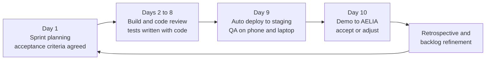
<p class="fig">Figure 7. The ten-working-day sprint cycle, repeated 13 times across 26 weeks.</p>

### 8.2 Engineering practices

| Practice | Standard |
|---|---|
| Source control | Git with protected `main`; feature branches; pull requests reviewed by a second engineer |
| CI | Lint, unit and integration tests, Ent and Atlas migration check, container build and vulnerability scan on every PR |
| CD | GitOps: merge to `main` builds an image, CI bumps `image.tag`, ArgoCD syncs staging automatically; production promotion is a reviewed tag |
| Testing | Test-first for money, tax and state-machine code; contract tests for every integration adapter (Part K) |
| Documentation | OpenAPI generated from handlers; ADRs for significant decisions; runbooks kept with the code |
| Environments | Development (local and preview), Staging (production-like, sandbox providers), Production |
| Feature flags | Incomplete v1 features are shipped dark behind flags so MVP production stays stable |

### 8.3 Definition of Done (every feature)

Requirements spec §5.2 and the delivery DoD combined: **BUILD → TEST → SECURITY CHECK → DOCUMENTATION → UAT → AELIA APPROVAL**.

| Requirement | Completion condition |
|---|---|
| Functionality | Meets the acceptance criteria agreed at sprint planning and the FR in §4 |
| UI / UX | Screens and workflow completed; checked on a phone and a laptop |
| Code quality | Reviewed by a second engineer; automated tests pass in CI |
| Money-code coverage | Payment, commission and tax code has at least 70% test coverage |
| Integration | Required APIs tested against sandbox providers; adapter conformance suite passes |
| Security | Access and permissions tested; no known high or critical issue open |
| Error handling | Key failure scenarios tested (provider timeout, duplicate webhook, invalid signature, insufficient permission) |
| Analytics | Required domain events emitted and visible in the event log |
| Documentation | API docs, user help and runbook updated |
| Deployment | Deployed to staging automatically |
| UAT and approval | Demonstrated to AELIA and accepted by the designated product owner |

### 8.4 Change control

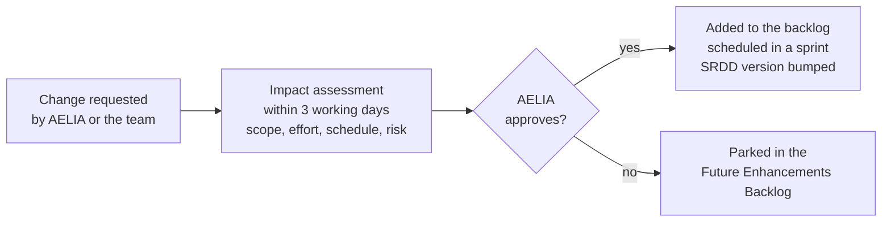
<p class="fig">Figure 8. Change control. Approved changes update this SRDD (minor version) and the traceability matrix.</p>

## 9. Governance, Roles & Responsibilities

### 9.1 Governance cadence

| Forum | Cadence | AELIA | Codevertex | Purpose |
|---|---|---|---|---|
| Steering | Monthly | Board representative (Erick Wanga) | Director (Titus Owuor) | Scope, gates, risks, go/no-go |
| Product | Weekly | Product owner | Technical lead | Backlog order, decisions, acceptance |
| Delivery | Fortnightly | Pilot operations (Creative & Digital, Marketing) | Delivery team | Sprint demo and feedback |
| Status | Every Friday | Product owner | Technical lead | Written update: done, next, blocked |

A shared project board is open to AELIA at all times. The named contact for urgent questions is the technical lead.

### 9.2 Delivery team

| Member | Role | Responsibilities |
|---|---|---|
| Titus Owuor | Technical lead, backend and infrastructure | Refines requirements and owns this SRDD; architecture, payments, commission and tax logic, security, infrastructure, releases |
| Steve Oginga | Backend engineer | Onboarding, Passports, campaigns, messaging, payouts, tax, reporting, and the integration adapters for Codevertex services |
| Meshack Isava | Frontend engineer | Design system in AELIA's brand, brand and creator journeys, dashboards, admin console, installable PWA |

### 9.3 RACI

| Responsibility | AELIA | Titus | Steve | Meshack |
|---|---|---|---|---|
| Product priorities and backlog order | A | C | C | C |
| Critical technical decisions | A (jointly) | R, A (jointly) | C | C |
| Backend services and integrations | I | A | R | I |
| Web app and user experience | C | A | C | R |
| Infrastructure, security, releases | I | A, R | C | C |
| Payment, commission and tax logic | C | A, R | R | I |
| Pilot recruitment and onboarding | A, R | C | I | I |
| User acceptance testing | A, R | R | C | C |

<p class="fig">R does the work · A is accountable and signs off · C is consulted · I is kept informed.</p>

## 10. Delivery Roadmap: MVP and Version 1

### 10.1 Phases and gates

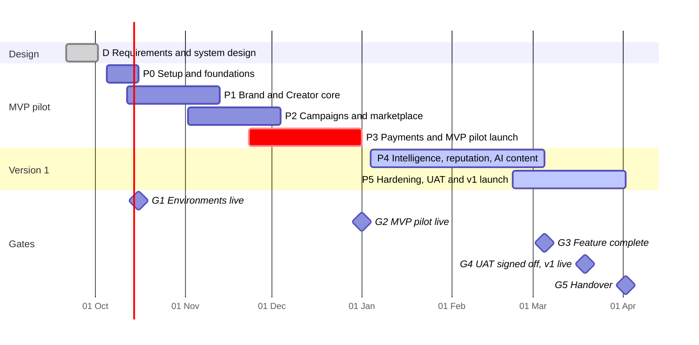
<p class="fig">Figure 9. Delivery plan from 5 October 2026 (week 1). Payments (P3) start in week 8, so the pilot goes live with real transactions at week 13.</p>

| Phase | Weeks | Deliverables | Exit criteria and gate |
|---|---|---|---|
| D · Requirements and system design | Before 5 Oct | This SRDD; screen flows; a ready build backlog | SRDD signed off by AELIA, so developers start with nothing left to guess |
| P0 · Setup and foundations | 1–2 | Dev, staging and production environments on AELIA-controlled accounts; CI/CD; monitoring; AELIA design system; SSO working; Codevertex default integration profile seeded | **G1**: every change deploys to staging automatically; a test brand and a test creator can sign in |
| P1 · Brand and Creator core | 2–6 | Brand onboarding and verification; creator onboarding; Creator Passport v1; Brand Passport v1; admin verification queue; user management | A brand and a creator register, are verified by an admin and see their Passports |
| P2 · Campaigns and marketplace | 5–9 | Brief builder with content rights; discovery and curated shortlist; workspace and messaging; submission, revision, approval; notifications at every step | A full campaign runs in staging from brief to approved content, with notifications at each step |
| P3 · Payments and MVP pilot launch | 8–13 | M-Pesa and card funding; commission ledger; payouts with starting fee and balance; bank transfer with proof; configurable tax engine; dashboards; production go-live | **G2**: a real campaign is funded, delivered, approved and paid out in production, and the ledger reconciles to the shilling |
| P4 · Intelligence, reputation, AI content | 14–22 | Rules-based matching; Passport v2 with social connections; brand reporting; WHT certificates; reviews and rebooking; fee settings; AI content lane with automatic cost per clip; alternative-provider registration and outbound webhooks; pilot improvements | **G3**: every brief gets a ranked shortlist; every AI clip is costed automatically; pilot feedback triaged every sprint |
| P5 · Hardening, UAT, v1 launch | 21–26 | Admin console for disputes, moderation and audit; security and data-protection review; load test; backup and restore drill; UAT; documentation and training; launch and two weeks of close support | **G4**: UAT signed off and v1 live (week 24). **G5**: handover complete; zero open high or critical findings; restore proven within 4 hours (week 26) |

### 10.2 Work breakdown (planned team days)

| Phase | Work package | Titus | Steve | Meshack | Days |
|---|---|---|---|---|---|
| D | Requirements refinement; system design; screen flows and backlog | 10 | – | – | 10 |
| P0 | Environments, deployment, AELIA-owned accounts, secrets, monitoring | 7 | 1 | – | 8 |
| P0 | Design system, app shell, landing and sign-up pages, installable app base | – | – | 6 | 6 |
| P0 | Single sign-on, roles and permissions | 2 | 3 | 2 | 7 |
| P1 | Brand onboarding, organisation profile, verification workflow | 1 | 5 | 4 | 10 |
| P1 | Creator onboarding and Creator Passport v1 | 1 | 5 | 5 | 11 |
| P1 | Brand Passport v1 | – | 2 | 2 | 4 |
| P1 | Admin foundations: verification queue, users, configuration | 1 | 3 | 4 | 8 |
| P2 | Brief builder with content rights | 1 | 3 | 4 | 8 |
| P2 | Discovery, search and curated shortlist | – | 2 | 3 | 5 |
| P2 | Workspace and messaging v1 | – | 3 | 4 | 7 |
| P2 | Content submission, revisions, approval | – | 3 | 4 | 7 |
| P2 | Notifications at each campaign step | – | 1 | – | 1 |
| P3 | M-Pesa and card payments, campaign funding | 6 | 3 | 3 | 12 |
| P3 | Commission ledger and reconciliation | 6 | 3 | – | 9 |
| P3 | Creator payouts, starting-fee and balance schedules | 1 | 3 | 2 | 6 |
| P3 | Bank transfer with proof upload and finance verification | – | 3 | 3 | 6 |
| P3 | Configurable tax engine | 4 | 1 | 1 | 6 |
| P3 | Transaction statuses and basic dashboards | – | 1 | 2 | 3 |
| P3 | Pilot deployment, hardening, go-live support | 4 | 2 | 2 | 8 |
| P4 | Rules-based matching v1 and refinement | 7 | 6 | 2 | 15 |
| P4 | Passport v2: track record and platform history | – | 3 | 4 | 7 |
| P4 | Reporting, performance data, campaign insights | – | 4 | 7 | 11 |
| P4 | Monthly withholding certificates | 1 | 1 | 1 | 3 |
| P4 | Messaging, discovery and brief enhancements from pilot | – | 3 | 3 | 6 |
| P4 | Two-sided ratings and reviews | – | 3 | 4 | 7 |
| P4 | Rebooking flow | – | 3 | 2 | 5 |
| P4 | Revenue tracking and configurable fee settings | – | 3 | 2 | 5 |
| P4 | AI content lane: AI video tools, automatic cost per clip | 7 | 3 | 3 | 13 |
| P4 | Social account connections for Passport metrics | 4 | 2 | 2 | 8 |
| P4 | Pilot support and iteration | 3 | 3 | 3 | 9 |
| P5 | Admin console: disputes, moderation, audit log | – | 5 | 6 | 11 |
| P5 | Security and data-protection review, fixes, access review | 6 | 3 | – | 9 |
| P5 | Load testing, backup and restore drills | 4 | 2 | – | 6 |
| P5 | UAT with pilot brands and creators, fixes | 3 | 4 | 5 | 12 |
| P5 | Documentation, runbooks, admin guide, handover training | 4 | 3 | 2 | 9 |
| P5 | Launch and two weeks of close post-launch support | 3 | 3 | 3 | 9 |
| **Total** | **All work packages** | **86** | **101** | **100** | **287** |

> **Integrations Hub scope within the plan.** The Codevertex default profile, adapters, inbound webhooks and credential vault are built inside P0 (SSO), P2 (notifications) and P3 (payments), as part of those packages. Alternative-provider registration, the declarative REST connector and outbound webhooks (INT-03, INT-05) are delivered in P4 under "pilot support and iteration" and "revenue tracking and fee settings", with the conformance suite in P5.

<div class="chart"><!-- chart:team --></div>
<p class="fig">Figure 10. Planned team days per phase. No one is planned above 90% in any window: whole-project loading is Titus 70.5%, Steve 82.8% and Meshack 82%, leaving room to absorb the unexpected without moving a gate.</p>

## Part C · Technical Architecture Specification

How the platform is built: new AELIA services with their own data, running on and integrated with the Codevertex ecosystem through configurable ports.

## 11. Architecture Principles

| # | Principle | What it means for AELIA |
|---|---|---|
| AP-1 | **AELIA owns its application and data** | A dedicated `aelia` PostgreSQL database, not shared with any other product; AELIA-controlled domain, repository access and backups. |
| AP-2 | **New domain, shared plumbing** | The brand-to-creator marketplace is new code. Identity, notifications, entitlements, payments, payouts and AI runtime are consumed from Codevertex services instead of being rebuilt. |
| AP-3 | **Reference plus cached display, never duplicate** | Cross-service data is stored as a nullable UUID reference plus a small display snapshot (for example `sso_user_id` with `display_name` and `email`; `payment_intent_id` with `amount` and `status`). Live details are fetched when needed. |
| AP-4 | **Ports and adapters for every external dependency** | Domain code depends on interfaces (`IdentityProvider`, `NotificationProvider`, `BillingProvider`, `PaymentProvider`, `PayoutProvider`, and others). Codevertex services are the default adapters, and any adapter can be replaced by configuration (Part D). |
| AP-5 | **Event-driven, reliably** | Every state change writes a domain event to a transactional outbox, published to NATS JetStream under `aelia.*` using the `shared-events` envelope. Consumers are idempotent. |
| AP-6 | **Money moves only on licensed rails** | AELIA records intents, splits, ledger entries and payouts. Funds are collected and disbursed by licensed providers through Treasury. |
| AP-7 | **Link, don't rebuild** | Where a Codevertex UI already does the job (for example Treasury's GL and eTIMS views for Finance), AELIA links to it instead of recreating it. |
| AP-8 | **Stateless, horizontally scalable services** | Session state lives in tokens and Redis; media in object storage; HPA-ready deployments with at least 2 replicas. |
| AP-9 | **Secure by default** | Every mutating route passes rate limit → authentication → subscription gate → JIT provisioning → context → permission. Secrets are encrypted and never returned. |
| AP-10 | **Configuration over code** | Tax, fees, plans, templates, match weights and provider bindings are effective-dated, audited runtime settings. |

## 12. System Context & Container Architecture

### 12.1 System context

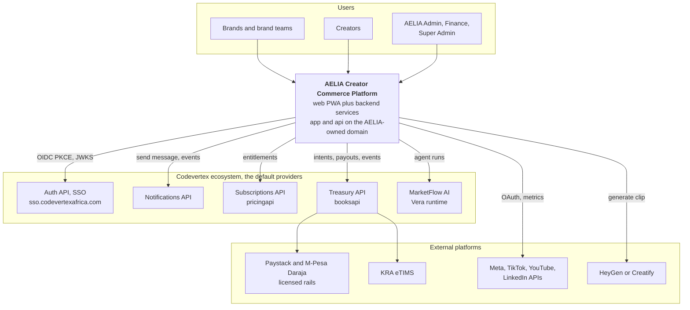
<p class="fig">Figure 11. System context. Every arrow from AELIA crosses a configurable port (Part D).</p>

### 12.2 Containers

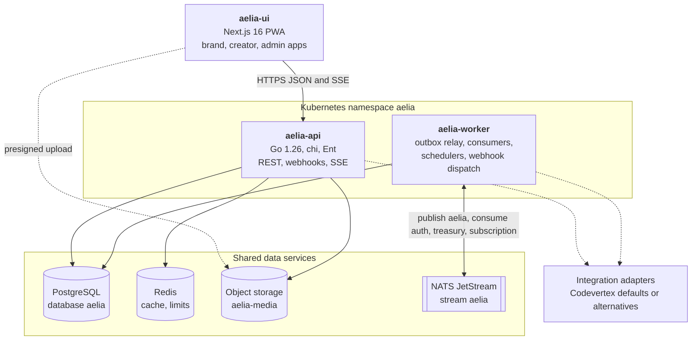
<p class="fig">Figure 12. Container view. The API and worker share one codebase and the same integration adapters, deployed as two workloads.</p>

| Container | Technology | Responsibilities | Scaling |
|---|---|---|---|
| `aelia-ui` | Next.js 16 (App Router), React 19, Tailwind v4, `next-pwa`, TanStack Query, `@bengo-hub/shared-ui-lib` | Brand, creator and admin experiences; SSO login; payment modal or redirect; PWA install and offline shell; web push | 2+ replicas, stateless |
| `aelia-api` | Go 1.26, chi v5, Ent, Atlas, `httpware`, `shared-auth-client`, `shared-service-client`, `shared-ratelimit`, `pagination`, `cache` | REST API; auth middleware chain; domain services; inbound webhooks; SSE for messaging and notifications; presigned uploads | HPA on CPU and latency; 2+ replicas |
| `aelia-worker` | Go (same module), `shared-events` | Outbox relay to NATS; consumers of `auth.*`, `treasury.*`, `subscription.*` and provider webhooks; schedulers (reminders, metrics refresh, certificates, reconciliation); outbound webhook delivery | Queue-group consumers; 2+ replicas |
| PostgreSQL | PostgreSQL 16 through PgBouncer (`pgbouncer.infra.svc.cluster.local:6432`); migrations use a direct `POSTGRES_MIGRATE_URL` | System of record for all AELIA data | Cluster instance; daily backups |
| Redis | Shared Redis, key prefix `aelia:` | Cache-aside (tenant details, entitlements, integration config), rate limits, idempotency keys, SSE fan-out | Shared |
| Object storage | S3-compatible (default MinIO; configurable) | Verification documents (private), portfolio and campaign media, agreement PDFs, certificates | Bucket per environment |
| NATS JetStream | Shared cluster, `EVENTS_NATS_URL` | Stream `aelia` (subjects `aelia.>`); durable consumers on other streams | Shared |

### 12.3 Technology stack

| Layer | Choice | Notes |
|---|---|---|
| Backend language | Go 1.26 | Codevertex standard; direct use of the shared toolkit |
| HTTP | chi v5, `httpware` (request ID, structured zap logs, recovery, CORS) | Routes under `/api/v1/{tenant}/...` |
| Data access | Ent v0.14 and Atlas versioned migrations | `migrate` runs in the container entrypoint before `serve` |
| Database | PostgreSQL 16 | `numeric(18,2)` for money plus an ISO-4217 currency column on every amount |
| Cache | Redis 7 via the shared `cache` package (`Aside[T]`, TTL tiers 5 min / 1 min / 30 s) | |
| Messaging | NATS JetStream via `shared-events` (envelope, outbox, idempotency store) | |
| Frontend | Next.js 16, React 19, TypeScript, Tailwind v4, `next-pwa`, pnpm | AELIA design system over shared UI primitives |
| Auth client | `shared-auth-client` (JWT validation via JWKS, API-key validation, subscription gating helpers) | |
| S2S client | `shared-service-client` (circuit breaker, retries with backoff, 10 s default timeout, OTel spans) | |
| API docs | OpenAPI 3, generated; Swagger UI at `/v1/docs` | External tags filtered for public docs |
| Containers | `golang:1.26-alpine` build → `alpine:3.20` runtime, non-root 100:101 | `/healthz`, `/readyz`, `/metrics` |
| Deployment | k3s, ArgoCD app-of-apps, generic Helm chart `charts/app`, cert-manager, Cloudflare | Part L |

### 12.4 Tenancy model

AELIA runs as a **platform tenant** in Codevertex auth-api (slug `aelia`). Brands, creators and campaigns are **AELIA-domain entities** inside that tenant; they are not Codevertex tenants. Brand teams are managed in AELIA's own `organisation_members`.

- **Every table is tenant-scoped.** Every AELIA table carries `tenant_id`, and every query filters by it (the Codevertex rule).
- **Regional expansion [Later] is configuration only.** Each country operation (for example `aelia-ke`, `aelia-ug`) becomes its own tenant with its own currency, tax pack, merchant accounts and integration profile. There is no schema change.
- **Codevertex services see one tenant.** Downstream services see AELIA as a single tenant. Treasury holds AELIA's merchant configuration, and Notifications holds AELIA's sender identities.
- **Tenant is always explicit on S2S calls.** Outbound calls carry `X-Tenant-ID` (the UUID, never the slug), so API-key calls never silently resolve to the platform-owner tenant.

## 13. Internal Module Design

`aelia-api` and `aelia-worker` form a **modular monolith**: one Go module with strict bounded-context packages that communicate through service interfaces and domain events. There are no cross-module table joins, so a module can later be split into its own service if load requires it.

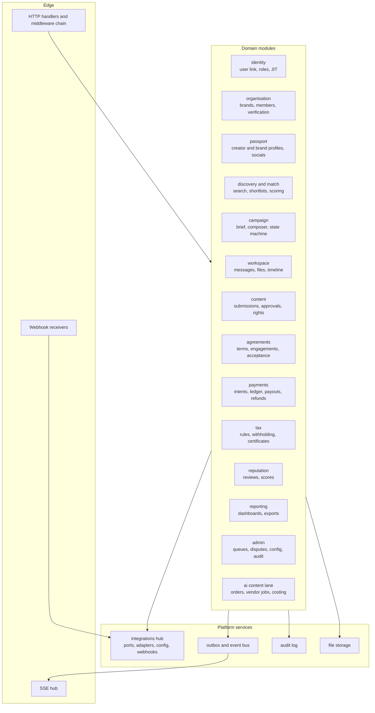
<p class="fig">Figure 13. Bounded contexts inside the AELIA backend.</p>

| Module | Owns (tables) | Publishes | Depends on ports |
|---|---|---|---|
| identity | `users`, `user_roles`, `identity_links` | `aelia.user.*` | IdentityProvider |
| organisation | `organisations`, `organisation_members`, `verification_cases`, `documents` | `aelia.organisation.*`, `aelia.verification.*` | ObjectStorage, KYCProvider [Later] |
| passport | `creator_profiles`, `creator_rates`, `creator_availability`, `portfolio_items`, `social_accounts`, `social_metrics`, `brand_profiles` | `aelia.passport.*` | SocialPlatformConnector |
| discovery and match | `shortlists`, `shortlist_items`, `match_runs`, `match_scores`, `match_weights` | `aelia.match.*` | AIMatchProvider |
| campaign | `campaigns`, `campaign_deliverables`, `campaign_participants`, `applications` | `aelia.campaign.*` | BillingProvider (entitlements) |
| workspace | `threads`, `messages`, `attachments`, `timeline_events` | `aelia.message.*` | NotificationProvider |
| content | `submissions`, `submission_versions`, `review_comments`, `approvals`, `publication_proofs`, `content_rights` | `aelia.content.*` | ObjectStorage |
| agreements | `agreement_templates`, `terms_acceptances`, `engagements` | `aelia.agreement.*` | ESignatureProvider [Later] |
| payments | `funding_intents`, `ledger_accounts`, `ledger_entries`, `payouts`, `refunds`, `payment_proofs` | `aelia.funding.*`, `aelia.payout.*`, `aelia.refund.*` | PaymentProvider, PayoutProvider |
| tax | `tax_rules`, `tax_withholdings`, `tax_certificates` | `aelia.tax.*` | InvoicingProvider (eTIMS) |
| reputation | `reviews`, `reputation_scores` | `aelia.review.*` | – |
| reporting | read models, `metric_snapshots` | – | – |
| admin | `disputes`, `dispute_events`, `settings`, `feature_flags`, `moderation_items` | `aelia.dispute.*`, `aelia.settings.*` | – |
| ai content lane | `ai_orders`, `ai_jobs`, `ai_cost_lines` | `aelia.ai_order.*` | AIVideoVendor |
| integrations hub | `integration_providers`, `integration_bindings`, `integration_credentials`, `webhook_endpoints`, `webhook_subscriptions`, `webhook_deliveries`, `integration_health` | `aelia.integration.*` | all ports |

## 14. Codevertex Ecosystem Integration Map

This is the **default** wiring, seeded as the Codevertex integration profile. Each row can be replaced through Part D.

| Codevertex service | Reuse mode | What AELIA uses | Interface (default adapter) |
|---|---|---|---|
| **Auth API (SSO)**: sign-on, client portal, users | REUSE AS-IS | OIDC Authorization Code + PKCE login for all users; JWT (RS256, JWKS) validation; profile; MFA for staff; API-key validation for S2S | `GET /api/v1/authorize`, `POST /api/v1/token`, `POST /api/v1/auth/refresh`, `GET /api/v1/auth/me`, `/.well-known/openid-configuration`; OIDC client `aelia-ui` seeded with `/{tenant}/auth/callback` and `/auth/callback`; consumes `auth.user.created` and `auth.user.login` on plain NATS |
| **Notifications API**: email, SMS, WhatsApp, push | REUSE AS-IS | Transactional messages for every campaign and payment state change; templates namespaced `aelia/*`; AELIA sender identities as tenant provider settings | `POST /{tenantId}/notifications/messages` with `channel`, `template`, `to`, `data`, `Idempotency-Key`; event-driven path where Notifications subscribes to `aelia.>`; push via `/api/v1/push/web-config` and `/api/v1/push/tokens` |
| **Subscriptions API**: plans, entitlements, gating | REUSE, EXTEND | The AELIA tenant's own entitlement to the **Treasury service only**; AELIA's brand plan catalogue as consumer-scoped plans and features (for example `aelia_max_active_campaigns`, `aelia_ai_lane_member_pricing`) | `GET /api/v1/tenants/{tenantId}/subscription`; `GetEntitlements` / `ConsumerHasFeature` S2S; JWT `sub_*` claims; events `subscription.*`. **Extension:** consumer-scoped plans keyed `aelia:brand:{id}` |
| **Treasury API**: payments, payouts, GL, eTIMS | REUSE, EXTEND | Payment intents for funding; Paystack and M-Pesa collection on AELIA-owned merchant configuration; manual bank-transfer confirmation; payouts to creators; GL auto-posting; eTIMS for commission invoices | `POST /api/v1/{tenant}/payments/intents` (`source_service: "aelia"`), `/intents/{id}/initiate`, `/confirm-manual`, `/check-status`; pay page `books.codevertexafrica.com/pay` or `TreasuryPaymentModal`; events `treasury.payment.succeeded`, `treasury.payment.failed`, `treasury.payout.completed`, `treasury.refund.completed`. **Extensions:** `creator` payee type, three-way split, S2S payout API with idempotency key (§33.3) |
| **MarketFlow AI (Vera runtime)** | REUSE AS-IS | Agent loop for the AI Brief Builder and for AELIA Match explanations and scoring, with AELIA tools exposed to the agent | Agent-run API with AELIA tool definitions; runs scoped to the AELIA tenant |
| **Shared Go toolkit** | REUSE AS-IS | `shared-auth-client`, `shared-service-client`, `shared-events`, `httpware`, `cache`, `shared-ratelimit`, `pagination` | Go modules |
| **Shared UI library** | REUSE AS-IS | `SSOLoginModal`, `TreasuryPaymentModal` (iframe + postMessage), layout primitives | `@bengo-hub/shared-ui-lib` |
| **Platform infrastructure** | REUSE AS-IS | k3s cluster, ArgoCD, Helm chart, cert-manager TLS, Cloudflare edge, PgBouncer, Redis, NATS, MinIO, backups, `fleet-health-watcher` alerting | `devops-k8s` `apps/aelia-api`, `apps/aelia-worker`, `apps/aelia-ui` |
| **MarketFlow CRM social connect** | REUSE PATTERN | The OAuth "connect your account" handshake used for Facebook Pages and TikTok. AELIA builds its own connectors with profile and insights scopes for Instagram, Facebook, TikTok, YouTube and LinkedIn, and stores tokens encrypted. | New `SocialPlatformConnector` adapters |
| HR service, wider ERP suite | NOT USED | AELIA consumes Treasury only | – |

> **Treasury-only consumption.** AELIA's Codevertex tenant is entitled to the Treasury service alone, not the wider ERP suite (HR, payroll, inventory, POS). Finance users reach Treasury screens (GL, eTIMS, gateway configuration) through SSO deep links from the AELIA admin console. AELIA's own finance views (ledger, payouts, withholding) live in `aelia-ui`.

### 14.1 Reference-plus-cache examples

| AELIA record | Reference column | Cached snapshot | Live source |
|---|---|---|---|
| `users` | `sso_user_id` (UUID), `idp_issuer`, `idp_subject` | `display_name`, `email`, `avatar_url` | IdentityProvider `/me` or userinfo |
| `funding_intents` | `provider_intent_id` (Treasury `payment_intent_id`) | `amount`, `currency`, `status`, `provider_reference` | PaymentProvider `check-status`, payment events |
| `payouts` | `provider_payout_id` | `amount`, `status`, `rail`, `completed_at` | PayoutProvider events |
| `organisations` | `crm_contact_id` (nullable; only if AELIA chooses to enrich a MarketFlow record) | `name` | MarketFlow `GET /api/v1/contacts/{id}` |
| `ai_jobs` | `vendor_job_id` | `status`, `vendor_cost` | AIVideoVendor status |

## 15. Event-Driven Design

### 15.1 Conventions (Codevertex event standards)

- **Stream and subjects.** The stream is `aelia`, with subjects `aelia.{aggregate}.{event}` built by `shared-events` from `aggregate_type` and `event_type`. The event type is passed **without** the service prefix (`NewEvent("campaign.funded", "aelia", ...)`), which avoids dead subjects of the form `aelia.aelia.*`.
- **Envelope** (`shared-events`): `id`, `tenant_id`, `aggregate_type`, `aggregate_id` (UUID), `event_type`, `payload`, `timestamp`, `version: "1.0"`.
- **Outbox.** Each domain write inserts an `outbox_events` row in the same transaction, holding the **full envelope**. The worker relays it to NATS and later prunes it.
- **Idempotency.** Consumers claim `(event_id, consumer)` in `processed_events` (`ON CONFLICT DO NOTHING`) **before** any irreversible side effect (payout, refund, notification). Payment events are keyed on the envelope `id`, never on the provider reference.
- **Consumers.** Subscriptions are durable queue groups (`QueueSubscribe`), so replicas share the load. `auth.*` subjects arrive on plain NATS rather than JetStream and use `nc.Subscribe`.
- **Entitlement check in consumers.** A consumer checks that the tenant is entitled before acting, and acks and drops the event otherwise.
- **Coverage.** `aelia-api` is added to `tools/event-subject-coverage.sh`, so orphan publishes and dead subscriptions are reported.

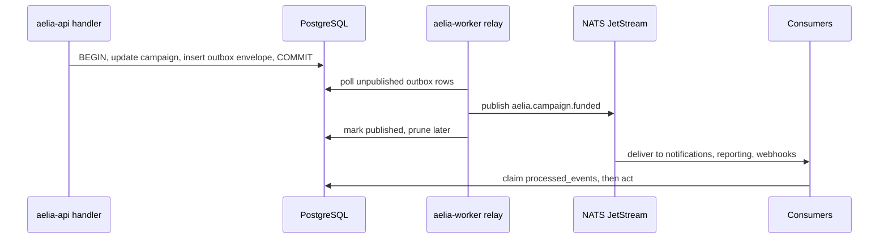
<p class="fig">Figure 14. Transactional outbox and idempotent consumption.</p>

## Part D · Pluggable Integration Framework

How every external service AELIA depends on is configured from inside the AELIA platform. Codevertex services load by default, and any capability can be switched to another provider through a programming interface or an API interface, with webhooks and callback URLs, without changing AELIA's domain code.

## 16. Integration Framework Overview

### 16.1 Requirement

AELIA must be able to integrate with another SSO, notification, subscription or billing, or finance and treasury provider, or any other external service. It does so by applying a **programming interface** (a code-level adapter implementing an AELIA port) or an **API interface** (a declarative REST connector configured in the admin console). It then configures the new service's credentials, webhooks and callback URLs. The existing Codevertex integrations remain the **default configuration** and load automatically for any Codevertex service plugged into AELIA's workflows.

### 16.2 Design: ports, adapters, profiles

<div class="layers">
<div class="ly"><div class="ly-t">AELIA domain modules</div><div class="ly-r"><div class="ly-b">campaign</div><div class="ly-b">payments</div><div class="ly-b">workspace</div><div class="ly-b">passport</div><div class="ly-b">match</div><div class="ly-b">content</div></div></div>
<div class="ly-arrow">&#8595; call a port interface only &#8595; &#160;&#160;&#160;&#160; &#8593; canonical events from inbound webhooks &#8593; &#160;&#160;&#160;&#160; &#8595; domain events to outbound webhooks &#8595;</div>
<div class="ly ly-hub"><div class="ly-t">Integrations Hub</div><div class="ly-r"><div class="ly-b"><b>Provider resolver</b><br/>capability to binding, cached in Redis</div><div class="ly-b"><b>Adapter registry</b><br/>drivers by key</div><div class="ly-b"><b>Credential vault</b><br/>encrypted, fingerprints only</div><div class="ly-b"><b>Health and breakers</b><br/>probe every 60 s</div><div class="ly-b"><b>Inbound webhooks</b><br/>verify, dedupe, normalise</div><div class="ly-b"><b>Outbound webhooks</b><br/>sign, retry, log</div></div></div>
<div class="ly-arrow">&#8595; resolved at call time from configuration &#8595;</div>
<div class="ly"><div class="ly-t">Adapters</div><div class="ly-r"><div class="ly-b ly-def"><b>Codevertex adapters &middot; default profile</b><br/>SSO, Notifications, Subscriptions, Treasury, Vera, MinIO</div><div class="ly-b"><b>Vendor adapters</b><br/>Keycloak, Auth0, Twilio, Africa's Talking, Stripe, Flutterwave, direct Paystack</div><div class="ly-b"><b>Generic adapters</b><br/>generic OIDC, SMTP, declarative REST connector</div></div></div>
</div>

<p class="fig">Figure 15. Domain code only ever calls a port. The resolver picks the bound adapter at call time from configuration.</p>

| Concept | Definition |
|---|---|
| **Capability** | A kind of external service AELIA needs, such as `identity`, `notifications.email`, `notifications.sms`, `notifications.whatsapp`, `notifications.push`, `billing`, `payments.collect`, `payments.payout`, `invoicing.tax`, `ai.runtime`, `ai.video`, `social.<platform>`, `storage.objects`, `kyc` [Later], `esign` [Later], `moderation` [Later] |
| **Port** | A Go interface in `internal/integrations/ports` that domain code depends on, one per capability |
| **Driver** | An adapter implementation registered under a key, such as `codevertex.sso`, `generic.oidc`, `vendor.twilio`, `generic.rest` |
| **Provider** | A configured instance of a driver: its endpoints, options, credentials and webhooks. Several providers can use the same driver, for example two SMTP accounts |
| **Binding** | Capability plus scope mapped to a primary provider and an optional fallback provider, with priority and effective date |
| **Profile** | A named set of bindings. `codevertex-default` is seeded at install; others can be cloned from it |
| **Scope** | `platform` (the AELIA tenant). `organisation` [Later] lets an agency or brand bring its own provider |

### 16.3 Two ways to add a provider

| Path | Who uses it | When | How |
|---|---|---|---|
| **Programming interface (adapter SDK)** | Engineers | The provider needs custom logic: an SDK, a complex auth flow, or multi-step orchestration | Implement the port interface in Go, register the driver, pass the conformance suite (§34.4), then ship it in a release. After that it is configurable from the admin console like any other driver |
| **API interface (declarative REST connector)** | Super Admin, with engineering support if needed | The provider exposes a conventional REST/JSON API | Configure in the Integrations Hub: base URL, auth scheme, operation mappings (request and response templates), status mapping, webhook verification and event mapping. Test the connection and the conformance checks, then activate. No deployment needed |

## 17. Provider Ports & Adapters

### 17.1 Port catalogue

| Capability | Port | Key operations | Default adapter (Codevertex profile) | Alternative adapters |
|---|---|---|---|---|
| Identity | `IdentityProvider` | `AuthorizeURL`, `ExchangeCode`, `Refresh`, `VerifyToken` (JWKS), `UserInfo`, `Logout`, `ValidateAPIKey` | `codevertex.sso` (auth-api OIDC + PKCE) | `generic.oidc` (Keycloak, Auth0, Azure AD / Entra ID, Google, Okta, Cognito); `vendor.firebase` [Later] |
| Notifications | `NotificationProvider` | `Send(message)`, `SendBatch`, `Status(id)`, `RegisterPushToken` | `codevertex.notifications` (template keys `aelia/*`) | `generic.smtp`, `vendor.africastalking`, `vendor.twilio`, `vendor.meta_whatsapp`, `vendor.fcm`, `generic.rest`, `generic.webhook` |
| Billing / entitlements | `BillingProvider` | `GetEntitlements(subject)`, `HasFeature`, `GetLimit`, `CreateSubscription`, `ChangePlan`, `Cancel` | `codevertex.subscriptions` | `builtin.plans` (plans in AELIA's own tables), `vendor.stripe_billing`, `generic.rest` |
| Payment collection | `PaymentProvider` | `CreateIntent`, `Initiate(method)`, `ConfirmManual`, `CheckStatus`, `Refund` | `codevertex.treasury` (Paystack and M-Pesa via Treasury) | `vendor.paystack` (direct), `vendor.flutterwave`, `vendor.mpesa_daraja` (direct), `vendor.pesapal`, `generic.rest` |
| Payouts | `PayoutProvider` | `CreateRecipient`, `Payout(idempotencyKey)`, `BulkPayout`, `Status`, `Balance` | `codevertex.treasury` (Paystack Transfers and M-Pesa B2C via Treasury) | `vendor.paystack_transfers`, `vendor.mpesa_b2c`, `vendor.flutterwave`, `generic.rest` |
| Tax invoicing | `InvoicingProvider` | `IssueInvoice`, `Status`, `CreditNote` | `codevertex.treasury_etims` | `vendor.kra_etims` (direct OSCU/VSCU), `generic.rest` |
| AI runtime | `AIMatchProvider`, `AIAssistant` | `ScoreCandidates`, `Explain`, `DraftBrief` | `codevertex.vera` | `builtin.rules` (no AI), `vendor.anthropic`, `vendor.openai`, `generic.rest` |
| AI video | `AIVideoVendor` | `CreateJob(script or url)`, `Status`, `FetchAsset`, `CostQuote` | – (v1: `vendor.heygen` or `vendor.creatify`) | `vendor.arcads`, `vendor.runway` [Later], `generic.rest` |
| Social platforms | `SocialPlatformConnector` | `AuthorizeURL`, `ExchangeCode`, `Profile`, `AudienceInsights`, `MediaInsights(url)`, `Revoke` | `builtin.meta` (Instagram and Facebook Graph), `builtin.tiktok`, `builtin.youtube`, `builtin.linkedin` | `generic.rest` for new platforms |
| Object storage | `ObjectStorage` | `PresignPut`, `PresignGet`, `Delete`, `Head` | `codevertex.minio` | `vendor.s3`, `vendor.gcs`, `vendor.azure_blob`, `vendor.r2` |
| KYC/KYB, e-signature, moderation [Later] | `KYCProvider`, `ESignatureProvider`, `ModerationProvider` | Per port | – | Vendor adapters or `generic.rest` |

### 17.2 Programming interface (Go)

```go
// internal/integrations/ports/payments.go
type PaymentProvider interface {
    Capabilities() PaymentCaps                       // methods, currencies, split support, refunds
    CreateIntent(ctx context.Context, in CreateIntentInput) (*Intent, error)
    Initiate(ctx context.Context, intentID string, m Method, payer Payer) (*Initiation, error)
    ConfirmManual(ctx context.Context, intentID string, proof ManualProof) (*Intent, error)
    CheckStatus(ctx context.Context, intentID string) (*Intent, error)
    Refund(ctx context.Context, in RefundInput) (*Refund, error)
    // Translate a verified provider callback into canonical AELIA events.
    ParseWebhook(ctx context.Context, req VerifiedWebhook) ([]CanonicalEvent, error)
    Health(ctx context.Context) HealthStatus
}

// Every driver registers itself once; configuration decides which one is used.
func init() {
    registry.Register("codevertex.treasury", registry.Driver{
        Capabilities: []string{"payments.collect", "payments.payout", "invoicing.tax"},
        ConfigSchema: treasuryConfigSchema,          // JSON Schema rendered as the admin form
        New:          newTreasuryAdapter,            // func(cfg ProviderConfig, secrets SecretReader) (any, error)
    })
}

// Domain code never names a vendor:
pay := hub.Payments(ctx, tenantID)                   // resolves binding, applies breaker and fallback
intent, err := pay.CreateIntent(ctx, ports.CreateIntentInput{
    ReferenceType: "aelia_campaign_funding", ReferenceID: campaign.ID,
    Amount: money.KES(250000), IdempotencyKey: "fund:" + campaign.ID.String(),
})
```

- **Canonical types.** Ports speak AELIA's canonical types (money as integer minor units plus currency, canonical statuses `pending`, `processing`, `succeeded`, `failed`, `reversed`). Adapters own all translation.
- **Error taxonomy.** Adapters return typed errors: `ErrRetryable`, `ErrRejected`, `ErrAuth`, `ErrNotSupported`. These drive retry, fallback and admin alerts.
- **Capability flags.** Each adapter declares what it supports (for example `SupportsSplit`, `SupportsBulkPayout`, `SupportsWhatsApp`), and the UI hides options the bound provider cannot do.
- **Frontend counterparts.** `aelia-ui` has matching client adapters:
  - **Login:** `SSOLoginModal` for `codevertex.sso`, or a standard OIDC redirect for `generic.oidc`.
  - **Payments:** `TreasuryPaymentModal` for `codevertex.treasury`, or a hosted-checkout redirect, or an embedded widget, as the provider's descriptor declares.
  - **Selection:** the UI reads which adapter to use from `GET /api/v1/{tenant}/integrations/client-config`, which exposes public settings only.

### 17.3 API interface: declarative REST connector (`generic.rest`)

A provider with a conventional REST API is integrated by configuration. The connector definition is stored as versioned JSON (edited as a form or as YAML in the admin console) and validated against the port's operation contract.

```yaml
driver: generic.rest
capability: payments.collect
name: Flutterwave (via REST connector)
base_url: https://api.flutterwave.com/v3
auth: { scheme: bearer, secret_ref: FLW_SECRET_KEY }
timeouts: { connect_ms: 3000, request_ms: 10000 }
retry: { max_attempts: 3, backoff: exponential, retry_on: [429, 502, 503, 504] }
operations:
  CreateIntent:
    method: POST
    path: /payments
    headers: { Idempotency-Key: "{{ .IdempotencyKey }}" }
    body: |
      { "tx_ref": "{{ .ReferenceID }}", "amount": "{{ .Amount.Major }}",
        "currency": "{{ .Amount.Currency }}", "redirect_url": "{{ .CallbackURL }}",
        "customer": { "email": "{{ .Payer.Email }}", "phonenumber": "{{ .Payer.Phone }}" } }
    response:
      provider_intent_id: $.data.id
      checkout_url: $.data.link
  CheckStatus:
    method: GET
    path: /transactions/verify_by_reference?tx_ref={{ .ReferenceID }}
    response:
      status: { path: $.data.status, map: { successful: succeeded, failed: failed, pending: pending } }
      provider_reference: $.data.flw_ref
webhook:
  verification: { scheme: shared_secret_header, header: verif-hash, secret_ref: FLW_WEBHOOK_HASH }
  event_type_path: $.event
  events:
    charge.completed:
      canonical: payment.succeeded      # when $.data.status == successful
      reference_path: $.data.tx_ref
```

**Connector capabilities**

- **Auth schemes:** `api_key_header`, `bearer`, `basic`, `oauth2_client_credentials` (token cached until expiry), `hmac_request_signing` (configurable canonical string and algorithm), `mtls` [Later].
- **Templating:** Go `text/template` over canonical input fields. There is no arbitrary code execution: functions are limited to formatting helpers.
- **Response mapping:** JSONPath extraction and value maps into canonical fields. Unmapped required fields fail the conformance check.
- **Safety:** outbound hosts must be HTTPS and on the provider's allowlist, which blocks SSRF to cluster-internal addresses. Secrets are referenced, never inlined. Every request and response is logged with secrets redacted.
- **Versioning:** each saved connector definition is a new immutable version. Bindings point to a specific version, and rollback is one click.

## 18. Configuration Model

### 18.1 Configuration data

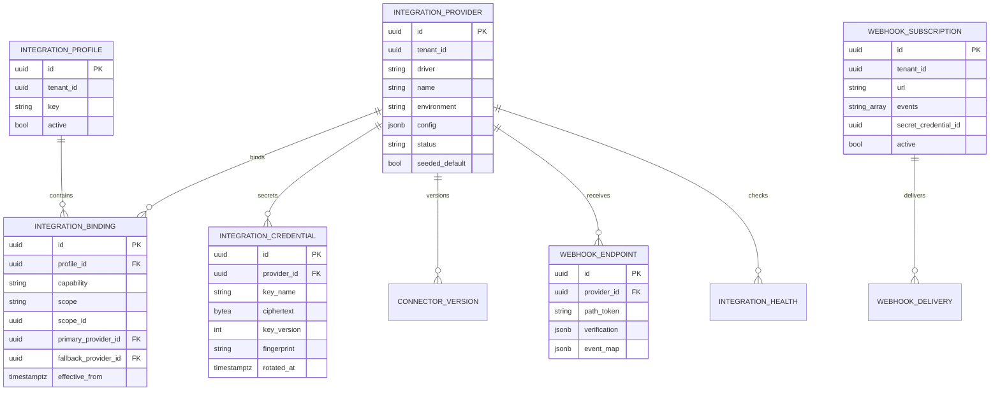
<p class="fig">Figure 16. Integration configuration entities (stored in the AELIA database).</p>

### 18.2 Resolution and precedence

Configuration resolves in layers. Each later layer overrides the one before it for the same key:

1. **Code defaults.** Each driver's schema defaults.
2. **Environment bootstrap.** Kubernetes secrets and config: Codevertex base URLs (`SSO_ISSUER_URL`, `NOTIFICATIONS_API_URL`, `SUBSCRIPTIONS_API_URL`, `TREASURY_API_URL`, `VERA_API_URL`), `INTERNAL_SERVICE_KEY`, the `EVENTS_NATS_URL` and the vault master key. These are used by the seeder and as emergency fallback.
3. **Seeded Codevertex default profile.** Created by the `aelia-api seed integrations` job at install and upgrade. It is idempotent and never overwrites admin edits.
4. **Platform bindings edited by the Super Admin** in the Integrations Hub.
5. **Organisation-scoped bindings** [Later], for example an agency's own payment account.

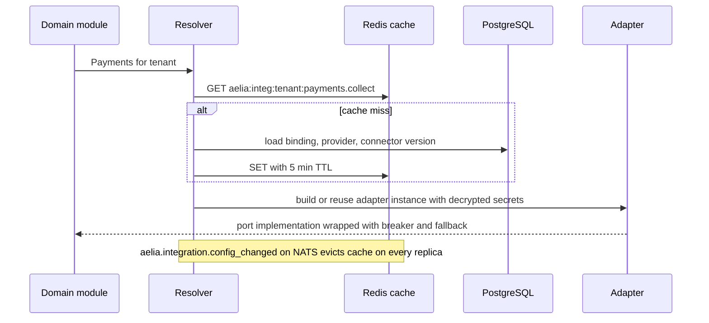
<p class="fig">Figure 17. Provider resolution at call time. Configuration changes take effect within seconds, with no redeploy.</p>

### 18.3 Runtime behaviour

| Concern | Behaviour |
|---|---|
| Health checks | Each active provider is probed every 60 s (driver-defined: OIDC discovery, `GET /healthz`, a balance call). Results are stored in `integration_health` and shown in the hub. |
| Circuit breaker | Per provider, via `shared-service-client` (gobreaker): trips after 5 consecutive failures, half-open probe after 30 s. |
| Fallback | If the primary is open-circuited or returns `ErrRetryable`, the binding's fallback is used, only for capabilities marked fallback-safe (notifications, AI explanations). Money operations **never** fail over automatically. They queue and alert Finance. |
| Sandbox vs production | Every provider carries an `environment`. Staging refuses to bind production providers, and production refuses sandbox ones. |
| Change safety | A new or changed provider starts as `draft`. Activation requires a passing "Test connection" and conformance checks, plus a second Super Admin's approval for payment, payout and identity capabilities. |
| Audit | Every create, update, activate and rotate is written to the audit log with a before/after diff. Secrets appear only as fingerprints. |
| Credential vault | AES-256-GCM envelope encryption with a rotatable key ring (`key_version`), following the Codevertex secrets-management standard. Plaintext exists only in process memory. APIs return fingerprints only. |

### 18.4 Integrations Hub (admin UI)

| Screen | Contents |
|---|---|
| Overview | A card per capability showing bound provider, environment, health, last error, and last event received |
| Provider catalogue | Available drivers with capability badges; "Add provider" |
| Provider detail | Form generated from the driver's JSON Schema; credential fields (write-only); callback URLs to copy; webhook secret generation; "Test connection"; conformance results; version history |
| REST connector editor | Operation mapping (form or YAML), a sample request preview, response mapping tester with pasted JSON |
| Bindings | Capability-to-provider table with primary, fallback, effective date; the approval workflow |
| Webhooks | Inbound endpoints with verification settings and recent requests; outbound subscriptions with a delivery log and replay |
| Client configuration | Public settings exposed to `aelia-ui` (login mode, payment UI mode) |

## 19. Webhooks & Callback URLs

### 19.1 Inbound webhooks (providers → AELIA)

Each provider gets a dedicated, unguessable endpoint:

`POST https://api.<aelia-domain>/api/v1/integrations/hooks/{providerKey}/{pathToken}`

| Step | Behaviour |
|---|---|
| 1. Receive | Raw body retained (needed for signature checks); max 1 MB; 5 s processing budget, then async |
| 2. Verify | Per-provider scheme: `hmac_sha512` (for example Paystack `x-paystack-signature`), `hmac_sha256` with timestamp (`t=...,v1=...` style), `shared_secret_header`, `jwt` (JWKS), IP allowlist (for example M-Pesa callbacks), or `none` in sandbox only. Constant-time compare. Timestamp tolerance 300 s |
| 3. Dedupe | Key = provider event ID, or a SHA-256 of the body, stored in `processed_webhooks` for 7 days. Duplicates return 200 without reprocessing |
| 4. Normalise | Adapter `ParseWebhook`, or the connector `event_map`, produces canonical events (`payment.succeeded`, `payout.completed`, `message.delivered`, `subscription.changed`, and so on) |
| 5. Record and ack | Raw payload stored encrypted with its verification result; canonical events written to the outbox; `200 OK` returned |
| 6. Reconcile | For money events, the worker re-queries `CheckStatus` before posting to the ledger (trust but verify) |

The Codevertex default profile receives most callbacks as **NATS events** (`treasury.*`, `subscription.*`, `auth.*`) because AELIA runs in the same cluster. These are normalised through the same canonical handler, so behaviour is identical whether the provider is Codevertex (events) or external (webhooks).

### 19.2 Callback and redirect URLs (configured per provider)

| URL | Purpose | Default value |
|---|---|---|
| OIDC redirect URIs | Return from the IdP after login | `https://app.<aelia-domain>/aelia/auth/callback`, `https://app.<aelia-domain>/auth/callback` |
| Post-logout redirect | Return after IdP logout | `https://app.<aelia-domain>/` |
| Payment return URL | Browser return after hosted checkout | `https://app.<aelia-domain>/aelia/payments/return?intent={id}` |
| Payment webhook | Server-to-server payment result | Treasury via NATS (default), or `.../integrations/hooks/{providerKey}/{token}` |
| Payout result callback | Transfer and B2C results | Treasury via NATS (default), or a provider hook URL |
| Social OAuth redirect | Creator account connection | `https://app.<aelia-domain>/aelia/passport/social/callback/{platform}` |
| Notification delivery receipts | Delivery, read and failure status | Provider hook URL (for non-Codevertex providers) |
| AI vendor job callback | Generation complete | Provider hook URL |

All URLs are displayed ready to copy in the provider detail screen and are derived from the configured public base URL. Changing the domain re-derives them.

### 19.3 Outbound webhooks (AELIA → third parties)

AELIA can notify external systems (a brand's CRM, AELIA's own BI, a partner agency) about platform events.

```text
POST {subscriber_url}
Content-Type: application/json
X-Aelia-Event: campaign.completed
X-Aelia-Delivery: 6b1f...   (unique per attempt group)
X-Aelia-Timestamp: 1791234567
X-Aelia-Signature: v1=hex(HMAC_SHA256(secret, timestamp + "." + raw_body))

{ "id": "evt_...", "type": "campaign.completed", "tenant_id": "...", "created_at": "...",
  "data": { "campaign_id": "...", "brand_id": "...", "status": "completed" } }
```

| Property | Behaviour |
|---|---|
| Subscription | URL (HTTPS only), event list (with wildcards such as `campaign.*`), secret (generated, shown once), active flag, API version |
| Delivery | At-least-once, via the worker. 10 s timeout. Any 2xx is success |
| Retries | Exponential backoff (30 s, 2 min, 10 min, 1 h, then every 6 h) for up to 24 h. The subscription is auto-disabled after 3 days of continuous failure, and admins are notified |
| Replay | Manual replay of any delivery from the log; bulk replay by time range |
| Security | HMAC-SHA256 signature with timestamp (receivers should reject anything older than 5 min); secret rotation with a 24 h dual-signature window; no internal IDs or PII beyond what the event contract defines |

## 20. Default Codevertex Profile & Provider Swap Scenarios

### 20.1 Seeded `codevertex-default` profile

| Capability | Provider (driver) | Seeded configuration | Secrets (from Kubernetes) |
|---|---|---|---|
| identity | Codevertex SSO (`codevertex.sso`) | `issuer: https://sso.codevertexafrica.com`, `client_id: aelia-ui`, PKCE S256, scopes `openid profile email offline_access`, tenant slug `aelia` | `INTERNAL_SERVICE_KEY` (API-key validation) |
| notifications.* | Codevertex Notifications (`codevertex.notifications`) | `base_url` from `NOTIFICATIONS_API_URL`, template namespace `aelia/`, channels email, SMS, WhatsApp (when AELIA's WhatsApp plan is active), push | `NOTIFICATIONS_API_KEY` |
| billing | Codevertex Subscriptions (`codevertex.subscriptions`) | `base_url` from `SUBSCRIPTIONS_API_URL`, consumer prefix `aelia:brand:`, feature codes `aelia_*` | `INTERNAL_SERVICE_KEY` |
| payments.collect | Codevertex Treasury (`codevertex.treasury`) | `base_url` from `TREASURY_API_URL`, `source_service: aelia`, methods `mpesa`, `paystack`, `manual`, pay-page base `https://books.codevertexafrica.com/pay`, events via NATS `treasury.>` | `INTERNAL_SERVICE_KEY` |
| payments.payout | Codevertex Treasury (`codevertex.treasury`) | Payee type `creator`, rails `mpesa_b2c`, `paystack_transfer`, OTP-gated approval | as above |
| invoicing.tax | Codevertex Treasury eTIMS (`codevertex.treasury_etims`) | Commission and fee invoices only | as above |
| ai.runtime | MarketFlow Vera (`codevertex.vera`) | Agent profile `aelia-match`, tool set `aelia.*` | `INTERNAL_SERVICE_KEY` |
| storage.objects | Codevertex MinIO (`codevertex.minio`) | Bucket `aelia-media-{env}`, SSE enabled | MinIO access keys |
| social.* | Built-in connectors | Disabled until AELIA registers its own developer apps (v1) | App IDs and secrets owned by AELIA |
| ai.video | – | Unbound until v1 vendor selection | Vendor API key owned by AELIA |

### 20.2 Swap scenario A: move SSO to another OIDC provider

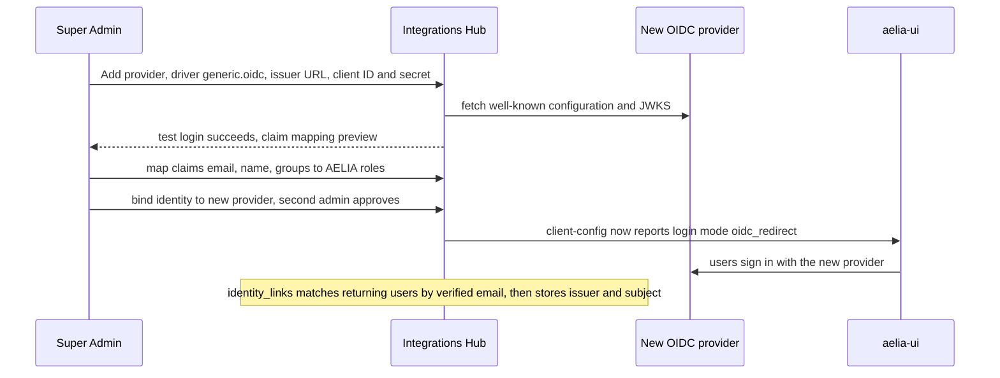
<p class="fig">Figure 18. Replacing the identity provider. AELIA user IDs, roles and data are unchanged, because <code>identity_links</code> maps (issuer, subject) to the AELIA user.</p>

### 20.3 Swap scenario B: add a direct payment provider

1. **Add the provider.** The Super Admin adds a provider with driver `vendor.flutterwave` (a built-in adapter) or `generic.rest` (the connector in §17.3), in the `sandbox` environment.
2. **Wire up callbacks.** The hub shows the callback and webhook URLs, and AELIA pastes them into the provider's dashboard. The hub generates or accepts the webhook verification secret.
3. **Test in sandbox.** "Test connection" runs a sandbox `CreateIntent`, `CheckStatus` and a simulated webhook. The conformance suite must pass.
4. **Switch to production.** The provider is cloned to `production` with live keys and bound to `payments.collect`, effective from a date. Finance and a second Super Admin approve.
5. **Handle in-flight intents.** Intents already in flight finish on the provider that created them. The provider ID is stored on every intent, so reconciliation stays per-provider.

### 20.4 Swap scenario C: notifications and billing

- **Notifications.** Bind `notifications.sms` to `vendor.africastalking` under AELIA's own account, and keep email on Codevertex Notifications. Templates exist once in AELIA's template registry (`aelia/*`, versioned, per locale). For non-Codevertex drivers AELIA renders them locally. For Codevertex the template key is passed through.
- **Billing.** Bind `billing` to `builtin.plans`, so plans, features and limits live in AELIA tables and are edited in the admin console, or to `vendor.stripe_billing`. The domain keeps calling `HasFeature` and `GetLimit` unchanged.

## Part E · API Specification

How systems communicate: the AELIA public REST API, its conventions, the endpoint catalogue, the event catalogue, and the documentation register for every shared service and external integration.

## 21. API Conventions

| Aspect | Convention |
|---|---|
| Base URL | `https://api.<aelia-domain>/api/v1/{tenant}` (tenant slug `aelia`). Staging uses `https://api.staging.<aelia-domain>`. A sandbox environment for external integrators mirrors production with sandbox providers |
| Style | Resource-oriented REST, JSON (UTF-8), `snake_case` fields, ISO-8601 UTC timestamps, UUID v7 identifiers |
| Money | `{ "amount": 2000000, "currency": "KES" }`: integer minor units plus ISO-4217 code; never floats |
| Authentication | `Authorization: Bearer <JWT>` from the bound Identity Provider (users); `X-API-Key` plus `X-Tenant-ID` (service-to-service); outbound-webhook signatures (§19.3) |
| Authorization | Permission codes `aelia.{module}.{action}` (actions `view`, `view_own`, `add`, `change`, `change_own`, `delete`, `manage`), checked by middleware and by resource ownership |
| Middleware order | Rate limit → authentication (JWT or API key) → subscription gate for mutations (`RequireActiveSubscriptionForMutationsWithGrace`) → JIT user provisioning → tenant and organisation context (`X-Organisation-ID` for brand-scoped calls) → permission |
| Idempotency | `Idempotency-Key` header **required** on money-moving POSTs (funding, payouts, refunds) and accepted on all POSTs; stored 24 h per key and route; replays return the original response |
| Pagination | Cursor-based: `?limit=25&cursor=...`; the response carries `next_cursor` (shared `pagination` package) |
| Filtering and sorting | `?status=funded&created_after=...&sort=-created_at` |
| Concurrency | `ETag` on mutable resources; `If-Match` required on state-changing PATCH/PUT; `412` on mismatch |
| Errors | `{ "error": { "code": "campaign_not_fundable", "message": "...", "details": {...}, "request_id": "..." } }` |
| Rate limits | Per user 120 req/min, per IP 300 req/min, per API key per plan (`shared-ratelimit`); headers `X-RateLimit-Limit`, `X-RateLimit-Remaining`, `Retry-After` |
| Versioning | URI major version (`/v1`); additive changes only within a major; deprecation announced with a `Sunset` header at least 6 months ahead |
| Real-time | Server-Sent Events at `GET /api/v1/{tenant}/stream` (messages, notifications, status changes), authenticated with a short-lived stream token |
| Uploads | `POST /uploads` returns a presigned PUT URL and object key; the client uploads directly; `POST /uploads/{key}/complete` triggers scanning |
| Documentation | OpenAPI 3.1 generated from handlers; Swagger UI at `/v1/docs` (public tags), with the full spec for authenticated staff |

### 21.1 Standard error codes

| HTTP | Code | Meaning |
|---|---|---|
| 400 | `validation_failed` | Field errors in `details.fields` |
| 401 | `unauthenticated` | Missing, expired or invalid token or API key |
| 403 | `forbidden` | Permission missing, or resource not owned |
| 403 | `subscription_inactive`, `feature_not_available`, `usage_limit_exceeded`, `plan_upgrade_required` | Codevertex gating codes, surfaced unchanged (for example the brand plan's active-campaign limit) |
| 404 | `not_found` | Resource not visible to the caller |
| 409 | `invalid_state_transition` | For example approving content on an unfunded campaign |
| 409 | `idempotency_conflict` | Same key with a different payload |
| 412 | `precondition_failed` | ETag mismatch |
| 422 | `verification_required`, `kra_pin_required`, `terms_not_accepted` | Business-rule blocks |
| 428 | `otp_required` | Finance approvals need an OTP |
| 429 | `rate_limited` | Retry after the indicated time |
| 502 / 503 | `provider_unavailable` | A bound provider failed; safe to retry with the same idempotency key |

## 22. Endpoint Catalogue

All paths are relative to `/api/v1/{tenant}`. The "Release" column follows the functional requirement served.

### 22.1 Identity, organisations and Passports

| Method and path | Purpose | Permission | Release |
|---|---|---|---|
| `GET /me` | Current user, roles, organisations, creator profile summary | authenticated | [MVP] |
| `POST /me/roles` | Activate the Brand or Creator role for the current user | authenticated | [MVP] |
| `POST /organisations` | Register a brand organisation | authenticated | [MVP] |
| `GET, PATCH /organisations/{id}` | View and update the brand profile (Brand Passport) | `aelia.organisations.view` / `change_own` | [MVP] |
| `POST /organisations/{id}/members` · `DELETE .../members/{uid}` | Invite or remove brand team members | `aelia.organisations.manage_own` | [MVP] |
| `POST /verification-cases` · `GET /verification-cases/{id}` | Submit and track verification with documents | owner | [MVP] |
| `GET, PUT /creators/me` | Creator Passport: profile, niches, skills, languages | `aelia.passport.change_own` | [MVP] |
| `PUT /creators/me/rates` · `PUT /creators/me/availability` · `POST /creators/me/portfolio` | Rates and packages, calendar, portfolio | `aelia.passport.change_own` | [MVP] |
| `PUT /creators/me/payout-method` | M-Pesa number or bank account (validated via PayoutProvider) | `aelia.passport.change_own` | [MVP] |
| `GET /creators/me/social/{platform}/connect` · `DELETE /creators/me/social/{id}` | Start OAuth connection; revoke | `aelia.passport.change_own` | [v1] |
| `GET /creators/{id}` | Public Passport for verified brands | `aelia.passport.view` | [MVP] |

### 22.2 Discovery, matching and campaigns

| Method and path | Purpose | Permission | Release |
|---|---|---|---|
| `GET /creators?niche=&platform=&location=&followers_min=&rate_max=&available_from=` | Creator search | `aelia.discovery.view` | [MVP] |
| `POST /shortlists` · `POST /shortlists/{id}/items` | Shortlists | `aelia.discovery.add` | [MVP] |
| `POST /campaigns` · `GET /campaigns` · `GET, PATCH /campaigns/{id}` | Brief builder: draft and edit | `aelia.campaigns.add` / `change_own` | [MVP] |
| `POST /campaigns/{id}/submit` | Submit the brief for matching | `aelia.campaigns.change_own` | [MVP] |
| `POST /campaigns/{id}/composer` | Lane options with indicative costs | `aelia.campaigns.view_own` | [v1] |
| `POST /campaigns/{id}/brief-assist` | AI Brief Builder suggestions | `aelia.campaigns.change_own` | [v1] |
| `GET /campaigns/{id}/recommendations` | Curated [MVP] or ranked [v1] shortlist with rationale | `aelia.campaigns.view_own` | [MVP] |
| `POST /campaigns/{id}/selections` | Brand selects creators (proposed) | `aelia.campaigns.change_own` | [MVP] |
| `POST /admin/campaigns/{id}/selections/{sid}/confirm` | AELIA confirms or adjusts the match | `aelia.match.manage` | [MVP] |
| `POST /campaigns/{id}/invitations` · `POST /opportunities/{id}/applications` | Invite creators; creators apply to open calls | brand / creator | [MVP] |
| `GET /opportunities` | Creator opportunity feed | `aelia.opportunities.view` | [MVP] |
| `POST /campaigns/{id}/cancel` | Cancel under agreement terms | `aelia.campaigns.change_own` | [MVP] |
| `POST /campaigns/{id}/rebook` | New campaign pre-filled from a completed one | `aelia.campaigns.add` | [v1] |

### 22.3 Agreements, workspace and content

| Method and path | Purpose | Permission | Release |
|---|---|---|---|
| `GET /terms/current` · `POST /terms/{id}/accept` | Platform terms and acceptance | authenticated | [MVP] |
| `POST /campaigns/{id}/engagements` · `POST /engagements/{id}/accept` | Generate and accept per-party engagement records | brand / creator | [MVP] |
| `GET /engagements/{id}/document` | Rendered agreement PDF with hash | party | [MVP] |
| `GET /campaigns/{id}/threads` · `POST /threads/{id}/messages` | Campaign messaging | participant | [MVP] |
| `GET /campaigns/{id}/timeline` | Activity timeline | participant | [MVP] |
| `POST /deliverables/{id}/submissions` | Submit a draft version | `aelia.content.add_own` | [MVP] |
| `POST /submissions/{id}/revision-requests` · `POST /submissions/{id}/approve` | Review decision | brand approver | [MVP] |
| `POST /deliverables/{id}/publication-proof` | Live URL and screenshot | creator | [MVP] |
| `POST /deliverables/{id}/metrics` | Manual performance entry | creator | [MVP] |
| `GET /content-library` | Approved assets with licence metadata | brand | [v1] |

### 22.4 Payments, tax and reporting

| Method and path | Purpose | Permission | Release |
|---|---|---|---|
| `GET /campaigns/{id}/quote` | Fee and tax preview from current settings | brand | [MVP] |
| `POST /campaigns/{id}/funding` | Create a funding intent (Idempotency-Key required) | `aelia.payments.add_own` | [MVP] |
| `POST /funding/{id}/initiate` | Start M-Pesa STK or card checkout via the PaymentProvider | brand | [MVP] |
| `POST /funding/{id}/bank-transfer-proof` | Upload proof of bank transfer | brand | [MVP] |
| `POST /admin/funding/{id}/verify` | Finance verifies manual payment (OTP) | `aelia.finance.manage` | [MVP] |
| `GET /payouts` · `GET /payouts/{id}` | Creator payouts and status | creator / finance | [MVP] |
| `POST /admin/payouts/batches` · `POST /admin/payouts/batches/{id}/approve` | Payout batch approval (OTP) | `aelia.finance.manage` | [v1] |
| `POST /admin/refunds` | Refund under agreement or dispute decision | `aelia.finance.manage` | [MVP] |
| `GET /admin/ledger/entries` · `GET /admin/reconciliation?period=` | Ledger explorer and reconciliation report | `aelia.finance.view` | [MVP] |
| `GET /tax/certificates` · `GET /admin/tax/withholding-register?period=` | Creator certificates; WHT register export | creator / finance | [v1] / [MVP] |
| `GET /reports/campaigns/{id}` · `GET /reports/brand` · `GET /reports/creator` | Performance and financial reports (JSON, CSV, PDF) | owner | [v1] |

### 22.5 Reputation, administration and integrations

| Method and path | Purpose | Permission | Release |
|---|---|---|---|
| `POST /campaigns/{id}/reviews` | Two-sided review | participant | [v1] |
| `GET /admin/verification-queue` · `POST /admin/verification-cases/{id}/decision` | Verification queue | `aelia.verification.manage` | [MVP] |
| `POST /disputes` · `POST /admin/disputes/{id}/decision` | Dispute case and decision with financial outcome | participant / `aelia.disputes.manage` | [v1] |
| `GET, PUT /admin/settings/{key}` | Tax, fee, plan, template and match-weight settings (effective-dated) | `aelia.settings.manage` | [MVP] |
| `GET /admin/audit-log` | Audit explorer | `aelia.audit.view` | [v1] |
| `GET /admin/integrations` · `POST /admin/integrations/providers` · `PATCH /admin/integrations/providers/{id}` | Providers | `aelia.integrations.manage` | [MVP] |
| `POST /admin/integrations/providers/{id}/credentials` · `.../test` · `.../activate` | Write-only secrets; test; activate | `aelia.integrations.manage` (+ second approver) | [MVP] |
| `PUT /admin/integrations/bindings/{capability}` | Bind capability to provider and fallback | `aelia.integrations.manage` | [MVP] |
| `POST /admin/webhooks/subscriptions` · `GET .../deliveries` · `POST .../deliveries/{id}/replay` | Outbound webhooks | `aelia.integrations.manage` | [v1] |
| `GET /integrations/client-config` | Public client settings (login and payment UI modes) | public | [MVP] |
| `POST /integrations/hooks/{providerKey}/{pathToken}` | Inbound provider webhooks | signature | [MVP] |

## 23. Event Catalogue

### 23.1 Events published by AELIA (stream `aelia`)

| Subject | Emitted when | Key payload | Consumers |
|---|---|---|---|
| `aelia.user.onboarded` | A role profile is completed | `user_id`, `role` | notifications, reporting |
| `aelia.verification.decided` | Verification approved or rejected | `case_id`, `subject_type`, `decision`, `reason_code` | notifications, passport |
| `aelia.campaign.submitted` | Brief submitted | `campaign_id`, `organisation_id`, `type`, `budget` | admin queue, match |
| `aelia.match.shortlist_published` | Curated or ranked shortlist ready | `campaign_id`, `count`, `method` | notifications |
| `aelia.campaign.creator_confirmed` | AELIA confirms a selection | `campaign_id`, `creator_id` | notifications, agreements |
| `aelia.agreement.accepted` | A party accepts its engagement | `engagement_id`, `party`, `version`, `hash` | campaign state machine |
| `aelia.campaign.funded` | Funding verified | `campaign_id`, `funding_id`, `amount` | ledger, payouts (upfront), notifications |
| `aelia.content.submitted` / `revision_requested` / `approved` | Content review loop | `deliverable_id`, `version`, `approver_id` | notifications, payouts |
| `aelia.content.published` | Publication proof recorded | `deliverable_id`, `url` | performance |
| `aelia.payout.requested` / `completed` / `failed` | Payout lifecycle | `payout_id`, `creator_id`, `gross`, `wht`, `net` | notifications, tax, reporting |
| `aelia.refund.completed` | Refund posted | `refund_id`, `amount` | ledger, notifications |
| `aelia.campaign.completed` | All deliverables approved and paid | `campaign_id` | reviews, reporting, rebooking |
| `aelia.review.submitted` | A review is submitted | `review_id`, `subject` | reputation |
| `aelia.dispute.opened` / `decided` | Dispute lifecycle | `dispute_id`, `outcome` | ledger, notifications |
| `aelia.tax.certificate_issued` | Monthly WHT certificate issued | `creator_id`, `period`, `amount` | notifications |
| `aelia.integration.config_changed` | Provider or binding changed | `capability`, `provider_id` | resolver cache eviction |
| `aelia.integration.provider_unhealthy` | Health check failing or circuit open | `provider_id`, `error` | admin alerts |

### 23.2 Events consumed by AELIA

| Subject | Source | AELIA action |
|---|---|---|
| `auth.user.created`, `auth.user.login` (plain NATS) | auth-api | Warm the user link; update the last-login snapshot |
| `treasury.payment.succeeded` / `failed` | treasury-api | Mark funding verified or failed (after `CheckStatus` confirmation); post ledger |
| `treasury.payout.completed` (and failure events) | treasury-api | Complete or fail the payout; post ledger; notify |
| `treasury.refund.completed` | treasury-api | Complete the refund; post ledger |
| `treasury.etims.invoice_transmitted` / `transmission_failed` | treasury-api | Mark the commission invoice as transmitted, or alert Finance |
| `subscription.created` / `upgraded` / `downgraded` / `cancelled` / `renewed` | subscriptions-api | Refresh cached entitlements for the tenant or brand consumer |

### 23.3 Notification templates (`aelia/*`)

One template per notifying event and channel, for example `aelia/verification_approved`, `aelia/shortlist_ready`, `aelia/invitation_received`, `aelia/agreement_to_accept`, `aelia/funding_received`, `aelia/content_submitted`, `aelia/revision_requested`, `aelia/content_approved`, `aelia/payout_sent`, `aelia/deadline_reminder`, `aelia/review_request`, `aelia/wht_certificate_ready`. WhatsApp variants use Meta-approved `_btn` templates with link buttons.

## 24. Shared Service & External API Documentation Register

Requirements spec §4.2 requires every shared service and external integration to be documented to one standard. Each shared service and external integration is documented against the §4.2 fields. Both tables below are kept in the repository (`docs/integrations/`) and in the Integrations Hub.

**A. Purpose, interface and environments**

| Service | Purpose | Endpoints | Authentication | Sandbox / test | Production | Ownership / access |
|---|---|---|---|---|---|---|
| Codevertex SSO | Login, identity, MFA | OIDC authorize, token, refresh, me, discovery (§14) | PKCE; RS256 JWT via JWKS | Staging SSO | sso.codevertexafrica.com | Codevertex operates; AELIA OIDC client configured |
| Codevertex Notifications | Email, SMS, WhatsApp, push | `/{tenantId}/notifications/messages`; push tokens | JWT or `X-API-Key` | Staging | notificationsapi.codevertexafrica.com | Codevertex operates; AELIA sender identities |
| Codevertex Subscriptions | Plans and entitlements | `/tenants/{id}/subscription`; entitlements | `X-API-Key` + `X-Tenant-ID` | Staging | pricingapi.codevertexafrica.com | Codevertex operates |
| Codevertex Treasury | Collection, payouts, GL, eTIMS | `/payments/intents*`; payout API | `X-API-Key` + `X-Tenant-ID` | Sandbox gateways; eTIMS sandbox | booksapi.codevertexafrica.com | Codevertex operates; **merchant accounts in AELIA's name** |
| MarketFlow Vera | AI agent runtime | Agent-run API | `X-API-Key` | Staging | marketflowai.codevertexafrica.com | Codevertex operates |
| Paystack / M-Pesa (via Treasury) | Licensed payment rails | Managed by Treasury | Keys held in Treasury gateway config | Paystack test keys; Daraja sandbox | Live keys | **AELIA-owned merchant accounts** |
| Social platforms | Account verification, metrics | Meta Graph, TikTok, YouTube Data, LinkedIn | OAuth 2.0 per creator | Developer apps in test mode | Apps approved through platform review | **AELIA-owned developer apps** |
| AI video vendor | Clip generation | Vendor REST (async jobs) | API key | Trial keys | Live key | **AELIA-owned vendor account** |

**B. Behaviour, limits and operations**

| Service | Request / response | Error codes | Rate limits | Versioning | Monitoring | Dependencies |
|---|---|---|---|---|---|---|
| Codevertex SSO | JSON; JWT claims | OAuth 2.0 errors | Per client | `/api/v1` | Hub health every 60 s | – |
| Codevertex Notifications | JSON; `202 accepted` with `requestId` | 400, 401, 429 | Per channel and plan | `/v1` | Hub health; delivery statistics | Channel provider accounts |
| Codevertex Subscriptions | JSON | Gating codes (§21.1) | Cached 60 s | `/api/v1` | Hub health | auth-api |
| Codevertex Treasury | JSON; intent object | 4xx, 5xx, `428` OTP | Per tenant | `/api/v1` | Hub health; daily reconciliation | Paystack, Daraja, KRA |
| MarketFlow Vera | JSON | 4xx, 5xx | Per-tenant token budget | `/v1` | Hub health | LLM provider |
| Paystack / M-Pesa | Treasury abstraction | Mapped by Treasury | Provider limits | Provider versions | Via Treasury | CBK-licensed providers |
| Social platforms | JSON | Platform-specific, mapped to canonical | Platform quotas | Graph API and platform versions | Token-expiry alerts | Platform app review |
| AI video vendor | JSON; async job | Vendor-specific, mapped | Vendor quotas | Vendor versions | Job-failure alerts | Vendor |

## Part F · Database & Data Model Specification

How platform data is structured: the AELIA database, its entities and relationships, ownership against the Codevertex services, and retention.

## 25. Data Architecture

| Aspect | Specification |
|---|---|
| Database | One PostgreSQL 16 database `aelia` (schema `public`), owned by AELIA, reached through PgBouncer in transaction mode |
| Schema management | Ent schemas in Go, with Atlas versioned migrations committed to the repository and linted in CI (`atlas migrate lint`). Destructive changes need a two-step expand/contract migration |
| Keys | UUID v7 primary keys (time-ordered). Every table has `tenant_id`, `created_at`, `updated_at`; soft delete (`deleted_at`) where records must be kept for audit |
| Money | `amount_minor bigint` plus `currency char(3)`. The ledger uses integer minor units only |
| Enumerations | Postgres text with check constraints (portable, migration-friendly) |
| JSON | `jsonb` only for provider payload snapshots, configuration and flexible metadata. Queried fields are always real columns |
| Search | Postgres full-text (`tsvector`) plus trigram indexes on creator name, bio and niches for MVP. The search port allows a dedicated engine [Later] |
| Encryption | Documents and media in object storage with server-side encryption. PII columns (ID number, KRA PIN, payout account) encrypted at application level (AES-256-GCM, rotatable key ring); a blind index (HMAC) where equality search is needed |
| Audit | Append-only `audit_log` (actor, action, entity, before/after diff, IP, request ID), hash-chained per day to be tamper-evident |
| Read models | Reporting projections (`metric_snapshots`, `campaign_stats`) are maintained by event consumers, and heavy reports read from them |

## 26. Entity-Relationship Diagrams

### 26.1 Identity, organisations and Passports

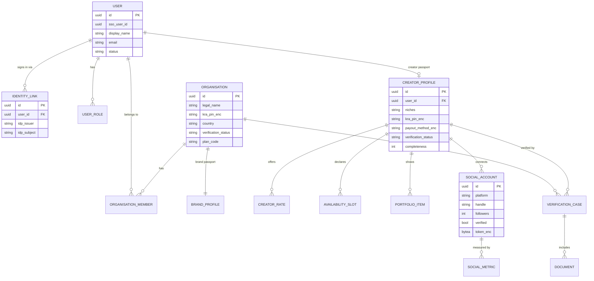
<p class="fig">Figure 19. Identity, organisations and Passports.</p>

### 26.2 Campaigns, agreements and content

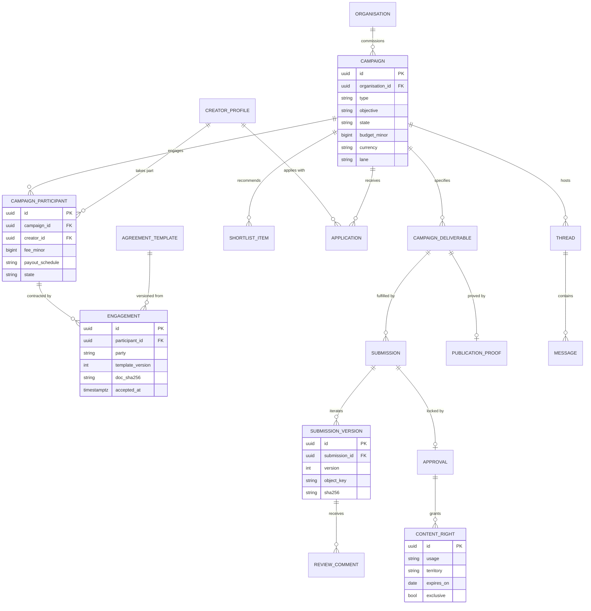
<p class="fig">Figure 20. Campaigns, agreements and content. One campaign links two engagement records per creator: AELIA–Brand and AELIA–Creator.</p>

### 26.3 Payments, ledger and tax

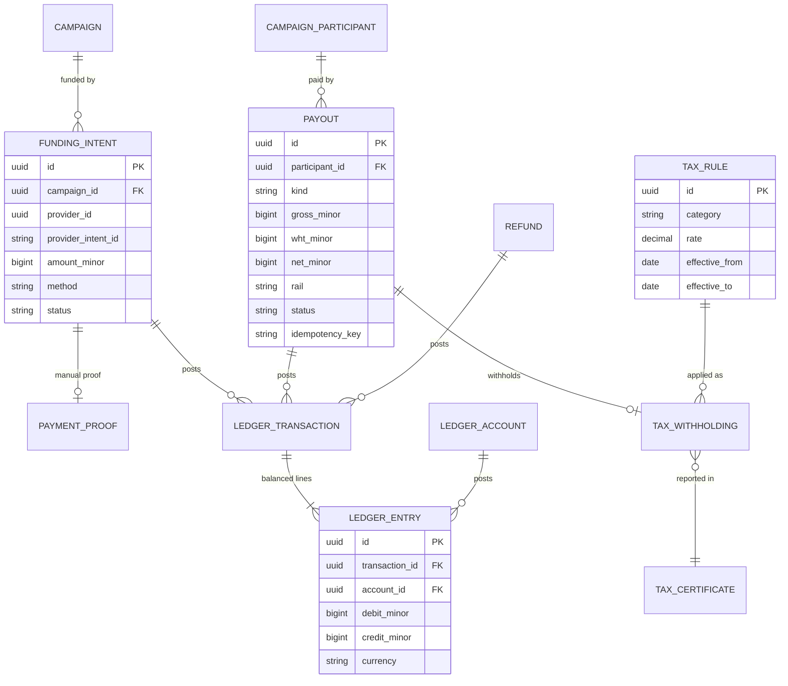
<p class="fig">Figure 21. Payments, double-entry ledger and tax.</p>

## 27. Entity Dictionary, Ownership & Retention

### 27.1 Core entities

| Entity | Description | Key rules |
|---|---|---|
| `users` | AELIA user linked to the IdP identity; display snapshot | Created just-in-time on the first valid token; never stores passwords |
| `identity_links` | (issuer, subject) to user mapping | Unique per issuer and subject; enables IdP replacement |
| `organisations`, `organisation_members` | Brand organisations and their team | A brand needs `verified` status to fund; member roles are owner, approver, finance, viewer |
| `creator_profiles` and children | Creator Passport: profile, rates, availability, portfolio, social accounts, metrics | KRA PIN and payout method are encrypted; self-declared vs verified flags |
| `verification_cases`, `documents` | KYC/KYB workflow and evidence | Documents are private objects; the decision is audited |
| `campaigns`, `campaign_deliverables` | Brief and deliverable specification | `state` follows the machine in §28; the budget currency is fixed at funding |
| `campaign_participants` | A creator (or in-house or AI lane) engaged on a campaign | Fee, payout schedule and per-participant state |
| `shortlists`, `match_runs`, `match_scores` | Curated and computed recommendations | Scores are stored with a weights snapshot for explainability |
| `agreement_templates`, `terms_acceptances`, `engagements` | Versioned legal templates and per-party acceptance | Immutable once accepted; the PDF hash is stored |
| `submissions`, `submission_versions`, `approvals`, `content_rights`, `publication_proofs` | Content workflow and rights chain | The approved version is immutable; rights reference the engagement terms |
| `threads`, `messages`, `attachments` | Campaign-scoped messaging | Contact details masked before agreement |
| `funding_intents`, `payment_proofs`, `payouts`, `refunds` | Money movements, mirrored with provider references | Idempotency keys unique; status is driven by verified provider events |
| `ledger_accounts`, `ledger_transactions`, `ledger_entries` | Double-entry ledger | Sum of debits = sum of credits per transaction; append-only; corrections by reversal |
| `tax_rules`, `tax_withholdings`, `tax_certificates` | Configurable tax and withholding | Rule version stamped on each withholding |
| `reviews`, `reputation_scores` | Two-sided reviews | Double-blind reveal |
| `disputes`, `dispute_events` | Dispute cases | The decision triggers ledger postings |
| `settings`, `feature_flags` | Effective-dated configuration | Every change audited |
| `integration_*`, `webhook_*` | Integrations Hub (§18) | Secrets are ciphertext only |
| `outbox_events`, `processed_events`, `processed_webhooks` | Reliable events and idempotency | Pruned after publication or TTL |
| `audit_log` | Tamper-evident audit | Retained 7 years |

### 27.2 Data ownership versus Codevertex services

| Data | System of record | AELIA stores | Must NOT be duplicated in AELIA |
|---|---|---|---|
| Login credentials, MFA factors, sessions | IdentityProvider (Codevertex SSO) | `sso_user_id`, issuer and subject, display snapshot | Passwords, MFA secrets |
| Brand, creator, campaign, content, agreement, review, dispute data | **AELIA** | Everything | – |
| Commission ledger, payouts, withholding | **AELIA** (business ledger) | Everything | – |
| Payment transactions, gateway state, GL journals, eTIMS invoices | Treasury | Intent and payout references plus status snapshot | Card data, gateway credentials, GL journals |
| Plan subscriptions and entitlements | BillingProvider (Codevertex Subscriptions) | Plan code snapshot, cached entitlements (60 s) | Plan catalogue master data |
| Notification delivery logs | NotificationProvider | Message request ID and status | Provider logs |
| CRM contact (optional enrichment) | MarketFlow | Nullable `crm_contact_id` and name snapshot | CRM records |

### 27.3 Retention schedule

| Data class | Retention | Disposal |
|---|---|---|
| Financial records (ledger, payouts, withholding, receipts, certificates) | 7 years after the financial year (tax and accounting law) | Archive, then delete |
| Agreements and terms acceptances | 7 years after campaign completion | Archive, then delete |
| Verification documents (ID, incorporation) | Account life + 2 years; rejected applications 6 months | Hard delete from object storage |
| Campaign content and messages | Account life + 2 years, or the licence term if longer | Delete or anonymise |
| Social tokens and metrics | Until revoked or account closure; metrics 3 years | Tokens deleted immediately on revoke |
| Audit log | 7 years | Delete |
| Application logs | 30 days | Rotate |
| Closed accounts (DSR erasure) | Personal data erased or anonymised within 30 days, except where retention is legally required | Anonymise |

## Part G · Workflows & State Machines

The lifecycles that govern campaigns, participants, content and disputes, and the swimlane showing how money and approvals cross between brand, platform and creator.

## 28. Campaign Lifecycle

### 28.1 Transaction swimlane

<div class="swim"><div class="sw-h"></div><div class="sw-h">1 · Brief</div><div class="sw-h">2 · Match</div><div class="sw-h">3 · Agree</div><div class="sw-h">4 · Fund</div><div class="sw-h">5 · Produce and approve</div><div class="sw-h">6 · Pay and review</div><div class="sw-lane">Brand</div><div class="sw-c">Post brief: objective, audience, deliverables, budget</div><div class="sw-c">Review the shortlist and pick one or more creators</div><div class="sw-c">Accept the AELIA campaign order</div><div class="sw-c">Fund via M-Pesa, card or bank transfer</div><div class="sw-c">Review, request revisions, approve</div><div class="sw-c">Rate the creator; rebook</div><div class="sw-lane sw-plat">AELIA platform</div><div class="sw-c sw-plat">Brief checked; matching starts</div><div class="sw-c sw-plat">AELIA Match shortlist; <b>human confirmation</b> and introduction</div><div class="sw-c sw-plat">Generate linked engagement records</div><div class="sw-c sw-plat">Verify the provider event; <b>set the commission aside</b></div><div class="sw-c sw-plat">Lock the approved version; evaluate payout triggers</div><div class="sw-c sw-plat"><b>Release the payout</b> per schedule, minus WHT; certificates</div><div class="sw-lane">Creator</div><div class="sw-c">Passport discoverable</div><div class="sw-c">Receive the invitation; accept or apply</div><div class="sw-c">Accept the AELIA creator engagement</div><div class="sw-c">Starting fee released if scheduled</div><div class="sw-c">Create, submit, revise; publish with disclosure</div><div class="sw-c">Receive net pay; rate the brand</div></div>
<p class="fig">Figure 22. Three-lane transaction swimlane. The platform lane never holds money itself: funds sit with the licensed provider, and AELIA holds the intent, ledger and payout records.</p>

### 28.2 Campaign state machine

The developer brief's 17 states are consolidated into a campaign-level machine plus a per-participant machine (§28.3). Together they cover every original state.

<div class="stflow"><span class="st">draft</span><span class="st-a">&#8594;</span><span class="st">submitted</span><span class="st-a">&#8594;</span><span class="st">matching</span><span class="st-a">&#8594;</span><span class="st">shortlisted</span><span class="st-a">&#8594;</span><span class="st">selection_confirmed</span><span class="st-a">&#8594;</span><span class="st">agreed</span><span class="st-a">&#8594;</span><span class="st">awaiting_funding</span><span class="st-a">&#8594;</span><span class="st">funded</span><span class="st-a">&#8594;</span><span class="st">in_production</span><span class="st-a">&#8594;</span><span class="st">in_review</span><span class="st-a">&#8594;</span><span class="st">approved</span><span class="st-a">&#8594;</span><span class="st">published</span><span class="st-a">&#8594;</span><span class="st">measuring</span><span class="st-a">&#8594;</span><span class="st">completing</span><span class="st-a">&#8594;</span><span class="st">completed</span></div>
<div class="stflow st-side"><span class="st st-x">disputed</span><span class="st-note">from in_production or in_review; resolves to in_production, completing or cancelled</span></div>
<div class="stflow st-side"><span class="st st-x">cancelled</span><span class="st-note">from awaiting_funding (brand cancels or funding expires) or from disputed (refund)</span></div>

| From | Event | To |
|---|---|---|
| `draft` | Brand submits the brief | `submitted` |
| `submitted` | Admin picks it up | `matching` |
| `matching` | Shortlist published (curated or ranked) | `shortlisted` |
| `shortlisted` | Brand selects and AELIA confirms | `selection_confirmed` |
| `selection_confirmed` | All engagements accepted | `agreed` → `awaiting_funding` |
| `awaiting_funding` | Provider event verified, or Finance approves the bank transfer | `funded` → `in_production` |
| `in_production` | First submission | `in_review` |
| `in_review` | Revision requested | `in_production` |
| `in_review` | All deliverables approved | `approved` |
| `approved` | Publication proofs recorded (influence) | `published` → `measuring` |
| `approved` | Content-only campaign | `completing` |
| `measuring` | Metrics window closes | `completing` |
| `completing` | All payouts settled | `completed` |
| `in_production`, `in_review` | Dispute opened | `disputed` |
| `awaiting_funding` | Brand cancels or funding expires | `cancelled` |
<p class="fig">Figure 23. Campaign state machine. Transitions are server-enforced; each emits an <code>aelia.campaign.*</code> event and a timeline entry.</p>

| Guard | Rule |
|---|---|
| `submitted` | Brand verified; current terms accepted; entitlement allows another active campaign |
| `selection_confirmed` | An AELIA admin confirmation record exists for each selected participant (MAT-04) |
| `funded` | Verified provider event **and** a `CheckStatus` confirmation, or a Finance OTP approval for bank transfer |
| `approved` | Every deliverable has an approval with a locked version hash |
| `completed` | Every participant's payouts are `completed` and the ledger transaction for the campaign balances |
| Cancellation | Refund amount computed from the engagement's cancellation terms and the production stage reached |

### 28.3 Participant and payout lifecycle

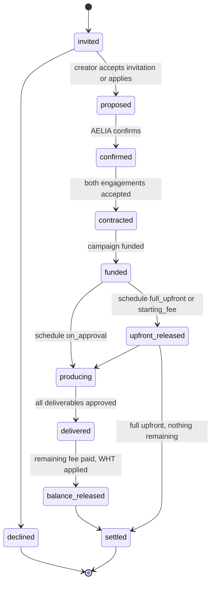
<p class="fig">Figure 24. Per-participant lifecycle, including the three payout schedules.</p>

## 29. Content, Review & Dispute Workflows

### 29.1 Content submission and approval

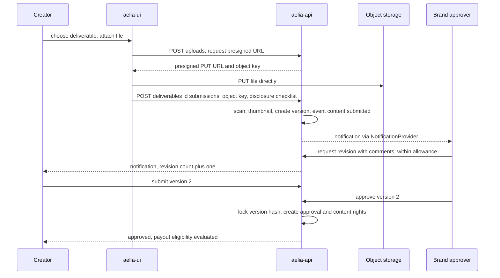
<p class="fig">Figure 25. Submission, revision and approval with direct-to-storage uploads.</p>

### 29.2 Disputes

| Stage | Behaviour | SLA |
|---|---|---|
| Open | Either party opens a dispute from the workspace with a category (non-delivery, quality, late delivery, non-approval, rights misuse, payment) and evidence | – |
| Hold | Pending payouts for that participant are frozen; the campaign moves to `disputed` | Immediate |
| Mediation | An AELIA admin reviews the thread, timeline, versions and agreement terms; requests statements | 5 business days |
| Decision | Outcome: continue, release in full, partial refund with partial release, or full refund. A written reason is recorded | 10 business days |
| Settlement | Ledger postings and PaymentProvider refund and PayoutProvider release, all idempotent; both parties notified | 2 business days |

## Part H · UI/UX Design Specification

Screens, navigation and the user experience for brands, creators and AELIA operations, delivered as one installable, mobile-first web app.

## 30. Experience Architecture

### 30.1 UX principles

1. **Mobile-first.** Creators work mainly on phones. Every creator journey completes one-handed on a 360 px screen, and brand and admin views are optimised for laptops while still working on phones.
2. **One next action.** Every dashboard leads with the single most important pending task (fund, approve, submit, verify).
3. **Money is always explicit.** Every amount shows gross, commission, tax and net, with the rule that produced it.
4. **Trust signals everywhere.** Verified badges, "AELIA curated" labels, disclosure reminders and agreement links sit next to the action they relate to.
5. **Status over notification.** A campaign's current state and its next owner are always visible, with notifications linking back to it.
6. **Brand-consistent.** The AELIA design system (tokens for colour, type and spacing) is built on shared Codevertex UI primitives, with AELIA's own brand identity.

### 30.2 Information architecture

```mermaid
flowchart TB
  ROOT["app.aelia-domain"] --> PUB["Public<br/>landing, how it works,<br/>for brands, for creators,<br/>sign in or sign up"]
  ROOT --> BRD["Brand app"]
  ROOT --> CRT["Creator app"]
  ROOT --> ADM["Admin console"]
  BRD --> B1["Dashboard"]
  BRD --> B2["Discover creators<br/>search, shortlists"]
  BRD --> B3["Campaigns<br/>brief builder, composer,<br/>workspace"]
  BRD --> B4["Content library"]
  BRD --> B5["Payments and receipts"]
  BRD --> B6["Reports"]
  BRD --> B7["Organisation<br/>passport, team, plan"]
  CRT --> C1["Dashboard"]
  CRT --> C2["Opportunities<br/>invitations, open calls"]
  CRT --> C3["My campaigns<br/>workspace, submissions"]
  CRT --> C4["Passport<br/>profile, rates, socials,<br/>availability, portfolio"]
  CRT --> C5["Earnings<br/>payouts, tax certificates"]
  ADM --> A1["Queues<br/>verification, matching,<br/>moderation, disputes"]
  ADM --> A2["Campaigns and users"]
  ADM --> A3["Finance<br/>funding, payouts,<br/>reconciliation, WHT"]
  ADM --> A4["Settings<br/>tax, fees, plans,<br/>templates, match weights"]
  ADM --> A5["Integrations Hub"]
  ADM --> A6["Audit log"]
```
<p class="fig">Figure 26. Sitemap. Role-based navigation shows only the areas a user's roles allow; a role switcher appears for multi-role users.</p>

### 30.3 Key screen illustrations

<div class="mocks">
<div class="mock"><div class="bar"><span>AELIA · Brand</span><span>Acme Foods ▾</span></div><div class="body"><div class="nav"><div class="on">Dashboard</div><div>Discover</div><div>Campaigns</div><div>Content</div><div>Payments</div><div>Reports</div></div><div class="main"><div class="card" style="margin-bottom:7px;border-color:#6d2c6d"><b>Next: fund "Ramadan Reels"</b><i>2 creators agreed · KES 60,000 incl. fees</i><div style="margin-top:4px"><span class="btn">Fund now</span> <span class="ghost">View quote</span></div></div><div class="row"><div class="card"><b>3</b><i>Active campaigns</i></div><div class="card"><b>5</b><i>Awaiting approval</i></div><div class="card"><b>12</b><i>Saved creators</i></div></div><div class="line" style="width:90%"></div><div class="line" style="width:70%"></div></div></div></div>
<div class="mock"><div class="bar"><span>AELIA · Brief builder</span><span>Step 3 of 6</span></div><div class="body"><div class="main"><b style="color:#3f1a3f">Deliverables</b><div class="card" style="margin:5px 0">2 × TikTok video (30–60 s) · Influence<br/><i>usage: 6 months · Kenya · paid media allowed</i></div><div class="card" style="margin-bottom:5px">3 × UGC product shots · Content<br/><i>usage: perpetual · brand channels</i></div><div class="row"><div class="card"><b>KES 80,000</b><i>Budget</i></div><div class="card"><b>1–20 Nov</b><i>Timeline</i></div></div><span class="ghost">Back</span> <span class="btn">Continue to rights</span></div></div></div>
<div class="mock"><div class="bar"><span>AELIA · Composer</span><span>v1</span></div><div class="body"><div class="main"><div class="row"><div class="card"><b>Human creators</b><i>4 matches · from KES 20,000 · 10–14 days</i><div style="margin-top:4px"><span class="btn">See shortlist</span></div></div><div class="card"><b>Hybrid</b><i>creator + AI variants · +3 cuts</i></div></div><div class="row"><div class="card"><b>AELIA Creative &amp; Digital</b><i>in-house production</i></div><div class="card"><b>AI-generated</b><i>flat fee per clip · about 2 days</i></div></div><i style="color:#7c6f7c">The platform recommends. You decide.</i></div></div></div>
<div class="mock"><div class="bar"><span>AELIA · Creator</span><span>Wanjiru K. ✔</span></div><div class="body"><div class="main"><div class="card" style="margin-bottom:7px;border-color:#12805f"><b>Next: submit reel 1 for "Ramadan Reels"</b><i>Due Thu 14 Nov · 1 revision left</i><div style="margin-top:4px"><span class="btn">Upload draft</span></div></div><div class="row"><div class="card"><b>KES 17,400</b><i>Net pending (after 5% WHT)</i></div><div class="card"><b>2</b><i>New invitations</i></div></div><div class="card"><b>Passport 85% complete</b><i>Connect Instagram to get verified metrics</i></div></div></div></div>
<div class="mock"><div class="bar"><span>Workspace · Ramadan Reels</span><span>in_review</span></div><div class="body"><div class="nav"><div>Brief</div><div>Agreement</div><div class="on">Content</div><div>Messages</div><div>Payments</div><div>Performance</div></div><div class="main"><b style="color:#3f1a3f">Reel 1 · version 2</b><div class="card" style="margin:5px 0;height:38px"><i>▶ video preview · 0:42 · #ad disclosed ✔</i></div><div class="card" style="margin-bottom:5px"><i>0:12 "Show the pack label longer" · Brand</i></div><span class="btn">Approve</span> <span class="ghost">Request revision (1 left)</span></div></div></div>
<div class="mock"><div class="bar"><span>Admin · Integrations Hub</span><span>Super Admin</span></div><div class="body"><div class="main"><div class="row"><div class="card"><b>Identity</b><i>Codevertex SSO · ● healthy</i></div><div class="card"><b>Payments</b><i>Codevertex Treasury · ● healthy</i></div></div><div class="row"><div class="card"><b>SMS</b><i>Codevertex Notifications · ● healthy</i></div><div class="card"><b>AI video</b><i>not bound · <u>Add provider</u></i></div></div><span class="btn">+ Add provider</span> <span class="ghost">Webhooks</span> <span class="ghost">Bindings</span></div></div></div>
</div>
<p class="fig">Figure 27. Illustrative wireframes (not final visual design): brand dashboard, brief builder, Campaign Composer, creator dashboard, campaign workspace, Integrations Hub.</p>

### 30.4 Screen inventory

| Area | Screens | Release |
|---|---|---|
| Public | Landing; for brands; for creators; how it works; pricing page (content set by AELIA); sign in or sign up (IdP); terms and privacy | [MVP] |
| Onboarding | Role choice; brand organisation wizard; creator Passport wizard; verification upload; payout method; KRA PIN | [MVP] |
| Brand | Dashboard; discover (search, filters, creator card, Passport); shortlists; brief builder (6 steps: objective, audience, deliverables, rights, budget and timeline, review); recommendations; agreement review; funding (method choice, M-Pesa prompt, card checkout, bank proof); workspace; content library; payments and receipts; team; plan | [MVP]; composer, AI brief, reports, content library [v1] |
| Creator | Dashboard; opportunities; invitation and application; engagement acceptance; workspace; submit and revise; publication proof and metrics; earnings and payouts; Passport editor; availability | [MVP]; social connect, certificates, reviews [v1] |
| Admin | Verification queue; matching queue and shortlist builder; campaign admin; finance (funding verification, payouts, reconciliation, WHT register); settings; Integrations Hub | [MVP]; disputes, moderation, audit explorer, webhooks [v1] |

### 30.5 Design system and PWA behaviour

| Topic | Specification |
|---|---|
| Tokens | Colour, type scale, spacing, radius and elevation as CSS variables. Light theme at MVP, dark theme [v1]. Minimum contrast 4.5:1 for text |
| Components | Built on `@bengo-hub/shared-ui-lib` primitives: buttons, inputs, tables, modals, toasts, steppers, status pills, money display, file uploader, timeline, chat |
| Status language | One colour and label per state across campaign, participant, payout and verification, with an icon so colour is never the only signal |
| Responsive breakpoints | 360, 768, 1024 and 1440 px. Bottom tab bar on mobile, side navigation on desktop |
| PWA | Web manifest with the AELIA icon set; install prompt after first successful action; service worker caching the app shell and static assets; offline read of recent campaigns and messages; queued message send when offline |
| Push | Web push via the NotificationProvider's push channel; opt-in after onboarding |
| Performance budgets | Largest Contentful Paint < 2.5 s on mid-range Android over 4G; JS < 250 kB gzipped per route |
| Accessibility | WCAG 2.1 AA [v1]: keyboard navigation, focus states, ARIA labels, captions required on uploaded video where provided |
| Analytics | Product analytics events (page views, funnel steps) sent to AELIA's own analytics property, owned and accessed by AELIA |

## Part I · Security & Data Protection Specification

Security and privacy controls, from authentication through to breach response, aligned with the Codevertex platform standards and Kenya's Data Protection Act, 2019.

## 31. Security Architecture

### 31.1 Threat model summary

| Asset | Main threats | Key controls |
|---|---|---|
| Campaign funds and payouts | Payout redirection, duplicate payout, forged payment callbacks, insider fraud | Licensed rails only; verified and re-queried provider events; idempotency keys; OTP and dual control on Finance approvals; payout-method change cool-off (24 h) with notification; ledger reconciliation |
| Personal data (IDs, KRA PINs, contacts) | Data breach, over-exposure between users | Field encryption; strict ownership checks; contact masking; least-privilege roles; audit |
| Accounts | Credential stuffing, session hijack | IdP-managed login with MFA for staff; short-lived access tokens (15 min) with refresh rotation; rate limits |
| Content and rights | Leak of unreleased brand content, rights misuse | Private objects with short-lived presigned URLs; watermarking of drafts [v1]; rights records |
| Integration credentials | Secret theft, rogue provider configuration | Encrypted vault; fingerprints only; dual approval for identity and money providers; SSRF-safe connector |
| Platform availability | DDoS, abuse | Cloudflare edge and WAF; ingress rate limits; HPA |

### 31.2 Authentication and authorization

| Control | Specification |
|---|---|
| User authentication | Via the bound IdentityProvider: OIDC Authorization Code + PKCE (S256); tokens validated against JWKS (RS256), issuer and audience; refresh-token rotation |
| MFA | Required for `aelia_admin`, `aelia_finance` and `super_admin`: the admin middleware checks the MFA assertion (`amr`/`acr`); optional for other users [v1] |
| Service-to-service | `X-API-Key` (hashed at rest by auth-api, validated and cached for 5 min) always with an explicit `X-Tenant-ID`; per-service keys with rotation |
| Authorization model | Codevertex three-layer pattern: IdP roles → AELIA roles → permissions `aelia.{module}.{action}`, plus resource ownership (brand membership, campaign participation) enforced in the service layer |
| Sensitive actions | OTP step-up (`428 otp_required`) for payout approval, manual-funding verification, refund, payout-method change, integration activation |
| Sessions | httpOnly, Secure, SameSite=Lax cookies for the web app's refresh token; CSRF tokens on cookie-authenticated mutations |

**Role and permission matrix (summary)**

| Permission area | Brand owner | Brand member | Creator | AELIA Admin | Finance | Super Admin |
|---|---|---|---|---|---|---|
| Organisation and team | manage own | view own | – | view, verify | view | manage |
| Creator Passport | view (verified brands) | view | manage own | view, verify | view | manage |
| Campaigns | manage own | per brand role | view own participation | manage | view | manage |
| Content approval | approve | if approver | submit own | moderate | – | – |
| Funding | fund own | if finance role | – | view | verify, refund | view |
| Payouts | view own campaigns | view | view own | view | approve (OTP) | view |
| Settings, tax, fees | – | – | – | view | tax and fees | manage |
| Integrations Hub | – | – | – | view health | view | manage (dual approval) |
| Audit log | – | – | – | view | view finance | view all |

### 31.3 Application, data and infrastructure security

| Area | Controls |
|---|---|
| Input and output | Server-side validation on every field; parameterised queries (Ent); output encoding; strict Content-Security-Policy; upload type and size limits; malware scanning of uploads |
| API security | OWASP API Top 10 controls; object-level authorization tests for every endpoint; rate limiting (`shared-ratelimit`); request-size limits; no stack traces in errors |
| Encryption in transit | TLS 1.2+ everywhere (cert-manager Let's Encrypt behind Cloudflare); HSTS |
| Encryption at rest | Object storage server-side encryption; application-level AES-256-GCM for PII and secrets with a rotatable key ring; database volume encryption per the hosting standard |
| Secrets management | Kubernetes secrets created through the Codevertex secret scripts, with Sealed Secrets for critical values; no secrets in images or repositories; secret scanning in CI |
| Webhooks | Signature verification, timestamp tolerance, deduplication, raw-payload retention (§19) |
| Dependencies | Dependency and container image scanning in CI; high or critical CVEs block the release |
| Logging | Structured logs without PII or secrets (redaction middleware); audit log for security-relevant events |
| Edge | Cloudflare WAF managed rules; bot protection on sign-up and login; ingress `limit-rps` and `limit-connections` |
| Kubernetes | Non-root containers; read-only root filesystem where possible; resource limits; NetworkPolicy restricting `aelia` namespace egress to required services and provider hosts |
| Testing | SAST and secret scan on every PR; authenticated DAST on staging before G2 and G4; security and data-protection review in P5; an independent penetration test is recommended before v1 at AELIA's discretion |

### 31.4 Ownership and access to critical assets

Requirements spec §4.1: critical AELIA assets must not exist only inside Codevertex-controlled accounts.

| Asset or resource | Requirement | Implementation |
|---|---|---|
| Domain and DNS | AELIA controlled | Registered in AELIA's name. Codevertex is granted DNS-edit delegation |
| Source code | AELIA access and control | Repositories in a GitHub organisation both parties can access from day one, with AELIA as an owner-level member |
| Database | AELIA access and control | Dedicated `aelia` database; read access for AELIA's nominated technical contact; export on request |
| Analytics | AELIA access and control | Analytics property owned by AELIA; Codevertex has user access |
| Payment accounts | Appropriate AELIA access | Paystack, M-Pesa paybill or till, bank accounts and KRA PIN or eTIMS all in AELIA's name. Treasury stores their configuration |
| API credentials | Controlled access | Social developer apps and AI vendor accounts registered by AELIA; secrets entered through the Integrations Hub vault |
| Cloud environment | Controlled access | Codevertex-managed cluster; AELIA gets environment documentation and read access to deployment manifests |
| Documentation | AELIA access | This SRDD, API docs, runbooks and ADRs in the shared repository |
| Backups | AELIA access | Encrypted backups with a documented restore procedure; a copy available to AELIA on request |
| App store accounts | AELIA controlled when applicable | Created in AELIA's name when native apps are built [Later] |

## 32. Data Protection & Privacy

### 32.1 Roles and registration

- **AELIA is the data controller** for brand, creator and campaign personal data. **Codevertex is the data processor**, hosting and operating the platform and shared services under a written data-processing agreement.
- Both register with the **Office of the Data Protection Commissioner (ODPC)** where the Data Protection Act, 2019 requires it. This is a Phase 0 legal task.
- Sub-processors are listed in the DPA and in the privacy notice: payment providers, notification channel providers, AI vendors and social platforms. Adding a provider through the Integrations Hub prompts a sub-processor review checklist.

### 32.2 Privacy-by-design controls

| Principle | Platform control |
|---|---|
| Lawfulness and consent | Versioned privacy notice and terms acceptance at sign-up; separate, withdrawable consents for marketing messages and for social-account data processing; `consent_log` with version, purpose, time and channel |
| Purpose limitation | Social data used only for Passport metrics and matching; AI vendors receive only the brief content needed for generation |
| Data minimisation | Contact details masked until an agreement exists; brands see creator KYC status, never documents |
| Accuracy | Self-service profile editing; verification re-checks on material changes |
| Storage limitation | Retention schedule (§27.3) enforced by scheduled jobs |
| Integrity and confidentiality | Part I security controls |
| Accountability | Audit log; a Data Protection Impact Assessment (DPIA) for matching and social data before v1; a processing register |
| Cross-border transfers | Providers outside Kenya (for example AI and social platforms) are covered by transfer safeguards recorded in the processing register |

### 32.3 Data subject rights

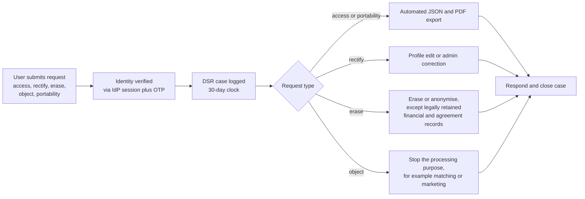
<p class="fig">Figure 28. Data-subject-request workflow, completed within the statutory period.</p>

### 32.4 Breach response

| Step | Action | Timing |
|---|---|---|
| Detect and contain | Alert triage, isolate the affected component, revoke keys or rotate secrets | Immediately |
| Assess | Scope, data categories, affected subjects, risk to individuals | Within 24 h |
| Notify controller | Codevertex (processor) notifies AELIA (controller) | Without undue delay, within 48 h of awareness |
| Notify regulator | AELIA notifies the ODPC | Within 72 h of becoming aware |
| Notify subjects | Where there is a real risk of harm, with guidance | Without undue delay |
| Review | Post-incident review, corrective actions, runbook update | Within 10 business days |

### 32.5 Sponsored-content disclosure and brand safety

- **Disclosure at submission.** Every influence deliverable carries a required disclosure specification (for example `#ad` or the platform's paid-partnership label). The creator confirms it at submission, and it is verified on the publication proof.
- **Brand-safety reporting.** A brand-safety report path is available to users and admins, and feeds the moderation queue.
- **Automated scanning [Later].** Content-safety scanning plugs in through the `ModerationProvider` port.

## Part J · Payment Integration Specification

The payment and transaction architecture: licensed-rail collection, the commission ledger, creator payouts with withholding, and reconciliation. It is delivered through the Codevertex Treasury service by default and can be swapped through the `PaymentProvider` and `PayoutProvider` ports.

## 33. Payments, Ledger & Tax

### 33.1 Principles

1. **Licensed rails only.** Holding client funds in Kenya requires a Payment Service Provider licence from the Central Bank of Kenya, and AELIA does not operate escrow or a stored-value wallet. Funds are collected and disbursed by licensed providers (Paystack, M-Pesa) through merchant accounts **in AELIA's name**. Treasury holds the gateway configuration, and AELIA records intents, ledger entries and payouts.
2. **Fund, then produce.** A campaign is funded after terms are agreed and before production starts. Commission is recognised at funding; the creator's share is released according to the agreed payout schedule.
3. **Split at the processor where supported.** On card and Paystack collection, a configured transaction split routes the platform share and the creator-payable share at processor level in real time. Where a split is not available (M-Pesa, bank transfer), the ledger segregates the creator-payable liability until payout. This behaviour is a provider capability flag (`SupportsSplit`).
4. **Everything is configurable.** Commission rate, who bears it (deducted from the creator's fee or added to the brand's price), processing-fee pass-through, AI-lane fees, tax rules and payout schedules are effective-dated settings, and nothing is hard-coded.
5. **Idempotent and reconcilable.** Every money operation carries an idempotency key. Every provider event is verified and re-queried, and every period reconciles to the shilling.

### 33.2 Funding flows

```mermaid
sequenceDiagram
  participant B as Brand
  participant UI as aelia-ui
  participant API as aelia-api
  participant PP as PaymentProvider, default Treasury
  participant RAIL as Paystack or M-Pesa
  participant W as aelia-worker
  B->>UI: Fund campaign
  UI->>API: POST campaigns id funding with Idempotency-Key
  API->>PP: CreateIntent, reference aelia_campaign_funding, source aelia
  PP-->>API: intent id
  B->>UI: choose M-Pesa or card
  UI->>API: POST funding id initiate
  API->>PP: Initiate with method and payer
  PP->>RAIL: STK push or checkout session with split code
  RAIL-->>B: prompt on phone or card page
  B->>RAIL: authorise payment
  RAIL->>PP: callback
  PP-->>W: treasury.payment.succeeded via NATS or provider webhook
  W->>PP: CheckStatus confirms succeeded
  W->>W: post ledger, campaign to funded, outbox events
  W-->>B: receipt and funding confirmation
```
<p class="fig">Figure 29. Card and M-Pesa funding through the Payment port. With the default profile, Treasury is the provider and events arrive on NATS.</p>

| Method | Flow | Confirmation | Release |
|---|---|---|---|
| M-Pesa (STK push) | Treasury `initiate` with `payment_method: mpesa` and the phone number; the customer approves on their handset | `treasury.payment.succeeded` plus `check-status` | [MVP] |
| Card or Paystack channels | Treasury `initiate` with `payment_method: paystack` returns `authorization_url`; `TreasuryPaymentModal` or a redirect | Paystack signed callback via Treasury, plus `check-status` | [MVP] |
| Bank transfer | The brand gets AELIA bank details and a reference, then uploads proof; Finance verifies against the bank statement; Treasury `confirm-manual` | Finance OTP approval; ledger posts on approval | [MVP] |
| Other currencies and rails | New PaymentProvider bindings per tenant or country | Per provider | [Later] |

### 33.3 Payouts and Treasury extensions

Payouts are created by the worker when a participant reaches a payout trigger in its schedule:

| Schedule | Trigger | Amount released |
|---|---|---|
| Full payment on approval (default for first-time pairings) | All the participant's deliverables approved | 100% of the creator share, net of withholding |
| Starting fee, then balance | Engagement accepted and campaign funded; then on approval | A configured percentage (for example 30–50%) as a starting fee, then the balance. WHT is applied proportionally at each release |
| Full payment upfront (eligibility-gated) | Engagement accepted and campaign funded | 100%. Available only to creators meeting configured Passport thresholds (completion and on-time rate) |

```mermaid
sequenceDiagram
  participant W as aelia-worker
  participant TAX as Tax engine
  participant L as Ledger
  participant F as Finance user
  participant PO as PayoutProvider, default Treasury
  participant R as M-Pesa B2C or Paystack Transfer
  W->>TAX: compute withholding for gross share on payout date
  TAX-->>W: wht amount and rule version
  W->>L: reserve payout, creator payable to payout clearing
  W->>F: payout awaiting approval, auto-approve under threshold if configured
  F->>W: approve with OTP
  W->>PO: Payout with idempotency key payout id
  PO->>R: B2C BusinessPayment or transfer to recipient code
  R-->>PO: result callback
  PO-->>W: treasury.payout.completed
  W->>L: settle clearing, record WHT payable
  W-->>W: event aelia.payout.completed, notify creator with net and WHT
```
<p class="fig">Figure 30. Creator payout with withholding, approval and idempotent disbursement.</p>

**Treasury extensions required (delivered by Codevertex in P3):**

| Extension | Description |
|---|---|
| `creator` payee type | Added to the payout engine alongside the existing payee types (riders, suppliers, staff, equity holders), with recipient creation for M-Pesa numbers, Pochi tills and bank accounts |
| S2S payout API | `POST /api/v1/{tenant}/payouts` with `payee_type`, `payee_ref`, `amount`, `currency`, `rail`, `reference_type: aelia_payout`, `reference_id`, and a required `Idempotency-Key`; status query and `treasury.payout.completed` or failure events |
| Three-way split | The existing platform-and-tenant service-charge split, extended to brand payment → platform commission → creator-payable for AELIA's reference types |
| Funding reference types | `aelia_campaign_funding` and `aelia_refund`, with `source_service: aelia`, so GL auto-posting maps to AELIA's chart of accounts |
| Commission invoicing | eTIMS invoice for AELIA's commission and fee revenue, triggered by an AELIA event |

### 33.4 Double-entry ledger

AELIA's business ledger is the source of truth for platform revenue, creator liabilities and withholding. Treasury's GL receives summarised postings through its normal event-driven auto-posting.

| Account | Type | Purpose |
|---|---|---|
| `provider_clearing:{provider}` | Asset | Funds collected at the provider, not yet settled to AELIA's bank |
| `bank:{account}` | Asset | Settled funds |
| `creator_payable:{creator}` | Liability | The creator's share awaiting release |
| `payout_clearing` | Liability | Payouts submitted, awaiting a provider result |
| `wht_payable` | Liability | Withholding due to KRA |
| `vat_payable` | Liability | VAT on fees where applicable |
| `brand_refund_payable:{brand}` | Liability | Refunds due |
| `commission_revenue` | Revenue | Platform commission |
| `fee_revenue:{type}` | Revenue | AI-lane, subscription and other fees |
| `processing_fees` | Expense | Provider charges (or recovered, per setting) |

**Worked test vector** (configured commission 8%, borne by the creator; WHT 5% of gross):

| Event | Debit | Credit | Amount (KES) |
|---|---|---|---|
| Brand funds a KES 20,000 creator fee | `provider_clearing` | `creator_payable` | 18,400 |
| | `provider_clearing` | `commission_revenue` | 1,600 |
| Content approved; payout submitted | `creator_payable` | `payout_clearing` | 17,400 |
| | `creator_payable` | `wht_payable` | 1,000 |
| Provider confirms payout | `payout_clearing` | `provider_clearing` | 17,400 |
| Monthly WHT remittance | `wht_payable` | `bank` | 1,000 |

<div class="chart"><!-- chart:payout-waterfall --></div>
<p class="fig">Figure 31. Payout calculation for the test vector above: gross KES 20,000 → net KES 17,400. Rates are settings, and this vector is part of the automated test suite.</p>

### 33.5 Tax engine

| Element | Specification |
|---|---|
| Rules | `tax_rules(category, rate, basis, threshold, effective_from, effective_to, country)`. Categories map to work types (digital content monetisation, professional services, and so on) as configured by Finance |
| Default rule | Digital-content withholding at **5% of the gross creator fee**, applied at payout, with the rule version stamped on each withholding |
| Preconditions | Creator KRA PIN validated before any payout (TAX-02) |
| Outputs | Withholding register export for remittance (MVP); monthly per-creator withholding certificates (PDF) [v1]; eTIMS invoices for AELIA's commission and fees via Treasury [v1] |
| Change control | Rate changes are effective-dated. Funded campaigns keep the quote they were funded on, and withholding always follows the rule in force on the payout date |

### 33.6 Reconciliation and controls

| Control | Frequency | Pass criterion |
|---|---|---|
| Ledger balance check | Every posting | Debits = credits per transaction; the posting is rejected otherwise |
| Provider reconciliation | Daily (automated) | Every provider transaction matches exactly one funding intent or payout, and vice versa; exceptions go to the Finance queue |
| Bank reconciliation | Daily for manual transfers; monthly overall | Settled amounts match bank statements |
| Period close | Monthly | Ledger trial balance, WHT register and provider statements agree to the shilling (the G2 exit criterion) |
| Stuck-state sweeper | Every 15 min | Intents and payouts pending beyond their SLA are re-queried with `CheckStatus`, then escalated |
| Segregation of duties | Always | The creator of a payout batch cannot approve it; integration changes to money providers need dual approval |

## Part K · Test & UAT Plan

How the platform is tested and accepted: test levels, integration conformance, pilot UAT, and the acceptance criteria for each gate.

## 34. Test Strategy

### 34.1 Test levels

```mermaid
flowchart TB
  E2E["End-to-end journeys<br/>Playwright on staging, phone and desktop viewports<br/>about 10% of tests"]
  INT["Integration and contract tests<br/>Postgres, Redis, NATS in containers,<br/>provider sandboxes, adapter conformance<br/>about 30% of tests"]
  UNIT["Unit tests<br/>domain rules, state machines, ledger,<br/>tax engine, templating<br/>about 60% of tests"]
  E2E --- INT --- UNIT
```
<p class="fig">Figure 32. Test pyramid. Money, tax and state-machine code has at least 70% coverage.</p>

| Level | Scope | Tooling | When |
|---|---|---|---|
| Unit | Domain services, state-machine guards, ledger postings, tax rules, fee quotes, connector templating | Go `testing`, testify; Vitest for UI logic | Every commit (CI) |
| Integration | Repositories and migrations, outbox relay, consumers, webhook verification, idempotency | Testcontainers (PostgreSQL, Redis, NATS) | Every PR |
| Contract and conformance | Every adapter against its port contract (§34.4) | Shared conformance suite, provider sandboxes and recorded fixtures | Every PR touching adapters; nightly against live sandboxes |
| API | OpenAPI conformance, authorization matrix (every endpoint × every role), error codes | Generated tests plus a role-matrix harness | Every PR |
| End-to-end | The 16-step brand and creator journeys; funding and payouts in sandbox | Playwright | Nightly on staging; before each gate |
| Performance | NFR-02 targets: 1k concurrent users, search at 10k creators, webhook bursts | k6 | P5 (before G4); after major changes |
| Security | SAST, secret scan, dependency and image scan, authenticated DAST, access review | CI scanners, OWASP ZAP | Every PR (static); before G2 and G4 (dynamic) |
| Resilience | Provider outage and circuit breaker, NATS redelivery, duplicate webhooks, pod loss | Fault injection in staging | P5 |
| Recovery | Backup restore to a clean environment within 4 h | Restore drill | Before G5, then quarterly |
| Accessibility | WCAG 2.1 AA checks on core screens | axe and manual review | v1 |

### 34.2 Critical test scenarios (money and state)

| # | Scenario | Expected result |
|---|---|---|
| T-01 | Duplicate `treasury.payment.succeeded` delivery | Funding posted once; the second is acknowledged and ignored |
| T-02 | Forged or unsigned payment webhook | 401; no state change; security log entry |
| T-03 | Provider says succeeded but `check-status` says pending | Funding stays pending; re-queried by the sweeper |
| T-04 | Payout retried after a timeout | Same idempotency key; exactly one disbursement |
| T-05 | Starting-fee schedule with a partial refund on dispute | Ledger balances; WHT proportional; refund equals policy |
| T-06 | Tax rate changed between funding and payout | Quote unchanged; withholding follows the rule on the payout date; rule version stamped |
| T-07 | Payout method changed within 24 h of a payout | Payout held; creator and Finance notified |
| T-08 | Content approval on an unfunded campaign | `409 invalid_state_transition` |
| T-09 | Brand member without approver role approves content | `403 forbidden` |
| T-10 | Primary notification provider down | Fallback provider used for notifications; money operations never fail over |
| T-11 | Identity provider swapped to generic OIDC in staging | Existing users log in and keep their data through `identity_links` |
| T-12 | Month-end reconciliation with 100 synthetic campaigns | Trial balance, WHT register and provider statements agree to the shilling |

### 34.3 Environments and test data

- **Staging.** Mirrors production topology with sandbox providers: the Paystack test mode, the Daraja sandbox, the Treasury eTIMS sandbox, social apps in development mode and the AI vendor on trial keys.
- **Test data.** Synthetic seed data (brands, creators, campaigns) is generated by a seeding command. Production data is never copied to lower environments.
- **Pilot preparation.** Pilot brands and creators are onboarded in production directly after G2. Staging keeps demo tenants for training.

### 34.4 Integration adapter conformance suite

Every adapter, whether Codevertex, vendor or a `generic.rest` connector, must pass the suite for its port before activation (INT-03). The same suite runs in CI for built-in drivers and from the Integrations Hub's "Test connection" for configured providers.

| Port | Conformance checks |
|---|---|
| IdentityProvider | Discovery and JWKS reachable; PKCE flow; token signature, issuer and audience validation; refresh; user-info claim mapping; logout redirect |
| NotificationProvider | Send per supported channel to a test recipient; idempotent resend; status query or delivery receipt parsing; template variables rendered |
| BillingProvider | Entitlements fetch; feature check; limit check; plan change reflected within the cache TTL |
| PaymentProvider | Create intent; initiate (sandbox); status mapping of every provider status to canonical; webhook signature verify (valid, invalid, replayed); refund; idempotency |
| PayoutProvider | Recipient creation; payout with an idempotency key (a repeat returns the same payout); success and failure callbacks; status mapping |
| AIVideoVendor / Social / Storage | Auth; create and poll a job or fetch a profile; error mapping; cost quote; revoke (social); presign put and get (storage) |

## 35. User Acceptance Testing & Acceptance Criteria

### 35.1 UAT approach

- **Who.** UAT runs with the pilot's real brands and creators plus AELIA operations staff, led by the AELIA product owner (accountable) with Codevertex support.
- **Scripts.** Scripts follow the journeys in §5, with each script referencing the FR IDs it verifies. Defects are triaged by severity: critical and high must be fixed before sign-off; medium and low are scheduled.
- **Sign-off.** Sign-off is recorded per gate by the designated AELIA product owner.

| UAT script | Journey | Verifies |
|---|---|---|
| UAT-01 | Brand registers, is verified, invites a team member | REG-01…07, BPP-01 |
| UAT-02 | Creator builds a Passport, sets rates and payout method, is verified | CPP-01…06, REG-04, TAX-02 |
| UAT-03 | Brand creates a brief; admin curates a shortlist; brand selects; admin confirms | CMP-01…04, DIS-05, MAT-01, MAT-04 |
| UAT-04 | Terms accepted by both parties; campaign funded by M-Pesa | AGR-01…04, PAY-01, PAY-03 |
| UAT-05 | Campaign funded by bank transfer with proof; Finance verifies | PAY-02, ADM-03 |
| UAT-06 | Creator submits, brand requests a revision, then approves; publication proof recorded | CNT-01…05 |
| UAT-07 | Payout with WHT under each payout schedule; creator sees net and tax | PAY-04, TAX-01, TAX-03 |
| UAT-08 | Messaging and notifications at every step (in-app, email, SMS) | COM-01…03, COM-07 |
| UAT-09 | Month-end: reconciliation and WHT register | PAY-03, RPT-03, TAX-03 |
| UAT-10 [v1] | Ranked matching, reviews, rebooking, reports, certificates, AI clip order | MAT-02…05, REP-*, RBK-02, RPT-02, TAX-04, AIC-02…04 |
| UAT-11 [v1] | Super Admin adds a sandbox provider, binds it, receives a webhook, replays an outbound webhook | INT-02…06 |
| UAT-12 [v1] | Dispute opened, mediated and settled with a partial refund | ADM-04, PAY-05 |

### 35.2 Gate acceptance criteria

| Gate | Week | Acceptance criteria |
|---|---|---|
| G1 · Environments live | 2 | CI/CD deploys every merge to staging; SSO login works for test brand and creator accounts; Codevertex default integration profile seeded and healthy; monitoring and alerts active |
| G2 · MVP pilot live | 13 | UAT-01…09 passed; a real campaign funded, delivered, approved and paid out in production; ledger reconciles to the shilling; no open critical or high security findings; runbook for pilot support published |
| G3 · Feature complete | 22 | All [v1] requirements implemented; every brief gets a ranked shortlist; every AI clip is costed automatically; conformance suite green for every bound provider |
| G4 · UAT signed off, v1 live | 24 | UAT-10…12 passed; load test meets NFR-02; security and data-protection review complete; v1 released to production |
| G5 · Handover | 26 | Documentation and training delivered; restore proven within 4 h; zero open high or critical findings; two weeks of close post-launch support completed |

### 35.3 Pilot validation (business acceptance, months 3–6)

Pilot targets are in §7.3. The platform must report every indicator directly from its own records: brands and creators verified, campaigns completed, paid transactions, on-time delivery rate, rebooking intent, and the economic validation data.

## Part L · Deployment & Support Runbook

How the platform is deployed, operated, monitored, backed up and supported, and the technical risks that the plan manages.

## 36. Deployment Architecture

```mermaid
flowchart TB
  DEV["Developers"] -->|pull request| GH["GitHub repositories<br/>aelia-api, aelia-ui<br/>AELIA has access"]
  GH -->|CI: lint, test, scan, build| REG["Container registry<br/>image tag = commit SHA"]
  GH -->|CI bumps image tag| OPS["devops-k8s<br/>apps/aelia-api, aelia-worker, aelia-ui<br/>values.yaml"]
  OPS -->|GitOps sync| ARGO["ArgoCD"]
  ARGO --> STG["Staging namespace aelia-staging<br/>sandbox providers"]
  ARGO -->|reviewed promotion| PRD["Production namespace aelia"]
  subgraph CLUSTER["Codevertex k3s cluster"]
    STG
    PRD
    SHARED["Shared services<br/>PgBouncer, PostgreSQL, Redis,<br/>NATS JetStream, MinIO,<br/>cert-manager"]
  end
  CF["Cloudflare DNS and WAF<br/>AELIA-owned domain"] --> PRD
  CF --> STG
  PRD --- SHARED
  STG --- SHARED
```
<p class="fig">Figure 33. Build and deployment pipeline. Production is served on AELIA's own domain through Cloudflare and cluster ingress with automatic TLS.</p>

### 36.1 Environments

| Environment | Hosts | Providers | Data | Deployment |
|---|---|---|---|---|
| Development | Local (Docker Compose) and preview builds | Mocks and sandboxes | Synthetic | On demand |
| Staging | `app.staging.<aelia-domain>`, `api.staging.<aelia-domain>` | Sandboxes (Paystack test, Daraja sandbox, eTIMS sandbox) | Synthetic and demo | Auto on merge to `main` |
| Production | `app.<aelia-domain>`, `api.<aelia-domain>` | Live, in AELIA's name | Live | Reviewed promotion (tag); change window agreed with AELIA |

### 36.2 Kubernetes and configuration

| Item | Specification |
|---|---|
| Chart | The Codevertex generic chart `charts/app`, registered in `devops-k8s` as `apps/aelia-api`, `apps/aelia-worker` and `apps/aelia-ui` (`app.yaml` plus `values.yaml`) |
| Replicas and availability | `replicaCount: 2`, PodDisruptionBudget `minAvailable: 1`, HPA on CPU (target 70%); VPA in recommendation mode |
| Probes | `/healthz` (liveness), `/readyz` (readiness: DB, Redis and NATS reachable) |
| Resources (initial) | api: 100m to 500m CPU, 128 to 512 Mi; worker: 50m to 300m CPU, 128 to 384 Mi; ui: 50m to 300m CPU, 128 to 384 Mi. Tuned from pilot metrics |
| Migrations | Container entrypoint runs `migrate` (Atlas, direct `POSTGRES_MIGRATE_URL`), then `serve`; expand/contract for breaking changes |
| Configuration | Env vars: `DATABASE_URL`, `POSTGRES_MIGRATE_URL`, `REDIS_URL`, `EVENTS_NATS_URL`, `PUBLIC_BASE_URL`, `SSO_ISSUER_URL`, `NOTIFICATIONS_API_URL`, `SUBSCRIPTIONS_API_URL`, `TREASURY_API_URL`, `VERA_API_URL`, `OBJECT_STORAGE_*`, `VAULT_MASTER_KEY` (secret), `INTERNAL_SERVICE_KEY` (secret) |
| Ingress | cert-manager `letsencrypt-prod`; CORS limited to the AELIA app origins; rate-limit annotations; body size 50 MB for the API (uploads go direct to storage) |
| Jobs | `seed-integrations` (post-install and upgrade hook); CronJobs inside the worker for reminders, metrics refresh, reconciliation, certificates, retention |

### 36.3 Release process

1. Merge to `main` after review and green CI. The image is built and pushed, CI updates the staging `image.tag`, and ArgoCD syncs.
2. QA on staging, including automated end-to-end tests. The sprint demo happens here.
3. Promote by tagging a release. CI updates the production `image.tag`, ArgoCD syncs with a rolling update and zero downtime, and release notes go to AELIA.
4. **Rollback:** revert the image tag in `devops-k8s`, and ArgoCD rolls back. Expand/contract migrations keep the previous version compatible.

## 37. Operations & Support

### 37.1 Monitoring and alerting

| Signal | Source | Alert |
|---|---|---|
| Availability | External uptime checks on `app` and `api` every minute | Down for 2 minutes → on-call (Slack and email via `fleet-health-watcher`) |
| Errors and latency | Structured logs (zap via `httpware`) with `request_id`, `tenant_id`, `user_id`; `/metrics` endpoints | 5xx rate above 2% over 5 min; p95 above 800 ms over 10 min |
| Money health | Worker metrics: stuck intents and payouts, reconciliation exceptions, webhook verification failures | Any stuck item past SLA; any failed verification burst |
| Integrations | Integrations Hub health (every 60 s), circuit-breaker state | Provider unhealthy for 5 minutes → Super Admin and on-call |
| Event bus | Outbox backlog and consumer lag | Outbox rows older than 2 minutes; lag above 1,000 messages |
| Capacity | Pod CPU and memory; database connections; storage growth | Above 80% sustained for 15 min |

### 37.2 Backup and recovery

| Item | Policy |
|---|---|
| Database | Daily full backups plus WAL archiving where available; encrypted; retained 30 days (daily) and 12 months (monthly); copy available to AELIA |
| Object storage | Versioned bucket with replication to a secondary location; 30-day version retention |
| Configuration | GitOps manifests in `devops-k8s`; integration configuration inside the database backup; secrets escrowed per the secrets standard |
| Targets | RTO 4 h and RPO 24 h (NFR-04); restore drill before G5, then quarterly |

### 37.3 Incident management and support

| Severity | Definition | Response | Target resolution or workaround |
|---|---|---|---|
| Critical | Platform down, payments or payouts failing, data breach suspected | Within 2 h, any day | 4 h |
| High | Core journey blocked for many users (for example submissions failing) | Within 4 business hours | 1 business day |
| Medium | Feature degraded with a workaround | Within 1 business day | Next sprint |
| Low | Cosmetic issue or question | Within 2 business days | Backlog |

Support after launch covers:

- round-the-clock uptime monitoring and alerts
- security patches, updates and certificate renewals
- daily backups and quarterly restore tests
- bug fixes, and running the AI-generated content pipeline
- small improvements, and a monthly health report to AELIA

The first two weeks after v1 launch are close post-launch support with daily check-ins. On partnership transition, Codevertex provides 90 days of transition support with full runbooks.

### 37.4 Runbook index (delivered in P5)

| Runbook | Contents |
|---|---|
| RB-01 Deploy and rollback | Promotion, rollback, migration failure handling |
| RB-02 Payment incident | Stuck funding or payouts, provider outage, manual reconciliation, customer communication |
| RB-03 Provider swap | Adding and binding a provider, rollback to the Codevertex default profile |
| RB-04 Secret rotation | Vault key rotation, provider credential rotation, webhook secret rotation |
| RB-05 Restore | Database and object restore, verification checklist |
| RB-06 Security incident and breach | Containment, assessment, notification timeline (§32.4) |
| RB-07 Data subject requests | Export, erasure, verification |
| RB-08 Month-end close | Reconciliation, WHT register, certificates, eTIMS checks |

## 38. Technical Risks, Assumptions & Dependencies

| Risk | Severity | Mitigation | Owner |
|---|---|---|---|
| Payment and tax account approvals (Paystack, M-Pesa paybill, KRA eTIMS) take longer than planned | High | Applications start in week 1; payments are built and tested in sandbox meanwhile; the Treasury integration already exists | AELIA, with Codevertex |
| Legal sign-off on the split-payment and funds-flow design slips past month 1 | High | Counsel engaged in week 1; the design supports both processor split and ledger-segregated modes as configuration | AELIA |
| Treasury extensions (creator payee, payout API, three-way split) delay P3 | Medium | Scheduled early in P3 by the Treasury owner; the `PayoutProvider` port allows an interim direct adapter | Codevertex |
| Social platform API permissions or app review limit metrics access | Medium | Manual metrics in MVP; apps submitted for review in P4; adapters degrade gracefully | Codevertex, with AELIA app ownership |
| AI video vendor pricing or API changes | Medium | Cost per clip tracked automatically; brand price is a setting; the `AIVideoVendor` port allows switching vendors | Codevertex |
| Scope growth during the build | Medium | Change control with a 3-day impact estimate; the Future Enhancements Backlog | Both |
| Too few pilot brands or creators for a meaningful UAT | Medium | Recruitment through AELIA Marketing clients and Academy creators from month 2 | AELIA |
| Shared-cluster resource contention | Low | Resource requests and limits; HPA; move to dedicated capacity if pilot metrics require it | Codevertex |
| Team member unavailable | Low | Code reviews, runbooks, backup from the wider Codevertex engineering team | Codevertex |

**Assumptions:**

- A named AELIA product owner is available for weekly decisions and fortnightly demos.
- AELIA provides brand assets and copy for public pages, legal texts (terms, privacy notice, agreement templates) and business accounts in its name.
- Scope follows §7; changes go through change control.

**Exclusions (this SRDD's delivery plan):**

- Native mobile apps and all other [Later] items.
- The Aelia Brand House website.
- Independent third-party penetration testing (recommended, at AELIA's discretion).
- Legal and regulatory filings, content production and paid advertising.

## 39. Appendix A · Requirements Traceability Matrix

| Spec requirement (source) | SRDD requirement IDs | Design reference | Verified by |
|---|---|---|---|
| User Registration & Verification | REG-01…10 | §12.4, §31.2, Part F 26.1 | UAT-01, UAT-02 |
| Creator Passport | CPP-01…10 | §13, §17.1 SocialPlatformConnector | UAT-02, UAT-10 |
| Brand Passport | BPP-01…04 | §13, Part F 26.1 | UAT-01 |
| Creator Discovery | DIS-01…06 | §22.2 | UAT-03 |
| Creator Matching | MAT-01…06 | §13, §17.1 AIMatchProvider | UAT-03, UAT-10 |
| Campaign Creation | CMP-01…08 | §22.2, §28 | UAT-03 |
| Campaign Workspace | WSP-01…05 | §30.3 | UAT-06, UAT-08 |
| Content Marketplace and Submission | CNT-01…08 | §29.1 | UAT-06 |
| Contracts and Rights | AGR-01…06 | Part F 26.2 | UAT-04 |
| Communication | COM-01…07 | §14 Notifications, §23.3 | UAT-08 |
| Payments | PAY-01…10 | Part J | UAT-04, 05, 07, 09; T-01…12 |
| Tax (feasibility correction) | TAX-01…07 | §33.5 | UAT-07, UAT-09 |
| Performance Tracking | PRF-01…04 | §22.3 | UAT-06, UAT-10 |
| Reputation | REP-01…03 | §22.5 | UAT-10 |
| Rebooking | RBK-01…03 | §22.2 | UAT-10 |
| Reporting | RPT-01…05 | §13 reporting | UAT-09, UAT-10 |
| Administration | ADM-01…08 | §30.2, §29.2 | UAT-05, UAT-12 |
| AI content lane (feasibility) | AIC-01…06 | §17.1 AIVideoVendor | UAT-10 |
| Configurable integrations (this SRDD) | INT-01…07 | Part D | UAT-11; §34.4 |
| Technical, data and trust requirements (spec Part 4) | NFR-01…16 | Parts C, F, I, L | §34, §35 |
| Critical ownership and access (spec §4.1) | NFR-15 | §31.4 | G5 checklist |
| API documentation standard (spec §4.2) | – | §24 | G5 checklist |
| Pilot validation (spec §5.1) | – | §7.3 | §35.3 |
| Definition of Done (spec §5.2) | – | §8.3 | Every sprint |

## 40. Appendix B · References & Sign-Off

### 40.1 References

| Reference | Location |
|---|---|
| AELIA System Requirements & MVP Specification v1.0 | Aelia Holdings, September 2026 |
| AELIA Creator Commerce Technical Partnership & Feasibility Report | Codevertex Africa, 21 September 2026 |
| AELIA Creator Commerce Project Proposal (technical and delivery sections) | Codevertex Africa, 26 September 2026 |
| Codevertex microservice, event and data-ownership architecture | `shared-docs/docs/architecture/` |
| Codevertex SSO integration, login flow and authorization pattern | `shared-docs/docs/architecture/` |
| Notifications REST API; Treasury payment workflow; Paystack, M-Pesa and eTIMS references | `shared-docs/docs/integrations/` |
| Platform engineering standards: S2S conventions, idempotency and outbox, secrets management | `shared-docs/internal/platform-standards/` |

### 40.2 Document approval

Signing below approves this SRDD v1.0 as the baseline for development starting 5 October 2026. Later changes follow the change-control process in §8.4.

<div class="signoff">
<div class="sig"><div class="sig-h">For Aelia Holdings Limited · Product Owner</div><div class="sig-cols"><div class="sig-f"><span></span><label>Name</label></div><div class="sig-f"><span></span><label>Signature</label></div><div class="sig-f sig-date"><span></span><label>Date</label></div></div></div>
<div class="sig"><div class="sig-h">For Codevertex Africa Limited · Technical Lead</div><div class="sig-cols"><div class="sig-f"><span></span><label>Name</label></div><div class="sig-f"><span></span><label>Signature</label></div><div class="sig-f sig-date"><span></span><label>Date</label></div></div></div>
</div>
