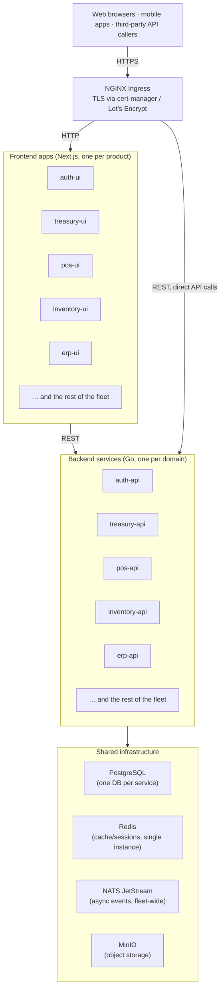

# Codevertex Microservices Architecture

**Date**: May 2026 (merged August 2026)  
**Version**: 1.2  
**Purpose**: Define a hybrid microservices architecture with clear service-to-service communication, scalability, performance, and security for all Codevertex services.

> **August 2026 update**: This document absorbed the genuinely unique, still-accurate content from `ARCHITECTURE-RECOMMENDATIONS.md` (Jan 2026) and `Microservice-Architecture-for-POS-Inventory-Orders.md`, both now retired in favor of this single canonical document.

---

## Table of Contents

1. [Overview](#overview)
2. [Architecture Principles](#architecture-principles)
3. [Production Infrastructure (devops-k8s)](#production-infrastructure-devops-k8s)
4. [Communication Patterns](#communication-patterns)
5. [Service Discovery](#service-discovery)
6. [Service-to-Service Technology Stack](#service-to-service-technology-stack)
7. [Data Sharing & Ownership](#data-sharing--ownership)
8. [Security & Authentication](#security--authentication)
9. [Reliability & Resilience](#reliability--resilience)
10. [Observability](#observability)
11. [Shared Libraries & Abstractions](#shared-libraries--abstractions)
12. [Architecture Diagram](#architecture-diagram)
13. [Implementation Status](#implementation-status)

---

## Overview

Codevertex uses a hybrid microservices architecture that combines multiple communication patterns for different use cases:

- **Event-Driven Architecture (EDA)** via NATS JetStream for asynchronous, decoupled communication
- **REST APIs** for synchronous, request-response operations
- **gRPC/ConnectRPC** for high-throughput internal service communication
- **Webhooks** for callback-based integrations (external and internal)
- **WebSockets** for real-time bidirectional communication
- **GraphQL** for flexible frontend data fetching (future)

The goal is no duplicated entities across services, authenticated and authorized service-to-service calls, graceful degradation under failure, and real-time updates where they're actually needed rather than everywhere by default.

---

## Architecture Principles

### 1. **Single Source of Truth**
Each service owns its domain data. Other services reference via IDs only.

### 2. **Reference Only, No Duplication**
Services store reference IDs (UUIDs), never duplicate entity data.

### 3. **Event-Driven First**
Prefer asynchronous events (NATS) for non-blocking operations.

### 4. **Synchronous When Necessary**
Use REST/gRPC for operations requiring immediate feedback.

### 5. **Fail Fast, Recover Gracefully**
Circuit breakers, retries, and graceful degradation.

### 6. **Secure by Default**
All service-to-service communication authenticated and authorized.

### 7. **Observable Everywhere**
Distributed tracing, metrics, and structured logging.

---

## Production Infrastructure (devops-k8s)

**Status**: ✅ Operational

Codevertex uses a centralized DevOps repository (`devops-k8s`) that provides shared infrastructure, deployment pipelines, and standardized configurations for all microservices.

### Infrastructure Services

#### 1. **Message Brokers** (Namespace: `messaging`)

**NATS JetStream** (Primary - All Go services):
- Service: `nats.messaging.svc.cluster.local:4222`
- **Env var (standard):** `EVENTS_NATS_URL` — all Go backends use this single key for the NATS connection URL.
- Clustering: 2 replicas with JetStream enabled
- Storage: 10Gi PVC for persistence
- Usage: Primary async communication for Go services
- Streams: `{service}.{domain}` (e.g., `subscription.billing`, `logistics.tasks`)

RabbitMQ previously ran alongside NATS as the Celery broker for the original Django-based ERP service. That ERP service has since been fully rebuilt on Go (`erp-api`, part of the same event-driven fleet as every other backend), and RabbitMQ was decommissioned during the 2026-04 infrastructure optimization pass — it no longer runs anywhere in the cluster. NATS JetStream is now the platform's single async messaging layer, used uniformly across all backend services.

#### 2. **Caching & Session Storage** (Namespace: `infra`)

**Redis**:
- Service: `redis-master.infra.svc.cluster.local:6379`
- Usage: 
  - Session storage (JWT refresh tokens)
  - Query result caching (5-60 min TTL)
  - Rate limiting counters
  - Idempotency keys
  - Real-time pub/sub (for WebSockets)
- Storage: 8Gi with persistence
- Priority: `db-critical` (high priority)

#### 3. **Databases** (Per-Service)

**PostgreSQL**:
- Each service has dedicated PostgreSQL database
- Connection strings stored in Kubernetes secrets
- Example: `{service-name}-secrets` → `postgresUrl` key

**Services with Databases**:
- `auth-service` → PostgreSQL in `auth` namespace
- `treasury-service` → PostgreSQL in `treasury` namespace
- `subscription-service` → PostgreSQL (database: `pricing`)
- `logistics-service` → PostgreSQL (PostGIS for geo-queries)
- `ordering-service` → PostgreSQL
- `notifications-service` → PostgreSQL
- `inventory-service` → PostgreSQL
- `pos-service` → PostgreSQL
- `erp-service` → PostgreSQL

#### 4. **Object Storage** (Namespace: `storage`)

**MinIO** (S3-compatible):
- Service: `minio.storage.svc.cluster.local:9000`
- Usage: Treasury service for settlement artifacts, receipts
- Bucket: `treasury-artifacts`

#### 5. **Observability** (Namespace: `infra`)

**OpenTelemetry Collector**:
- Service: `otel-collector.infra.svc.cluster.local:4317`
- Usage: Centralized trace/metric collection
- Export: All services export traces/metrics to collector

**Metrics/dashboards**: a `ServiceMonitor` Helm template exists so any service can expose Prometheus-scrapeable metrics once a metrics-collection stack is pointed at it. See [Observability](../platform-standards/observability.md) for what's actually running today.

### API Gateway & Ingress

**NGINX Ingress Controller**:
- Entry point for all external traffic
- TLS termination via cert-manager (Let's Encrypt)
- Domain-based routing to services
- Load balancing across service replicas

**TLS Certificates**:
- Managed by cert-manager
- ClusterIssuer: `letsencrypt-prod`
- Automatic renewal
- Per-service TLS secrets

**External Domains**:
- Auth API: `sso.codevertexafrica.com`
- Auth UI: `accounts.codevertexafrica.com`
- Treasury API: `booksapi.codevertexafrica.com`
- Treasury UI: `books.codevertexafrica.com`
- Notifications: `notifications.codevertexafrica.com`
- Ordering API: `orderingapi.codevertexafrica.com`
- Ordering UI: `ordering.codevertexafrica.com`
- Cafe/Ordering storefront: per-tenant custom domain (example: `example-tenant.com`)
- POS API: `posapi.codevertexafrica.com`
- POS UI: `pos.codevertexafrica.com`
- Subscription API: `pricingapi.codevertexafrica.com`
- Projects API: `projectsapi.codevertexafrica.com`
- Projects UI: `projects.codevertexafrica.com`
- IoT: `iot.codevertexafrica.com`
- ISP Billing API: `ispbillingapi.codevertexafrica.com`
- ISP Billing UI: `ispbilling.codevertexafrica.com`
- Ticketing API: `ticketingapi.codevertexafrica.com`
- Ticketing UI: `ticketing.codevertexafrica.com`
- ERP API: `erpapi.codevertexafrica.com`

### GitOps & Deployment

**ArgoCD**:
- GitOps deployment orchestrator
- Monitors `devops-k8s` repository
- Root application syncs all child applications
- Internal admin tool — URL intentionally not published here

**Helm Charts**:
- Generic reusable chart in `charts/app/`
- Standardized deployment templates
- Service-specific values in `apps/{service}/values.yaml`

**GitHub Actions**:
- CI/CD pipelines for each service
- Reusable workflows from `devops-k8s`
- Automated builds and deployments

### Autoscaling & Resource Management

**Horizontal Pod Autoscaler (HPA)**:
- All services configured with HPA
- CPU/Memory-based scaling
- Min/Max replicas per service

**Vertical Pod Autoscaler (VPA)**:
- Enabled for critical services (ERP, Treasury)
- Automatic resource recommendations
- Update mode: `Recreate`

**KEDA** (Future):
- Queue-driven autoscaling
- NATS queue depth scaling

### Deployment Pattern

**Standard Service Structure**:
```
apps/
  {service-name}/
    app.yaml          # ArgoCD Application manifest
    values.yaml       # Helm values
    README.md         # Service-specific docs
```

**Reusable Helm Chart** (`charts/app/`):
- Generic deployment templates
- Supports: HTTP services, background workers, migrations, seeding
- Standardized health checks, monitoring, ingress

---

## Communication Patterns

### Pattern Selection Matrix

| Use Case | Pattern | Technology | When to Use |
|----------|---------|------------|-------------|
| **Async notifications** | Event-Driven | NATS JetStream | User/tenant sync, status updates, audit logs |
| **Real-time queries** | REST API | HTTP/REST | Data retrieval, immediate operations |
| **High-throughput internal** | gRPC | ConnectRPC | Bulk operations, streaming, service-to-service |
| **External callbacks** | Webhooks | HTTP POST | Payment providers, third-party integrations |
| **Internal callbacks** | Webhooks | HTTP POST | Service-to-service callbacks (payment confirmations) |
| **Live updates** | WebSockets | WS/WSS | Real-time tracking, live notifications |
| **Complex queries** | GraphQL | GraphQL | Frontend data fetching (future) |

---

## 1. Event-Driven Architecture (NATS JetStream)

**Status**: ✅ Implemented (primary async communication)

**Technology**: NATS JetStream

**Use For**:
- User/tenant synchronization
- Status updates
- Notifications
- Audit logging
- Non-blocking operations
- Event sourcing

### Architecture

```
┌─────────────┐         ┌──────────────┐         ┌─────────────┐
│   Service   │────────▶│ NATS         │────────▶│   Service   │
│     A       │ Publish │ JetStream    │ Consume │     B       │
└─────────────┘         └──────────────┘         └─────────────┘
                             │
                             ▼
                    ┌──────────────┐
                    │  Outbox      │
                    │  Pattern     │
                    └──────────────┘
```

### Implementation

**Stream Naming**: `{service_name}.{domain}` (e.g., `subscription.billing`, `logistics.tasks`)

**Subject Naming**: `{service_name}.{entity}.{action}` (e.g., `auth.user.created`, `treasury.payment.success`)

**Outbox Pattern** (Recommended for reliability):
1. Store event in database (same transaction as domain operation)
2. Background worker publishes from outbox table to NATS
3. Delivery survives even if NATS is temporarily unavailable

**Direct Publish** (For non-critical events):
- Direct NATS publish without persistence
- Suitable for non-critical status updates

### Services Using NATS

| Service | Stream Name | Subjects | Outbox Pattern |
|---------|-------------|----------|----------------|
| **auth-service** | `auth.events` | `auth.user.*`, `auth.tenant.*` | ⚠️ Partial |
| **subscription-service** | `subscription` | `subscription.*` | ✅ Implemented |
| **notifications-service** | `notifications` | `notifications.*` | ✅ Implemented |
| **logistics-service** | `logistics` | `logistics.*` | ✅ Implemented |
| **ordering-service** | `ordering` | `ordering.*` | ❌ Direct publish |
| **treasury-service** | `treasury` | `treasury.*` | ⚠️ Partial |
| **projects-service** | `projects` | `projects.*` | ✅ Implemented |
| **iot-service** | `iot` | `iot.*` | ✅ Implemented |

### Published Event Catalog by Service

| Publisher | Subject Prefix | Representative Events |
|-----------|-----------------|------------------------|
| auth-service | `auth.events` | `user.created`, `user.updated`, `user.deleted`, `tenant.created`, `tenant.updated`, `tenant.deleted`, `user.password_changed`, `user.2fa_enabled`, `user.session_created` |
| subscription-service | `subscriptions.events` | `subscription.created`, `subscription.activated`, `subscription.cancelled`, `subscription.expired`, `subscription.upgraded`, `subscription.downgraded` |
| ordering-service | `ordering.events` | `order.created`, `order.confirmed`, `order.ready`, `order.completed`, `order.cancelled` |
| logistics-service | `logistics.events` | `task.created`, `task.assigned`, `task.completed`, `task.cancelled` |
| notifications-service | `notifications.events` | Consumer only — email/SMS/push delivery, no domain events published |

This complements the general `{service_name}.{entity}.{action}` subject pattern above. Services migrated to the transactional outbox (see "Recent Architecture Additions" further below) publish under a per-service `{service}.events` subject with an `event_type` field in the envelope instead.

### Gaps

- Outbox pattern is only partially rolled out (implemented for subscription, notifications, logistics, projects, IoT; still partial for ordering, treasury, auth)
- No event schema registry
- No event versioning strategy
- Dead-letter queue handling exists in the shared-events library but needs per-service configuration

### Recommendations

1. Standardize the outbox pattern for all critical events, across every service
2. Adopt JSON Schema or Protobuf for event contracts (schema registry)
3. Support event versioning (e.g., `auth.user.created.v1`, `auth.user.created.v2`)
4. Configure DLQ handling for failed event processing

---

## 2. REST API (Synchronous)

**Status**: ✅ Implemented (standard HTTP calls)

**Technology**: HTTP/REST with Chi Router (Go) or Gin (Go)

**Use For**: real-time data retrieval, immediate operations requiring a response, query operations, CRUD operations.

### Current Implementation

Services address each other via Kubernetes DNS internally and HTTPS externally:
- Internal: `http://{service}.{namespace}.svc.cluster.local:{port}`
- External: `https://{domain}.codevertexafrica.com`

Config is env-var driven per service — each service holds the URLs of the services it calls (e.g. `AUTH_SERVICE_URL`, `TREASURY_SERVICE_URL`).

Calls go through the shared HTTP client (`shared-service-client`), which adds:
- Circuit breaker (gobreaker) — opens after 5 consecutive failures
- Retry with exponential backoff — 100ms to 5s, max 30s
- Distributed tracing (OpenTelemetry)
- Structured logging (Zap)
- Configurable timeouts (default 10s)

**Usage**:
```go
client := serviceclient.New(serviceclient.DefaultConfig(
    "http://auth-api.auth.svc.cluster.local:4101",
    "auth-service",
    logger,
))
resp, err := client.Get(ctx, "/api/v1/users/"+userID, nil)
```

### Gaps

None outstanding — all services have migrated to the shared HTTP client, and Kubernetes DNS-based service discovery is fully in place.

---

## 3. gRPC/ConnectRPC (High-Throughput)

**Status**: Not yet implemented

**Technology**: ConnectRPC, for high-throughput internal service communication, bulk operations, streaming data, and service-to-service RPCs where REST's overhead matters.

---

## 4. Webhooks (Callbacks)

**Technology**: HTTP POST with HMAC signature verification.

**External** (implemented): treasury-service handles M-Pesa and Paystack webhooks, with HMAC signature verification and retry logic on event processing.

**Internal**: service-to-service communication uses NATS events rather than internal webhooks — see [Event Architecture](event-architecture.md).

---

## 5. WebSockets (Real-Time)

**Status**: Not yet implemented

**Technology**: WebSocket (WS/WSS), for real-time order tracking, live driver/rider location updates, live notifications, and collaborative features. The intended design pairs a WebSocket gateway with Redis pub/sub to broadcast updates to connected clients.

---

## 6. GraphQL (Flexible Queries)

**Status**: Not yet implemented

**Technology**: GraphQL, for frontend data fetching that needs complex nested queries or flexible field selection — dashboards aggregating data from multiple services, or mobile apps that want to avoid over-fetching.

---

## Service Discovery

**Status**: ✅ Implemented (Kubernetes DNS-based)

### Production Implementation

**Kubernetes DNS-Based Discovery** (Currently in use):

All services communicate via Kubernetes DNS service names following the pattern:
```
{service-name}.{namespace}.svc.cluster.local:{port}
```

**Internal Service Communication** (Backend-to-Backend):
- Auth Service: `auth-api.auth.svc.cluster.local:4101`
- Treasury Service: `treasury-api.treasury.svc.cluster.local:4000`
- Notifications Service: `notifications-service.notifications.svc.cluster.local:4000`
- Subscription Service: `subscription-service.subscription.svc.cluster.local:4005`
- Logistics Service: `logistics-api.logistics.svc.cluster.local:4000`
- Ordering Service: `ordering-backend.ordering.svc.cluster.local:4000`
- POS Service: `pos-api.pos.svc.cluster.local:4000`
- Inventory Service: `inventory-api.inventory.svc.cluster.local:4000`

**Infrastructure Services** (Shared resources):
- Redis: `redis-master.infra.svc.cluster.local:6379`
- NATS: `nats.messaging.svc.cluster.local:4222`
- MinIO: `minio.storage.svc.cluster.local:9000`

**External Service Communication** (Frontend-to-Backend):
- Auth API: `https://sso.codevertexafrica.com`
- Auth UI: `https://accounts.codevertexafrica.com`
- Treasury API: `https://booksapi.codevertexafrica.com`
- Treasury UI: `https://books.codevertexafrica.com`
- Notifications Service: `https://notifications.codevertexafrica.com`
- Ordering API: `https://orderingapi.codevertexafrica.com`
- Ordering UI: `https://ordering.codevertexafrica.com`
- Cafe Website: `https://example-tenant.com`
- POS API: `https://posapi.codevertexafrica.com`
- POS UI: `https://pos.codevertexafrica.com`
- Subscription API: `https://pricingapi.codevertexafrica.com`
- Projects API: `https://projectsapi.codevertexafrica.com`
- Projects UI: `https://projects.codevertexafrica.com`
- IoT Service: `https://iot.codevertexafrica.com`
- ISP Billing API: `https://ispbillingapi.codevertexafrica.com`
- ISP Billing UI: `https://ispbilling.codevertexafrica.com`
- Ticketing API: `https://ticketingapi.codevertexafrica.com`
- Ticketing UI: `https://ticketing.codevertexafrica.com`

### Namespace Organization

**Infrastructure Namespaces**:
- `infra` - Shared infrastructure (Redis, PostgreSQL)
- `messaging` - NATS JetStream
- `storage` - Object storage (MinIO)

**Service Namespaces**:
- `auth` - Auth service
- `treasury` - Treasury service
- `notifications` - Notifications service
- `subscription` - Subscription service (to be created)
- `logistics` - Logistics service
- `cafe` / `ordering` - Ordering service
- `pos` - POS service
- `inventory` - Inventory service
- `erp` - ERP service

### Service URLs Configuration

**Backend Services** (Use Kubernetes DNS for internal communication):
```go
// Configuration in service values.yaml
env:
  - name: AUTH_SERVICE_URL
    value: http://auth-api.auth.svc.cluster.local:4101
  - name: TREASURY_SERVICE_URL
    value: http://treasury-api.treasury.svc.cluster.local:4000
```

**Frontend Services** (Use HTTPS URLs for external communication):
```yaml
env:
  - name: NEXT_PUBLIC_API_URL
    value: https://sso.codevertexafrica.com
  - name: NEXT_PUBLIC_NOTIFICATIONS_URL
    value: https://notifications.codevertexafrica.com
```

### Benefits

- **Zero configuration**: Kubernetes DNS resolves service names automatically
- **Load balancing**: built into the Kubernetes Service
- **Health checks**: unhealthy pods are excluded from service endpoints automatically
- **Multi-namespace**: logical separation via namespaces
- **No service registry needed**: Kubernetes DNS is the registry

### Future Enhancements

**Service Registry** (Optional - For advanced scenarios):
- Consul/etcd for cross-cluster service discovery
- Service mesh (Istio/Linkerd) for advanced traffic management

---

## Service-to-Service Technology Stack

### Technology Selection by Service and Use Case

| Service | Primary Protocol | Message Broker | Database | Cache | Why This Stack? |
|---------|-----------------|----------------|----------|-------|-----------------|
| **auth-service** | REST (HTTP) | NATS JetStream | PostgreSQL | Redis | JWT validation requires REST, events for user/tenant sync, Redis for session cache |
| **subscription-service** | REST + gRPC (future) | NATS JetStream | PostgreSQL | Redis | REST for feature checks, gRPC for high-throughput usage reporting, NATS for billing events |
| **notifications-service** | REST + gRPC (future) | NATS JetStream | PostgreSQL | Redis | REST for immediate delivery, gRPC for bulk notifications, NATS for event-driven triggers |
| **treasury-service** | REST + gRPC (future) | NATS JetStream | PostgreSQL | Redis | REST for payment intents, gRPC for bulk settlements, NATS for payment events |
| **logistics-service** | REST + WebSocket | NATS JetStream | PostgreSQL (PostGIS) | Redis | REST for CRUD, WebSocket for real-time tracking, NATS for task events, PostGIS for geo-queries |
| **ordering-service** | REST + WebSocket | NATS JetStream | PostgreSQL | Redis | REST for orders, WebSocket for live updates, NATS for order lifecycle events |
| **inventory-service** | REST | NATS JetStream | PostgreSQL | Redis | REST for stock queries, NATS for stock update events |
| **pos-service** | REST | NATS JetStream | PostgreSQL | Redis | REST for POS operations, NATS for order events |
| **erp-service** | REST | NATS JetStream | PostgreSQL | Redis | REST for API, NATS for async events — same pattern as the rest of the Go fleet |

### Communication Pattern Decision Tree

**REST API**: synchronous operations requiring an immediate response, CRUD, queries, external-facing APIs, frontend-to-backend communication.

**NATS JetStream (Events)**: asynchronous notifications, user/tenant synchronization, status updates, audit logging, event sourcing, non-blocking operations.

**gRPC**: high-throughput internal service calls, bulk operations, streaming data, service-to-service RPCs (future), micro-batching scenarios.

**WebSockets**: real-time tracking (delivery, order status), live notifications, collaborative features, anything needing bidirectional communication.

**Webhooks**: external service callbacks (payment providers), internal service-to-service callbacks, event delivery to external systems.

### Service Communication Examples

#### Example 1: Order Creation Flow (REST + NATS)

```
Ordering Service → Treasury Service (REST)
  POST /api/v1/payments/intents
  Response: {payment_intent_id, status}

Ordering Service → Logistics Service (NATS)
  Event: ordering.order.created
  Payload: {order_id, delivery_address, items}

Ordering Service → Notifications Service (NATS)
  Event: ordering.order.created
  Payload: {customer_id, order_id, template: "order_confirmation"}
```

**Why This Pattern?**
- REST for payment requires immediate confirmation
- NATS for logistics (non-blocking, eventual consistency OK)
- NATS for notifications (non-blocking, can retry)

#### Example 2: Feature Check (REST + Cache)

```
Any Service → Subscription Service (REST)
  GET /api/v1/{tenant_id}/features/multi_warehouse
  Cache: Redis (60s TTL)
  Response: {enabled: true, limit: 5}
```

**Why REST?**
- Immediate response required (blocking operation)
- Low latency with Redis cache
- Simple request-response pattern

#### Example 3: User Synchronization (NATS Events)

```
Auth Service → All Services (NATS)
  Event: auth.user.created
  Payload: {user_id, email, tenant_id}

Services consume event and create local user references
```

**Why NATS?**
- Multiple subscribers (all services need user data)
- Non-blocking (service can process async)
- Reliable delivery with JetStream

#### Example 4: Real-Time Tracking (WebSocket + Redis Pub/Sub)

```
Frontend → Logistics Service (WebSocket)
  Connection: ws://logistics-service/ws/task/{task_id}

Logistics Service → Redis Pub/Sub
  Publish: task:{task_id}:updates
  Payload: {status: "en_route", location: {...}}

Frontend receives real-time updates via WebSocket
```

**Why WebSocket?**
- Real-time bidirectional communication
- Lower latency than polling
- Efficient for continuous updates

#### Example 5: Stock Reservation & Backflush Depletion (Ordering + Inventory)

```
Customer → Ordering Service (REST)
  Add item to cart

Ordering Service → Inventory Service (REST, synchronous)
  POST /api/v1/reservations
  Inventory places a temporary hold (soft reservation) on the requested quantity

If order is finalized:
  Ordering Service → Inventory Service (REST)
    Consume reservation → permanent stock deduction

If cart/hold expires without checkout:
  Inventory Service releases the hold automatically
```

For recipe-based items (bakery, café), inventory-service also supports **backflush depletion**: when pos-service publishes a sale-finalized event, inventory-service resolves the item's BOM/recipe and deducts each ingredient in real time, rather than requiring the ingredients to be reserved individually up front.

**Why This Pattern?**
- Synchronous REST for the reservation call (ordering needs to know immediately if stock is available)
- Time-bound holds prevent overselling without requiring a distributed lock
- Event-driven backflush keeps POS sales low-latency — ingredient depletion happens asynchronously after the sale completes

---

## Shared Libraries & Abstractions

### Current Shared Libraries

#### 1. shared-auth-client

**Purpose**: JWT validation and authentication for all services

**Repository**: `github.com/Bengo-Hub/shared-auth-client`

**Features**: JWKS fetching and caching, RS256 signature validation, issuer/audience validation, HTTP middleware for Chi and Gin routers, API key fallback support, Redis session caching.

**Usage**:
```go
import authclient "github.com/Bengo-Hub/shared-auth-client"

validator, _ := authclient.NewValidator(config)
authMiddleware := authclient.NewAuthMiddleware(validator)
router.Use(authclient.GinMiddleware(authMiddleware))
```

**Services Using**: All Go services (auth, subscription, notifications, treasury, logistics, ordering, inventory, pos)

### Frontend Shared Libraries (NPM)

#### @bengo-hub/shared-ui-lib v0.1.5

**Package**: `@bengo-hub/shared-ui-lib`  
**Repository**: `github.com/Bengo-Hub/shared-ui-lib`  
**Published to**: GitHub Packages (npm.pkg.github.com)

**Components** (all use iframe + postMessage):
- `TreasuryPaymentModal` — embeds `books.codevertexafrica.com` in an iframe; handles Paystack, M-Pesa, COD; postMessage events: `treasury:payment_initiated`, `treasury:payment_confirmed`, `treasury:payment_failed`
- `SSOLoginModal` — embeds `accounts.codevertexafrica.com` in an iframe; postMessage events: `auth:login_success`, `auth:login_failed`
- `TrackingIframeModal` — embeds `logistics.codevertexafrica.com`; postMessage events: `tracking:resize`, `logistics:resize`

**Services using v0.1.5**: ordering-frontend, pos-ui, subscriptions-ui, notifications-ui, cafe-website, inventory-ui, truload-frontend

**Reference pattern** (GitHub URL, pnpm):
```json
"@bengo-hub/shared-ui-lib": "github:Bengo-Hub/shared-ui-lib#v0.1.5"
```

#### @bengo-hub/maps v0.2.6

**Package**: `@bengo-hub/maps`  
**Repository**: `github.com/Bengo-Hub/maps`  
**Services using**: logistics-ui, rider-app, ordering-frontend

---

### Additional Shared Libraries

#### 2. shared-service-client — Implemented

**Purpose**: standardized HTTP client for service-to-service communication (circuit breaker, retry, tracing, logging — see [REST API](#2-rest-api-synchronous) above for the full feature list).

**Repository**: `github.com/Bengo-Hub/shared-service-client`

**Services using**: logistics-service, subscription-service; remaining services can migrate incrementally.

#### 3. shared-events — Implemented

**Purpose**: standardized event publishing/consuming with the outbox pattern (schema validation, versioning, dead-letter handling, idempotency, NATS JetStream integration, background publisher worker). See [Transactional Outbox Pattern](#transactional-outbox-pattern) below for how the outbox mechanics and event envelope work.

**Repository**: `github.com/Bengo-Hub/shared-events`

**Services using**: subscription, notifications, logistics, projects, IoT.

```go
// shared/events/publisher.go
func (p *Publisher) PublishWithOutbox(ctx context.Context, event Event) error {
    // Store in outbox table (same transaction as domain event)
    // Background worker publishes from outbox
}

// Usage
publisher.PublishWithOutbox(ctx, &UserCreatedEvent{
    UserID:   userID,
    Email:    email,
    TenantID: tenantID,
})
```

Logging (via `shared/httpware`'s `zap` integration) and tracing (via `shared/service-client`'s OpenTelemetry spans) are already standardized — see [Observability](../platform-standards/observability.md). A dedicated `shared-config` package for standardized env-var parsing and validation doesn't exist yet; each service handles its own config loading today.

---

## Service-Specific Technology Recommendations

The [service/use-case table](#technology-selection-by-service-and-use-case) above covers the current stack per service. Below are the services where the technology choice needs more explanation, plus concrete usage patterns for planned upgrades.

#### auth-service

REST for JWT validation follows the standard OAuth2/OIDC pattern. NATS publishes user/tenant events to multiple subscribers. PostgreSQL holds user/tenant/role data (needs ACID guarantees). Redis caches JWKS and sessions for high-frequency reads.

Future: gRPC for high-throughput user lookups if the need arises, and internal webhook endpoints for tenant/user discovery.

#### subscription-service

Planned: gRPC for feature checks, which every service calls on every request — lower latency and less overhead than REST at that volume (target: <10ms cached, <50ms uncached).

```
Every Service → subscription-service (gRPC)
  CheckFeature(tenant_id, feature_code) → {enabled: true, limit: 5}
```

Also planned: GraphQL for admin dashboards that need complex plan/feature queries.

#### notifications-service

Planned: gRPC for bulk notification campaigns — streaming support for large batches, target throughput 10,000+ notifications/second — and optionally WebSocket for live delivery status.

```
Campaign Service → notifications-service (gRPC)
  SendBulk(notifications: [Notification]) → Stream<Result>
```

#### treasury-service

Planned: gRPC for bulk settlement and payment processing, where batch throughput matters more than per-call latency. Webhooks are already live for M-Pesa and Stripe.

#### logistics-service

WebSocket is the priority here — real-time delivery tracking is core to the product, and polling can't match it for latency or UX (rider → service → customer needs to be bidirectional). PostGIS handles geo-spatial queries (nearest rider, route optimization) natively inside PostgreSQL.

```
Frontend → logistics-service (WebSocket)
  Connect: ws://logistics-service/ws/task/{task_id}
  Receive: {location: {lat, lng}, status: "en_route", eta: "5min"}
```

#### ordering-service

Planned: WebSocket for live order status and ETA updates (better UX than polling), and GraphQL for menu queries with filters (category, dietary, availability) to avoid over-fetching on the frontend.

#### inventory-service, pos-service, erp-service

REST + NATS is sufficient for all three — stock queries and POS operations are simple CRUD with no real-time requirement, and NATS already covers the event-driven side (stock updates, order sync). erp-service was rebuilt from its original Django/RabbitMQ/Celery implementation onto the same Go + REST + NATS + Ent/Atlas pattern as the rest of the fleet. inventory-service may add GraphQL later if aggregation or multi-warehouse queries get complex enough to justify it.

---

### Technology Selection Summary

| Technology | Services Using | Reason |
|------------|---------------|--------|
| **REST API** | All services | Standard synchronous communication, immediate responses |
| **NATS JetStream** | All services | Lightweight, native Go support, uniform async-event layer |
| **gRPC** | subscription, notifications, treasury (planned) | High-throughput, bulk operations, low latency |
| **WebSocket** | logistics, ordering (planned) | Real-time tracking, live updates, bidirectional |
| **GraphQL** | ordering (future), subscription (future) | Flexible frontend queries, complex nested data |
| **PostGIS** | logistics | Geo-spatial queries, route optimization |

---

## Data Sharing & Ownership

**Status**: ✅ Well defined

### Principles

1. **Single Source of Truth**: Each service owns its domain data
2. **Reference Only**: Other services store reference IDs (UUIDs)
3. **Event-Driven Sync**: Services sync data via events (NATS)

### Data Ownership Matrix

| Entity | Owner | Reference Pattern |
|--------|-------|-------------------|
| Users | auth-service | `auth_service_user_id` (UUID) |
| Tenants | auth-service | `tenant_id` (UUID) |
| Outlets | auth-service | `outlet_id` (UUID) |
| Riders | logistics-service | `rider_id` (UUID) |
| Inventory Items | inventory-service | `inventory_item_id` (UUID) |
| Payment Intents | treasury-service | `payment_intent_id` (UUID) |
| Orders | ordering-service | `order_id` (UUID) |
| Subscriptions | subscription-service | `subscription_id` (UUID) |

### Sync Mechanisms

**Event-Driven** (Preferred):
- `auth.user.created` → Services create local user references
- `auth.tenant.created` → Services initialize tenant data

**REST API** (For on-demand sync):
- `GET /api/v1/users/{id}` → Fetch user details from auth-service
- Cache in Redis for performance

**Redis Caching**:
- Cache frequently accessed data (users, tenants)
- TTL: 5-60 minutes
- Invalidate on update events

### Service Entity Ownership Matrix

Beyond the core entities above, each service owns a broader set of domain objects and only references others by ID. This is the service-level "owns vs. references" summary (see [Cross-Service Data Ownership](./cross-service-data-ownership.md) for full entity-level detail):

| Service | Owns | References |
|---------|------|-------------|
| **auth-service** | Users, Tenants, Sessions, MFA, OAuth Clients, API Keys | - |
| **subscription-service** | Plans, Features, Entitlements, Usage Metrics | auth-service (`tenant_id`) |
| **treasury-service** | Invoices, Payments, Refunds, Wallets, GL Entries, Settlements | auth (`user_id`), subscription (plan) |
| **inventory-service** | Items, Variants, Warehouses, Balances, Purchase Orders, BOMs/Recipes | auth (`tenant_id`, `user_id`) |
| **pos-service** | POS Orders, Devices, Cash Drawers, Sessions, Tables | auth, inventory (items) |
| **ordering-service** | Carts, Orders, Addresses, Loyalty | auth, inventory (items), treasury |
| **logistics-service** | Tasks, Zones, Drivers, Fleet, Routes | auth, ordering (orders), inventory |
| **notifications-service** | Templates, Channels, Delivery Logs, Preferences | auth (`user_id`, `tenant_id`) |
| **projects-service** | Projects, Tasks, Milestones, Time Entries | auth (`user_id`) |
| **ticketing-service** | Tickets, Events, Venues, Attendees | auth, treasury |
| **iot-service** | Devices, Sensors, Telemetry, Alerts, Geofences | auth (`tenant_id`), logistics |

### Domain Entity Ownership: POS, Inventory & Order

The POS, Inventory, and Ordering services never share a database table for "items" — each keeps a **service-specific projection** synchronized via events, so a restaurant's "Menu Item" (with modifiers) and a supermarket's "Product" (with barcode/weight) can coexist without compromising the stock records inventory-service owns:

| Entity | Owner | Data Stored | Downstream Usage |
|--------|-------|--------------|-------------------|
| Product Master (SKU) | inventory-service | SKU, name, base UoM, barcode, compliance flags, dimensions | Referenced by ID from pos-service and ordering-service |
| Stock Level | inventory-service | Quantity on hand, reserved quantity, bin location, auto-reorder settings | Queried by ordering-service for fulfillment/reservation |
| Lot / Batch | inventory-service | Lot number, expiry date, supplier | Perishable/pharma compliance tracking |
| BOM / Recipe | inventory-service | Ingredient list, quantities, wastage factor, costing (cost/portion, margin) | Drives stock depletion on POS sale (backflush) |
| Menu Item / POS Catalog Item | pos-service | Local name, modifiers, UI category/price, item type, compliance flags | Used for immediate sales at terminals |
| KDS Ticket | pos-service | Station, order, items, status, priority | Routed to kitchen display stations for prep |
| Appointment | pos-service | Customer, staff member, service items, start/end time | Scheduled service delivery (salons, clinics) |
| Fulfillment Item | ordering-service | Shipping weight, tax class, warehouse source | Used for logistics and checkout |

This is a summary — the authoritative, field-level version lives in [Cross-Service Data Ownership](./cross-service-data-ownership.md).

### Multi-Tenant Data Isolation Tiers

Tenant isolation is layered on top of the per-service database model above. Three isolation strengths are available, selected by tenant scale/regulatory needs:

1. **Shared database, shared schema** (standard tier) — all tenants share the same tables, `tenant_id` is indexed, and PostgreSQL Row-Level Security (RLS) prevents cross-tenant reads even on an application bug.
2. **Shared database, separate schema** (professional tier) — each tenant gets its own schema, simplifying per-tenant migrations/backups while staying on shared infrastructure.
3. **Separate database** (enterprise tier) — high-priority or regulated tenants get a dedicated database instance for maximum isolation and data-residency compliance.

All transactional and inventory entities carry both `tenant_id` and `outlet_id`; a "Warehouse" and a "Store" are both modeled as outlets, each with its own stock records.

---

## Security & Authentication

**Status**: ✅ Implemented (via shared-auth-client)

### Dual Authentication Support (JWT + API Key)

All Codevertex microservices MUST support **dual authentication** - accepting either JWT Bearer tokens OR API Keys interchangeably. This enables:

1. **User Authentication (JWT)**: Interactive user sessions via OAuth2/OIDC flow
2. **Service Authentication (API Key)**: Automated service-to-service calls, webhooks, cron jobs

```
┌─────────────────────────────────────────────────────────────────────────┐
│                    Dual Authentication Flow                              │
├─────────────────────────────────────────────────────────────────────────┤
│                                                                          │
│  Request ──► Authorization Header Present?                               │
│                    │                                                     │
│              ┌─────┴─────┐                                               │
│              │           │                                               │
│              ▼           ▼                                               │
│      Bearer Token?   X-API-Key?                                          │
│              │           │                                               │
│              ▼           ▼                                               │
│      Validate JWT    Validate API Key                                    │
│      (RS256/JWKS)    (auth-service call)                                 │
│              │           │                                               │
│              └─────┬─────┘                                               │
│                    ▼                                                     │
│            Extract Claims                                                │
│         (user_id, tenant_id,                                             │
│          roles, subscription)                                            │
│                    │                                                     │
│                    ▼                                                     │
│            Inject into Context                                           │
│                    │                                                     │
│                    ▼                                                     │
│              Continue to Handler                                         │
│                                                                          │
└─────────────────────────────────────────────────────────────────────────┘
```

### Current Implementation

**JWT validation** (`shared/auth-client`, used by all services): JWKS caching with auto-refresh (1 hour TTL, 5 min refresh), RS256 signature validation, issuer/audience validation, Redis session caching (5 min TTL).

**API key validation**: authenticated via auth-service `/api/v1/admin/api-keys/validate`, service accounts for automated operations, scoped permissions per key, response caching (5 min TTL).

**Middleware Integration** (AuthMiddleware):
```go
// NewAuthMiddlewareWithAPIKey creates middleware supporting both JWT and API Key
authMiddleware := authclient.NewAuthMiddlewareWithAPIKey(
    jwtValidator,      // JWKS-based JWT validation
    apiKeyValidator,   // auth-service API key validation
)

// Apply to protected routes
r.Use(authMiddleware.RequireAuth)
```

### Claims Structure

All authentication methods produce unified `Claims` with:

```go
type Claims struct {
    // Core identity
    SessionID string   `json:"sid"`
    TenantID  string   `json:"tenant_id"`
    Email     string   `json:"email"`
    Scope     []string `json:"scope"`

    // RBAC roles from auth-service
    Roles []string `json:"roles"`

    // Subscription data (embedded at login)
    SubscriptionPlan     string         `json:"subscription_plan"`
    SubscriptionFeatures []string       `json:"subscription_features"`
    SubscriptionLimits   map[string]int `json:"subscription_limits"`
    SubscriptionStatus   string         `json:"subscription_status"`

    // Service account identification
    ServiceName string `json:"service_name"`
    IsService   bool   `json:"is_service"`
}
```

### Token & API Key Security Parameters

| Parameter | JWT | API Key |
|-----------|-----|---------|
| Signing/storage | RS256 (asymmetric) | SHA-256 hashed at rest |
| Lifetime | 15-minute access token, 7-day refresh token | Long-lived, scoped, revocable |
| Rotation | JWKS rotated every 90 days | Supports rotation; each key is service-account scoped |
| Validation | Issuer + audience validated per service | Looked up via auth-service, response cached (5 min TTL) |
| Audit | — | All validations audit-logged |

Tenant isolation is enforced at the repository layer, not just at the auth boundary — every query MUST filter by `tenant_id`:

```go
// ALWAYS filter by tenant_id in queries
func (r *OrderRepo) GetOrders(ctx context.Context, tenantID string) ([]*Order, error) {
    return r.client.Order.Query().
        Where(order.TenantID(tenantID)). // MANDATORY
        All(ctx)
}
```

### Trinity Authorization Pattern

Codevertex uses a 3-layer authorization model:

```
┌─────────────────────────────────────────────────────────────────┐
│                 Trinity Authorization Model                      │
├─────────────────────────────────────────────────────────────────┤
│                                                                  │
│  Layer 1: RBAC (auth-service)                                    │
│  ├── WHO can perform WHAT actions                                │
│  └── Global roles: admin, manager, operator, viewer              │
│                                                                  │
│  Layer 2: Licensing (subscription-service)                       │
│  ├── WHICH features are enabled for tenant                       │
│  └── Plans: STARTER, GROWTH, PROFESSIONAL                        │
│                                                                  │
│  Layer 3: Resource Ownership (domain services)                   │
│  ├── Service-specific RBAC extensions                            │
│  └── Example: POS cashier, kitchen manager, driver               │
│                                                                  │
│  Authorization Check:                                            │
│  ┌──────────────────────────────────────────────────────────┐    │
│  │ RBAC Check (Has Role?) ──► Feature Check (Has License?)  │    │
│  │           │                          │                   │    │
│  │           ▼                          ▼                   │    │
│  │   Ownership Check (Owns Resource?) ──► ALLOW/DENY        │    │
│  └──────────────────────────────────────────────────────────┘    │
│                                                                  │
└─────────────────────────────────────────────────────────────────┘
```

### Service Boundary Rationale: Why subscription-service Stays Separate

subscription-service, auth-service, and treasury-service form a tightly-integrated but intentionally separate 3-service ecosystem:

- **auth-service** owns identity — users, tenants, JWT issuance, session management
- **subscription-service** owns entitlements — plans, feature flags, usage limits, plan history
- **treasury-service** owns money — invoices, payments, refunds

Consolidating subscription-service into auth-service or treasury-service would blur a clear domain boundary: entitlement logic (what a tenant is *allowed* to do) is a distinct concern from identity (*who* they are) and billing (*how they pay*). The three communicate via events — subscription-service publishes feature/plan changes that auth-service consumes and embeds into JWT claims at login (see Claims Structure above), and treasury-service publishes payment status that subscription-service consumes to transition subscription state.

### Service-to-Service Authentication

**Recommended Pattern**: Service Account JWT via API Keys

```go
// Service obtaining JWT for inter-service calls
client := authclient.NewClient(authServiceURL, logger)
resp, err := client.ServiceLogin(ctx, authclient.ServiceLoginRequest{
    APIKey:     os.Getenv("SERVICE_API_KEY"),
    ServiceName: "ordering-service",
})
// Use resp.AccessToken for inter-service calls
```

**Alternative**: Direct API Key usage (simpler but requires auth-service availability)

```go
// Direct API key in service-to-service calls
req.Header.Set("X-API-Key", os.Getenv("INVENTORY_SERVICE_API_KEY"))
```

### Authorization Middleware (v0.2.0+)

The `shared-auth-client` library provides built-in middleware for common authorization patterns:

**Role-Based Access Control**:
```go
// Require specific roles (superuser always bypasses)
r.With(authclient.RequireRole("admin", "manager")).Post("/settings", handler.UpdateSettings)

// Require admin role
r.With(authclient.RequireAdmin()).Delete("/users/{id}", handler.DeleteUser)
```

**Subscription Feature Gating**:
```go
// Require specific subscription feature
r.With(authclient.RequireFeature("group_ordering")).Post("/group-orders", handler.CreateGroupOrder)

// Require minimum plan tier
r.With(authclient.RequirePlan("PROFESSIONAL")).Get("/analytics", handler.GetAnalytics)

// Require active subscription
r.With(authclient.RequireActiveSubscription()).Post("/orders", handler.CreateOrder)
```

**Handler-Level Checks**:
```go
func (h *Handler) CreateOrder(w http.ResponseWriter, r *http.Request) {
    claims, _ := authclient.ClaimsFromContext(r.Context())

    // Check RBAC
    if !claims.HasAnyRole("customer", "staff") {
        // Return 403
    }

    // Check subscription feature
    if !claims.HasFeature("express_delivery") {
        // Express delivery not available in this plan
    }

    // Check usage limits
    if orderCount >= claims.GetLimit("monthly_orders") {
        // Return 403 with upgrade prompt
    }
}
```

### Combined Authorization Check Example (All Three Layers)

A single access-control decision typically walks all three Trinity layers plus tenant isolation:

```go
func authorizeOrderAccess(ctx context.Context, orderID string) error {
    claims, _ := authclient.ClaimsFromContext(ctx)

    // Layer 1: RBAC - does the user have the required role/scope?
    if !claims.HasScope("read:orders") && !claims.IsAdmin() {
        return ErrForbidden
    }

    // Layer 2: Licensing - is the feature enabled for this tenant's plan?
    if !claims.HasFeature("ordering_module") {
        return ErrFeatureNotEnabled
    }

    // Layer 3: Resource ownership - does the user have access to this specific order?
    order, err := repo.GetOrder(ctx, orderID)
    if err != nil {
        return err
    }
    if order.TenantID != claims.TenantID {
        return ErrForbidden // tenant isolation
    }
    if order.UserID != claims.Subject && !claims.HasRole("manager") {
        return ErrForbidden // resource ownership
    }

    return nil // access granted
}
```

### Gaps

- No mTLS for service-to-service communication
- No request signing for internal APIs
- No rate limiting for service-to-service calls

### Future Enhancements

- mTLS for service-to-service communication (via service mesh)
- Request signing for high-security scenarios
- Rate limiting per service (via API gateway or middleware)

---

## Reliability & Resilience

**Status**: ⚠️ Partial (some patterns implemented)

### Patterns

#### 1. Circuit Breaker

**Status**: ✅ Implemented (via `shared-service-client`) — opens after 5 consecutive failures, 30-second timeout before attempting to close, prevents cascading failures.

#### 2. Retry with Backoff

**Status**: ✅ Implemented (via `shared-service-client`) — exponential backoff from 100ms to 5s, 30-second max retry time, retries on network errors and HTTP 5xx/429.

#### 3. Timeout Configuration

**Status**: ✅ Standardized (via `shared-service-client`) — default HTTP client timeout 10 seconds, configurable per service, context-aware.

#### 4. Graceful Degradation

**Status**: ⚠️ Partial — services should implement fallbacks for critical dependencies.

#### 5. Health Checks

**Status**: ✅ Implemented — all services have `/healthz` endpoints.

#### 6. Offline-First Resilience (pos-service)

**Status**: ⚠️ Design pattern (verify current implementation status per deployment)

Physical retail/hospitality locations can lose connectivity mid-shift, so pos-service is designed around an offline-first model rather than assuming the backend is always reachable:

- **Local cache**: POS terminals keep a local database (e.g. SQLite) so sales can continue to be rung up while disconnected from the cloud backend
- **Automatic reconciliation**: once connectivity returns, queued offline transactions sync to pos-service, which triggers the normal sale-finalized events for inventory-service and treasury-service
- **Multi-carrier failover**: critical sites can be provisioned with cellular backup (multi-SIM) to minimize the window of disconnection

---

## Observability

**Status**: ⚠️ Partial (logging implemented, tracing/metrics partial)

### Current State

- ✅ Structured logging (Zap) in all Go services
- ⚠️ Prometheus metrics (partial)
- ❌ Distributed tracing (not implemented)
- ✅ Request ID propagation (implemented)

### Recommendations

**Distributed Tracing**: OpenTelemetry collector deployed, tracing integrated in `shared-service-client`

**Metrics**: Prometheus scraping enabled via ServiceMonitors, custom metrics vary by service

**Logging Standards**: Structured logging (Zap) with request ID and tenant ID propagation

---

## Implementation Status

- **NATS JetStream**, fleet-wide, for async events — every service uses the shared transactional-outbox pattern (`shared-events`) rather than publishing directly.
- **REST APIs** for synchronous operations, via `shared-auth-client` (JWT/API-key auth, RBAC, subscription feature gating) and `shared-service-client` (circuit breaker, retry, tracing) on every Go service.
- **Kubernetes DNS** for service discovery, Redis for caching/sessions, PostgreSQL per-service, NGINX Ingress as the API gateway, ArgoCD for GitOps deployment, HPA for autoscaling.
- **mTLS and a service mesh** are not in use — the platform relies on Kubernetes network policies instead.

See the [Technology Stack Summary](#technology-stack-summary) below for what's implemented vs. not per communication pattern, and [Observability](../platform-standards/observability.md) for the current logging/tracing tooling.

---

## Technology Stack Summary

| Layer | Technology | Status | Services Using |
|-------|-----------|--------|----------------|
| **Async Events** | NATS JetStream | Implemented | All Go services |
| **Synchronous APIs** | REST (Chi/Gin) | Implemented | All services |
| **High-Throughput** | ConnectRPC (gRPC) | Not yet implemented | — |
| **Real-Time** | WebSockets | Not yet implemented | — |
| **Flexible Queries** | GraphQL | Not yet implemented | — |
| **Callbacks** | Webhooks | Implemented for external gateways | treasury |
| **Service Discovery** | Kubernetes DNS | Implemented | All services |
| **Authentication** | JWT (`shared-auth-client`) | Implemented | All Go services |
| **Resilience** | Circuit Breaker (`shared-service-client`) | Implemented | All Go services |
| **Event Reliability** | Outbox (`shared-events`) | Implemented | All Go services with events |
| **Observability** | Structured logging + tracing | See [Observability](../platform-standards/observability.md) | All services |

### Shared Libraries Summary

| Library | Version | Purpose | Adoption |
|---------|---------|---------|----------|
| `shared-auth-client` | **v0.6.1** | JWT validation, JWKS, RBAC, subscription claims, feature gating | 100% (all Go services) |
| `shared-service-client` | v0.2.0 | Circuit breaker, retry, tracing | ~60% (6+ services) |
| `shared-events` | v0.2.0 | Transactional outbox pattern | 100% (all Go services with outbox) |
| `shared-password-hasher` | **v0.1.1** | Argon2id password hashing | auth-service |
| `httpware` | **v0.4.1** | RequestID, Tenant, Logging, Recover, CORS | 100% (all Go services) |
| `pagination` | v0.2.0 | Cursor/offset pagination helpers | notifications-api |
| `cache` | v0.2.0 | Redis caching wrapper | 6 services |
| `@bengo-hub/shared-ui-lib` | **v0.1.5** | TreasuryPaymentModal, SSOLoginModal, TrackingIframeModal (iframe+postMessage) | 7 frontend services |
| `@bengo-hub/maps` | v0.2.6 | MapLibre-based map/tracking components | 3 services (logistics-ui, rider-app, ordering-frontend) |
| `shared-config` | Planned | Configuration loading | 0% (to be created) |
| `shared-observability` | Planned | Logging, tracing, metrics | 0% (to be created) |

---

## Architecture Diagram

### Request path, top to bottom



Every backend service talks to its own PostgreSQL database, shares one Redis instance for caching, and publishes/consumes events through a single NATS JetStream cluster — there's no per-service message broker split. (An earlier version of the platform ran the original Django-based ERP service on RabbitMQ/Celery; that service was fully rebuilt on Go, and RabbitMQ was decommissioned along with it.) See [Observability](../platform-standards/observability.md) for the logging and tracing tooling in place today.

### Domain routing (ingress → service)

| Domain | Routes to |
|---|---|
| `sso.codevertexafrica.com` | auth-api |
| `accounts.codevertexafrica.com` | auth-ui |
| `notifications.codevertexafrica.com` | notifications-api |
| `booksapi.codevertexafrica.com` | treasury-api |
| `books.codevertexafrica.com` | treasury-ui |
| `orderingapi.codevertexafrica.com` | ordering-backend |
| `ordering.codevertexafrica.com` | ordering-frontend |
| `posapi.codevertexafrica.com` | pos-api |
| `pos.codevertexafrica.com` | pos-ui |
| `pricingapi.codevertexafrica.com` | subscription-api |
| `projectsapi.codevertexafrica.com` | projects-api |
| `projects.codevertexafrica.com` | projects-ui |
| `ispbillingapi.codevertexafrica.com` | isp-billing-backend |
| `ispbilling.codevertexafrica.com` | isp-billing-frontend |
| `ticketingapi.codevertexafrica.com` | ticketing-api |
| `ticketing.codevertexafrica.com` | ticketing-ui |

This is illustrative, not exhaustive — every service follows the same `{service}api.codevertexafrica.com` / `{service}.codevertexafrica.com` convention. The devops-k8s ingress manifests are the authoritative source for the current, complete list.


### Service Communication Flow

#### 1. **External Request Flow**
```
Client → NGINX Ingress → Frontend Service → Backend Service (REST)
                                           → Infrastructure (Redis/DB)
```

#### 2. **Service-to-Service Communication (Internal)**
```
Service A → Kubernetes DNS → Service B
         (auth-api.auth.svc.cluster.local:4101)
```

#### 3. **Event-Driven Communication**
```
Service A → NATS JetStream → Service B (async)
         (nats.messaging.svc.cluster.local:4222)
         Subject: {service}.{entity}.{action}
```

#### 4. **Real-Time Communication**
```
Frontend → WebSocket → Backend Service → Redis Pub/Sub → WebSocket → Frontend
```

### Technology Stack by Layer

#### **Presentation Layer**
- **Frontend**: Next.js (React), Vue.js
- **API Gateway**: NGINX Ingress Controller
- **TLS**: cert-manager + Let's Encrypt

#### **Application Layer (Backend Services)**
- **Language**: Go (primary), with a few non-Go services where the domain calls for it (TruLoad on .NET, ISP Billing on Python/FastAPI)
- **REST APIs**: Chi Router / Gin (Go), each non-Go service using its own idiomatic framework
- **Real-Time**: WebSocket (planned)

#### **Communication Layer**
- **Async Events**: NATS JetStream, fleet-wide
- **Service Discovery**: Kubernetes DNS
- **Load Balancing**: Kubernetes Service

#### **Data Layer**
- **Databases**: PostgreSQL (per-service), PostGIS (logistics)
- **Cache**: Redis (sessions, query cache, pub/sub)
- **Object Storage**: MinIO (S3-compatible)

#### **Observability Layer**
- **Metrics**: Prometheus + Grafana
- **Tracing**: OpenTelemetry Collector
- **Logging**: Structured logging (Zap)

#### **Deployment Layer**
- **Orchestration**: Kubernetes
- **GitOps**: ArgoCD
- **Package Manager**: Helm
- **CI/CD**: GitHub Actions

All Go services consume `shared-auth-client`, `shared-service-client`, and `shared-events`; `shared-observability` and `shared-config` are still planned. See [Shared Libraries Summary](#shared-libraries-summary) above for versions and adoption.

### Key Integration Points

1. **Authentication Flow**:
   - All services validate JWT via `shared-auth-client`
   - JWKS fetched from auth-service
   - Session cached in Redis

2. **Event Flow**:
   - Services publish events to NATS JetStream
   - Other services subscribe to relevant events
   - Outbox pattern ensures reliable delivery

3. **Data Sync Flow**:
   - Auth-service publishes user/tenant events
   - Downstream services consume events
   - Services create local references (no duplication)

4. **Feature Check Flow**:
   - Service calls subscription-service (REST)
   - Response cached in Redis
   - Feature gate enforced

5. **Payment Flow**:
   - Ordering-service → Treasury-service (REST)
   - Treasury-service publishes payment events (NATS)
   - Notifications-service consumes events

---

## Recent Architecture Additions (February 2026)

### Inventory Service MVP (February 2026)

The **inventory-service** was upgraded from scaffold-only to a full MVP with business logic:

- **5 Ent schemas**: item, warehouse, inventorybalance, reservation, consumption
- **8 HTTP endpoints** matching ordering-backend's inventory client DTOs: stock availability, bulk availability, reservation CRUD (create/get/release/consume), direct consumption
- **Seed data**: 39 Acme Retail menu items across 7 categories with realistic KES prices
- **Shared library alignment**: httpware v0.2.0, shared-events v0.2.0, shared-auth-client v0.3.1
- **Cross-service integration**: Ordering-backend calls inventory-service synchronously for stock checks and reservations during order placement

### Event Wiring Fix (February 2026)

Fixed NATS subject mismatch between ordering-backend and logistics-api:
- **Before**: logistics-api subscribed to `ordering.order.confirmed` (wrong)
- **After**: logistics-api subscribes to `ordering.order.ready` (matches publisher)
- This ensures delivery tasks are automatically created when orders are ready for fulfilment

### Transactional Outbox Pattern

The **transactional outbox pattern** is now implemented across auth-service and subscription-service for reliable event publishing:

**How it works:**
1. Service writes domain entity AND an `outbox_events` row in the **same database transaction**
2. A background publisher (`outbox-publisher`) polls the outbox table for `PENDING` events
3. Publisher sends events to NATS JetStream and marks them as `PUBLISHED`
4. Failed publishes are retried with exponential backoff (max 10 attempts)

**Implementation per service:**

| Service | Outbox Schema | Payload Type | Status Type | Publisher |
|:---|:---|:---|:---|:---|
| auth-service | `outbox_events` (Ent) | `[]byte` (JSON) | Enum (`PENDING`, `PUBLISHED`, `FAILED`) | `cmd/outbox-publisher` |
| subscription-service | `outbox_events` (Ent) | `map[string]any` | String (`PENDING`, `PUBLISHED`, `FAILED`) | `cmd/outbox-publisher` |

**Event envelope format:**
```json
{
  "id": "uuid",
  "tenant_id": "uuid",
  "aggregate_type": "user|tenant|subscription",
  "aggregate_id": "uuid",
  "event_type": "user.created|subscription.activated",
  "payload": { ... },
  "timestamp": "RFC3339",
  "version": "1.0"
}
```

**NATS subject naming convention:** `{service}.events` (e.g., `auth.events`, `subscriptions.events`)

### Subscription Service Lifecycle

The subscription-service implements a **finite state machine** for subscription management:

**States:** `trialing` → `active` → `past_due` → `cancelled` / `expired`

**Key operations:**
- **Trial provisioning**: Automatically created on `tenant.created` event (14-day trial)
- **Activation**: On successful payment, transitions from `trialing`/`past_due` to `active`
- **Cancellation**: Immediate or end-of-period, triggers `subscription.cancelled` event
- **JWT enrichment**: Active subscriptions embed product IDs and plan tier in JWT claims

**Product model:** 8 products (ordering, logistics, treasury, pos, analytics, notifications, auth, inventory) × 3 bundles (starter, professional, enterprise) × 6 plans (monthly/yearly per bundle)

### Notification Worker Architecture

The notifications-service worker processes messages from NATS JetStream with retry logic:

**Architecture:**
- Worker subscribes to `notifications.events` with durable consumer
- Messages contain: channel (email/sms/push), template ID, recipient list, metadata
- Template engine renders with tenant branding (name, logo, colors)

**Retry pattern:**
- Max 3 delivery attempts via NATS `MaxDeliver(3)`
- Failed deliveries: `NAck()` → redelivery after 30s `AckWait`
- Template/parse errors: `Ack()` immediately (not transient)
- Max retries exceeded: `Ack()` + error log (dead-letter)

**Provider abstraction:**
- Email: SendGrid (HTTP API, no SDK), SMTP fallback
- SMS: Twilio (REST API, basic auth)
- Push: Placeholder for FCM/APNS
- Per-tenant provider override via database config

---

## Conclusion

Codevertex's microservices architecture rests on a centralized, GitOps-managed DevOps infrastructure with clear conventions for how services talk to each other, own data, and authenticate.

### Strengths

- Production infrastructure: fully operational Kubernetes cluster with a centralized `devops-k8s` repository
- Service discovery: Kubernetes DNS-based, no separate registry to run
- Uniform async messaging: NATS JetStream fleet-wide, with a shared idempotency/outbox pattern
- Shared infrastructure: centralized Redis and NATS
- GitOps: ArgoCD-based deployments for consistent, repeatable releases
- Standardized auth: `shared-auth-client` for JWT validation across all services
- Resilience: `shared-service-client` for circuit breaker, retry, and tracing on service-to-service calls
- Event reliability: `shared-events` for the standardized outbox pattern

Communication patterns not yet in use — gRPC/ConnectRPC, WebSockets, GraphQL — are covered above in [Communication Patterns](#communication-patterns) along with what each would be used for. See [Observability](../platform-standards/observability.md) for the current logging/tracing tooling.

---

## References

- [Cross-Service Data Ownership](./cross-service-data-ownership.md)
- [Platform Audit & Standardization](./PLATFORM-AUDIT-AND-STANDARDIZATION.md)
- [Subscription Service Integrations](../subscription-service/docs/integrations.md)
- [Logistics Service Integrations](../logistics-service/logistics-api/docs/integrations.md)
- [Ordering Service Integrations](../ordering-service/ordering-backend/docs/integrations.md)