# Adding Products & Menu Items

Every product, ingredient, service, voucher, and piece of equipment your business sells or tracks
goes through the same **New Item** form — the fields that show depend on which type you pick. This
guide walks through the form field by field, using a retail shop as the example, then covers how
each of the other item types differs.

If you only read one section here, read [Don't skip Initial Stock](#dont-skip-initial-stock) —
it's the single most common reason a brand new product shows "out of stock" on day one.

## Item types at a glance

| Type | What it's for | Holds its own stock? |
|---|---|---|
| **Goods** | A physical product you buy and resell — the default for a retail shop | Yes |
| **Ingredient** | A raw ingredient or supply used inside a recipe or a service | Yes |
| **Equipment** | Durable equipment or tools you track (a scale, a kettle, a laptop) | Yes |
| **Recipe** | A menu item made from other items (a meal, a drink) — see [the New Menu Item wizard](#recipe-menu-items-the-new-menu-item-wizard) below | No — its ingredients hold the stock |
| **Service** | Something you sell that isn't a physical item (a haircut, a room night, a consultation) | No |
| **Voucher** | A gift voucher or credit note | No |

Which of these show up depends on your business type — a pharmacy only sees Goods (labelled
"Drugs"), a salon sees Service/Goods/Voucher, and so on. A retail shop sees all six.

## On your phone

Everything in this guide works the same way on the mobile app — the screens are just laid out for
a smaller screen. Logging in shows a single-column PIN pad instead of side-by-side panels, and the
sidebar becomes a menu you open from the icon in the top-left corner.

<figure markdown>
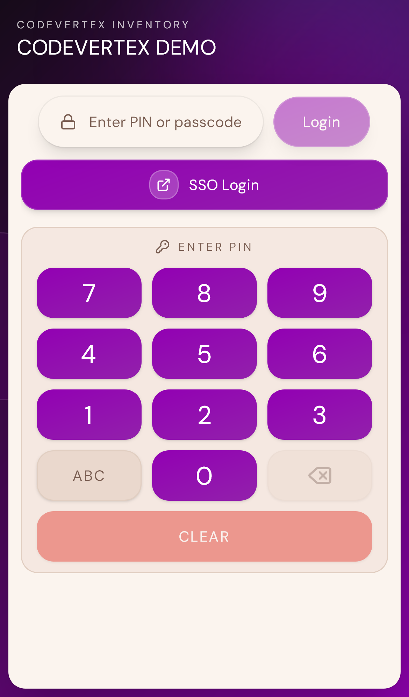{ width="300" }
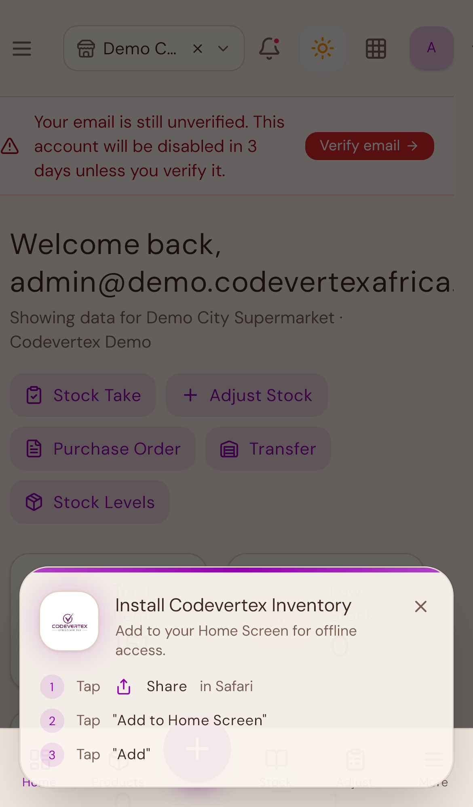{ width="300" }
</figure>

## Opening the form

Go to **Catalog** in the sidebar, then **New Item** (this button is labelled "New Product," "New
Drug," or similar depending on your business type — same form underneath).

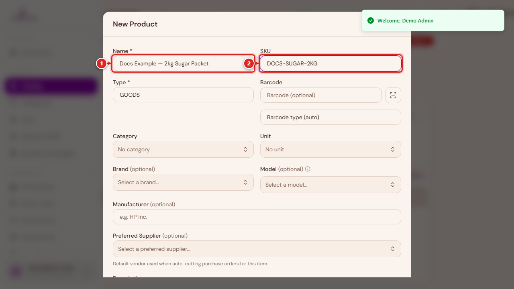

1. **Name** — required. This is what shows on receipts, the POS screen, and everywhere else.
2. **SKU** — optional. Leave it blank and the system generates one for you.

## Type, barcode, category, and unit

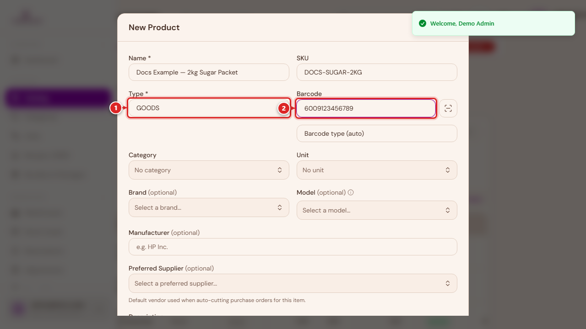

1. **Type** — picks which item type this is (see the table above). This decides which of the
   fields further down the form actually apply.
2. **Barcode** — optional, and you can scan it with your device's camera instead of typing it.

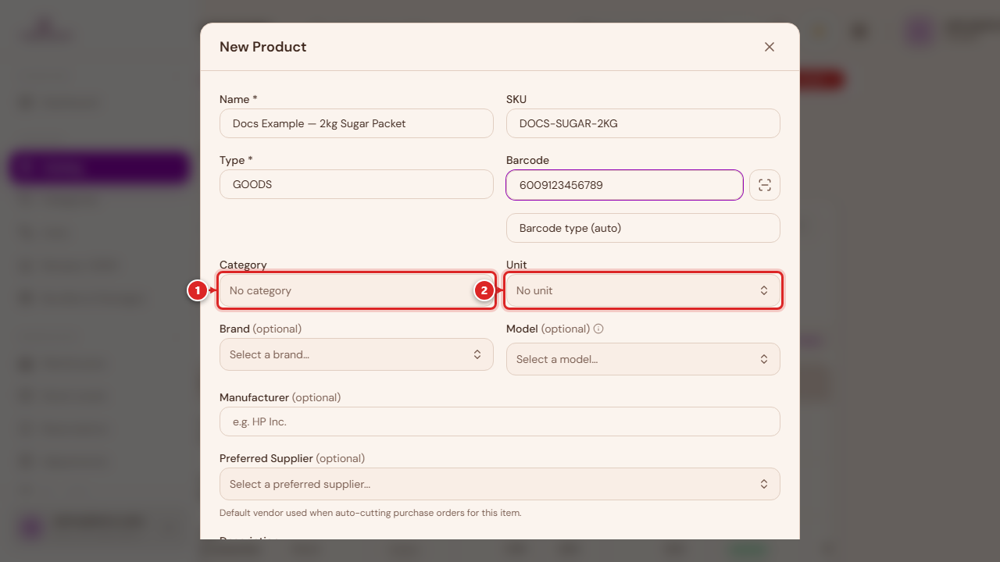

**Category** and **Unit** are both optional but worth setting: Category groups items for
reporting and filtering, and Unit (piece, kg, litre, and so on) is what Initial Stock, Cost, and
Reorder Level are measured in further down the form. If the one you need doesn't exist yet, both
fields let you add it on the spot.

## Brand, model, and manufacturer (Goods only)

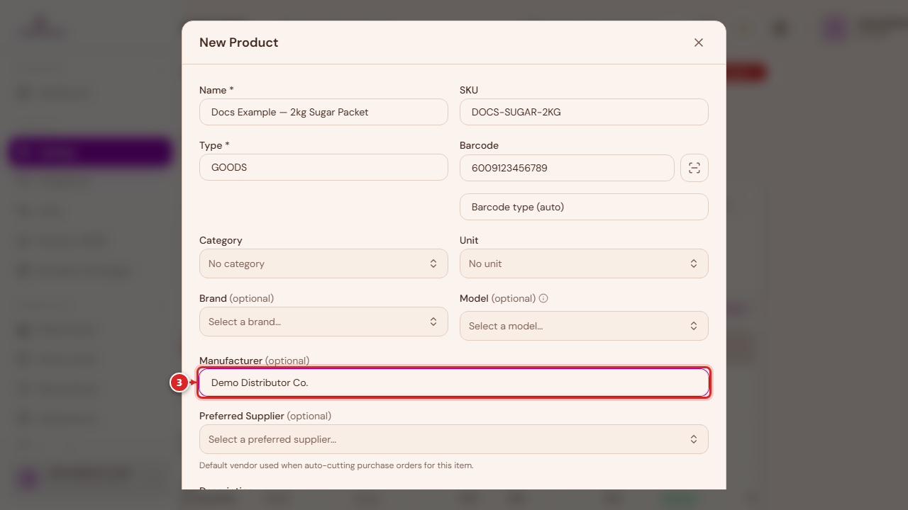

These three fields only appear for **Goods**. Brand and Model matter most for electronics and
appliances — Model is what warranty records and individually-serialed units (see
[Track Serial Numbers](#the-rest-of-the-stock-details-goods-ingredient-equipment) below) attach to.

## Not for sale

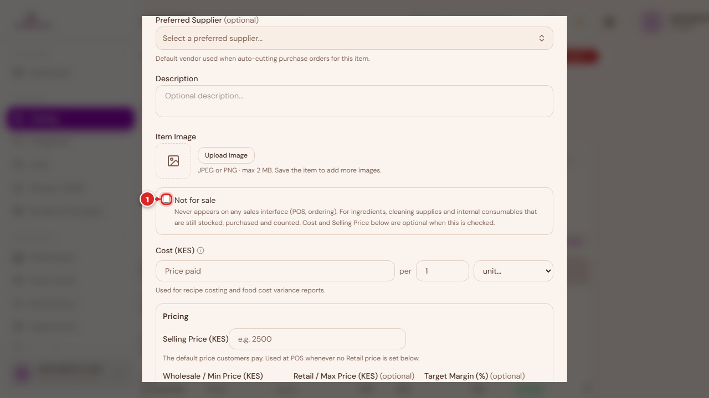

Turn this on for something you stock, purchase, and count, but that customers never buy directly —
cleaning supplies, packaging, internal consumables. It never appears on the POS or online store,
but stays fully trackable. This is different from **Non-billable** (below), which still appears at
the till but always rings up at zero.

## Cost

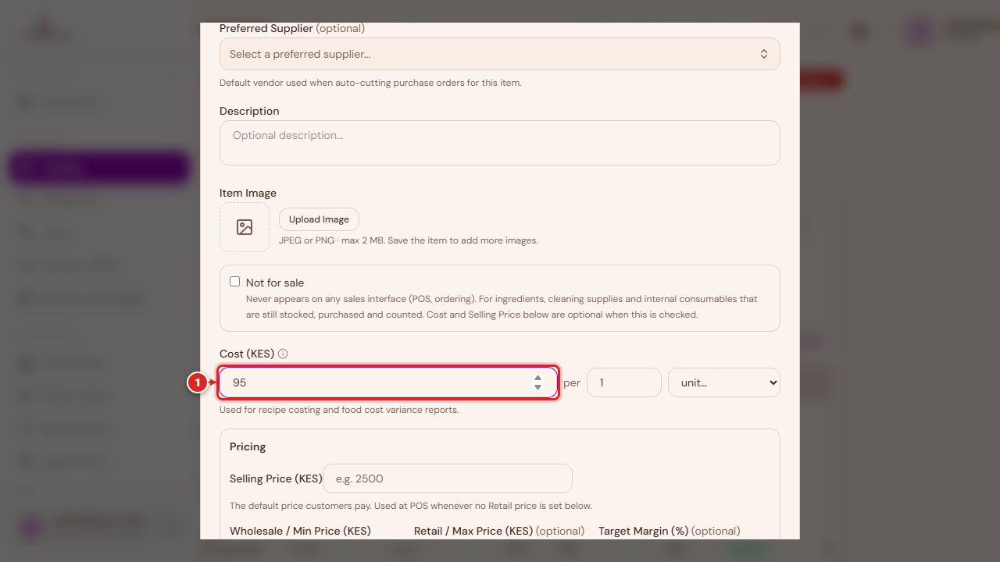

Enter the cost the way you actually buy it — for example, a 500&nbsp;ml bottle costing 52.50
becomes "52.50 per 500&nbsp;ml." The system works out the per-unit cost itself for margin and
recipe-costing purposes, so you never have to do that conversion by hand.

## Pricing

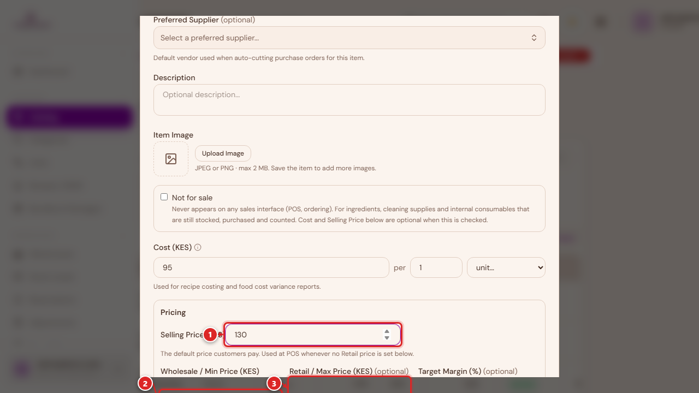

1. **Selling Price** — the default price customers pay.
2. **Wholesale / Min** and **Retail / Max** — optional. Leave these blank and they both default to
   the Selling Price. Only set them if you run separate wholesale and retail pricing at the till.

A **Target Margin** field also appears here for stocked items — it's a guide only, showing roughly
what a cost-plus price would look like at that margin. It doesn't change what you actually charge.

## Tax and non-billable

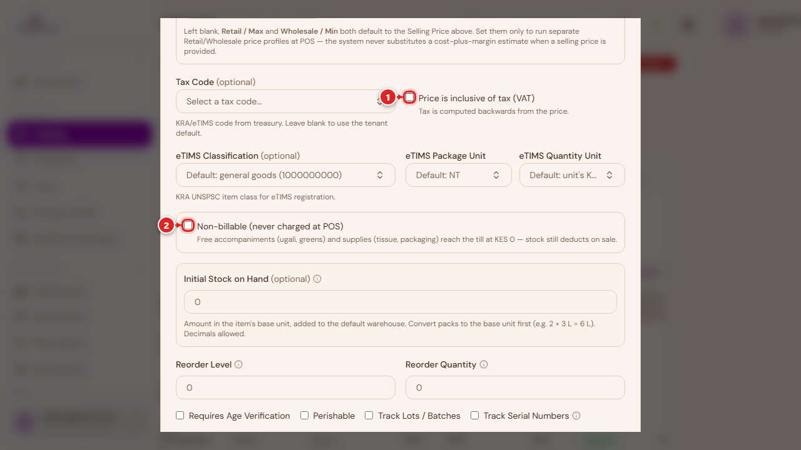

1. **Price is inclusive of tax (VAT)** — check this if the selling price you entered already
   includes tax, so it's calculated backwards from the price instead of added on top.
2. **Non-billable** — the item can be added to an order and still deducts stock, but always
   charges KES&nbsp;0. Useful for free accompaniments (a side of greens, a napkin) that you still
   want to track the cost and stock of.

A Tax Code and eTIMS classification fields also sit in this section for KRA/eTIMS compliance —
leave them blank to use your organisation's default.

## Don't skip Initial Stock

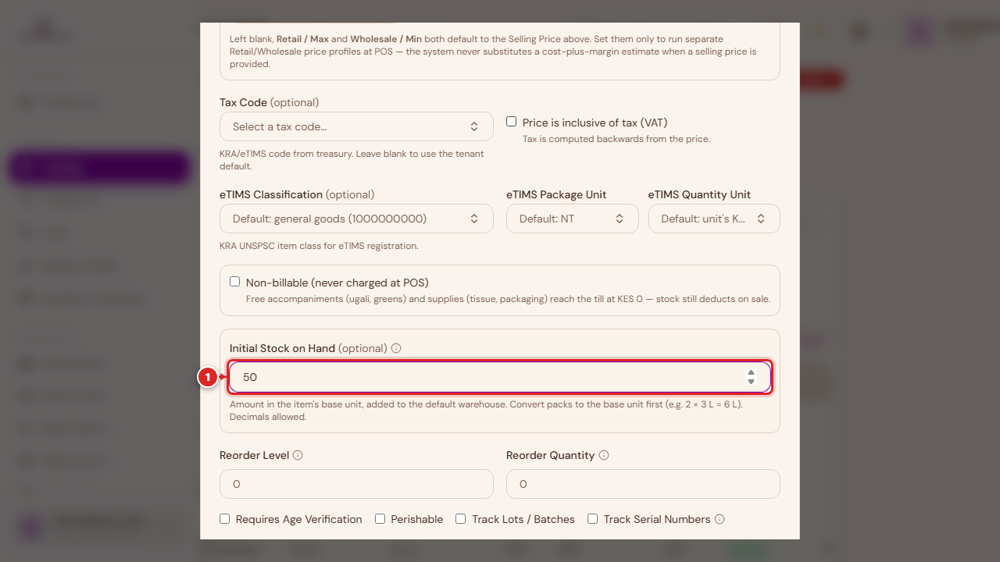

This is it — the field circled above. **Initial Stock on Hand** sets how much of this item you
already have, and it seeds your opening balance in your default warehouse. It only appears for
Goods, Ingredient, and Equipment (the three stocked types), and only when you're creating a brand
new item.

It's optional, and it sits well below the required Selling Price field — which is exactly why it's
easy to fill in everything above it, hit Create, and move on without ever reaching it. If you skip
it, the item saves fine and shows up in your catalog — it just starts at **zero stock**, and your
first sale of it will show as out of stock even though you actually have some sitting on the
shelf.

**Always fill this in for a new product you already have stock of.** Enter the amount in the
item's base unit (the Unit you picked above) — for example, two 3&nbsp;L bottles of oil with one
half used is 3 + 1.5 = 4.5.

If you forget, it's not a big problem — see [Warehouses & Stock](warehouses-and-stock.md#stock-adjustments)
for exactly how to fix it after the fact using a Stock Adjustment.

Same field, same importance, on the phone:

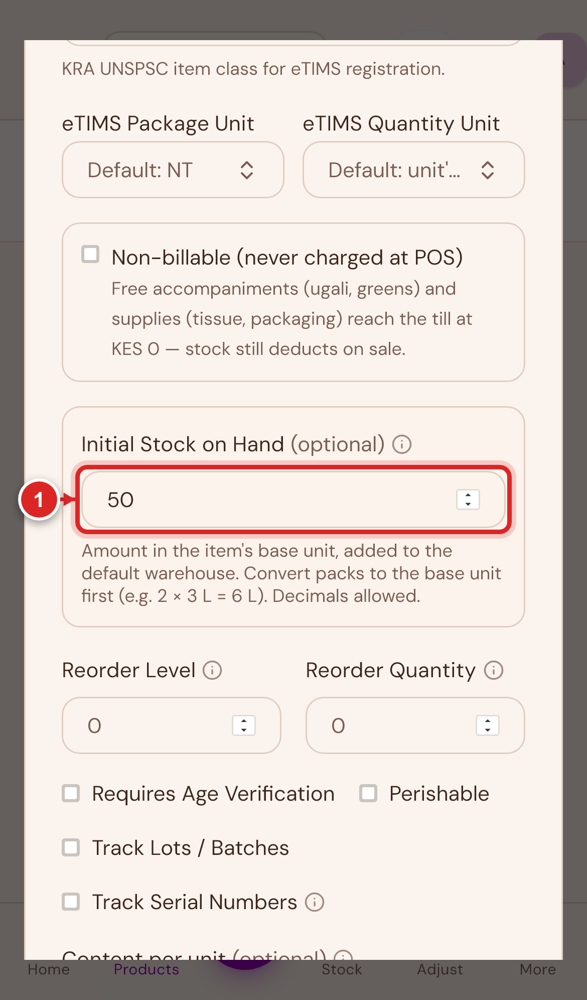{ width="320" }

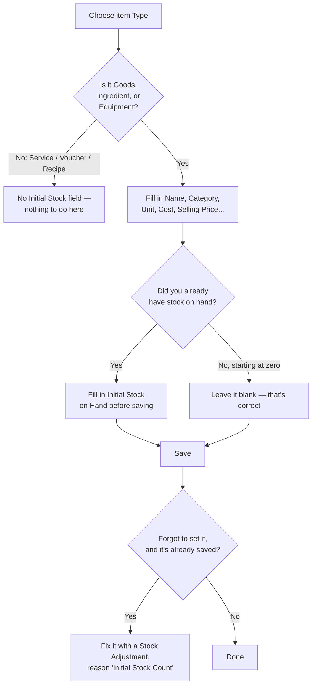

## The rest of the stock details (Goods, Ingredient, Equipment)

Below Initial Stock, a few more fields apply only to stocked items:

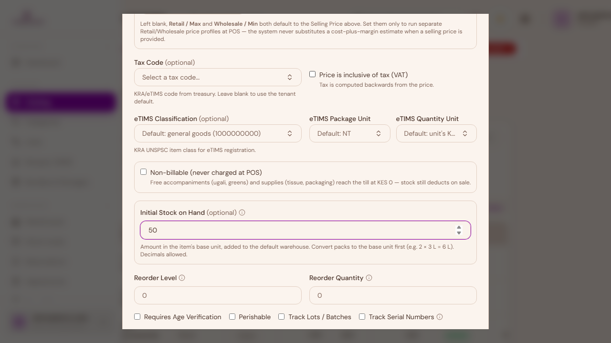

- **Reorder Level** — when stock on hand drops to or below this number, the item is flagged as low
  stock. This is a threshold, not a quantity you're setting now.
- **Reorder Quantity** — how much to order when that happens.

- **Requires Age Verification** — the cashier must confirm the buyer's age before selling (alcohol,
  tobacco).
- **Perishable** — flags the item as perishable and reveals a Default Shelf Life field.
- **Track Lots / Batches** — enables lot/batch tracking, with expiry dates entered per batch when
  you receive stock.
- **Controlled Substance** — pharmacy businesses only, flags a regulated drug for compliance
  reporting.
- **Track Serial Numbers** — turn this on when every physical unit needs its own identity (a
  laptop, for example). Serial numbers are then captured per unit when you receive stock, and the
  exact unit sold is recorded at the till — this is what a warranty lookup is checked against.

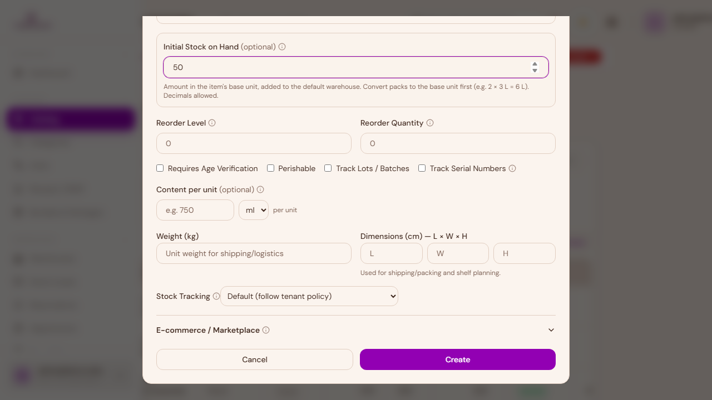

**Stock Tracking** controls whether selling the item actually deducts stock. Leave it on
**Default** unless you specifically want to force-deplete or exempt an item from your
organisation's usual policy.

## How the other item types differ

The fields above cover Goods in full. The other types share most of the same form but skip
whichever sections don't apply to them.

### Service

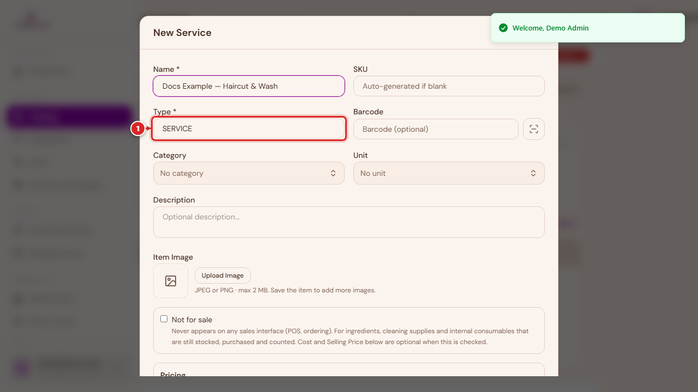

No stock, cost, or brand fields — a service isn't something you hold in a warehouse. It keeps
Pricing and Tax & Compliance, and gains a **Service Duration** field. For hospitality businesses, a
Service Details section adds room-specific fields (meal plan, occupancy, extra bed).

### Voucher

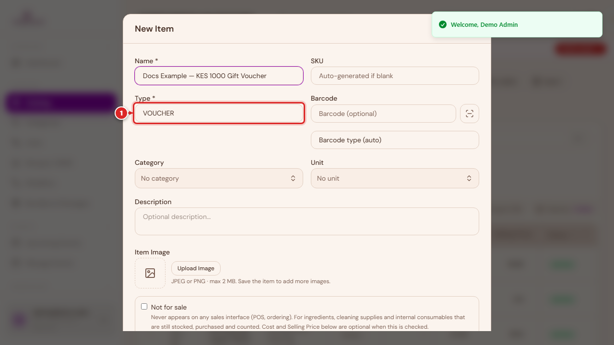

The lightest of the six types — just the shared identity fields (Name, SKU, Category) plus Tax &
Compliance. No cost, no pricing, no stock.

### Equipment and Ingredient

Both behave like Goods minus Brand/Model/Manufacturer, and minus the Tax & Compliance section
(equipment and raw ingredients typically aren't sold directly, so tax fields don't apply). Every
other stocked-item field — Cost, Pricing, **Initial Stock**, Reorder, the compliance checkboxes —
works exactly the same as it does for Goods.

### Recipe & menu items — the New Menu Item wizard

A Recipe is a menu item built from other stocked items (an Ingredient, or another reusable
Recipe) — think a plate of food or a mixed drink. Recipes don't hold stock themselves; what you
actually have on hand is whatever stock exists on the ingredients that make them up.

Rather than the New Item dialog, build these with **Catalog → New Menu Item** — a dedicated 3-step
wizard:

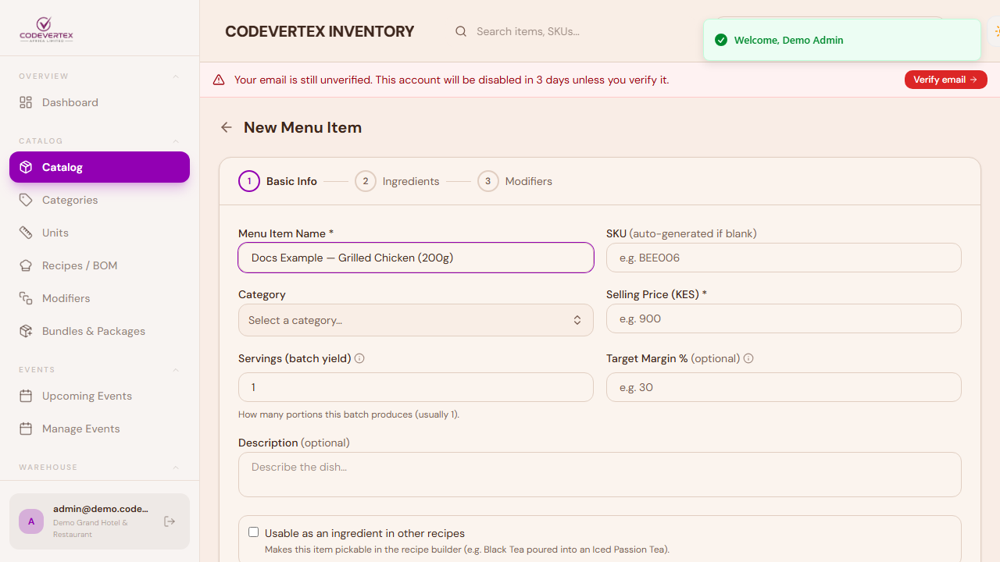

1. **Basic Info** — name, category, selling price, and servings (how many portions one batch of
   the recipe makes).
2. **Ingredients** — add the items this recipe consumes, with quantities. The wizard shows a
   running food-cost calculation as you build the list.
3. **Modifiers** (optional) — option groups like "Size" or "Extras" that customers pick from at
   the till.

The Ingredients step says it plainly: **building a recipe doesn't set anyone's opening stock.**
Each ingredient's own Initial Stock is set on its own item (Goods/Ingredient), the normal way
described above — or afterwards on **Stock → Adjustments**, reason "Initial Stock Count."
