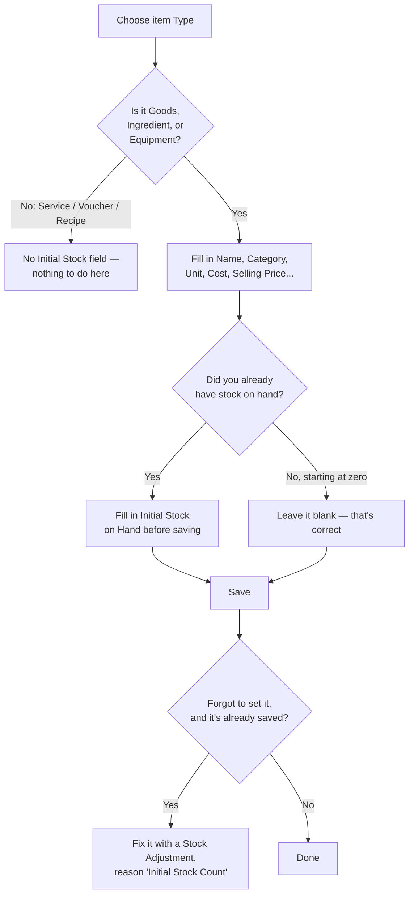
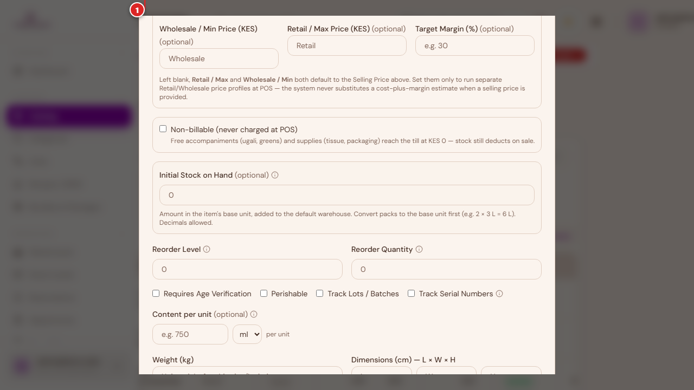
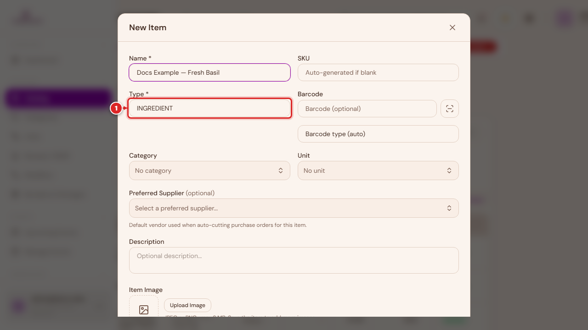
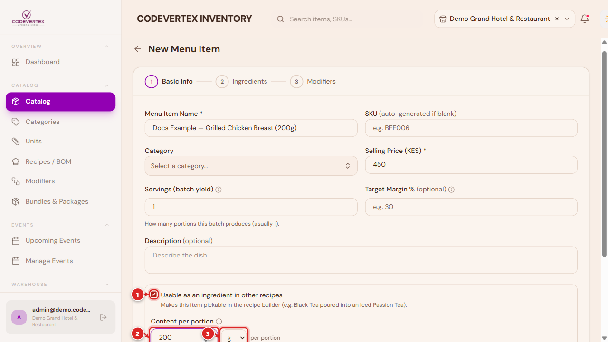
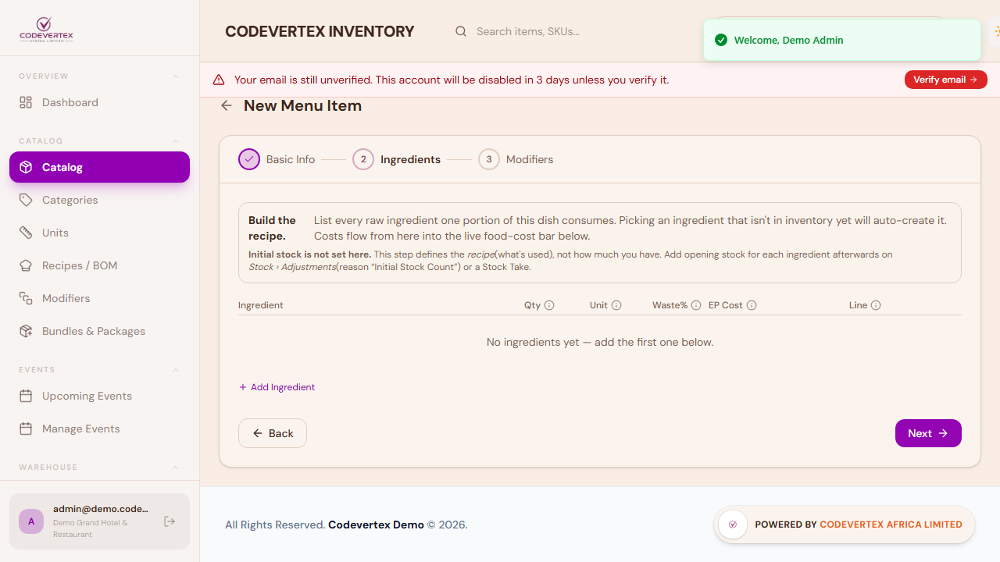
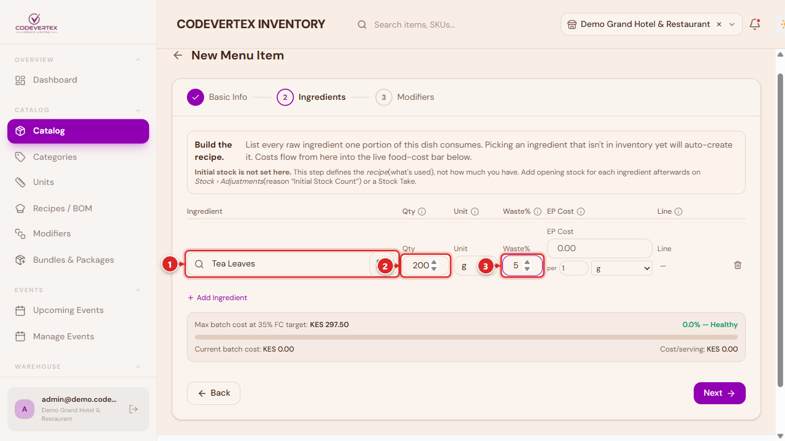
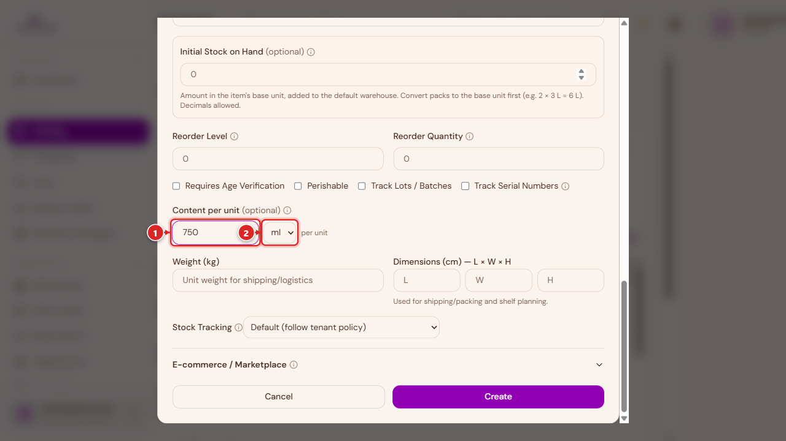
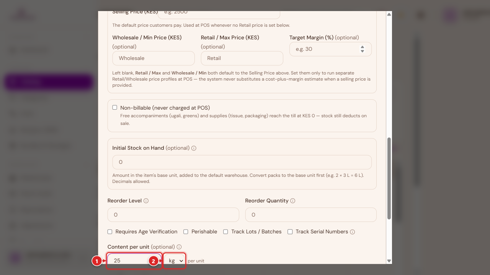

# Adding Products & Menu Items

Every product, ingredient, service, voucher, and piece of equipment your business sells or tracks
goes through the same **New Item** form — the fields that show depend on which type you pick. This
guide walks through the form field by field, using a retail shop as the example, then covers how
each of the other item types differs.

If you only read one section here, read [Don't skip Initial Stock](#dont-skip-initial-stock) —
it's the single most common reason a brand new product shows "out of stock" on day one.

## Item types at a glance

| Type | What it's for | Holds its own stock? |
|---|---|---|
| **Goods** | A physical product you buy and resell — the default for a retail shop | Yes |
| **Ingredient** | A raw ingredient or supply used inside a recipe or a service | Yes |
| **Equipment** | Durable equipment or tools you track (a scale, a kettle, a laptop) | Yes |
| **Recipe** | A menu item made from other items (a meal, a drink) — see [the New Menu Item wizard](#recipe-menu-items-the-new-menu-item-wizard) below | No — its ingredients hold the stock |
| **Service** | Something you sell that isn't a physical item (a haircut, a room night, a consultation) | No |
| **Voucher** | A gift voucher or credit note | No |

Which of these show up depends on your business type — a pharmacy only sees Goods (labelled
"Drugs"), a salon sees Service/Goods/Voucher, and so on. A retail shop sees all six.

## On your phone

Everything in this guide works the same way on the mobile app — the screens are just laid out for
a smaller screen. Logging in shows a single-column PIN pad instead of side-by-side panels, and the
sidebar becomes a menu you open from the icon in the top-left corner.

<figure markdown>
{ width="300" }
{ width="300" }
</figure>

## Opening the form

Go to **Catalog** in the sidebar, then **New Item** (this button is labelled "New Product," "New
Drug," or similar depending on your business type — same form underneath).

> **Direct link:** `https://inventory.codevertexafrica.com/{your-tenant-slug}/catalog`
> (demo: `https://inventory.codevertexafrica.com/codevertex-demo/catalog`)

1. **Name** — required. This is what shows on receipts, the POS screen, and everywhere else.
2. **SKU** — optional. Leave it blank and the system generates one for you.

## Type, barcode, category, and unit

1. **Type** — picks which item type this is (see the table above). This decides which of the
   fields further down the form actually apply.
2. **Barcode** — optional, and you can scan it with your device's camera instead of typing it.

**Category** and **Unit** are both optional but worth setting: Category groups items for
reporting and filtering, and Unit (piece, kg, litre, and so on) is what Initial Stock, Cost, and
Reorder Level are measured in further down the form. If the one you need doesn't exist yet, both
fields let you add it on the spot.

## Brand, model, and manufacturer (Goods only)

These three fields only appear for **Goods**. Brand and Model matter most for electronics and
appliances — Model is what warranty records and individually-serialed units (see
[Track Serial Numbers](#the-rest-of-the-stock-details-goods-ingredient-equipment) below) attach to.

## Not for sale

Turn this on for something you stock, purchase, and count, but that customers never buy directly —
cleaning supplies, packaging, internal consumables. It never appears on the POS or online store,
but stays fully trackable. This is different from **Non-billable** (below), which still appears at
the till but always rings up at zero.

## Cost

Enter the cost the way you actually buy it — for example, a 500&nbsp;ml bottle costing 52.50
becomes "52.50 per 500&nbsp;ml." The system works out the per-unit cost itself for margin and
recipe-costing purposes, so you never have to do that conversion by hand.

## Pricing

1. **Selling Price** — the default price customers pay.
2. **Wholesale / Min** and **Retail / Max** — optional. Leave these blank and they both default to
   the Selling Price. Only set them if you run separate wholesale and retail pricing at the till.

A **Target Margin** field also appears here for stocked items — it's a guide only, showing roughly
what a cost-plus price would look like at that margin. It doesn't change what you actually charge.

## Tax and non-billable

1. **Price is inclusive of tax (VAT)** — check this if the selling price you entered already
   includes tax, so it's calculated backwards from the price instead of added on top.
2. **Non-billable** — the item can be added to an order and still deducts stock, but always
   charges KES&nbsp;0. Useful for free accompaniments (a side of greens, a napkin) that you still
   want to track the cost and stock of.

A Tax Code and eTIMS classification fields also sit in this section for KRA/eTIMS compliance —
leave them blank to use your organisation's default.

## Don't skip Initial Stock

This is it — the field circled above. **Initial Stock on Hand** sets how much of this item you
already have, and it seeds your opening balance in your default warehouse. It only appears for
Goods, Ingredient, and Equipment (the three stocked types), and only when you're creating a brand
new item.

It's optional, and it sits well below the required Selling Price field — which is exactly why it's
easy to fill in everything above it, hit Create, and move on without ever reaching it. If you skip
it, the item saves fine and shows up in your catalog — it just starts at **zero stock**, and your
first sale of it will show as out of stock even though you actually have some sitting on the
shelf.

**Always fill this in for a new product you already have stock of.** Enter the amount in the
item's base unit (the Unit you picked above) — for example, two 3&nbsp;L bottles of oil with one
half used is 3 + 1.5 = 4.5.

If you forget, it's not a big problem — see [Warehouses & Stock](warehouses-and-stock.md#stock-adjustments)
for exactly how to fix it after the fact using a Stock Adjustment.

Same field, same importance, on the phone:

{ width="320" }

## The rest of the stock details (Goods, Ingredient, Equipment)

Below Initial Stock, a few more fields apply only to stocked items:

- **Reorder Level** — when stock on hand drops to or below this number, the item is flagged as low
  stock. This is a threshold, not a quantity you're setting now.
- **Reorder Quantity** — how much to order when that happens.

- **Requires Age Verification** — the cashier must confirm the buyer's age before selling (alcohol,
  tobacco).
- **Perishable** — flags the item as perishable and reveals a Default Shelf Life field.
- **Track Lots / Batches** — enables lot/batch tracking, with expiry dates entered per batch when
  you receive stock.
- **Controlled Substance** — pharmacy businesses only, flags a regulated drug for compliance
  reporting.
- **Track Serial Numbers** — turn this on when every physical unit needs its own identity (a
  laptop, for example). Serial numbers are then captured per unit when you receive stock, and the
  exact unit sold is recorded at the till — this is what a warranty lookup is checked against.

**Stock Tracking** controls whether selling the item actually deducts stock. Leave it on
**Default** unless you specifically want to force-deplete or exempt an item from your
organisation's usual policy.

## How the other item types differ

The fields above cover Goods in full. The other types share most of the same form but skip
whichever sections don't apply to them.

### Service

No stock, cost, or brand fields — a service isn't something you hold in a warehouse. It keeps
Pricing and Tax & Compliance, and gains a **Service Duration** field. For hospitality businesses, a
Service Details section adds room-specific fields (meal plan, occupancy, extra bed).

### Voucher

The lightest of the six types — just the shared identity fields (Name, SKU, Category) plus Tax &
Compliance. No cost, no pricing, no stock.

### Equipment and Ingredient

Both behave like Goods minus Brand/Model/Manufacturer, and minus the Tax & Compliance section
(equipment and raw ingredients typically aren't sold directly, so tax fields don't apply). Every
other stocked-item field — Cost, Pricing, **Initial Stock**, Reorder, the compliance checkboxes —
works exactly the same as it does for Goods.

### Recipe & menu items — the New Menu Item wizard

A Recipe is a menu item built from other stocked items (an Ingredient, a Goods item, or another
reusable Recipe) — think a plate of food or a mixed drink. Recipes don't hold stock themselves;
what you actually have on hand is whatever stock exists on the ingredients that make them up.

Rather than the New Item dialog, build these with **Catalog → New Menu Item** — a dedicated
3-step wizard.

> **Direct link:** `https://inventory.codevertexafrica.com/{your-tenant-slug}/catalog/new-menu-item`
> (demo: `https://inventory.codevertexafrica.com/codevertex-demo/catalog/new-menu-item`)

#### Basic Info: name, price, and making a recipe reusable

1. **Menu Item Name** — required. This is what shows on the till and on the menu.
2. **SKU** — optional, auto-generated if left blank.
3. **Category** — optional, same category list used everywhere else.
4. **Selling Price** — required (unless the item is marked Non-billable when edited afterwards).
5. **Servings (batch yield)** — how many portions the ingredient quantities in the next step
   produce. Leave it at 1 if you're listing ingredients for a single serving, or set it to 10 if
   the recipe as written is a batch for 10 — cost per portion is then batch cost ÷ servings.
6. **Target Margin %** (optional) — the gross margin you're aiming to keep on this dish. The
   food-cost bar on the Ingredients step turns red once ingredient cost eats into this target, so
   you know to raise the price or trim the recipe. Leave it blank to use your organisation's
   default.
7. **Description** (optional).

Further down the same step, a checkbox controls whether this recipe can be **reused inside other
recipes** — the mechanic behind complex, multi-level recipes like platters and combos:

1. **Usable as an ingredient in other recipes** — turning this on makes this menu item pickable
   from the ingredient search when building a *different* recipe, exactly like picking a raw
   Ingredient or Goods item. The in-app example says it plainly: Black Tea poured into an Iced
   Passion Tea. See [Complex recipes](#complex-recipes-using-a-recipe-as-an-ingredient-in-another)
   below for the full mechanic and a worked example.
2. **Content per portion** — appears once the checkbox above is on. It states how much ONE
   portion of this recipe actually contains — for example, a pot of tea holding 300&nbsp;ml. Once
   set, another recipe can consume this one in ml/g lines instead of whole portions (30&nbsp;ml =
   0.1 portion), and costing and stock deduction both stay exact. Leave it blank if other recipes
   will only ever reference whole portions of this one (a whole grilled chicken breast, not a
   slice of it).

A duplicate-name check runs as you type the name, the same as everywhere else in the catalog — it
warns, it doesn't block, so double-check before creating a near-duplicate menu item by mistake.

#### Ingredients: building the recipe

The wizard's own copy on this step is worth repeating: **picking an ingredient that isn't in
inventory yet auto-creates it**, and **initial stock is not set here** — this step defines the
recipe (what it uses), not how much stock you currently hold. Set each ingredient's own opening
stock on its own item the normal way, or afterwards on **Stock → Adjustments**, reason "Initial
Stock Count."

Click **Add Ingredient** for each line. Here's one filled in:

- **Ingredient** — search by name. Results include raw Goods/Ingredient items *and* any Recipe
  items flagged reusable (see above). Selecting one auto-fills its unit and cost.
- **Qty** — how much of this ingredient one serving uses, in the Unit beside it.
- **Unit** — defaults to the ingredient's own stock unit, but you can pick a smaller/compatible
  unit for this one line instead (ml when the ingredient is stocked in L, for example) — the
  quantity is converted back to the stock unit automatically when you save, so costing stays
  correct. A red warning appears if you pick a unit that genuinely can't be converted (see
  [Configuring quantity-per-unit for ingredients](#configuring-quantity-per-unit-for-ingredients-content-per-unit)
  below for exactly when that conversion is and isn't possible).
- **Waste%** — extra percentage lost to peeling, trimming, or cooking. 100&nbsp;g at 10% waste
  costs as if it were 110&nbsp;g.
- **EP Cost** — entered the same "price you pay, and the amount it buys" way as Cost on the item
  form (for example, "52.50 per 500&nbsp;ml") — it's pre-filled from the ingredient's own
  purchase pack when you pick it, and you can override it here to model a current or different
  price without changing the ingredient's own record.
- **Line** — read-only, the cost this one ingredient line contributes to the batch.

A live food-cost bar below the grid shows batch cost, cost per portion, and food-cost % once a
selling price is set, so you can see the effect of every ingredient as you add it.

#### Modifiers (optional)

Modifiers are choices the cashier makes when selling this item — a "Size" group (Small / Large),
or an "Extras" group (Extra Cheese, Add Bacon). Skip this step entirely for a plain dish. Each
**group** is one question (with an optional **Required** toggle that forces a choice before the
item can be added to an order); each **option** within it is an answer that can adjust the price
and, if you link it to a menu or stock item, deduct that item's stock too. This is different from
the Ingredients step above, which is always consumed on every sale — a modifier option only
deducts stock when the customer actually picks it.

### Complex recipes: using a recipe as an ingredient in another

A "reusable" recipe (the checkbox above) isn't limited to being used once. The same mechanic that
lets Black Tea be poured into an Iced Passion Tea lets you build **multi-level recipes** — a
platter or combo made up of other recipes, each of which is itself a complete, sellable menu item.

Say a kitchen sells both a **Grilled Chicken Breast** and a **Steamed Rice** as their own menu
items, and also wants to sell a **Chicken Platter** combining both:

1. Create **Grilled Chicken Breast** as a normal recipe (its own ingredients, its own selling
   price), and turn on **Usable as an ingredient in other recipes**. If it's useful for it to be
   orderable in fractions later, set a **Content per portion** too (for example, 200&nbsp;g).
2. Do the same for **Steamed Rice**.
3. Create **Chicken Platter** as a third recipe. On its Ingredients step, search for "Grilled
   Chicken Breast" and "Steamed Rice" the same way you'd search for a raw ingredient — because
   both are flagged reusable, they show up in the picker right alongside Goods and Ingredient
   items. Add each as its own line, with a quantity (1 portion of each, for a standard platter).

Selling the Chicken Platter then deducts stock by working backwards through both sub-recipes'
own ingredient lists automatically — there's nothing extra to configure for that to happen.
Un-flagged recipes never appear in another recipe's ingredient search; this is enforced by the
server, not just hidden in the picker.

This is also how a "tot" or measured pour works for a bottled ingredient, combining this mechanic
with content-per-unit configuration (below): a **Whiskey Tot (30&nbsp;ml)** recipe's single
ingredient line points at the Whiskey bottle Ingredient, quantity 30, unit ml — and because that
bottle has its own Content per unit declared as 750&nbsp;ml, 25 tots sold deplete exactly one
bottle, with no separate "tot" stock item ever needed.

### Configuring quantity-per-unit for ingredients (Content per unit)

The examples above depend on one more piece of setup, and it lives on the **Ingredient (or Goods,
or Equipment) item's own form**, not in the recipe wizard: how much a single stock unit actually
contains. **Content per unit** answers "how much is in one bottle / one bag / one box" — a
one-time declaration on the item itself, separate from any one recipe.

A 750&nbsp;ml bottle of whiskey, stocked in pieces/bottles: Content per unit **750**, unit **ml**.
Once that's set, any recipe can write an ingredient line in ml (a 30&nbsp;ml tot, a 60&nbsp;ml
double) and the system converts and deducts the correct fraction of a bottle automatically.

The exact same field, a much smaller number: a 50&nbsp;ml perfume bottle. Same mechanic, whether
the pour is 30&nbsp;ml or 2&nbsp;ml.

Content per unit isn't only for liquids — a 25&nbsp;kg bag of rice, sold and used a scoop or a
plate at a time, works the same way with unit **kg** (or **g** for finer amounts).

A few things worth being precise about, since three fields on these forms all look similar
("N per pack") but do different jobs:

- **Content per unit** (this field) — a one-time fact about the item: how much one stock unit
  physically contains. It exists purely to let a recipe line use a smaller, more natural unit
  than the item is stocked in.
- **Cost** on the same item form — also entered as "price you pay, per amount" (e.g. "1500 per
  750&nbsp;ml"), but that's the item's *purchase cost basis*, used for margin and recipe costing —
  it has nothing to do with how much a recipe line deducts.
- **Unit**, on each individual recipe ingredient line (see Ingredients above) — chosen per recipe,
  not per ingredient. It defaults to the ingredient's base unit but can be swapped to anything
  compatible — including anything in the Content per unit's dimension once that bridge is set.
  The quantity you enter is silently converted back to the ingredient's base/stock unit when the
  recipe is saved.

One current limitation worth knowing: the Content per unit dropdown only offers **ml, L, g, and
kg** — even though your organisation's own Units of Measure list
(see [Inventory Administration](administration.md#units-of-measure)) may contain others. If an
ingredient needs a content unit outside that list, use the closest of the four (grams instead of
ounces, for example).

Non-depleting recipes — where selling a menu item doesn't touch ingredient stock at all, for
businesses that count stock manually — are a tenant-wide setting with a per-item override; see
[Settings — Stock & Thresholds](administration.md#settings-stock-thresholds) in Inventory
Administration.

## Common Issues

**A new product shows "out of stock" as soon as it's saved.** This is the issue this whole guide
opened with — see [Don't skip Initial Stock](#dont-skip-initial-stock) above. Fix it with a Stock
Adjustment, reason "Initial Stock Count" (see [Warehouses & Stock](warehouses-and-stock.md#stock-adjustments)).

**"A [product/menu item/etc.] named '...' already exists."** A duplicate-name check runs as you
type, on every item type including recipes — it's a warning, not a hard block, so double-check the
name isn't actually a near-duplicate before saving anyway.

**"Initial stock must be a whole number for [unit] — it's a count-based unit."** Count-type units
(pieces, bottles, boxes) don't accept fractional opening stock. If you genuinely have a half-used
container, either switch that item's Unit to something fractional (litres, kilograms) or round to
the nearest whole count.

**"Wholesale price cannot exceed the retail price."** The Wholesale/Min and Retail/Max fields under
Pricing are validated against each other — Wholesale must stay at or below Retail. The Create/Save
button stays disabled until this is fixed.

**A recipe ingredient line shows "Can't deduct [unit] from [base unit] stock" in red.** The unit you
picked for that line isn't compatible with the ingredient's own stock unit, and there's no
[Content per unit](#configuring-quantity-per-unit-for-ingredients-content-per-unit) bridge declared
on that ingredient to convert through. Either pick a compatible unit, or open the ingredient item
and set its Content per unit (e.g. "750 ml per bottle") so smaller-unit lines like a 30 ml tot can
convert correctly.

**A menu item you just made "Usable as an ingredient in other recipes" doesn't show up when
building a different recipe.** Save the reusable item first — the flag has to be saved on the
item before the ingredient picker (which queries the server) will offer it in another recipe's
search.
