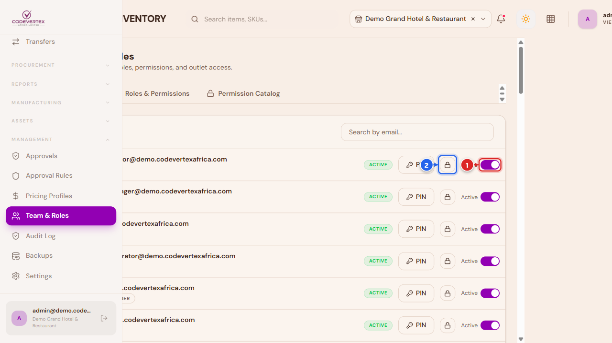
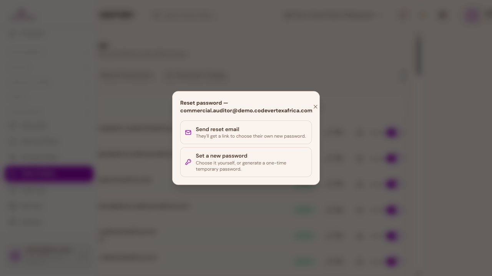
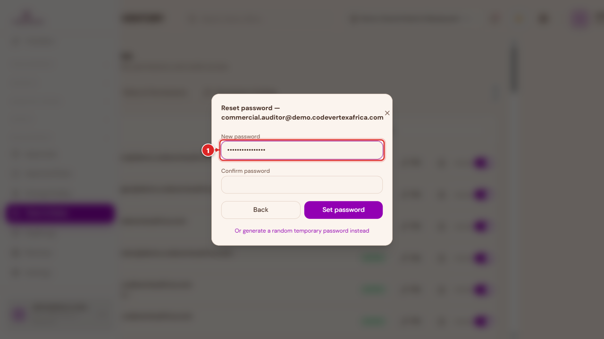
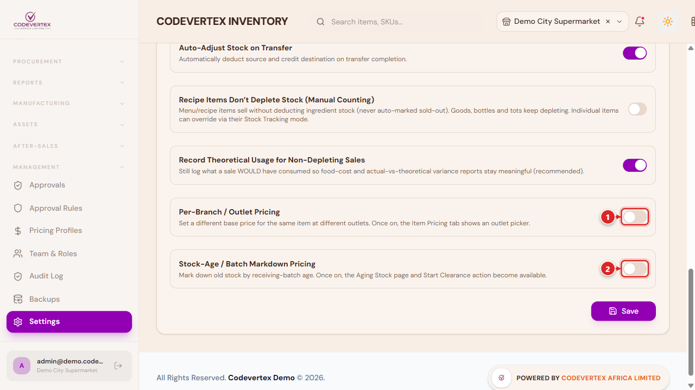
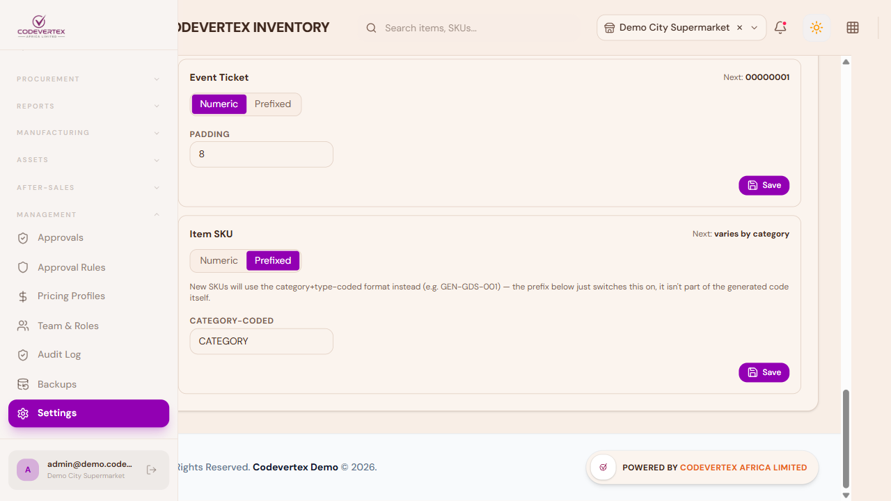
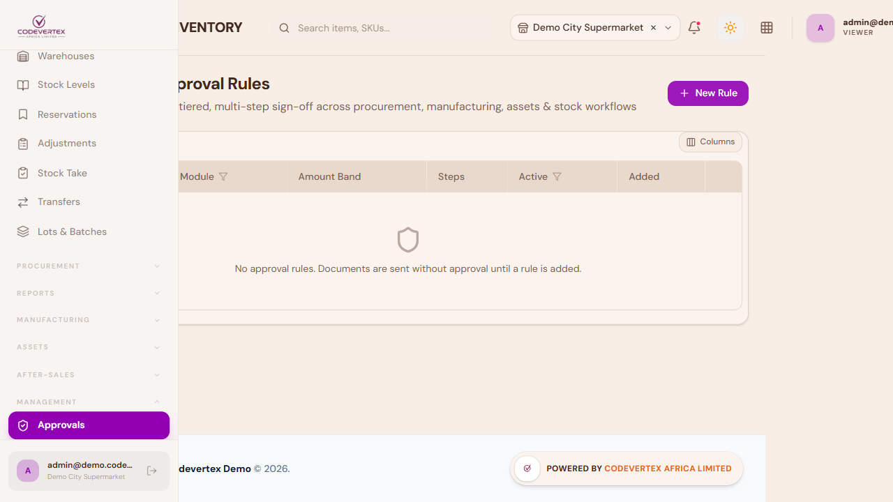
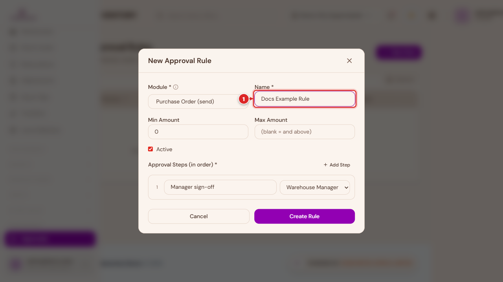
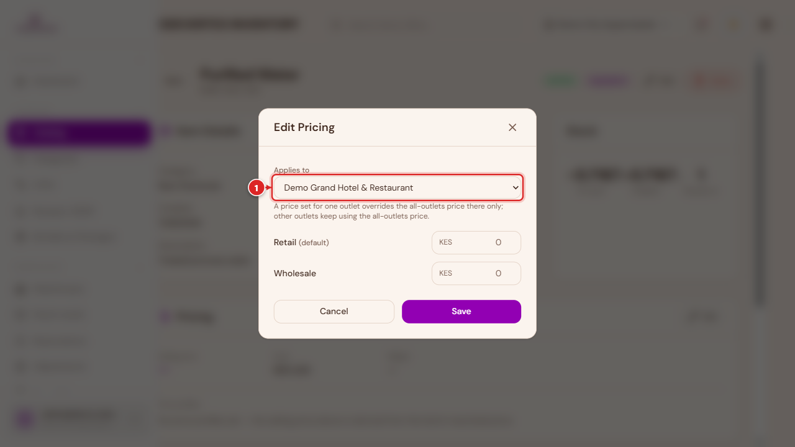

# Inventory Administration

This page covers the setup and management screens under the **Management**, **Catalog**, and
**Procurement** sidebar groups — the modules a manager or tenant admin uses to configure how
Inventory works for everyone else, rather than the daily catalog/warehouse/procurement work
covered in the other three guides.

If you're looking for staff accounts, PINs, roles at the organisation level, branches, or billing,
that's a different, platform-wide screen — see
[Managing Your Organisation](../organisation/managing-your-organisation.md). This page's **Team &
Roles** section (below) is the Inventory-specific piece: which Inventory permissions a role has,
and setting an individual staff member's PIN.

Most of these screens live under **Management** in the sidebar, which is collapsed by default —
click it to expand the list.

## Categories & Brands

> **Direct link:** `https://inventory.codevertexafrica.com/{your-tenant-slug}/categories`
> (demo: `https://inventory.codevertexafrica.com/codevertex-demo/categories`)

Categories group items for reporting, filtering, and the catalog's category picker. Categories can
be nested — **Add Category** lets you assign a **Parent Category** to create a subcategory.

1. **Name** — required.
2. **Code** — optional, a short internal reference (e.g. "BEV" for Beverages).

The **Brands** tab alongside it manages the separate brand master used by Goods' Brand field.

## Units of Measure

> **Direct link:** `https://inventory.codevertexafrica.com/{your-tenant-slug}/units`
> (demo: `https://inventory.codevertexafrica.com/codevertex-demo/units`)

This is the tenant-wide unit master — every item's base **Unit** field (piece, kg, litre, bottle,
and so on) is picked from this list, and it can also be extended on the spot from the item form
itself. A unit's own "view details" drawer shows which items currently use it.

1. **Name** — the full unit name (e.g. "Kilogram").
2. **Abbreviation** — the short form shown throughout the app (e.g. "kg").

Two of the "Content per unit" style fields on item forms — the ones that convert between a stock
unit and a recipe-line unit — are limited to a fixed **ml / L / g / kg** list regardless of what's
in this master; see
[Configuring quantity-per-unit for ingredients](adding-products.md#configuring-quantity-per-unit-for-ingredients-content-per-unit)
in the Adding Products guide.

## Suppliers

> **Direct link:** `https://inventory.codevertexafrica.com/{your-tenant-slug}/suppliers`
> (demo: `https://inventory.codevertexafrica.com/codevertex-demo/suppliers`)

The supplier master used throughout Purchasing & Receiving (see
[Purchasing & Receiving](procurement.md)) — name, contact details, and a payment method (M-Pesa,
bank, cash, or cheque) with the matching account details captured per method.

Only **Name** is required; everything else — contact info, payment details, preferred currency —
can be filled in later by editing the supplier.

## Team & Roles

> **Direct link:** `https://inventory.codevertexafrica.com/{your-tenant-slug}/team`
> (demo: `https://inventory.codevertexafrica.com/codevertex-demo/team`)

The **Accounts** tab lists everyone with access to Inventory in this organisation, searchable by
email. Expanding a row shows their role(s) and which outlets they can access, and this is also
where a manager sets or resets an individual staff member's **PIN** — the same PIN used to log
into the app on a shared till or warehouse tablet throughout the rest of this guide (see
[Signing In](../organisation/signing-in.md) for the login flow itself).

Each row also has an **Active / Inactive** toggle, and a lock icon for **Reset password**:

1. **Active / Inactive** — flips whether this person can sign in at all, without losing their
   account, roles, or history. Use this instead of removing someone outright when they're on
   leave or between roles.
2. **Reset password** — opens a dialog with two choices:

- **Send reset email** — they get a link and choose their own new password.
- **Set a new password** — type one directly (at least 8 characters, confirmed twice):

Below the form, an option to generate a random temporary password instead lets you hand someone a
working login on the spot without typing a password yourself.

A **platform admin** (not a regular tenant admin — this is Codevertex's own support/operations
role) additionally sees a **Delete** icon that permanently removes an account everywhere on the
platform, every tenant and every service — not just from this outlet's team. It asks for
confirmation first, and always suggests the Active/Inactive toggle above as the reversible
alternative if you only meant to remove someone's access here.

The **Roles & Permissions** tab is where a role's actual Inventory permissions are defined — pick a
role on the left, and its permission matrix (Approvals, Assets, Procurement, Stock, and so on, each
with add/view/change/delete-style toggles) opens on the right.

A **Permission Catalog** tab alongside it lists every permission that exists in the system, for
reference, independent of any one role.

New staff accounts themselves — inviting someone new to the organisation, and assigning which
tenant-level role they start with — are managed centrally, not here; see
[Managing Your Organisation](../organisation/managing-your-organisation.md#team).

## Settings — Stock & Thresholds

> **Direct link:** `https://inventory.codevertexafrica.com/{your-tenant-slug}/settings`
> (demo: `https://inventory.codevertexafrica.com/codevertex-demo/settings`)

The Settings page has several tabs (Modules, Tax & Compliance, Documents, Printing, Integrations,
and more); the one worth understanding in depth is **Stock & Thresholds**, since it changes how
every item in the catalog behaves.

- **Inventory Costing Method** — FIFO, LIFO, FEFO, or weighted average. FIFO/LIFO/FEFO require lot
  tracking (FEFO additionally needs expiry tracking); weighted average uses a simple item-level
  cost with no lot ordering.
- **Critical Stock (%)** — below this percentage of an item's reorder level, it's flagged as
  critically low rather than just low.
- **Default Reorder Level (fallback)**, and a **per-unit-type reorder defaults** table further down
  — used when an item has no explicit reorder level of its own set on its item form.
- **Purchase Order Approval Required** — turning this on is what feeds the **Approvals** module
  below: POs above a configured threshold then need sign-off before they can be sent to a supplier.
- **Recipe Items Don't Deplete Stock (Manual Counting)** — when on, selling a menu/recipe item does
  not deduct its ingredients' stock, and it's never auto-marked sold out; goods, bottles, and tots
  keep depleting as normal regardless. This is a tenant-wide default — an individual recipe item
  can still override it via its own **Stock Tracking** field (see
  [Adding Products & Menu Items](adding-products.md#recipe-menu-items-the-new-menu-item-wizard)).
  For businesses that count recipe stock manually rather than trusting automatic deduction.
- **Record Theoretical Usage for Non-Depleting Sales** — with the setting above on, this keeps
  logging what a sale *would* have consumed, so food-cost and actual-vs-theoretical variance
  reports still mean something even though stock isn't actually moving.

### Add-ons {: #add-ons }

Two further toggles on this same tab are handled differently from everything else here — they're
platform add-ons rather than part of any subscription plan, switched on for your account by
Codevertex directly rather than by upgrading a plan tier:

1. **Per-Branch / Outlet Pricing** — see
   [Per-branch / outlet pricing](#per-branch-outlet-pricing) above.
2. **Stock-Age / Batch Markdown Pricing** — see [Aging Stock](#aging-stock) above.

If your account doesn't have one of these yet, the row shows a dimmed **Add-on** badge instead of
a working toggle — clicking it explains that it's a platform add-on, not something a plan upgrade
unlocks on its own, and points you to your account manager. Once granted, the toggle here works
like any other setting, and a further **Aging Stock Threshold (days)** field appears under the
Stock-Age toggle once it's on, controlling how old received stock has to be before it counts as
"aging."

### Documents — Item SKU numbering

The **Documents** tab controls how every document type numbers itself — pure numeric (e.g.
`000001`) or prefixed/dated (e.g. `PO-260625-000001`) — including how new items get their SKU when
you leave the SKU field blank while adding one.

**Item SKU** works a little differently from every other document type here: switching it to
**Prefixed** doesn't add a literal prefix string — it switches new SKUs to the category+type-coded
format instead (e.g. `GEN-GDS-001`), which varies per item's own category, so there's no single
"next number" to preview. Leave it on **Numeric** for a plain sequential SKU across your whole
catalog instead.

## Approvals

> **Direct link:** `https://inventory.codevertexafrica.com/{your-tenant-slug}/approvals`
> (demo: `https://inventory.codevertexafrica.com/codevertex-demo/approvals`)

Once Purchase Order Approval Required (or a similar gate elsewhere — manufacturing, asset
disposal, large stock adjustments) is switched on, matching requests land here instead of going
through immediately. Three tabs: **My Inbox** (assigned to you), **All Pending**, and **All**
(full history). Opening a request shows its approval-step trail and an Approve/Reject action.

**Approval Rules** (linked from the top of this page) is where those gates are actually configured
— one rule per module + amount band, with an ordered list of approval steps and which role signs
off at each step. With no rules defined, the page says it plainly: **"No approval rules. Documents
are sent without approval until a rule is added."**

**New Rule**:

1. **Module** — which workflow this rule gates (Purchase Order send, Stock Adjustment, Asset
   Disposal, and so on).
2. **Name** — a label for the rule itself.
3. **Min Amount** / **Max Amount** — the value band this rule applies to; leave Max blank for "and
   above."
4. **Active** — turns the rule on or off without deleting it.
5. **Approval Steps (in order)** — add one or more steps, each naming who has to sign off (by
   role) and in what order. A request isn't approved until every step in the chain clears.

## Pricing Profiles

> **Direct link:** `https://inventory.codevertexafrica.com/{your-tenant-slug}/pricing-profiles`
> (demo: `https://inventory.codevertexafrica.com/codevertex-demo/pricing-profiles`)

Pricing Profiles let you define price tiers beyond the plain Selling Price — Retail, Wholesale, a
staff-discount tier, and so on. Each item can then carry a different price per profile, set from
the item's own page, and a **Generate prices** dialog can bulk-derive an entire profile's prices
from the base Selling Price using a percentage rule instead of pricing every item by hand.

**Name** is required; **Code** is an optional short reference (e.g. "WHOLESALE").

### Per-branch / outlet pricing {: #per-branch-outlet-pricing }

If your business charges a different price for the same item at different branches — a shop price
versus an airport-outlet price, for example — this is a separate, opt-in add-on (see
[Add-ons](#add-ons) below). Once it's switched on, every item's own page gets an outlet picker
next to its pricing:

Open an item, then **Edit** next to **Pricing**:

1. **Applies to** — **All outlets (default)**, or one specific outlet. A price set for one outlet
   overrides the all-outlets price there only; every other outlet keeps using the all-outlets
   price.
2. Enter the price per tier as usual, then **Save**.

The item's Price Profiles table shows which outlet each price belongs to, and an outlet-specific
price can be deleted (reverting that outlet back to the all-outlets price) from a small trash icon
next to it — the all-outlets price itself can't be deleted, since there'd be nothing left to fall
back to.

## Aging Stock — clearance pricing by stock age {: #aging-stock }

Another opt-in add-on (see [Add-ons](#add-ons) below). Once switched on in Settings, **Aging
Stock** appears under **Reports** in the sidebar: a list of items whose oldest received stock has
passed your configured age threshold and isn't already discounted. Each row shows the item, its
current price, how long the oldest batch has been sitting (with the actual receipt date), and how
much of it is aged.

**Start Clearance** on a row opens a short form: a **markdown price** (must be lower than the
current price), an optional **end date** (leave it blank to let the clearance run until the old
stock actually sells out, whichever comes first), and optional notes. This only marks the item
down at the till — if you also want it to appear as a timed flash sale on your online store, the
dialog links to creating a matching discount in **Sell → Discounts** in POS, using the same
markdown price.

## Backups and Audit Log

Two lighter-weight admin screens round out this group:

- **Backups** — on-demand and scheduled backups of your Inventory data.
- **Audit Log** — a read-only, filterable log of who changed what and when, across the modules
  above.

## Common Issues

**A category, unit, or supplier I just added doesn't show up in the item form's dropdown yet.**
These pickers cache the list briefly — reopening the New Item form (or refreshing the page) picks
up anything added in Categories, Units, or Suppliers immediately after.

**"Purchase Order Approval Required" is on, but POs aren't landing in anyone's Approvals inbox.**
Check that an **Approval Rule** actually exists for the Procurement module covering the PO's
amount band — the toggle in Settings only turns the *gate* on; without a matching rule, there's no
one configured to approve against, and the workflow that actually enforces the gate depends on a
rule being in place.

**A manager can see Inventory in the sidebar, but a screen they should have access to 403s or is
missing.** Check their role's permission matrix under **Team & Roles → Roles & Permissions** — a
role only sees and can act on the modules its permissions explicitly grant, module by module (Stock,
Procurement, Assets, and so on each have their own toggles).

**Recipe items keep showing as sold out even though "Recipe Items Don't Deplete Stock" is on.**
That tenant-wide setting only applies to items left on the **default** Stock Tracking mode. If a
specific recipe item's own Stock Tracking field is set to "Always deplete stock," it overrides the
tenant policy for that one item — open the item and check its Stock Tracking field.

**A pricing profile's "Generate prices" produced numbers that don't look right.** It always
calculates from the item's base Selling Price, not from another profile's price — if you've been
editing this item's Wholesale price by hand for a while and then run Generate prices on a
different profile, it recalculates from Selling Price, not from Wholesale.

**I don't see a Delete option on the Team page, only Active/Inactive.** That's expected — hard
delete is a platform-admin-only action for permanently removing an account everywhere on the
platform, not a regular tenant-admin capability. Suspending someone with the Active/Inactive
toggle is the normal, reversible way to remove a team member's access.

**Turned on Per-Branch/Outlet Pricing or Stock-Age/Batch Markdown Pricing, but the feature still
won't load ("subscription limit reached").** These add-ons need a real grant from Codevertex, not
just the Settings toggle — the toggle only controls whether it's switched on for your tenant once
the underlying grant exists. If you've confirmed the add-on should be active on your account and
still see this, contact your account manager.
