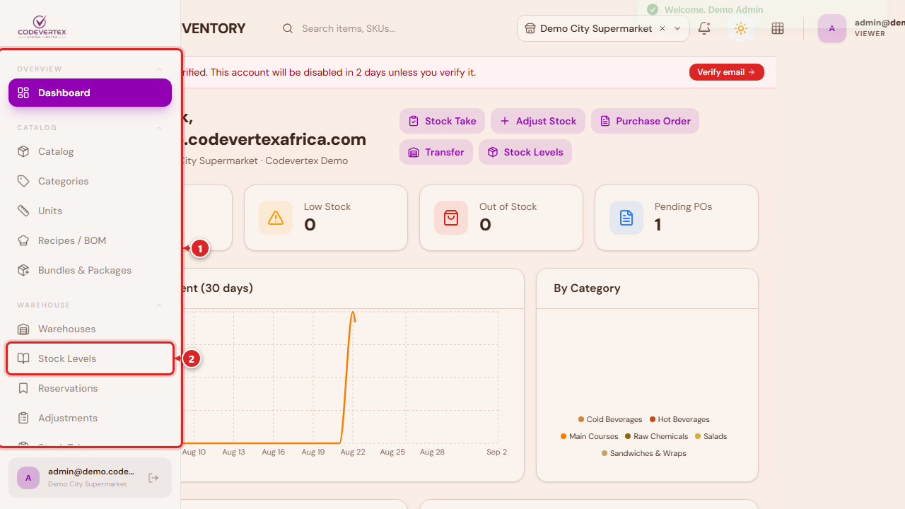
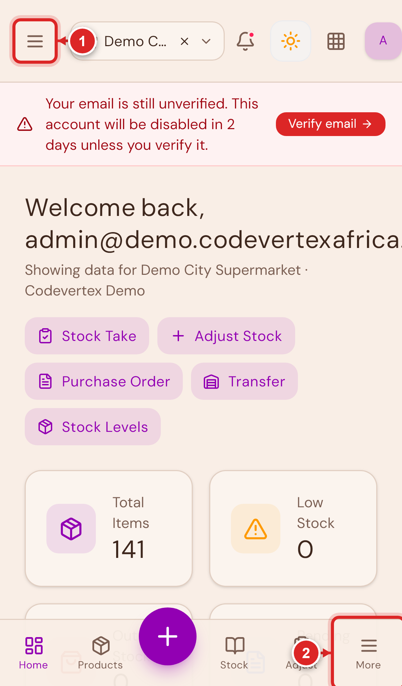

# Inventory

A step-by-step guide to running the Inventory product day to day: adding products, keeping stock
counts accurate, and managing purchasing. Every screenshot below comes from a working demo
account, not mockups, so what you see here is what you'll see in your own organisation.

### Staff Operations — day-to-day work

- **[Adding Products & Menu Items](adding-products.md)** — every field on the New Item form
  explained, what each item type is for, the one field that's easy to miss and causes a brand
  new product to show zero stock, and building recipes and menu items — including reusable
  components and ingredient quantity-per-unit configuration.
- **[Warehouses & Stock](warehouses-and-stock.md)** — setting up warehouses and storage locations,
  reading the Stock Levels page, and the exact steps to fix an item that shows zero stock.
- **[Purchasing & Receiving](procurement.md)** — creating a purchase order, receiving goods from a
  supplier (in full or partially), and recording a return to a supplier.

### Administration — setup and management

- **[Inventory Administration](administration.md)** — categories, brands and units, suppliers,
  team permissions and PINs, tenant-wide stock settings, approvals, and pricing profiles.

## Finding your way around

On a computer, the sidebar (①) is always visible on the left, and the dashboard's quick-action
buttons (②) jump straight to the workflows you use most:

On a phone, the sidebar becomes a menu. Open it either from the hamburger icon (①) in the header,
or the **More** tab (②) in the bottom navigation bar — both open the same menu:

{ width="320" }

## Before you start

You'll need an account with access to Inventory and a PIN set up by your administrator
(**Team & Roles** in the sidebar, under Management, is where an admin sets PINs for staff — see
[Inventory Administration](administration.md#team-roles)). If you manage more than one outlet,
you'll pick which one you're working in when you log in — a manager can switch outlets from the
header, an admin can view all outlets at once.

Staff accounts, organisation-level roles, branches, and billing are managed separately in the
centralized client portal — see [Account & Organisation](../organisation/index.md).

## More guides coming

This section covers the modules people ask about most. Guides for the rest of Inventory —
transfers between warehouses, lots and batch/expiry tracking, physical stock counts, production
batches, equipment and asset tracking, events and ticketing, and the built-in reports — are on the
way. If you need help with one of these before its guide is published, reach out to your account
contact.

Guides for the other Codevertex Africa products (POS, Treasury, and the rest) will be added here
the same way as they're written.
