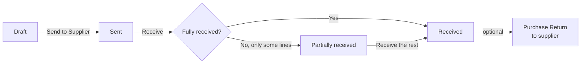
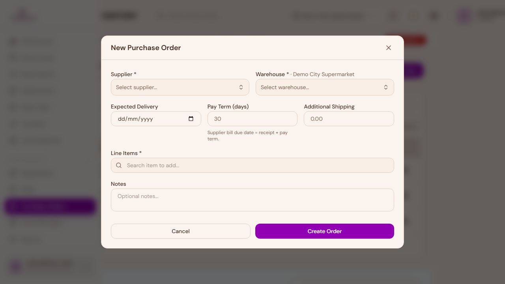
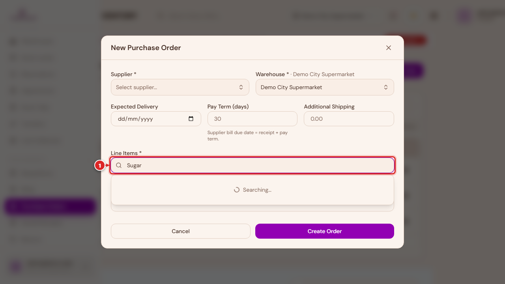
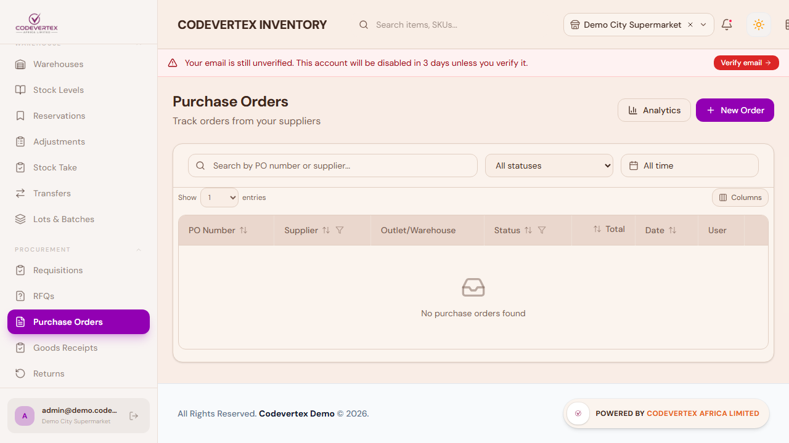
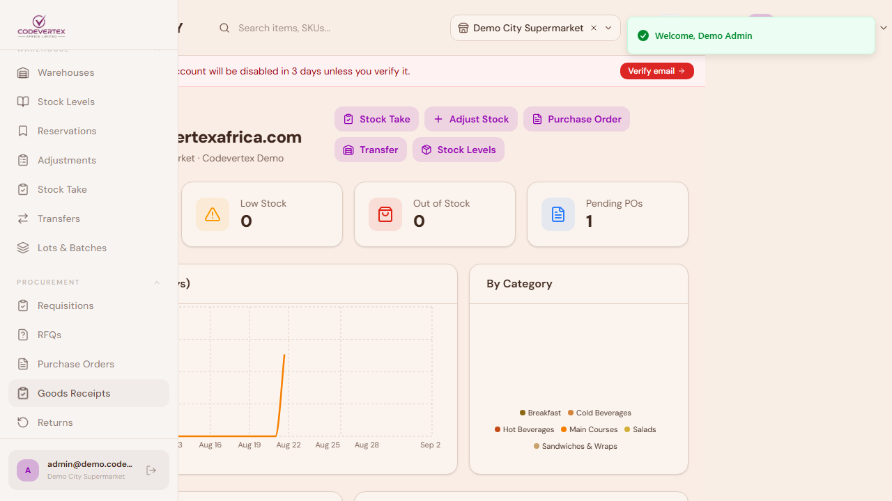
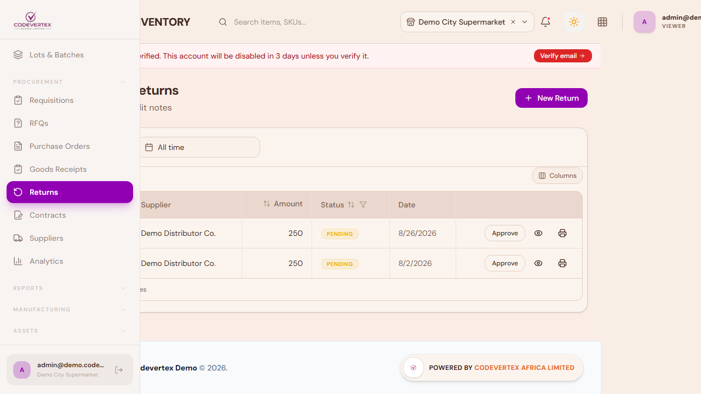
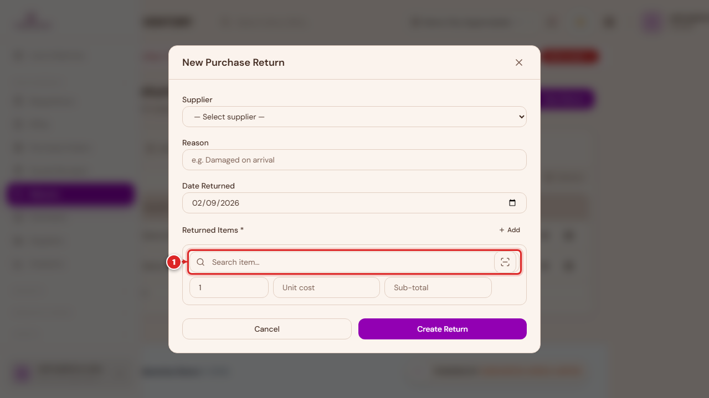

# Purchasing & Receiving

How to order stock from a supplier, receive it in, and record a return — the three steps of the
purchasing cycle, in order.

## Creating a Purchase Order

Go to **Purchase Orders** in the sidebar, then **New Order**.

1. **Supplier** — required. Pick an existing supplier or add a new one on the spot.
2. **Warehouse** — required. This is where the stock will post to once received.
3. **Expected Delivery**, **Pay Term**, and **Additional Shipping** are all optional header
   details.

Search for each item you're ordering and it's added as a line in one step, pre-filled with its
unit and last-paid cost — adjust the quantity and cost as needed. Each line also has an optional
**selling price adjustment**: if the supplier's price changed, you can set a new selling price
here and choose whether it applies to all existing stock immediately or only to the new stock once
it's received.

Submitting creates the order as a **Draft**.

## Sending, status, and receiving

Opening a purchase order shows its full detail — supplier, warehouse, line items, and how much has
been received against each line. The actions available depend on its current status:

- **Submit for Approval** — on a draft order, if your organisation requires purchase approval.
- **Send to Supplier** — moves a draft to **Sent**.
- **Mark Received** — a one-click shortcut that receives the *entire* order in one action and
  updates stock immediately. Use this when a delivery arrived complete and you don't need to
  record partial quantities, rejects, or lot/serial detail.
- **Cancel Order** — available on draft or sent orders.

## Goods Receipts — receiving with detail

For anything more than "it all arrived fine" — a partial delivery, some damaged units, items that
need a lot number and expiry date recorded — use **Goods Receipts** instead of the quick Mark
Received shortcut.

**New Goods Receipt**, then pick the purchase order you're receiving against — only orders that
are sent or partially received show up in the list, since there's nothing to receive against a
draft. For each line item, the form shows what's outstanding and lets you enter:

- **Received** — pre-filled with the full outstanding quantity; reduce it for a partial delivery.
- **Rejected** — units you're not accepting, with a reason (excluded from what you'll be billed
  for).
- **Actual unit cost** — pre-filled from the order, editable if the supplier's actual invoice
  differs.
- **Lot / batch number and expiry date** — shown up front for items you've marked as
  lot-tracked or perishable (see [Adding Products](adding-products.md)), otherwise available as an
  optional section.
- **Serial numbers** — for serial-tracked items, one serial per accepted unit.

Creating the receipt saves it as a **draft** — it does **not** touch your stock yet. Open it and
click **Post — update stock** as a deliberate second step once you're happy the numbers are right.
This two-step design (create, then post) gives you a chance to double-check quantities before
they hit your stock levels.

## Purchase Returns

A Purchase Return records stock going back **to your supplier** — damaged goods, an over-delivery,
anything you're sending back for a credit or refund. (This is different from a customer returning
something they bought from you, which is recorded as a Stock Adjustment with reason "Customer
Return" instead — see [Warehouses & Stock](warehouses-and-stock.md#stock-adjustments).)

**New Return**:

Pick the supplier, a reason, and add the item(s) being returned with quantity and unit cost. Once
created, an admin or manager needs to **Approve** the return before it affects your stock — it's
only decremented once approved, not at the moment you create it.
