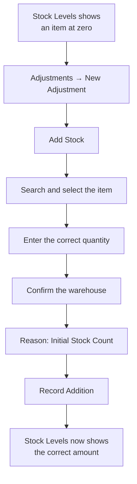
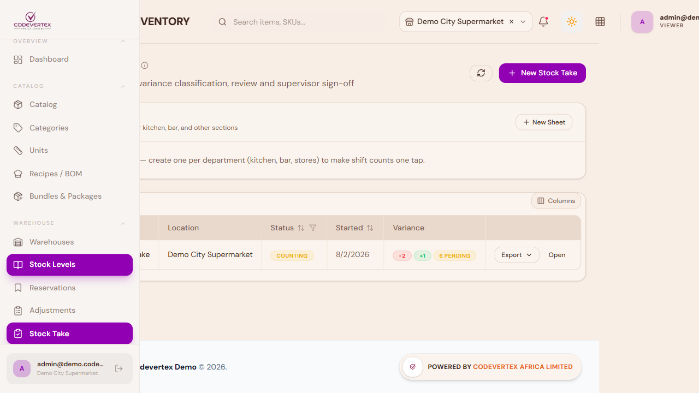
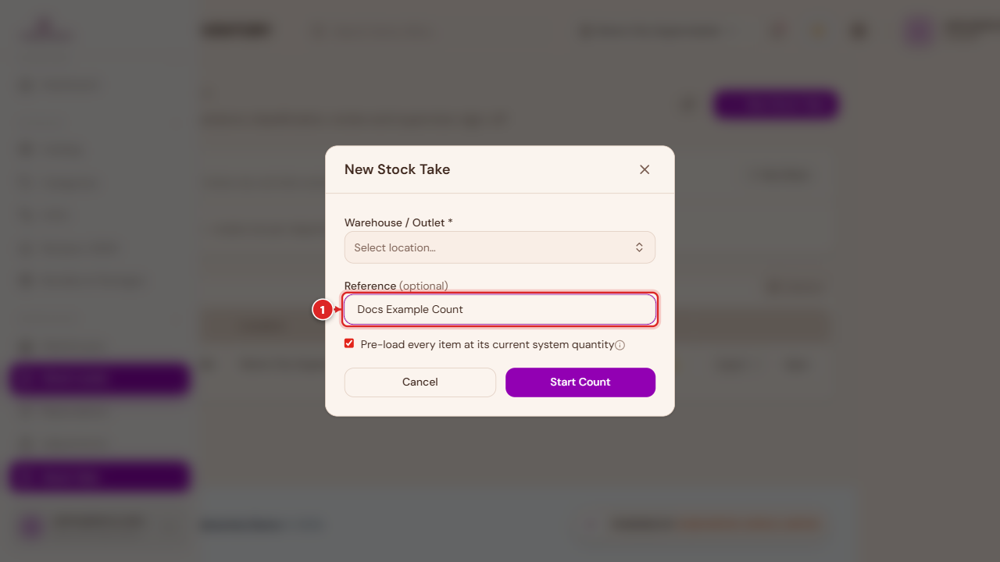
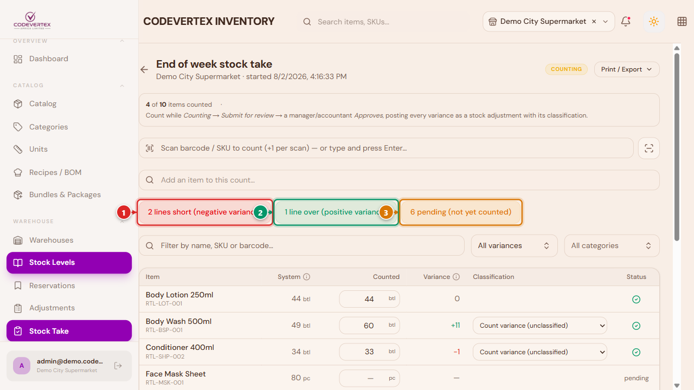

# Warehouses & Stock

This page covers setting up where your stock physically lives, reading your current stock levels,
and — the part most people land here for — fixing an item that shows the wrong amount of stock.

## Warehouses

A warehouse is a physical place stock is held — a shop floor, a back store, a central depot. Every
organisation has at least one, usually created for you when your account was set up.

Go to **Warehouses** in the sidebar, then **New Warehouse**:

> **Direct link:** `https://inventory.codevertexafrica.com/{your-tenant-slug}/warehouses`
> (demo: `https://inventory.codevertexafrica.com/codevertex-demo/warehouses`)

1. **Name** and **Code** — required. The code is a short identifier (e.g. `WH-MAIN`).
2. **Address** — optional.
3. **Set as default warehouse** — the warehouse new stock is added to when you don't specify one
   (including a new item's Initial Stock, see [Adding Products](adding-products.md)). Only one
   warehouse should normally be marked default.

### Locations (zones, aisles, shelves, bins)

Within a warehouse, you can optionally break storage down further into a hierarchy — a zone
containing aisles, containing shelves, containing bins. Open **Manage locations** on any warehouse
card to see and build this tree.

**Add Location** creates one level of the hierarchy at a time:

- **Name** and **Code** are required.
- **Type** is one of Zone, Aisle, Shelf, or Bin.
- **Parent Location** nests it under an existing location — a bin under a shelf, a shelf under an
  aisle, and so on. Leave it as "None" to create a top-level location.

Locations are optional. Plenty of businesses run fine tracking stock at the warehouse level alone.

## Stock Levels

**Stock** in the sidebar shows real-time stock across every warehouse — what's low, what's out,
and what's tracking normally.

> **Direct link:** `https://inventory.codevertexafrica.com/{your-tenant-slug}/stock`
> (demo: `https://inventory.codevertexafrica.com/codevertex-demo/stock`)

Two chips above the table, when relevant, jump straight to items out of stock or below their
reorder point. Clicking any row opens a detail panel with the item's available/reserved/reorder
numbers, and — if you have permission — quick "Adjust" and "Breakdown" actions right there,
shortcuts to the same adjustment flow covered below.

## Stock Adjustments

This is where you fix a stock number that's wrong — whether that's a brand new item that was
saved without its [Initial Stock](adding-products.md#dont-skip-initial-stock), a damaged batch, a
theft write-off, or a count that came up different after a physical stock take.

Go to **Adjustments** in the sidebar, then **New Adjustment**.

> **Direct link:** `https://inventory.codevertexafrica.com/{your-tenant-slug}/adjustments`
> (demo: `https://inventory.codevertexafrica.com/codevertex-demo/adjustments`)

**1. Choose Add Stock or Remove Stock.** This decides the direction — the quantity you type next
is always a positive number, and this toggle supplies the sign.

**2. Search for the item** by name or SKU and select it from the results.

**3. Enter the Quantity** — how much to add or remove (a delta), not the resulting total on hand.
**4. Confirm the Warehouse** this adjustment posts to. If you're currently viewing "All Outlets,"
you'll need to pick one explicitly before you can submit.

**5. Pick a Reason.** This is required, and it's worth choosing carefully — it's what shows up
later in your stock history and reports:

| Reason | Use it for |
|---|---|
| **Initial Stock Count** | Loading opening stock for an item that was created without it — this is the fix for a new product showing zero stock |
| **Count Correction** | Reconciling after a physical stock take |
| **Damaged Goods** | Write-offs for damaged stock |
| **Expired / Spoiled** | Write-offs for expired stock |
| **Theft / Unexplained Loss** | Shrinkage |
| **Internal Use / Issue to Floor** | Stock consumed internally rather than sold |
| **Found / Surplus Discovered** | Stock found that wasn't on the books |
| **Customer Return** | Stock coming back from a customer |
| **Other** | Anything else — a Notes field becomes required so you can explain it |

**6. Submit.** The button reads "Record Addition" or "Record Removal" depending on the toggle from
step 1. Large adjustments may be routed to a manager for approval first, depending on your
organisation's settings — you'll see a message if that happens, and the adjustment posts once
approved.

That's the whole recovery path for a zero-stock item: **Adjustments → New Adjustment → Add Stock →
search the item → enter the correct quantity → Warehouse → reason "Initial Stock Count" → Record
Addition.**

This is probably the single most useful screen to know on your phone — a stock problem usually
gets noticed on the shop floor, not at a desk:

{ width="320" }

A **Bulk Adjust** option in the toolbar lets you do the same thing for several items at once — useful
right after receiving a delivery of several new products at the same time.

## Stock Take {: #stock-take }

> **Direct link:** `https://inventory.codevertexafrica.com/{your-tenant-slug}/stock-take`
> (demo: `https://inventory.codevertexafrica.com/codevertex-demo/stock-take`)

A Stock Adjustment fixes one item you already know is wrong. **Stock Take** is the other
direction: a full or partial physical count, comparing what your team actually counts against
what the system thinks you have, all at once — periodic full counts, cycle counts, or a
department's daily shift sheet (kitchen, bar, stores).

Each row is one counting session, with a **Variance** column summarising it at a glance — how many
lines are short, over, or still pending — so a manager scanning the list can see which sessions
need attention without opening each one.

**New Stock Take**:

1. **Count sheet** (optional) — pick a saved department sheet to pre-load only its items (e.g. the
   kitchen daily sheet), or leave it as **Full count** to include every stocked item.
2. **Warehouse / Outlet** — required, unless a count sheet already has its own location.
3. **Reference** (optional) — a name for this session, e.g. "July month-end count."
4. **Pre-load every item at its current system quantity** — on by default. This fills the sheet
   with each item and what the system currently thinks you have; your team then types what they
   physically counted, and the difference becomes the variance. Turn it off to start from a blank
   sheet and add items as you go instead.

Counting works through three stages: **Counting** (your team enters quantities) → **Submit for
review** → a manager or accountant **Approves**, which posts every variance as a stock adjustment
with its classification, all at once.

As lines get counted, colored pills appear above the list — ① lines short (negative variance), ②
lines over (positive variance), ③ lines still pending — click one to filter the list to just those
lines, click again to clear the filter. The same three states are also available from the filter
row's dropdown, for narrowing by name/SKU/barcode at the same time. Each line shows **Counted −
System = Variance**; a reason can be attached to each variance line before it's approved and
posted.

## Common Issues

**Stock Levels shows a negative number for an item.** This is correct, not a bug — it means the
item was sold beyond what was actually on hand (an oversell), and the negative number is the
real, unsettled shortfall. It shows up marked **Out of Stock** the same as a zero-stock item, and
you'll see it in the "N items out of stock" count and the Out of Stock filter too. It resolves
itself automatically: the next stock coming in — a Goods Receipt, a transfer, an adjustment — pays
down the shortfall first, and the item only goes positive again once the debt is actually cleared.
You don't need to do anything special to fix it; just keep restocking normally.

**Submit is disabled, or the form asks you to pick a warehouse you didn't expect to need.** If
you're currently viewing "All Outlets" in the header (an admin-only view across every location),
an adjustment can't post anywhere in particular — pick one specific outlet/warehouse before
submitting.

**An adjustment doesn't show up in Stock Levels right away.** Large adjustments can be routed to a
manager for approval first, depending on your organisation's settings (see
[Approvals](administration.md#approvals) in Inventory Administration) — it posts once approved, and
you'll see a message at submit time if that's what happened.

**Choosing "Other" as the reason won't let you submit.** A Notes field becomes required for that
reason specifically, so there's a record of what actually happened — fill it in and the button
re-enables.

**A warehouse card doesn't show a "Manage locations" option.** Locations are optional — if a
warehouse doesn't need zone/aisle/shelf breakdown, that's fine to leave alone, and the option
still exists for when you're ready to use it.
