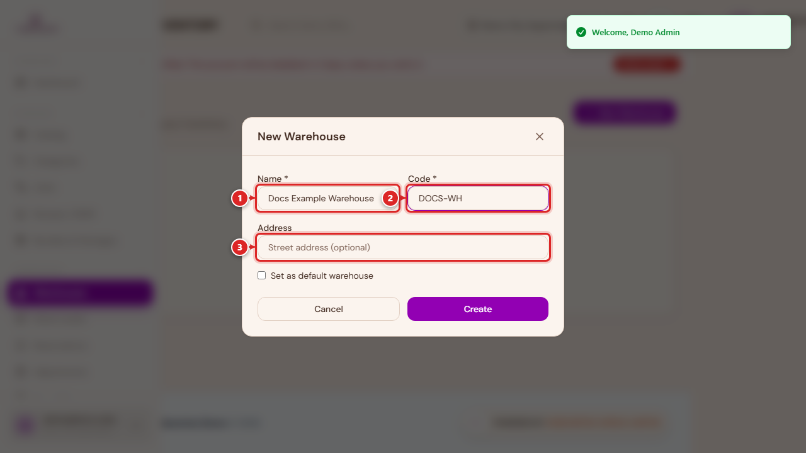
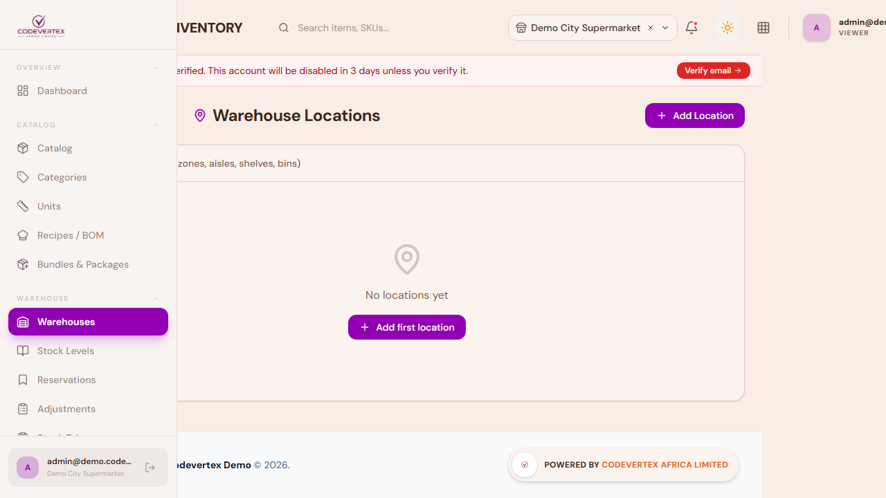
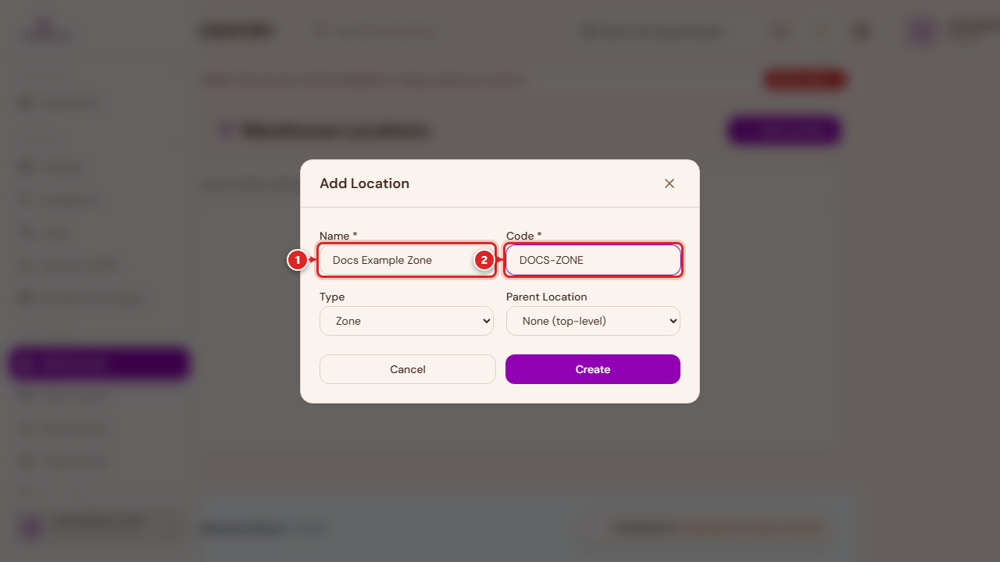
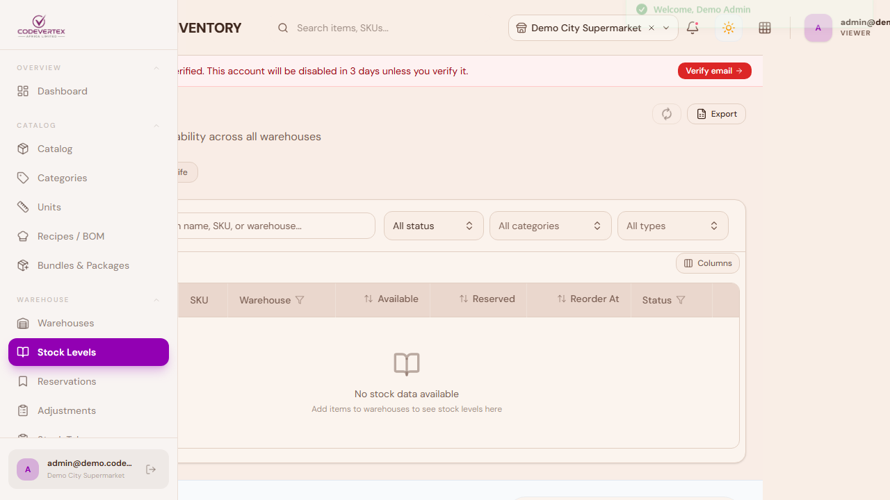
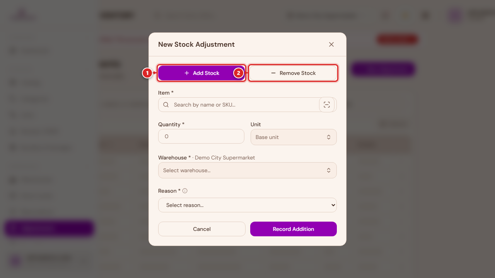
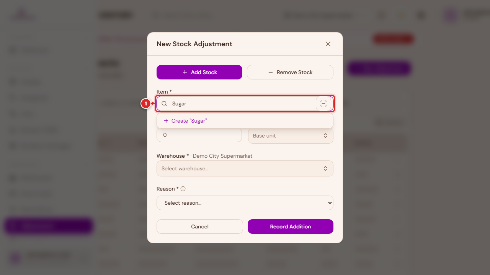
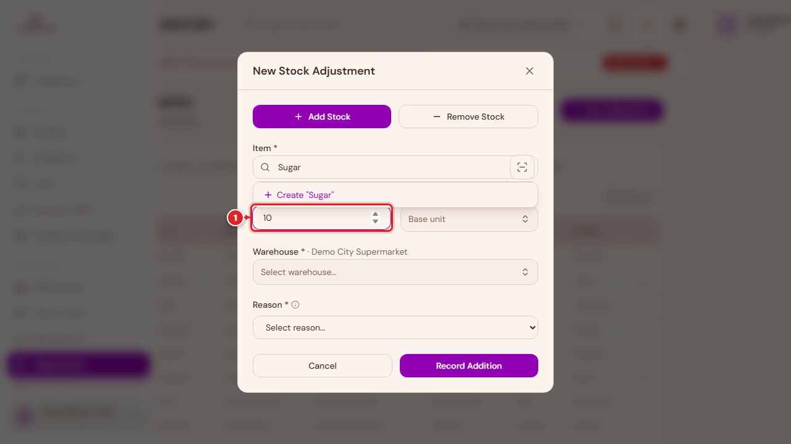
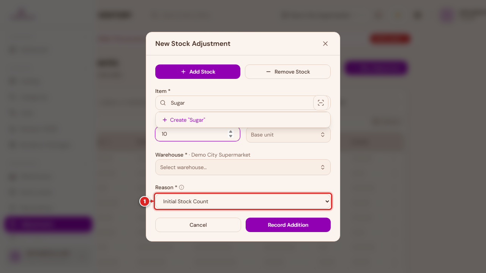
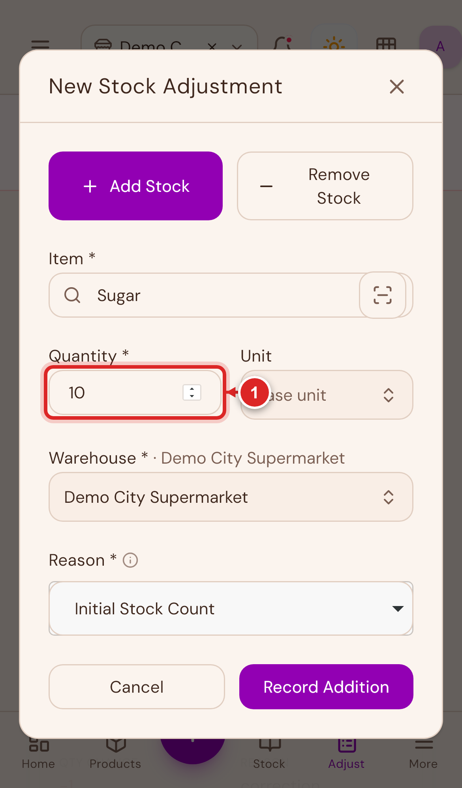
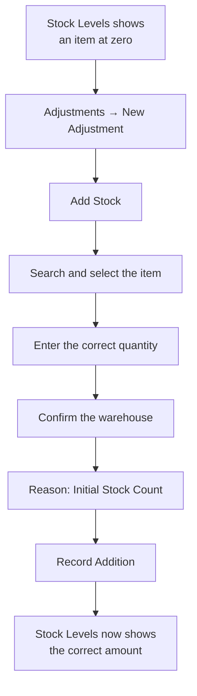

# Warehouses & Stock

This page covers setting up where your stock physically lives, reading your current stock levels,
and — the part most people land here for — fixing an item that shows the wrong amount of stock.

## Warehouses

A warehouse is a physical place stock is held — a shop floor, a back store, a central depot. Every
organisation has at least one, usually created for you when your account was set up.

Go to **Warehouses** in the sidebar, then **New Warehouse**:

1. **Name** and **Code** — required. The code is a short identifier (e.g. `WH-MAIN`).
2. **Address** — optional.
3. **Set as default warehouse** — the warehouse new stock is added to when you don't specify one
   (including a new item's Initial Stock, see [Adding Products](adding-products.md)). Only one
   warehouse should normally be marked default.

### Locations (zones, aisles, shelves, bins)

Within a warehouse, you can optionally break storage down further into a hierarchy — a zone
containing aisles, containing shelves, containing bins. Open **Manage locations** on any warehouse
card to see and build this tree.

**Add Location** creates one level of the hierarchy at a time:

- **Name** and **Code** are required.
- **Type** is one of Zone, Aisle, Shelf, or Bin.
- **Parent Location** nests it under an existing location — a bin under a shelf, a shelf under an
  aisle, and so on. Leave it as "None" to create a top-level location.

Locations are optional. Plenty of businesses run fine tracking stock at the warehouse level alone.

## Stock Levels

**Stock** in the sidebar shows real-time stock across every warehouse — what's low, what's out,
and what's tracking normally.

Two chips above the table, when relevant, jump straight to items out of stock or below their
reorder point. Clicking any row opens a detail panel with the item's available/reserved/reorder
numbers, and — if you have permission — quick "Adjust" and "Breakdown" actions right there,
shortcuts to the same adjustment flow covered below.

## Stock Adjustments

This is where you fix a stock number that's wrong — whether that's a brand new item that was
saved without its [Initial Stock](adding-products.md#dont-skip-initial-stock), a damaged batch, a
theft write-off, or a count that came up different after a physical stock take.

Go to **Adjustments** in the sidebar, then **New Adjustment**.

**1. Choose Add Stock or Remove Stock.** This decides the direction — the quantity you type next
is always a positive number, and this toggle supplies the sign.

**2. Search for the item** by name or SKU and select it from the results.

**3. Enter the Quantity** — how much to add or remove (a delta), not the resulting total on hand.
**4. Confirm the Warehouse** this adjustment posts to. If you're currently viewing "All Outlets,"
you'll need to pick one explicitly before you can submit.

**5. Pick a Reason.** This is required, and it's worth choosing carefully — it's what shows up
later in your stock history and reports:

| Reason | Use it for |
|---|---|
| **Initial Stock Count** | Loading opening stock for an item that was created without it — this is the fix for a new product showing zero stock |
| **Count Correction** | Reconciling after a physical stock take |
| **Damaged Goods** | Write-offs for damaged stock |
| **Expired / Spoiled** | Write-offs for expired stock |
| **Theft / Unexplained Loss** | Shrinkage |
| **Internal Use / Issue to Floor** | Stock consumed internally rather than sold |
| **Found / Surplus Discovered** | Stock found that wasn't on the books |
| **Customer Return** | Stock coming back from a customer |
| **Other** | Anything else — a Notes field becomes required so you can explain it |

**6. Submit.** The button reads "Record Addition" or "Record Removal" depending on the toggle from
step 1. Large adjustments may be routed to a manager for approval first, depending on your
organisation's settings — you'll see a message if that happens, and the adjustment posts once
approved.

That's the whole recovery path for a zero-stock item: **Adjustments → New Adjustment → Add Stock →
search the item → enter the correct quantity → Warehouse → reason "Initial Stock Count" → Record
Addition.**

This is probably the single most useful screen to know on your phone — a stock problem usually
gets noticed on the shop floor, not at a desk:

{ width="320" }

A **Bulk Adjust** option in the toolbar lets you do the same thing for several items at once — useful
right after receiving a delivery of several new products at the same time.
