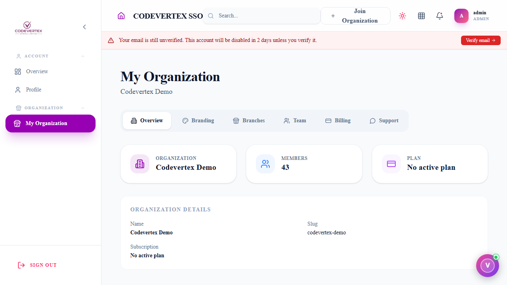
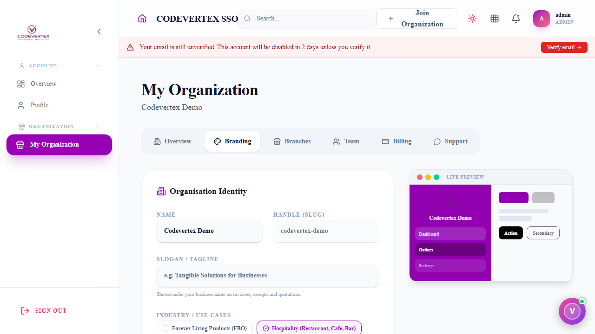
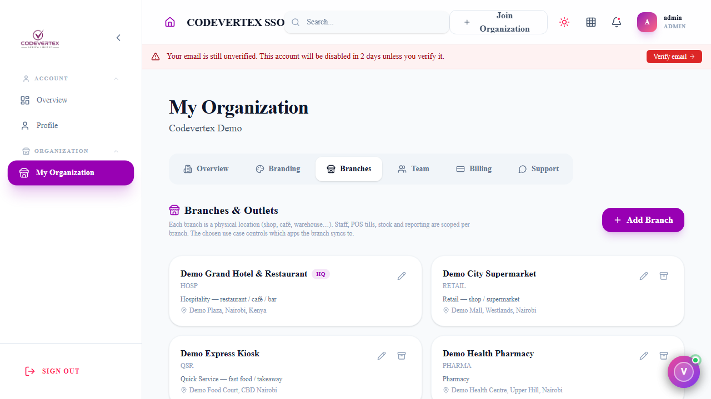
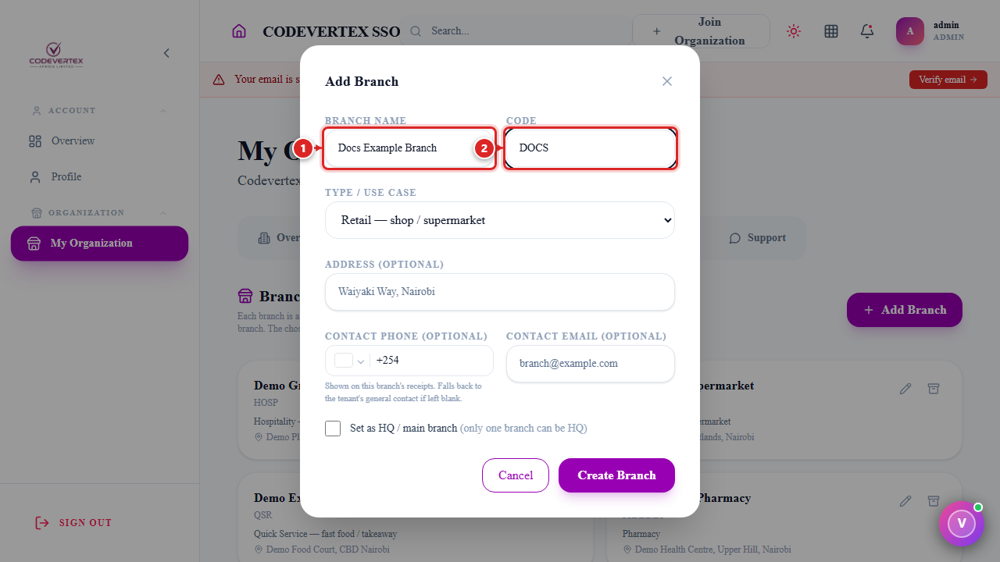
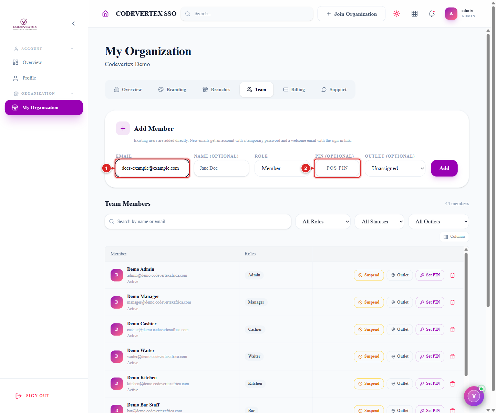
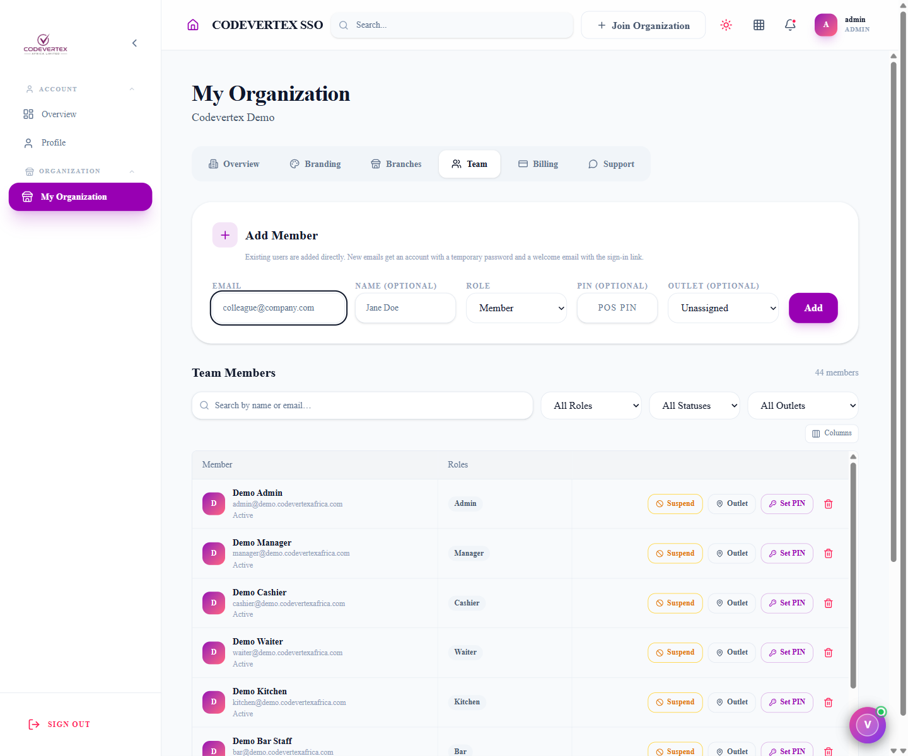
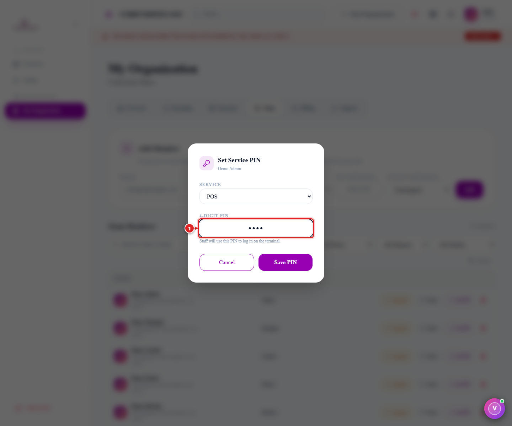
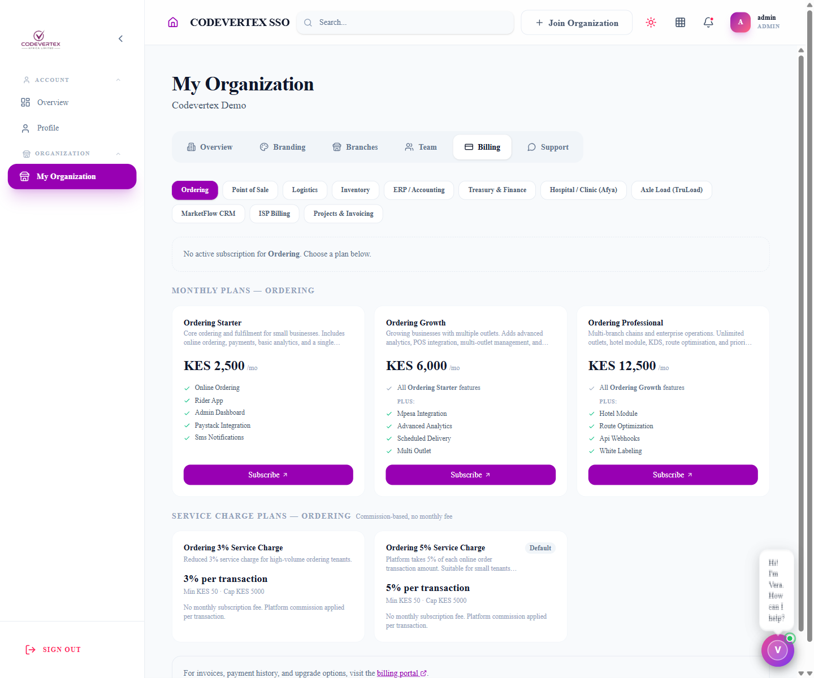
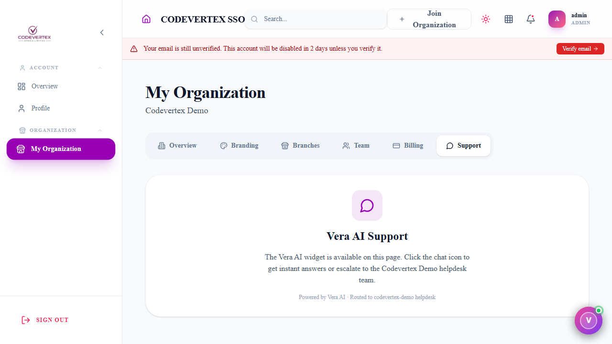

# Managing Your Organisation

**My Organization** is where an organisation admin manages everything shared across every
Codevertex Africa product: company branding, physical branches, your team's access, billing, and
support. Only admins see this page — everyone else manages their own account under **Profile**
instead.

> **Direct link:** `https://accounts.codevertexafrica.com/dashboard/my-tenant`
> (the demo organisation: sign in as `admin@demo.codevertexafrica.com`, then open the same link)

Six tabs sit across the top — click between them, nothing here needs a page reload. **Overview**
(shown above) is a quick snapshot: member count, active plan, and your organisation's name and
slug. That slug is the `{your-tenant-slug}` you'll see throughout every product's own guide — for
example `codevertex-demo` for this demo organisation, in a URL like
`https://inventory.codevertexafrica.com/codevertex-demo/catalog`.

## Branding

Your organisation's identity — logo, colours, contact details, and tax/compliance settings (KRA
PIN, eTIMS registration) used across receipts, invoices, and documents. Set these up once here;
every product reads from the same record.

## Branches {: #branches }

A branch is a physical location — a shop, a café, a warehouse. Staff, tills, stock, and reporting
are all scoped per branch, and the use case you pick here decides which products that branch
actually uses.

**Add Branch**:

1. **Branch Name** and **Code** — the code can't be changed once the branch is created.
2. **Type / Use Case** — retail, hospitality, pharmacy, quick service, warehouse-only, and so on.
   This is what makes a branch show up in Inventory as a Goods-selling "Products" outlet versus a
   Drugs-only pharmacy outlet, for example — see
   [Item types at a glance](../inventory/adding-products.md#item-types-at-a-glance).
3. **Address**, **Contact Phone**, **Contact Email** — all optional; contact details print on that
   branch's receipts and fall back to the organisation's general contact if left blank.
4. **Set as HQ / main branch** — only one branch can be HQ.

A branch can be archived (not deleted) later — staff assigned there will need reassigning first.

## Team {: #team }

This is where staff accounts, roles, outlet access, and **PINs** are managed — the same PIN staff
then use to log in to Inventory, POS, or Library on a shared terminal.

**Add Member**:

1. **Email** — required. An existing account is added directly; a brand-new email gets an account
   created on the spot, with a temporary password emailed to them (shown to you once, so you can
   share it securely too — see below).
2. **Name** — optional.
3. **Role** — the access level: `admin`, `manager`, `staff`, `cashier`, `accountant`, and so on —
   see the dropdown for the full list. Roles are shared across products; what a role can actually
   do varies by product.
4. **PIN** — optional, 4 digits. Set it here at invite time, or add/change it later from the
   member list (see below). This becomes their POS PIN by default.
5. **Outlet** — optional. Ties the member to one branch.
6. **Add**.

If the email didn't already have an account, you'll see a one-time **"Account created"** dialog
with a temporary password — copy it and share it securely; it isn't shown again, and the new
member must change it on first sign-in.

**The Team Members list**, below the Add Member form, is where you manage everyone already on the
team — search by name or email, and filter by role, status, or outlet:

Each row has:

- **Suspend / Activate** — toggles whether the member can sign in at all.
- **Outlet** — reassign which branch this member is tied to (only shown if you have branches set
  up).
- **Set PIN** — opens the dialog below.
- A trash icon to remove the member entirely.

### Setting or changing a PIN

This is the direct fix for **"a new staff member doesn't have a PIN yet"** or **"I need to change
someone's PIN"** — the exact question that comes up when a new hire can't log in to the shop
terminal.

1. Click **Set PIN** on that member's row.
2. **Service** — which product this PIN is for: **POS**, **Inventory**, or **Library**. A staff
   member can have a different PIN per product, or the same one — your call.
3. **4-Digit PIN** — required, exactly 4 digits.
4. **Save PIN**.

That PIN is what staff type into the numeric keypad on the product's own PIN login screen — see
[Inventory's login flow](../inventory/index.md) for what that looks like from the staff side.

## Billing

One tab per product your organisation could subscribe to — Point of Sale, Inventory, Treasury,
ERP, Ordering, Logistics, Afya, TruLoad, MarketFlow CRM, ISP Billing, and Projects. Each shows the
active plan and its renewal date, or lets you pick one if there isn't one yet. **Manage** opens the
full plans/billing experience at `subscriptions.codevertexafrica.com` for that product. See
[Subscriptions & Billing](../subscriptions-and-billing.md) for how plans and trials work generally.

## Support

Click the chat icon (bottom-right corner, on any page) to reach **Vera**, the platform's AI
assistant — it answers most questions instantly and can escalate to your organisation's helpdesk
team when it can't. This tab doesn't have its own ticket form; the chat widget is the way in.

## Common Issues

**Only some tabs are visible, or the page 403s.** Only organisation admins see My Organization at
all — everyone else manages their own account under **Profile** instead. If you should have admin
access and don't, another admin needs to change your role under **Team**.

**A new member's temporary password wasn't written down in time.** It's shown exactly once, in the
"Account created" dialog, and isn't recoverable afterward — use **Set PIN** or your product's
"Forgot password?" flow to issue a fresh credential instead of hunting for the original.

**Removed a branch/outlet and now can't find staff who were assigned to it.** Reassign affected
staff to another outlet under **Team** *before* archiving a branch — a branch is archived, not
deleted, but members tied to it will need reassigning to keep working normally.

**A staff member's PIN works on POS but not on Inventory (or vice versa).** PINs are set per
product on purpose (Service dropdown in Set PIN) — a staff member can have different PINs on
different products, or the same one, but they don't automatically carry over. Set the PIN again
for whichever product it's missing on.

**The Billing tab shows "No active plan" for a product you're sure you're paying for.** Billing is
managed per product at `subscriptions.codevertexafrica.com`, reached via that tab's **Manage**
button — a plan purchased there can take a short moment to reflect back here.
