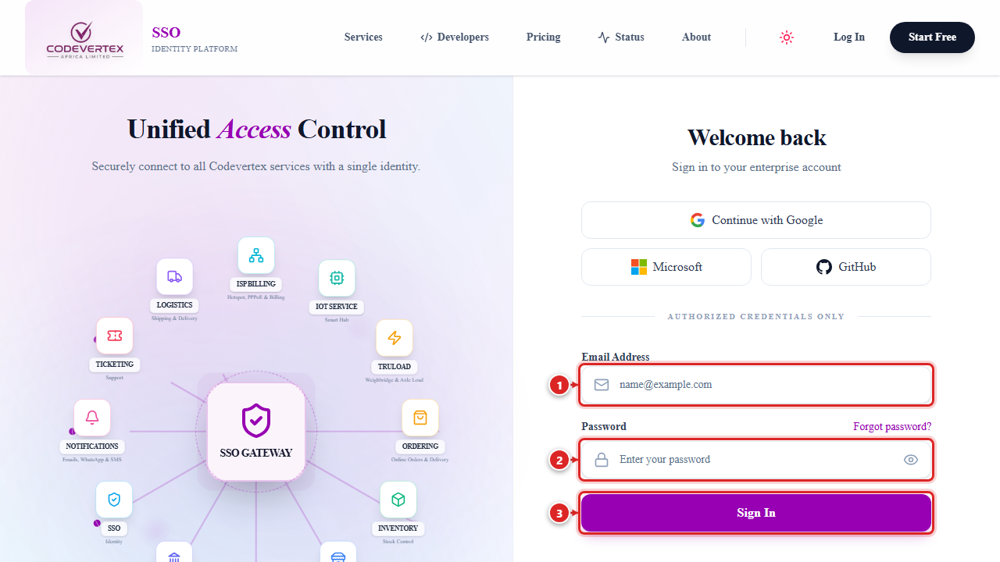
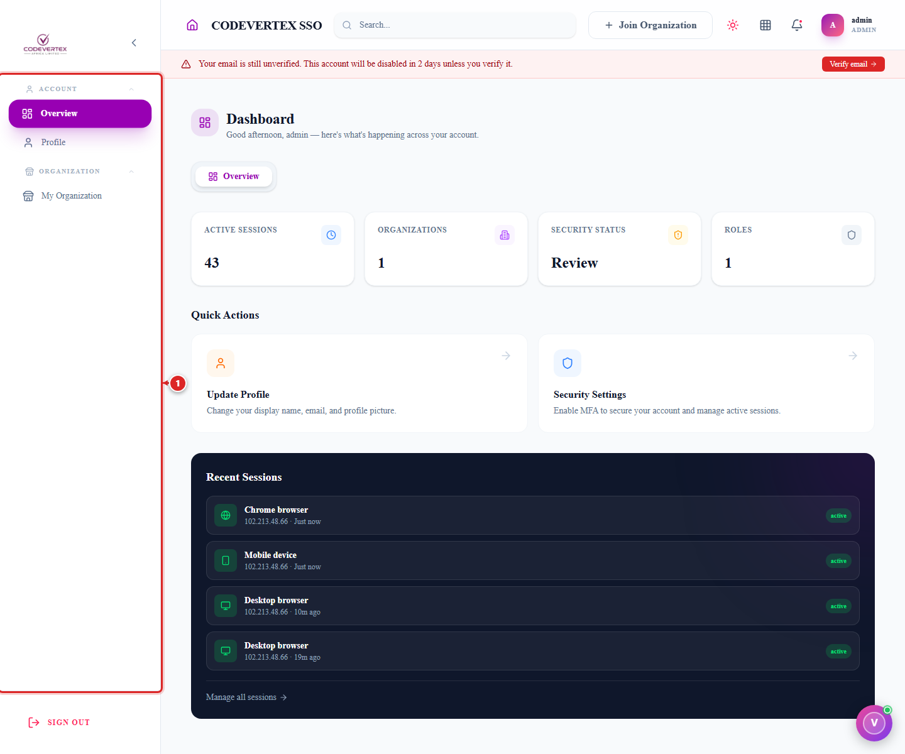
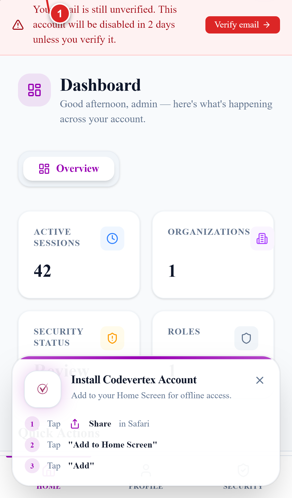

# Signing In

One login works across every Codevertex Africa product. This page covers signing in through the
central portal — **accounts.codevertexafrica.com**. If a product (Inventory, POS) sent you here
from its own "Sign in" link, you'll land right back there once you're signed in.

> **Direct link:** `https://accounts.codevertexafrica.com/login`

1. **Email Address** — the email your account was created with.
2. **Password** — click **Forgot password?** next to the label if you don't remember it.
3. **Sign In**.

A few other ways in are available on the same screen, depending on what your organisation has
enabled: **Continue with Google**, **Microsoft**, or **GitHub**, and — once you've signed in with
a password at least once — **Sign in with passkey** for password-free sign-in on a device you've
registered.

The first time you sign in on a new device, you may be offered **"Set up passkey"** — a prompt to
register that device (fingerprint or face unlock) so future sign-ins skip the password entirely.
It's entirely optional; **Maybe later** skips it and asks again another day.

Once you're in, you land on your dashboard. The sidebar (labelled ①) is always visible on a
computer; ② is the row of quick-action shortcuts for the sections you use most:

On a phone, the sidebar becomes a menu — tap the hamburger icon (①) in the top-left to open it:

{ width="320" }

From here, **My Organization** in the sidebar is where an admin manages the organisation — see
[Managing Your Organisation](managing-your-organisation.md).

## Common Issues

**"Your email is still unverified" banner won't go away.** Existing accounts are asked to confirm
their email on a graduated schedule — a dismissible notice at first, escalating to a banner that
can't be dismissed and eventually a short mandatory wait if it's ignored long enough. Click
**Verify email** and confirm the 6-digit code sent to your address to clear it for good.

**Passkey sign-in isn't offered on a new device.** A passkey is registered per device — you'll need
to sign in with your password once on that device and either accept the "Set up passkey" prompt or
set one up later from your account settings.

**Signed in on one device, but a colleague on another device doesn't see the same thing.** Each
person has their own login — a passkey or "remembered" session is tied to one device, not the
organisation. Every staff member who needs access should have their own account (see
[Managing Your Organisation → Team](managing-your-organisation.md#team)), not a shared login.
