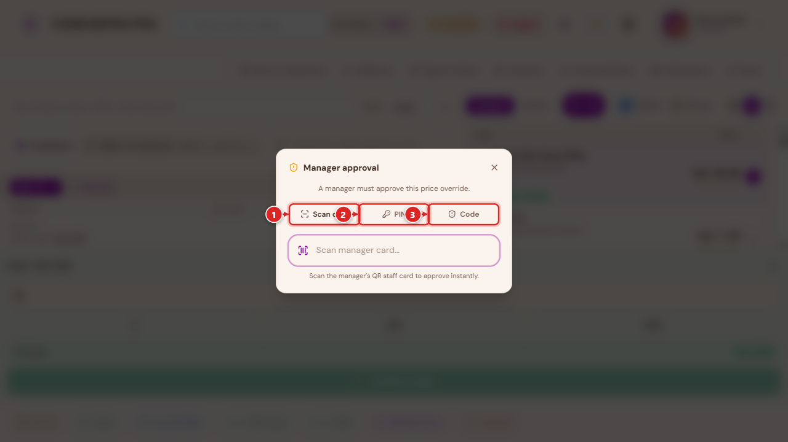
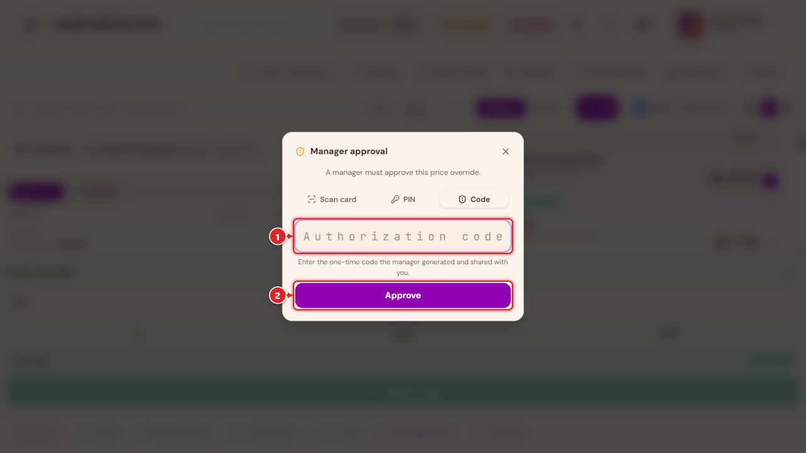
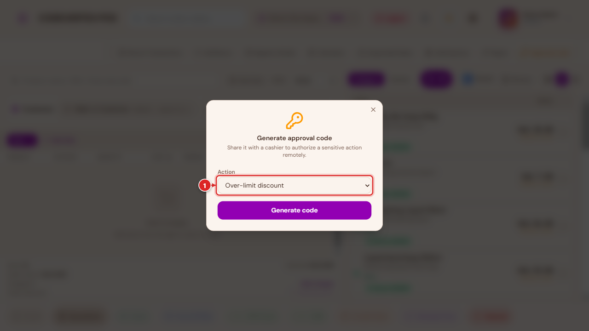
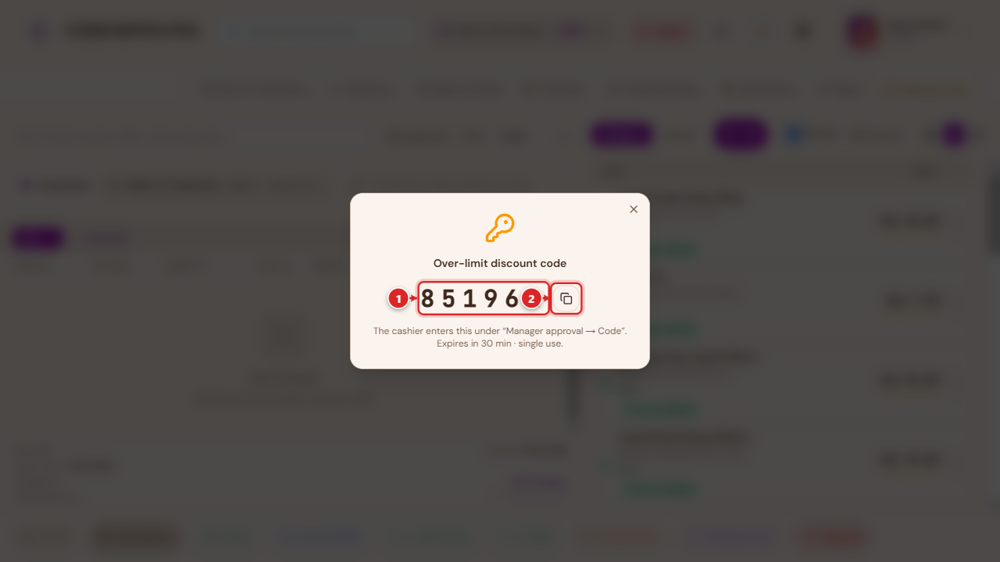

# Approvals & Manager Overrides

Some actions at the till are deliberately not left to a cashier's own judgement — selling below
cost, discounting past a limit, giving something away for free, or voiding a bill. This page
covers the three mechanisms the POS uses to require a second person's sign-off, and the
Complimentary (no-charge) payment workflow, which is the most common reason a manager gets pulled
in.

## The three ways to approve

Whenever an action needs manager sign-off, the same dialog offers three ways to provide it:

1. **Scan card** — the manager scans their own QR staff card at the terminal.
2. **PIN** — the manager types their PIN directly at the terminal.
3. **Code** — a one-time code the manager generated remotely and shared (by phone, radio, or
   in person) with the cashier, for when they can't get to the terminal themselves.

A manager (or a role your organisation has explicitly granted a matching self-approve permission
to) skips this dialog entirely for actions they're already allowed to authorize themselves —
Void and most overrides work this way by default. **Complimentary is a deliberate exception**:
even a manager acting as their own cashier must authorize it, since it's real, unrecovered
inventory cost with higher potential for abuse than a simple discount.

## When approval is asked for

- **A discount or price change beyond your role's limit.** Selling below the catalog price, or
  applying a discount larger than your organisation allows a cashier to give on their own,
  prompts this dialog automatically when you try to complete the sale.
- **Out-of-stock overrides** — adding more of an item than the outlet actually has on hand (see
  [below](#out-of-stock-overrides)).
- **Order adjustments** — additional charges, or other order-level edits past a normal amount.
- **Void** — cancelling a bill.
- **Complimentary** — giving a whole bill (or part of a split bill) away at no charge (see below).

### Out-of-stock overrides {: #out-of-stock-overrides }

Adding more of an item to a sale than the outlet actually has on hand triggers the same
manager-approval dialog rather than silently overselling. A manager (or a role explicitly granted
the matching self-approve permission) confirms it with a plain Yes/No instead of the full dialog;
everyone else goes through Scan card / PIN / Code like any other approval.

## Generating a one-time approval code

A manager who isn't physically at the terminal can still authorize an action remotely. The amber
**Approval code** button, on the POS Terminal's toolbar, mints a one-time code for a
not-yet-placed sale's discount, price override, order adjustment, or out-of-stock override:

Pick the action, then **Generate code**:

Read the code out (by phone, radio, or in person) to the cashier, who enters it under the
approval dialog's **Code** tab. It's single-use and expires a short time after it's generated —
if it isn't used in time, generate a fresh one.

Once a bill has already been placed, the same idea applies per-bill: its detail page shows
**Void code** and **Complimentary code** buttons for a manager to generate a one-time code
specifically for voiding, or comping, that one bill — see [Void](#void) and
[Complimentary payments](#complimentary-no-charge-payments) below.

## Void

Voiding cancels a bill entirely — reversing anything already booked against it. It's available
from the terminal while a sale is still open, and from an already-placed bill's own page
(**Void Bill**) for open, pending, draft, sent, in-progress, parked, unpaid, or partially-paid
bills; a bill that's already been paid, cancelled, or voided can't be voided again (a paid sale is
handled through [Returns](selling-and-checkout.md#returns) instead).

Voiding always asks for a reason first — **Customer complaint**, **Duplicate order**,
**System error**, **Manager override**, or **Other** — before the manager-approval step (unless
you're the one authorizing it yourself).

Void is for a bill that's still in progress or unpaid. A sale that's already **completed** is
corrected with **Edit Sale** or **Delete Sale** instead — both admin-level tools, opened from a
completed sale's own actions menu.

## Editing a completed sale {: #editing-a-completed-sale }

**Edit Sale** corrects a completed sale in place — the sale keeps its original order number and
status throughout, rather than being cancelled and replaced:

- **Removing a line, or reducing its quantity** reverses just that portion: stock is added back,
  the amount owed/refundable adjusts down, and any loyalty points or staff commission earned on
  it are clawed back proportionally.
- **Adding a new item, or increasing an existing line's quantity** bills the difference as a
  small linked follow-on sale, referencing the original — stock, tax, and loyalty all apply to
  the top-up exactly like a normal sale.
- A line can only be reduced once. To correct the same line a second time, remove it entirely and
  add it back at the corrected quantity as a fresh line.
- Changing only the **price** of a line without changing its quantity isn't something this tool
  captures — remove the line and re-add it at the corrected price instead.
- Edit Sale is only available while the sale hasn't already been fully reversed or refunded —
  once it has, use [Returns](selling-and-checkout.md#returns) for anything further.

**Billing an increase to a customer's account.** If the original sale was a walk-in (no customer
attached) and the increase should go on someone's account, attach the customer while editing — the
top-up bills to their account correctly, and that customer stays on record for the sale so any
later payment against it finds the right account. A small **walk-in** hint on the Edit Sale button
is a reminder to do this when it looks like the sale might need it, not a requirement to act on it.

## Deleting a sale {: #deleting-a-sale }

**Delete Sale** (admin only) is for a sale that should never have been recorded at all — entered
against the wrong till, a training mistake, a genuine duplicate. What happens next depends on
whether the sale was already reported to KRA eTIMS:

- **Already reported** — the sale can't be erased (a transmitted tax record has to stay on file),
  so Delete reverses everything it caused (stock restored, the ledger entry undone) and marks the
  sale deleted. It still shows up in a fiscal audit trail, just flagged as removed.
  Delete Sale can't be used on a sale that already has a return, refund, or other correction
  against it — void or edit it instead.
- **Never reported** — the sale is removed entirely, after the same stock and ledger reversal.

## Complimentary (no-charge) payments {: #complimentary-no-charge-payments }

Complimentary closes a bill with **no cash collected** — for staff meals, a director's order,
goodwill toward a customer, or a vendor/technical visit. It's a genuine tender, not a discount:
the items are still deducted from stock and the sale is still recorded, just with nothing paid.

Reached from **Settle Bill** (Tables) or **Collect Payment** (an open bill's own detail page) — a
plain retail/quick-service checkout doesn't offer it directly, since it's a bill-level, always
manager-approved action rather than an everyday till tender. Picking it opens a short reason
capture first:

- Staff meal
- Director's order
- Goodwill / comp
- Vendor / technical visit
- Other (free text)

The app explains plainly what happens next: *"No cash will be collected — this closes as a
complimentary expense in your books (revenue is still recorded, offset by a Complimentary &
Goodwill Expense line, so management can see what was given away)."* See
[Payments & Treasury](payments-and-treasury.md#complimentary-sales) for how this shows up in your
financial reports.

A reason and manager approval are **always** required — the same three-way dialog described
above, with no self-approve shortcut for anyone, manager included.

### Complimentary code

Exactly like Void, a manager who isn't at the terminal can pre-authorize a specific bill's
complimentary close remotely — its detail page's **Complimentary code** button mints a one-time
code:

> Share this code with the waiter/cashier. They enter it under "Manager approval → Code" to
> close the bill as complimentary. Single use, expires a short time after it's generated.

### Split bills

Comping only part of a bill (pay for some guests, comp the rest) works through the same
**Multiple Pay** / split-by-item flow described in
[Selling & Checkout](selling-and-checkout.md#taking-payment) — assign the items you're comping to
their own guest, then choose Complimentary for that guest's portion. The receipt and reports both
reflect a mixed sale correctly: part collected, part complimentary.

## Common Issues

**A manager's PIN works to log in everywhere, but is rejected when stepping up to approve
something at a different outlet.** Approval PINs and cards are checked the same way login is —
if this happens, the PIN itself is fine; check with your account contact, since this points at an
outlet-assignment gap on that manager's account rather than a wrong PIN.

**An approval code says it's invalid, even though it was just generated.** Codes are tied to the
specific outlet they were generated for and expire quickly by design — confirm the cashier is at
the same outlet, and that the code hasn't already timed out (generate a fresh one if it has).

**Complimentary doesn't appear as a payment option.** It's an opt-in feature your organisation
enables — if your business genuinely needs it (staff meals, comps) and doesn't see it, ask your
account contact to switch it on.

**Editing a sale to add value says something like "requires a customer with a phone number
selected."** Billing the extra amount needs one of two things: an active **Cash** payment method
configured for your outlet (see
[Settings & Configuration → Payment Display](settings-and-configuration.md#payment-display)), or a
customer attached to the sale so the top-up can go on their account instead. If neither is set up,
attach a customer while editing, or ask your admin to check that an active Cash tender exists.

**Edit Sale is greyed out on a completed sale.** The sale has already been fully reversed or
refunded — Edit Sale only works on a sale that hasn't gone through that yet. Use
[Returns](selling-and-checkout.md#returns) for anything further on an already-refunded sale.

**Delete Sale refuses with "this sale already has a return, refund, or reversal on record."**
Delete is only for a plain, untouched sale entered by mistake. A sale that's already been
corrected in any way needs that correction's own tool (Edit Sale, or Returns) instead — Delete
won't layer on top of existing history.

**Resuming a draft and changing it — will that create a second sale?** No. Adding, removing, or
adjusting items on a resumed draft always saves onto that same draft — it never creates a
replacement order or leaves a stray voided one behind, however many changes you make before it's
finally completed.

**An admin or manager still sees the full approval dialog for an action they should be able to
self-approve.** Self-approval is a specific, named permission separate from the general
admin/manager role — check **Team, Shifts & Cash Management →
[Roles & permissions](team-and-administration.md#roles-and-permissions)** for the exact
self-approve permission that action needs.
