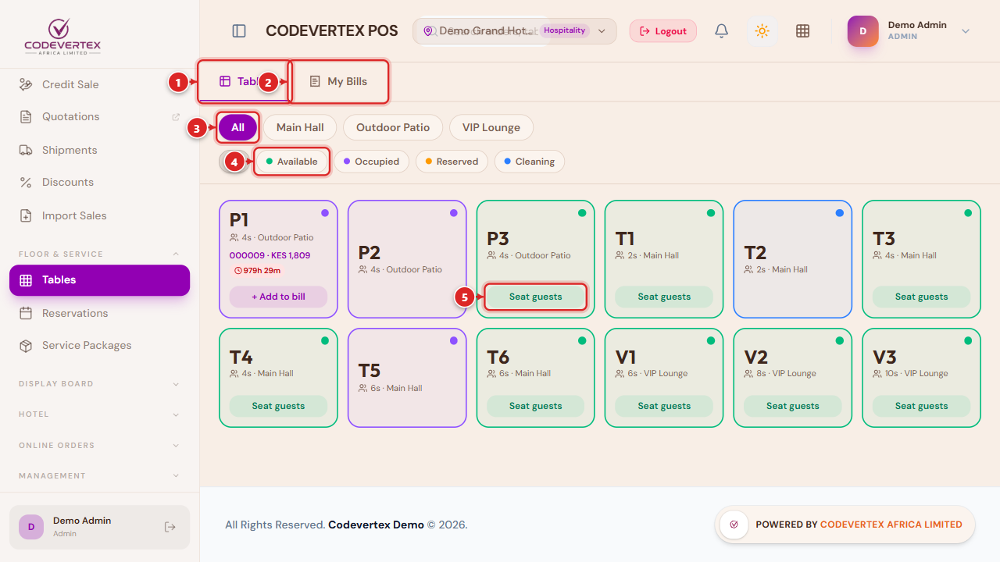
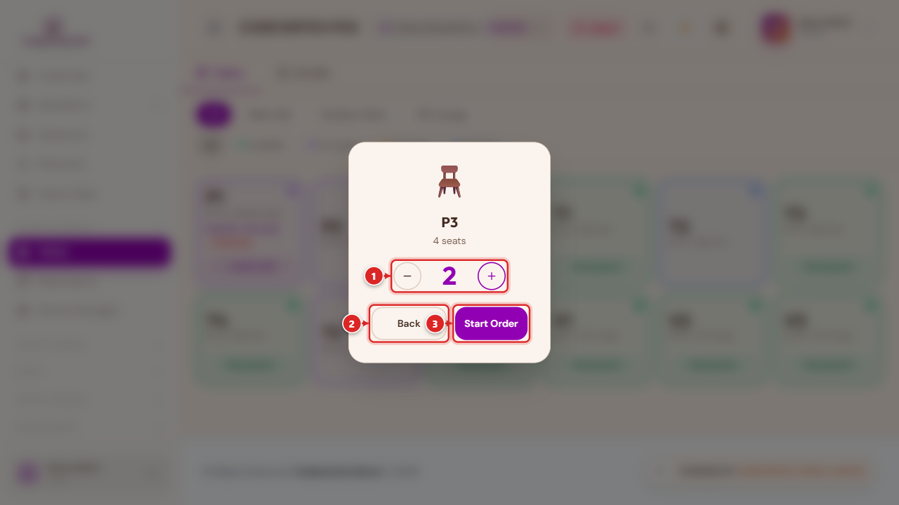
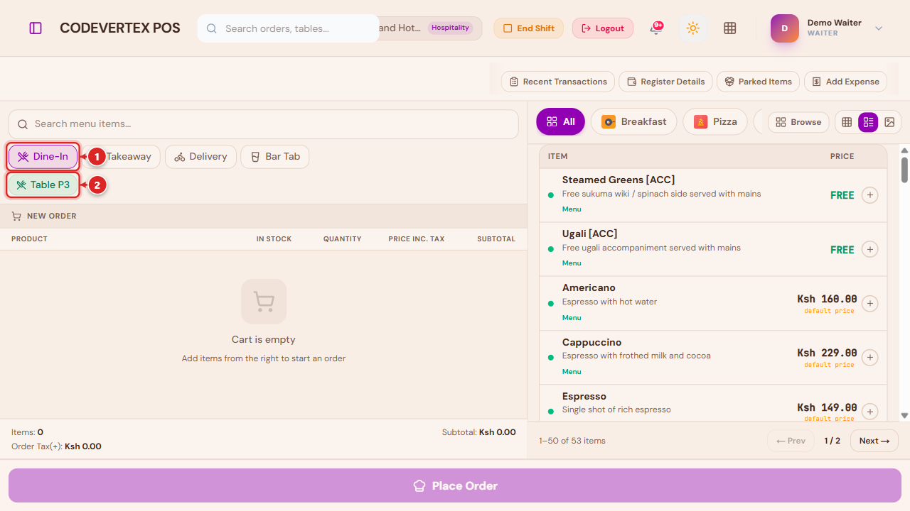
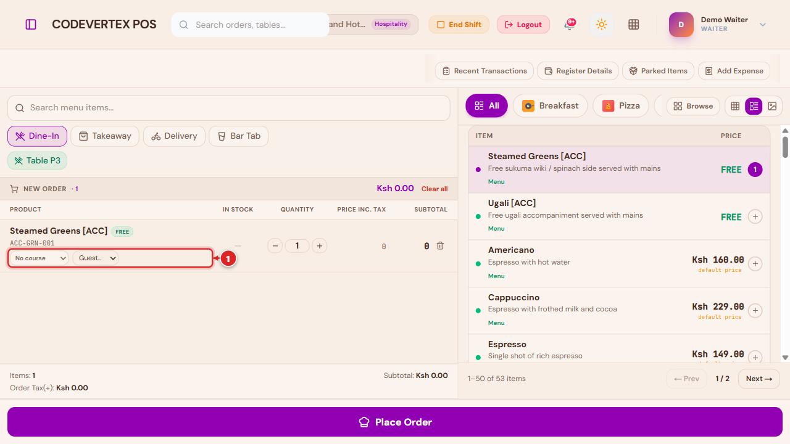
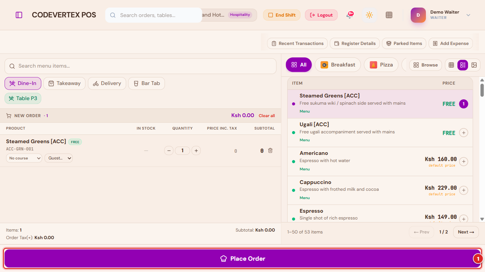
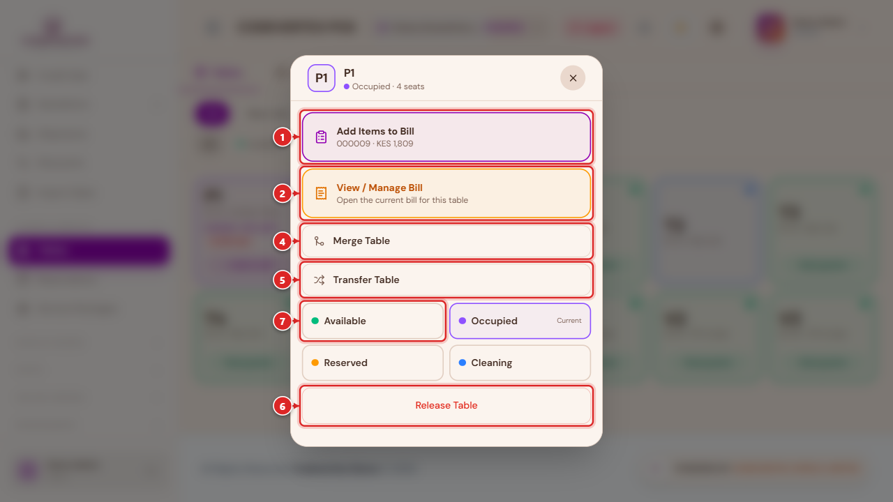
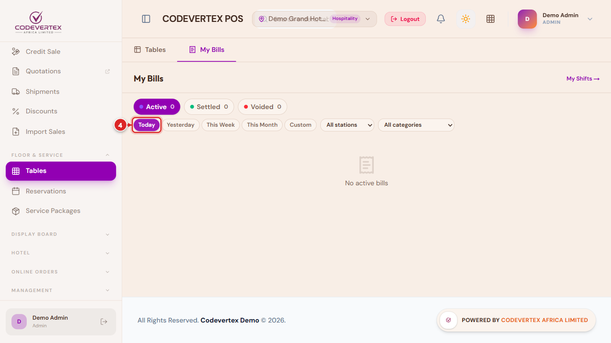
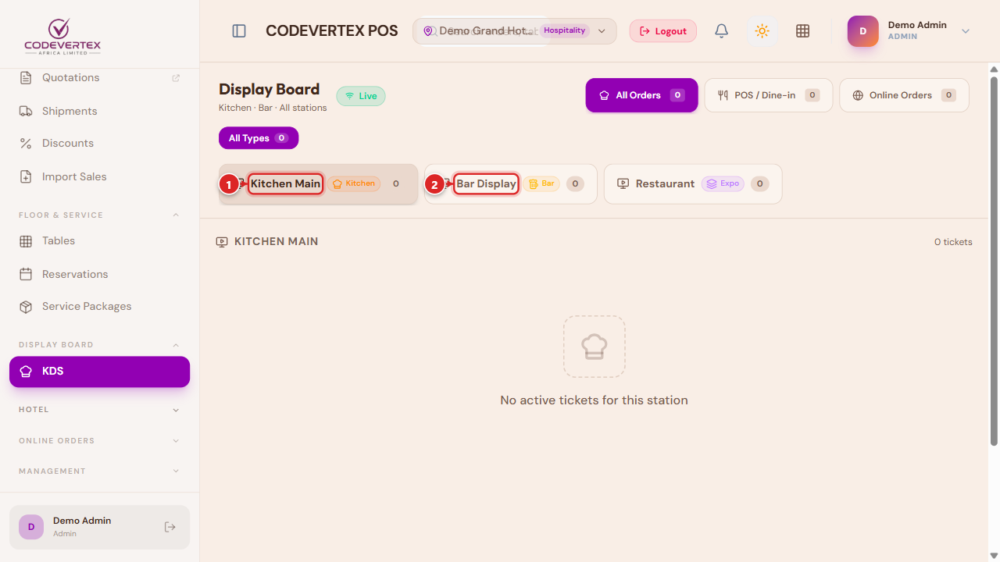
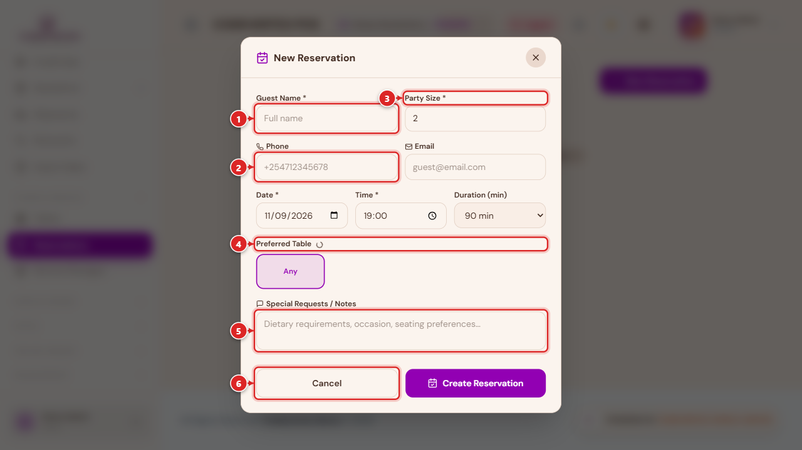
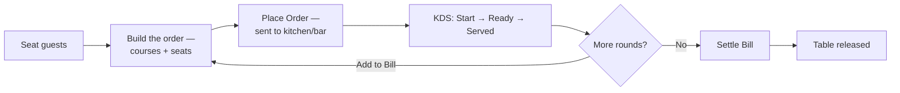

# Hospitality: Tables, Kitchen & Bills

A restaurant, bar, cafe, or hotel-restaurant outlet uses the same terminal and cart covered in
[Selling & Checkout](selling-and-checkout.md) — search, discounts, additional charges, drafts, and
every checkout tender all work the same way. What's different is everything upstream and
downstream of the cart: seating a table, routing items to a kitchen or bar screen course by
course, and settling a bill that may cover several rounds. This page covers that difference end to
end. Every screenshot below comes from "Demo Grand Hotel & Restaurant," a working hospitality demo
outlet, not mockups.

If your outlet takes counter orders only (no tables) — a quick-service or takeaway-style
setup — most of this page won't apply; see [Selling & Checkout](selling-and-checkout.md) instead.

## Tables — the floor plan {: #tables }

> **Direct link:** `https://pos.codevertexafrica.com/{your-tenant-slug}/tables`

**Tables** (sidebar, under **Floor & Service**) is where a host or waiter sees the whole floor at a
glance and starts or manages any table's order:

1. **Tables** — this page.
2. **My Bills** — the other tab, covered [below](#my-bills).
3. **Section filter** — narrows the grid to one physical area (e.g. Main Hall, Outdoor Patio, VIP
   Lounge) — set up under **Settings → Tables**.
4. **Status filter** — Available (green), Occupied (violet), Reserved (amber), or Cleaning (blue).
5. **Seat guests** — starts a new order at an available table (see [below](#seating-guests)).

An occupied table's card shows its order number and running total, plus an **aging badge** once
it's been open a while — the badge's color escalates the longer the table stays occupied past your
outlet's configured threshold (**Settings → Tables → Table Aging**), a quick visual cue for a table
that's been sitting far longer than a normal turn.

## Seating guests and starting an order {: #seating-guests }

Tapping **Seat guests** on an available table asks how many are being seated before anything else:

1. **− / +** — adjust the guest count, capped at the table's own seat capacity.
2. **Back** — cancels, no order started.
3. **Start Order** — opens the terminal with this table already attached.

## The terminal for a table order {: #order-type-and-table }

Landing on the terminal from Seat Guests (or from **+ Add to bill** on an already-occupied table)
shows an **Order Type** row above the cart that a retail till doesn't have:

1. **Order Type** — Dine-In, Takeaway, Delivery, and (where relevant) Room Service or Bar Tab; only
   the types that make sense for your outlet show up. Dine-In is selected by default when you
   arrive from Seat Guests.
2. **Table chip** — the table this order is attached to, carried over from Seat Guests. Choosing
   **Dine-In** without a table attached offers a **Select a table →** link instead.

Everything else on this screen — search, the product grid, Browse, discounts, additional charges —
works exactly as described in [Selling & Checkout](selling-and-checkout.md); it isn't repeated
here.

## Courses and seats {: #courses-and-seats }

Once an item's on the order, two extra controls appear on its cart line:

1. **Course** (left) and **Guest** (right) — two small dropdowns on every cart line. **Course** —
   No course, Starter, Main, Dessert, or Bar. Leaving it as "No course" sends the item to the
   kitchen/bar immediately with everything else; assigning a course lets you hold it back and fire
   it later (see below). **Guest** — which seated guest this item belongs to. Tagging items by
   guest pre-fills **Split Order** later, so splitting the bill by person doesn't mean re-entering
   who ordered what.

### Firing courses

Once a first round has already gone to the kitchen (from **My Bills → Add to Bill**, adding a
second round to a table that's already open), any item with a course assigned beyond "No course"
is held back from the kitchen display until you fire it — a **Fire [Course]** button appears in the
totals footer for each course still waiting. This is what keeps a dessert off the grill before
starters have even gone out. A brand-new order's first round always sends everything at once,
regardless of course — there's nothing to fire yet.

## Sending an order to the kitchen or bar {: #place-order }

A dine-in order doesn't take payment when it's built — it's sent to be prepared first:

**Place Order** replaces the usual tender row for a fresh dine-in order. Tapping it routes each
line to the kitchen/bar station(s) that handle its category (set up under
**Settings → KDS Stations**) and marks the table occupied. The confirmation that follows shows
which station(s) the order went to, offers **Print Bill**, and either signs you out (a shared
till, ready for the next waiter) or leaves you signed in (a dedicated device) — whichever your
outlet's policy is set to.

No money changes hands at this step. Settling the bill happens later, once the table is ready to
pay — see [My Bills](#my-bills) below.

## Managing an open table {: #managing-an-open-table }

Tapping an occupied (or available) table's name opens its action sheet:

1. **Add Items to Bill** — a second (or third) round on the same open order, going straight back
   into the terminal with `+ Add to bill` behavior (courses, seats, and Fire buttons all apply).
2. **View / Manage Bill** — opens the current bill for this table.
3. **Reserve Table** *(available tables only)* — books it ahead; see [Reservations](#reservations).
4. **Merge Table** — combines this table's order with another occupied table's, for a party that's
   spread across two tables.
5. **Transfer Table** — moves this table's whole order to a different available table (an
   **Unmerge Table** option appears instead, for a table whose order came from a merge).
6. **Release Table** — clears the table back to Available. Normally happens automatically once the
   bill is settled; this is the manual override.
7. **Status grid** — set Available, Occupied, Reserved, or Cleaning directly, without going through
   Seat Guests or a payment.

Merge, Transfer, and status changes need table-management rights — a waiter typically manages only
their own tables' day-to-day flow (seating, adding items, settling); see
[Team, Shifts & Cash Management](team-and-administration.md#roles-and-permissions).

## My Bills {: #my-bills }

> A table's tab, or **My Bills** on the Tables page.

A waiter's (or cashier's) own running list of bills — active, settled, and voided:

**Active** / **Settled** / **Voided** switch which bills you're looking at, and the period row below
them — **Today** (highlighted, the default), Yesterday, This Week, This Month, or a custom range,
alongside station and category filters — narrows it further. Each open bill offers
**Add to Bill** (another round), **Settle Bill** (opens the same payment modal used everywhere
else — see [Selling & Checkout → Taking payment](selling-and-checkout.md)), **Split Order**
(per-seat, pre-filled from each line's guest tag, or split evenly/by item), **Print Receipt/Bill**,
and **Void**. Settling releases the table automatically.

## Kitchen & Bar Display (KDS) {: #kds }

> **Direct link:** `https://pos.codevertexafrica.com/{your-tenant-slug}/kds`

Each station configured under **Settings → KDS Stations** (typically one per kitchen line, plus a
bar station and an expo/all-stations view) gets its own ticket queue:

1. **Kitchen Main** — the kitchen line's own queue, filtered to food categories.
2. **Bar Display** — the bar's own queue, filtered to drink categories. Any other configured
   station (e.g. a combined Restaurant/expo view that sees everything) appears as a further tab.

A ticket moves **Start → Ready → Served** as kitchen/bar staff work through it, with a running
timer that changes color the longer a ticket sits unstarted or unfinished — a quick visual cue for
what's falling behind. An admin/manager tool on this page can mark every active ticket served at
once, for a station with no device to bump tickets individually or to clear stale ones.

## Reservations {: #reservations }

> **Direct link:** `https://pos.codevertexafrica.com/{your-tenant-slug}/reservations`

Book a table ahead of time for a guest who hasn't arrived yet:

1. **Guest Name** — required.
2. **Phone** — used to reach the guest to confirm; email is also available but optional.
3. **Party Size** — how many guests.
4. **Preferred Table** — pick a specific table, or leave it as **Any**.
5. **Special Requests / Notes** — dietary needs, an occasion, a seating preference.
6. **Cancel** / **Create Reservation**.

A reservation moves from **Pending** to **Confirmed**, then **Checked-in** once the guest actually
arrives and is seated (or **Cancelled** / **No-show** if plans changed).

## The dine-in order lifecycle

## Roles for a hospitality outlet {: #roles }

A hospitality outlet typically has more specialized roles than a retail till: **Waiter** (seats
guests, builds and settles their own tables' bills), **Kitchen Staff** and **Bar Staff** (KDS
access only, scoped to their own station), and **Receptionist** (front-of-house and, where the
Hotel module is enabled, room-service orders). A trusted waiter can also be granted every other
waiter's tables (sometimes called a "floor supervisor") via **Extra roles** rather than becoming a
full manager. See [Team, Shifts & Cash Management → Roles & Permissions](team-and-administration.md#roles-and-permissions)
for the full matrix.

## Common Issues

**The terminal still shows the retail layout after I switched outlets from the header.** The
terminal picks up your outlet's mode when you sign in. If you switch outlets mid-session from the
header's outlet chip, sign out and back in (or start a fresh PIN session) so the terminal
re-reads the new outlet's settings.

**Add Items to Bill doesn't show Fire Courses even though I assigned courses.** Fire buttons only
appear once a first round is already with the kitchen — assign courses on the FIRST round and
they're sent all together immediately; the course only matters for holding back a LATER round
added via Add to Bill.

**Merge Table / Transfer Table / Release Table aren't in a table's action sheet.** These need
table-management rights, not just table-view — see
[Roles for a hospitality outlet](#roles) above.

**A table's aging badge is red.** It's been occupied longer than your outlet's configured
threshold (**Settings → Tables → Table Aging**) — a prompt to check on the table, not an error.

**Room charges, credit sales to a guest's account, and complimentary rounds** work the same way
here as everywhere else in POS — see
[Payments & Treasury](payments-and-treasury.md#credit-sales-and-customer-accounts) and
[Approvals & Manager Overrides](approvals-and-overrides.md#complimentary-no-charge-payments).
