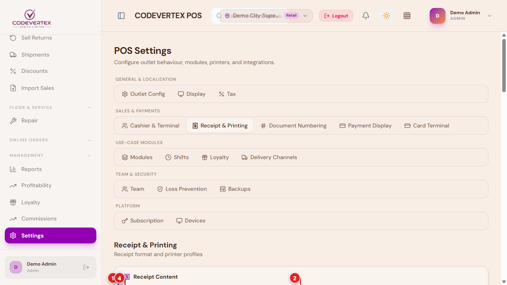
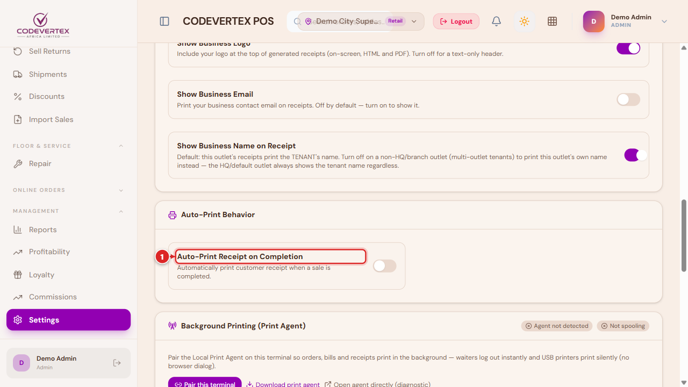
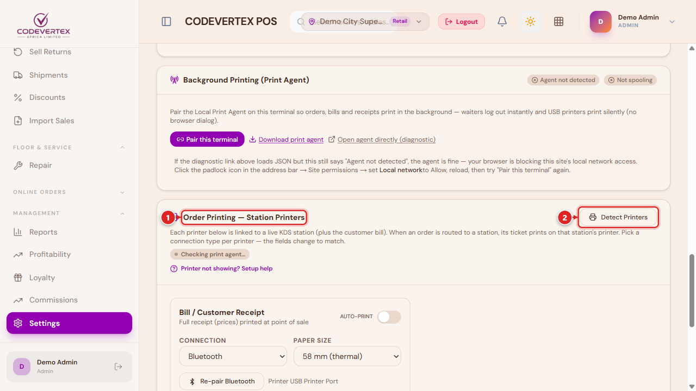
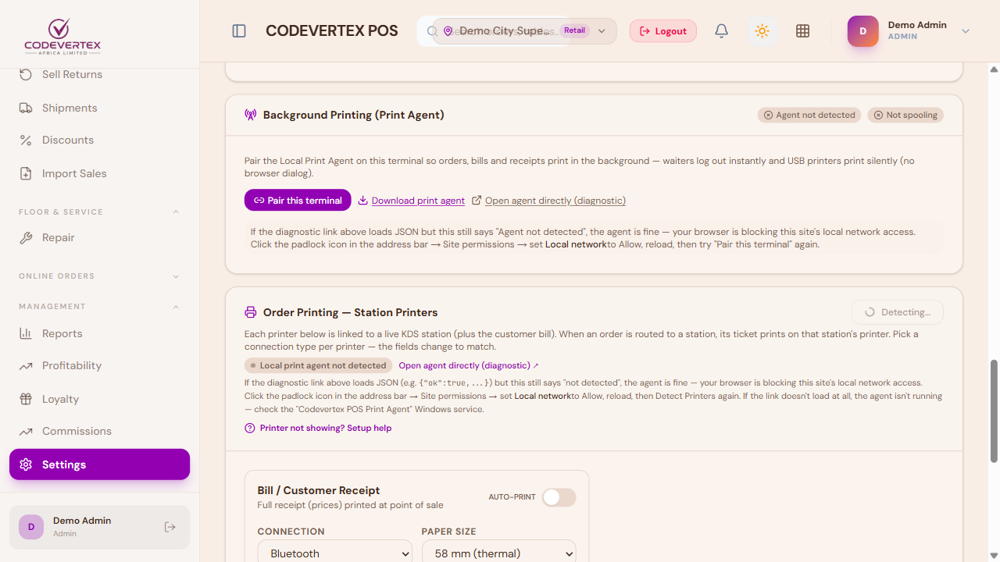
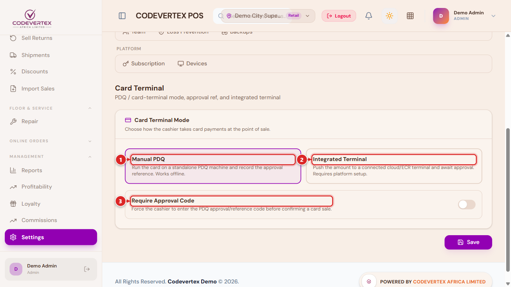
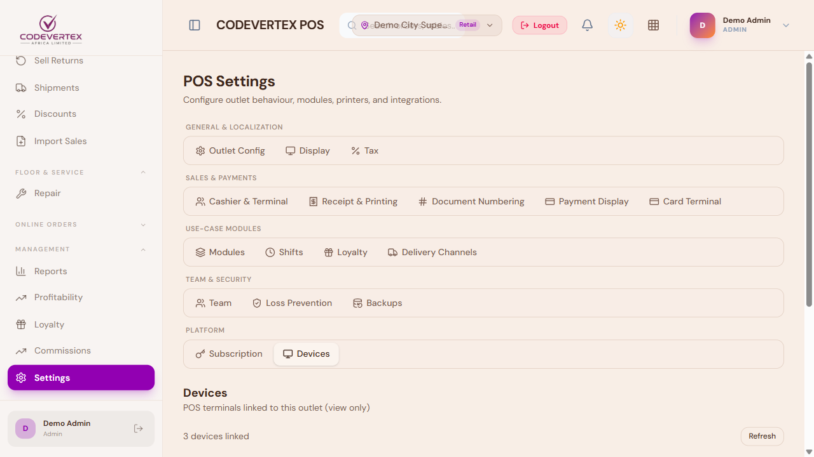

# Receipts & Printing

Everything about what a receipt looks like, and how it actually reaches a printer, lives under
**Settings → Receipt & Printing**. This page also covers the Card Terminal and Devices tabs
alongside it, since all three are part of getting a till physically ready to sell.

> **Direct link:** `https://pos.codevertexafrica.com/{your-tenant-slug}/settings`
> (demo: `https://pos.codevertexafrica.com/codevertex-demo/settings`)

## Receipt content

1. **Header Text** — your business name, address, and any other line you want printed above the
   line items.
2. **Footer Text** — a thank-you message or motto (for example, "IN GOD WE TRUST").
3. **Show Business Logo** — prints your logo at the top of the receipt.
4. **Show Business Email** — off by default; turn on to print your business email as well as
   whatever else your header already shows.

A matching **Show Business Name on Receipt** toggle sits alongside these.

### Auto-print behaviour

1. **Auto-Print Receipt on Completion** — prints automatically the moment a sale finishes, with
   no extra tap needed.
2. **Auto-Print Station Tickets** — for hospitality/quick-service, sends kitchen/bar dockets to
   their station printers automatically when an order is placed.

## Printer profiles

Each till can have its own printer profile — a receipt printer, and (for hospitality/quick-service)
one per kitchen/bar station:

**Detect Printers** scans for printers your device can currently see — over the network, USB, or
already installed in the operating system — and lists them for you to pick from, instead of typing
a name or IP address by hand.

Each profile picks a **Connection** type, and the fields below it change accordingly:

- **OS / QZ Tray** — a printer already installed on this device (needs the free
  [QZ Tray](https://qz.io) helper app running locally). Pick it from the detected list.
- **Network (IP)** — a thermal printer on your local network; enter its **Printer IP** and
  **Port**.
- **USB** / **Bluetooth** — **Pair USB** / **Pair Bluetooth** pairs directly from the browser
  (needs a user gesture — a real click — which is why this is a button, not automatic).

**Test print** on a profile sends a real test docket through exactly that profile's configured
connection — the same path a real sale's receipt or kitchen ticket will use. Test it here after
any change, before trusting it on the floor.

## Background printing (the Print Agent)

For a shared till with no printer directly attached to the browser's device, install the
**Local Print Agent** — a small background app that connects to your printers and prints jobs
this device sends it, over your local network:

**Pair this terminal** links this browser session to a running agent. Once paired, the status
here shows the agent's version and whether it's actively spooling jobs — useful for confirming a
printer problem is on the agent/hardware side rather than the browser's.

If a print can't reach any configured printer or agent, the browser falls back to opening its own
print dialog automatically, so a receipt is never simply lost — a cashier can still print (or save
as PDF) through the browser itself.

## Card Terminal

1. **Manual PDQ** — a standalone card machine the cashier swipes independently; the till just
   records the reference afterward (this is the **Card (PDQ)** tender at checkout).
2. **Integrated Terminal** — a supported payment-terminal provider connected directly, so card
   payments settle through the platform itself rather than a manual reference.
3. **Require Approval Code** — asks for the card terminal's own printed approval code before the
   till accepts the payment as confirmed.

## Devices

**Devices** lists the POS terminals already linked to this outlet — a read-only view (devices are
provisioned automatically, not added here by hand):

## Common Issues

**Detect Printers finds nothing, or shows "agent not detected"/"Local print agent not
detected."** The app tells you exactly what to check:

If the diagnostic link still says "not detected" even though it loads something, the agent itself
is fine — your browser is blocking this site's access to your local network. Click the padlock
icon in the address bar → Site permissions → set **Local network** to Allow, reload the page, then
try **Detect Printers** (or **Pair this terminal**) again. If the diagnostic link doesn't load at
all, the Print Agent isn't running — check the "Codevertex POS Print Agent" Windows service. For a
network printer specifically, also confirm it's powered on and on the same network as this device.

**Test Print works, but real sales don't print.** Test Print always uses the profile's
**currently displayed** settings, even if they haven't been saved yet — live sales use the
**last saved** configuration. If you changed a printer's name or IP, click **Save** before relying
on it, not just Test Print.

**A receipt didn't print, and nothing obviously went wrong.** The browser's own print dialog
should have opened as a fallback — check for it (it can appear behind the main window). If it
didn't, use the sale's own **Print** / **Print Receipt** action to try again; see
[Selling & Checkout](selling-and-checkout.md#recent-transactions).

**Kitchen/bar tickets aren't printing, but the receipt printer works fine.** These are separate
printer profiles — confirm the specific station's profile (not just the receipt printer) is
configured and has passed its own Test Print.
