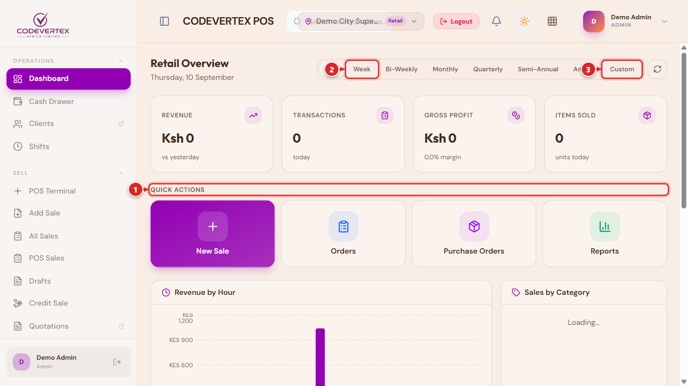
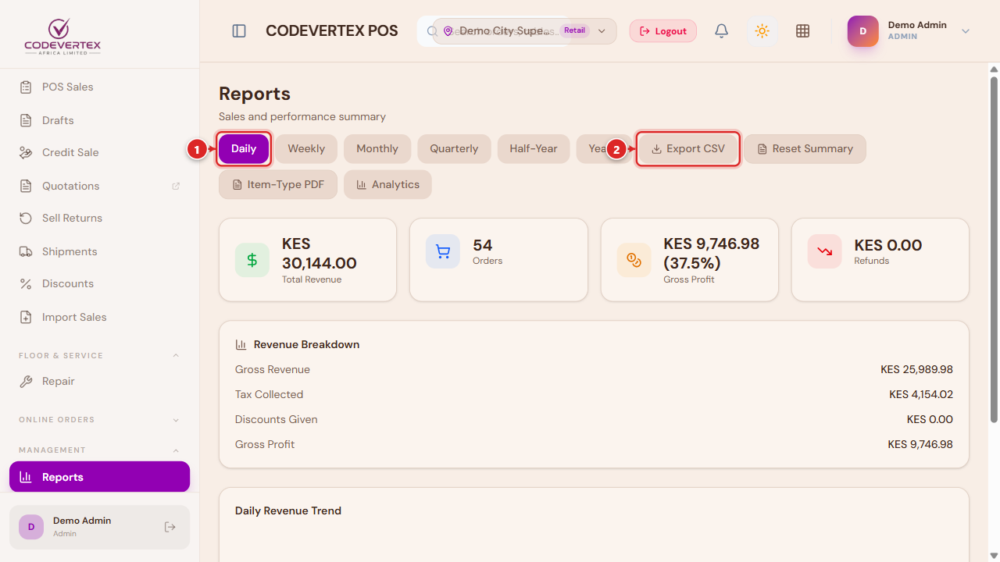

# Reports & Dashboard

## Dashboard

> **Direct link:** `https://pos.codevertexafrica.com/{your-tenant-slug}/dashboard`

The dashboard adapts to your role: an admin or manager sees outlet-wide KPIs and a date-range
filter, while a cashier's dashboard focuses on their own shift instead (and a plain cashier lands
straight on the till or their open bills rather than the dashboard at all — see
[Selling & Checkout](selling-and-checkout.md)).

1. **Quick Actions** — the workflows you use most (New Order, Reports, Cash Drawer, and others
   depending on your outlet's use case), one tap away.
2. **Range presets** — Day, Week, Bi-Weekly, Monthly, Quarterly, Semi-Annual, Annual.
3. **Custom** — pick your own date range.

The dashboard's own charts (revenue trend, category breakdown, top items) are a thin view over the
exact same numbers as the **Reports** pages below — a chart here can never disagree with the
matching report, since both read the same underlying data.

## Reports

> **Direct link:** `https://pos.codevertexafrica.com/{your-tenant-slug}/reports`

The landing page summarizes sales by your chosen granularity (Daily through Yearly) with
**Export CSV** and PDF options. From here, dedicated pages cover:

- **Sales Analytics** — a free date-range view (not locked to the fixed granularities above),
  broken down by Staff, Hour, Category, Register, Products & Brands, Payment Methods, Product
  Mix, or Voids.
- **End-of-Day Reports** — a per-day register summary for the current month.
- **Profitability** — revenue, cost, and gross profit over a chosen range.
- **Tax Report** — VAT collected by tax type over a period (Today, Last 7 days, This month), for
  KRA eTIMS compliance and filing.
- **Shift Reports**, **Returns & Refunds**, and **Stock Consumption** round out the set, each
  scoped to its own topic.

For invoicing, customer statements, and full financial statements (Profit & Loss, Cash Flow), see
the [Treasury guide](../treasury/index.md) — POS's own reports focus on till activity, not overall
business financials.

## Common Issues

**A report and the Dashboard chart for the same period show different numbers.** They read the
same underlying data, so a mismatch almost always means the date ranges aren't actually the same —
double-check both are set to the identical period before assuming a discrepancy.

**Export CSV / PDF returns an empty or unexpected file.** Confirm a result actually loaded on
screen for the current filters first — exporting works from whatever's currently displayed, not a
separate fetch of "everything."
