# Selling & Checkout

This guide walks through the POS Terminal — the screen a cashier spends most of the day in — for
a retail till. Hospitality, pharmacy, quick-service, and services outlets share the same
underlying terminal and cart, with a few workflow differences (tables and course firing for
hospitality, a prescription step for pharmacy); this page focuses on what every outlet type has
in common.

## Opening the terminal

> **Direct link:** `https://pos.codevertexafrica.com/{your-tenant-slug}/order`
> (demo: `https://pos.codevertexafrica.com/codevertex-demo/order`)

**POS Terminal** in the sidebar (under **Sell**) opens straight into the till. The top strip is a
row of quick actions, and everything below it is the order builder: search and customer on the
left, the cart and totals below that, and the product grid on the right.

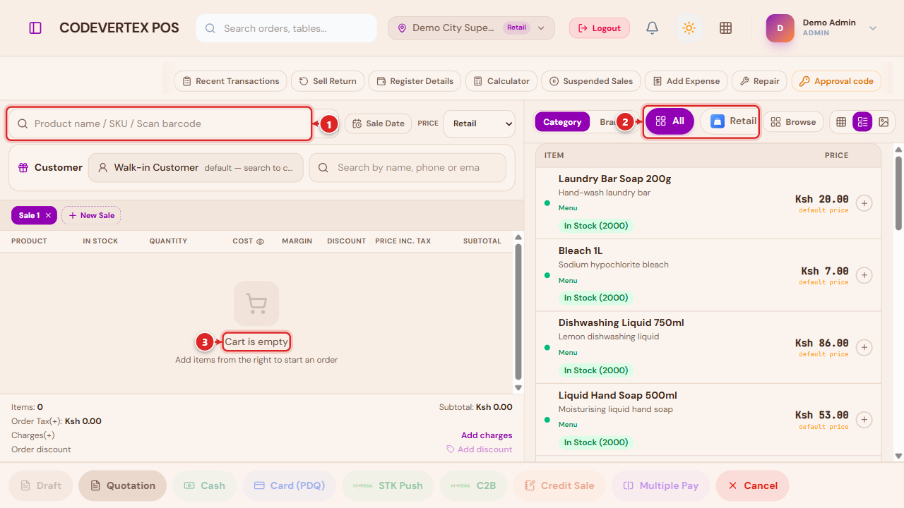

1. **Search** — type a name, SKU, or scan a barcode. Scanning with a handheld or camera scanner
   works the same as typing; the field auto-focuses so a scan lands here from anywhere on the
   screen.
2. **Category / Brands tabs** — filter the product grid on the right. **All** clears any filter.
3. **Cart** — starts empty. Adding an item from the grid (click, or scan) adds it here.

### Quick-action toolbar

Every action on this strip opens without leaving the sale you're in the middle of building.

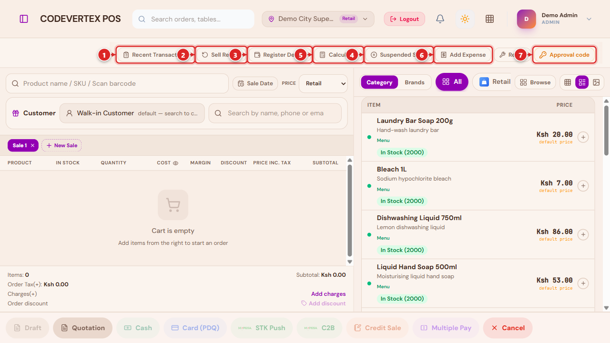

1. **Recent Transactions** — the last completed sales, quotations, and drafts, without leaving
   the terminal (see [below](#recent-transactions)).
2. **Sell Return** — start a return against a past sale by invoice/order number (see
   [Returns](#returns)).
3. **Register Details** — a live shift summary: payment-method breakdown, sales/refund/expense
   totals, and everything sold so far this shift (see [below](#register-details)).
4. **Suspended Sales** — resume a sale that was parked mid-transaction (see [below](#suspended-sales)).
5. **Calculator** — a quick on-screen calculator, for change or quantity math without leaving the
   till (see [below](#calculator)).
6. **Add Expense** — record a small till-side expense (e.g. paying a delivery rider from the
   drawer) directly to your books (see [below](#add-expense)).
7. **Approval code** — a manager's tool for pre-authorizing a discount, price override, order
   adjustment, or out-of-stock override remotely. Covered in full in
   [Approvals & Manager Overrides](approvals-and-overrides.md).

Two more buttons round out the row depending on your outlet and role: **Repair** (retail/services,
opens the repair-intake board) and **Open Drawer** (roles that handle cash — pops the physical
drawer without ringing up a sale).

### Browse — the category/brand picker

**Browse**, next to the Category/Brands toggle above the product grid, opens a full-screen picker
— useful on a touch screen, or when there are more categories than fit in the tab strip:

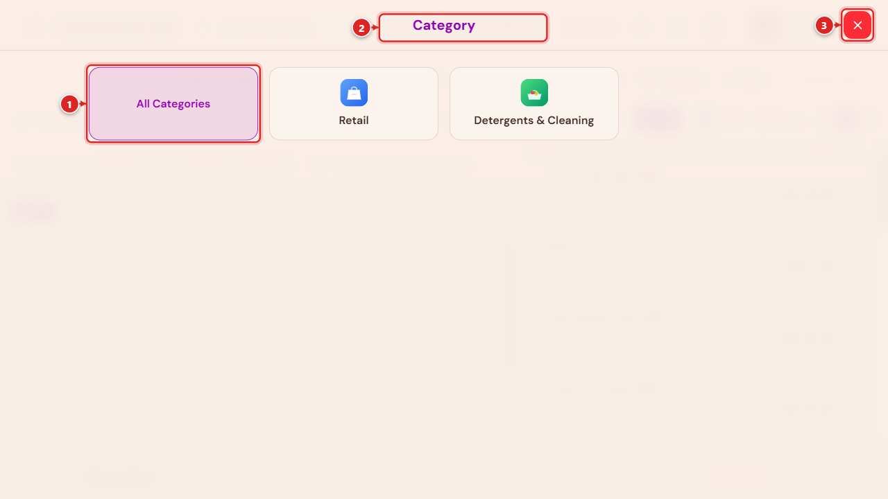

1. **All Categories** — clears the filter.
2. Any category tile — filters the product grid to it, and closes the picker automatically.
3. **Close** (✕) — dismiss without changing the filter.

The same picker shows brands instead when the **Brands** tab (next to Category, above the grid)
is active.

### Sale Date — backdating a sale at entry {: #sale-date }

Admins and managers get a **Sale Date** button next to the search bar for entering a sale under an
earlier date — a missed sale being caught up, or a recovery after being offline. Pick a date and
it applies to the sale you're about to ring up; it resets to today automatically afterward, so it
never silently carries over to the next customer.

A backdated sale shows its entered date everywhere — receipts, All Sales, reports — alongside a
small note of the real date/time it was actually rung up, so the true activity timestamp is never
hidden. This is a proactive, at-entry alternative to correcting a sale's date after the fact
(an admin-only tool on All Sales, for a sale that was already rung up under the wrong date).

## Attaching a customer {: #attaching-a-customer }

Every sale starts as **Walk-in Customer** — nobody's name is captured unless you attach one. To
put a real customer's details on the sale (so their name shows on the receipt, and their purchase
history/loyalty points/account balance are tracked), search for them right from the terminal:

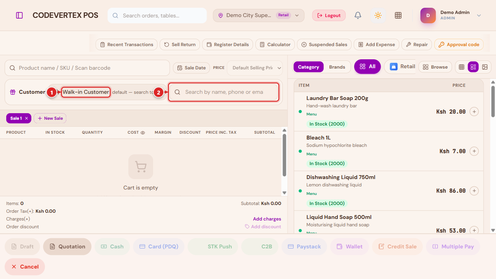

1. **Walk-in Customer** — the default. Nothing to do here if the sale genuinely has no named
   customer.
2. **Search by name, phone or email** — start typing; matches from your customer list appear as
   you type. Tap one to attach it — its name, phone/email, and (if they have one) their account
   balance and loyalty points show in place of the search field.

### Adding someone who isn't in the system yet

If nothing matches, a prompt to add them appears automatically — no separate "New Customer" page
to go find:

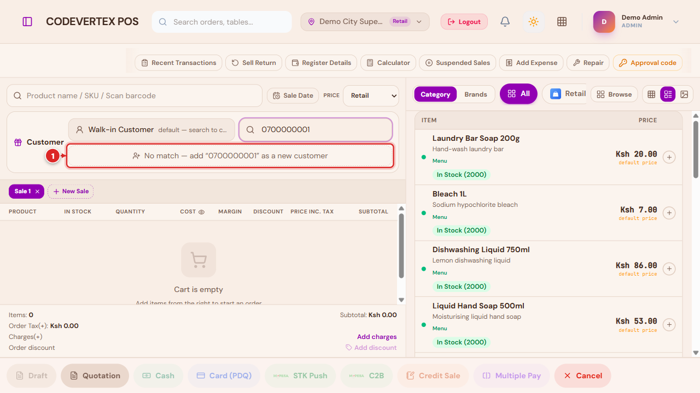

Tapping it opens a short inline form, pre-filled with whatever you already typed (a phone number
you searched by lands straight in the Phone field, for example):

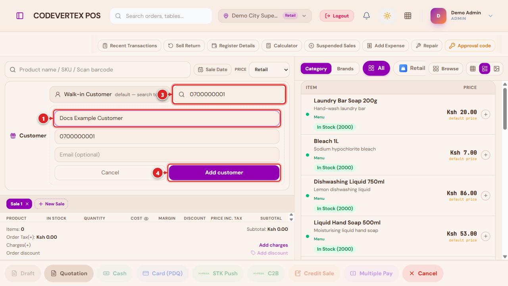

1. **Customer name** — required.
2. **Phone** — required (used to look them up next time, and to key their account/loyalty
   record).
3. **Email** — optional.
4. **Add customer** — saves them and attaches them to the current sale in one step. They're now
   searchable by name, phone, or email on every future sale, and their purchase history builds up
   from here.

### What shows on the receipt

A sale with a customer attached prints their **name** on the receipt. If no customer was attached
but the sale was paid through an online method (M-Pesa STK, card, Paystack), the receipt shows
who **paid** instead (the payer's name or phone, labelled "Paid by") — otherwise it simply reads
"Walk-in customer." Attaching a real customer is the only way to guarantee their name (rather
than just a phone number, or nothing at all) appears on the printed receipt.

## Building a sale

Click (or scan) any product in the grid to add it to the cart. Adding the same item again
increases its quantity instead of creating a second line.

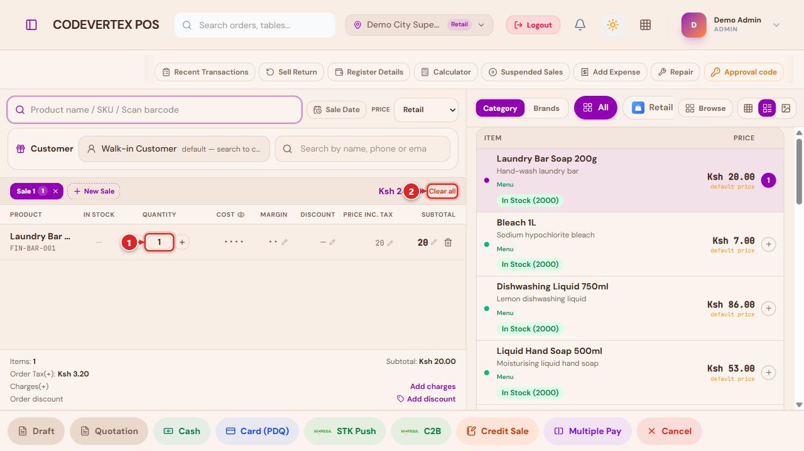

- **Quantity** — the **−** / **+** buttons, or type directly into the number field.
- **Cost / Margin** — visible only to roles with cost-viewing permission (managers/admins by
  default); a masked eye icon hides them from a screen a customer might see.
- **In Stock** — the balance left after this sale, updating live as you change quantity. It turns
  red as stock runs low, and adding more than what's on hand asks for a manager override (see
  [Approvals & Manager Overrides](approvals-and-overrides.md#out-of-stock-overrides)) rather than
  silently overselling.
- **Margin / Discount / Price inc. tax** — each has its own small pencil. A manager or admin (or a
  cashier your organisation has explicitly granted price/discount rights to) can edit any of them
  directly on the row:

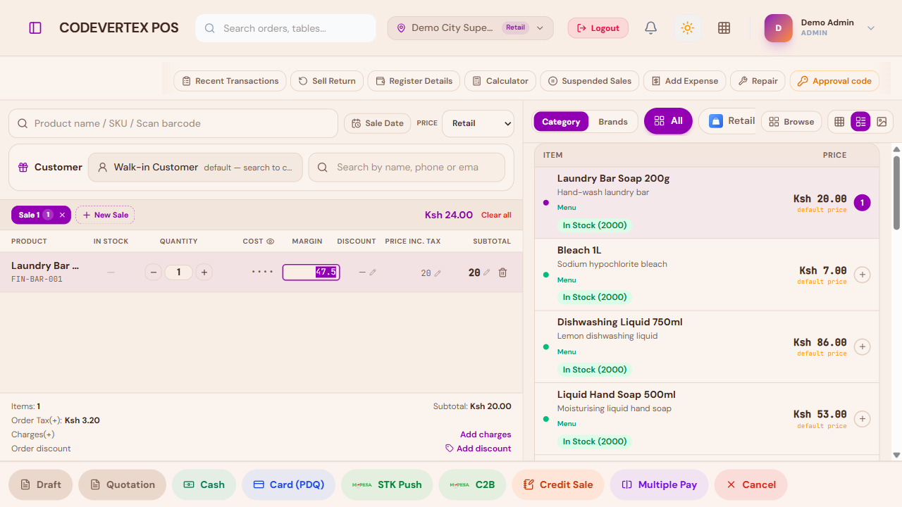

Selling below the catalog price is still allowed for a restricted role — it just asks a manager to
approve it at checkout instead of blocking the edit outright; see
[Approvals & Manager Overrides](approvals-and-overrides.md).

### Discounts

**Add discount**, in the totals footer, applies a discount to the whole sale (the per-line
pencils above are for one line only). Three ways to discount:

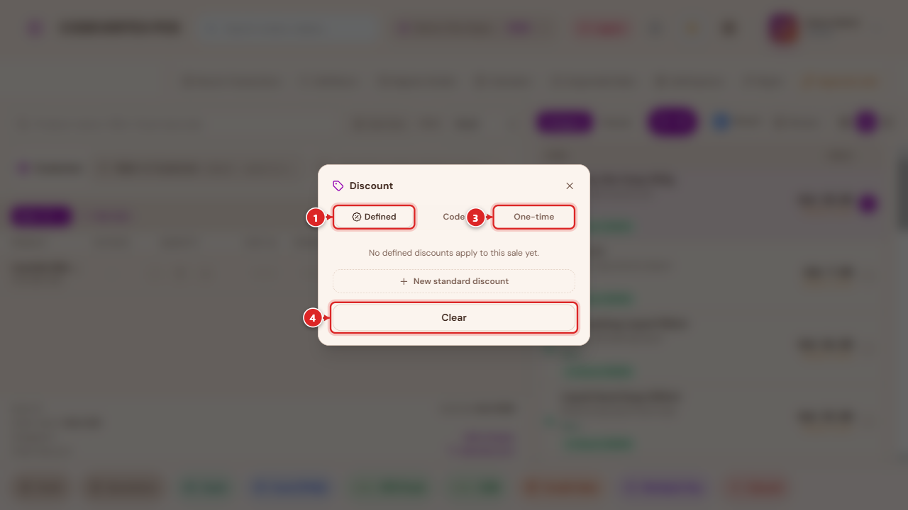

1. **Defined** — pick from your organisation's active discounts and promotions (set up under
   **Sell → Discounts**; see
   [Team, Shifts & Cash Management](team-and-administration.md#discounts-and-promotions)).
2. **Code** — type or scan a promo code, checked against this sale's actual items (schedule,
   item/category scope, and buy-one-get-one rules all apply).
3. **One-time** — a manual percentage or fixed amount for this sale only, with a reason.
4. **Clear** — removes any discount currently applied.

A discount beyond what your role is allowed to give on its own asks for manager approval before
it's applied — see [Approvals & Manager Overrides](approvals-and-overrides.md).

### Additional charges

**Add charges**, next to Add discount, adds packaging, service, or shipping/delivery on top of
the sale:

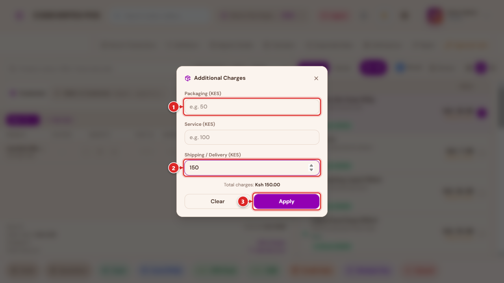

Leave a field blank (or zero) to skip that charge. **Apply** adds the total to the sale; **Clear**
removes all three.

### Multiple sales at once (Sale tabs)

On a retail till, a slow M-Pesa payer doesn't have to block the next customer. **+ New Sale**
opens a second, completely independent cart — switch between tabs, and each keeps its own items,
customer, and discount until it's paid or closed.

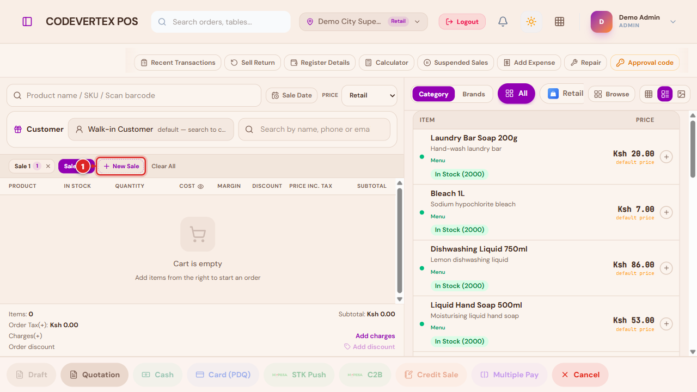

Closing a tab that still has items offers to save it to **Drafts** first, so nothing is lost by
accident.

### Recent Transactions {: #recent-transactions }

A quick lookup of recent activity without leaving the terminal:

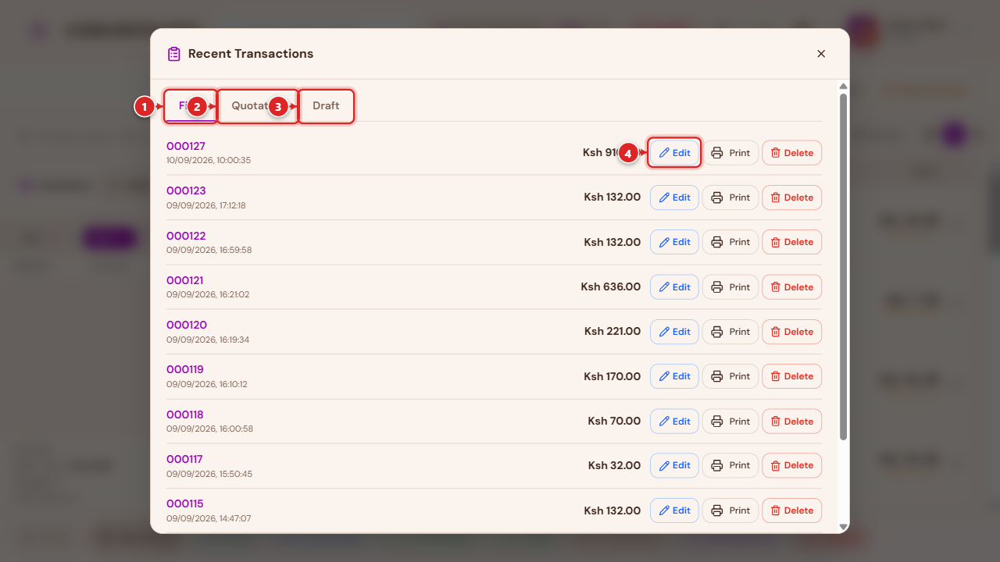

1. **Final** — completed, refunded, and voided sales.
2. **Quotation** — quotations, expandable to their line items, with **Send / Accept → Invoice /
   Decline / Cancel** actions for a manager.
3. **Draft** — sales saved without completing payment (see [Drafts](#drafts-held-sales) below) —
   and, less commonly, any order still genuinely open or awaiting payment.
4. **Edit** — a draft reopens on Add Sale; anything else opens its own order page.

Each row also has **Print** and **Delete** (voids the sale — this may itself ask for manager
approval).

### Returns {: #returns }

**Sell Return**, on the toolbar, starts a return by invoice/order number:

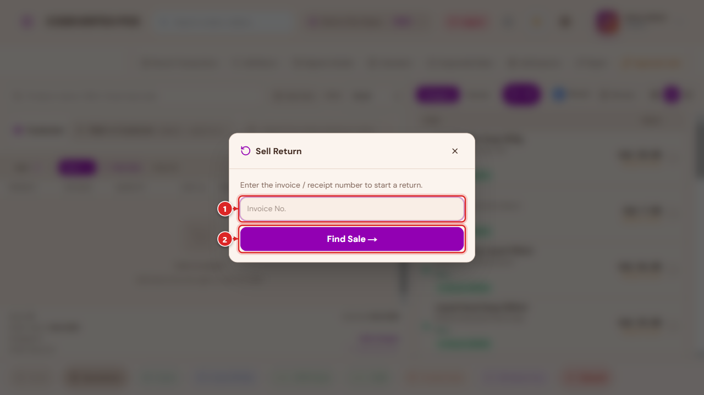

A return goes through three steps before money or stock moves:

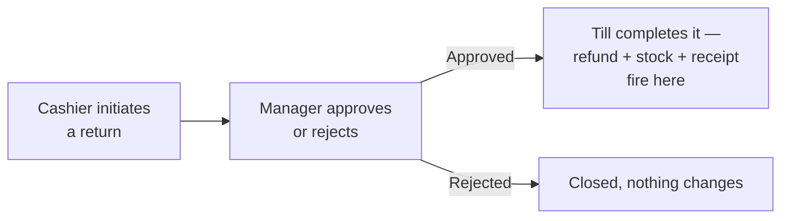
```mermaid
flowchart LR
    A[Cashier initiates\na return] --> B[Manager approves\nor rejects]
    B -- Approved --> C[Till completes it —\nrefund + stock + receipt\nfire here]
    B -- Rejected --> D[Closed, nothing changes]
```

An approved-but-not-yet-completed return is a real, visible state — it means a manager has signed
off, but the refund hasn't actually been paid out or the item put back into stock yet.
**Complete**, on the return's own page, is what actually does that.

### Register Details {: #register-details }

A live report for the current shift (from when it opened through now):

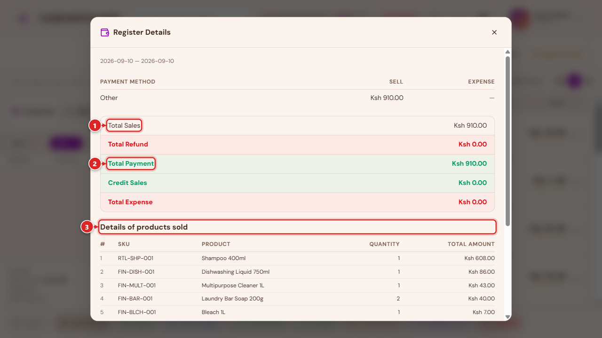

1. **Total Sales** — the shift's gross sales, before refunds.
2. **Total Payment** — what was actually collected, net of refunds, alongside **Credit Sales** and
   **Total Expense**.
3. **Details of products sold** — every item sold this shift, and (further down) the same broken
   out by brand.

### Suspended Sales {: #suspended-sales }

Sales parked mid-transaction, ready to resume and take payment:

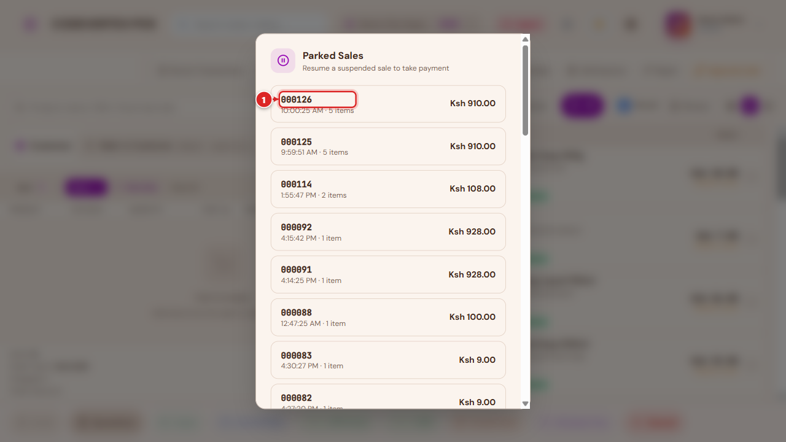

Tap any row to resume it exactly where it was left off. Resuming a parked sale is its own
permission your organisation can restrict per role — see
[Team, Shifts & Cash Management](team-and-administration.md#roles-and-permissions).

### Calculator {: #calculator }

A small on-screen calculator for change or quantity math, without leaving the till:

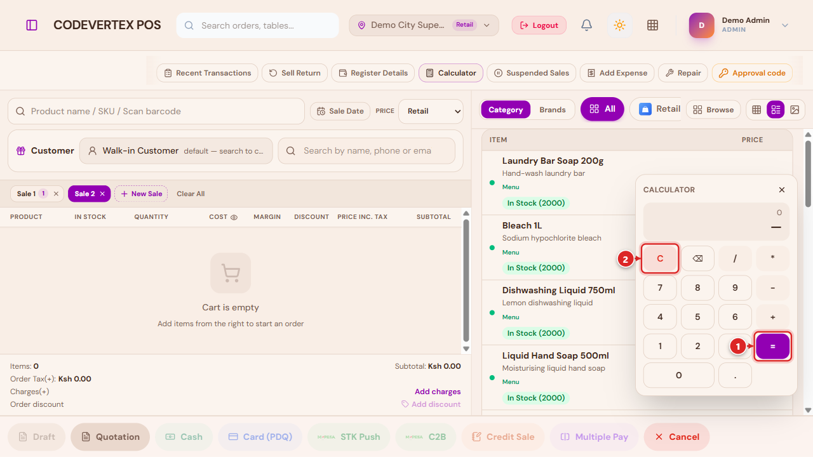

Supports the physical keyboard too — digits and operators type directly, Enter/`=` evaluates,
Backspace deletes, and Escape closes it.

### Add Expense {: #add-expense }

Records a small expense straight to your books — paying a delivery rider from the till drawer, for
example — without a trip to Treasury:

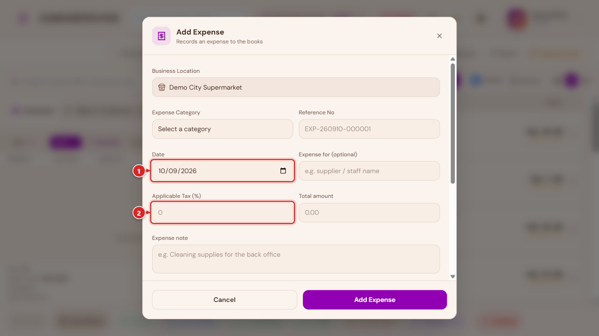

Category, reference number, date, tax, total, and a note; a payment block below records how it was
paid. This posts directly to Treasury — see
[Payments & Treasury](payments-and-treasury.md#till-side-expenses).

### Drafts (held sales) {: #drafts-held-sales }

A sale saved without completing payment — from a Sale tab, or the **Draft** button in the payment
row — lands in **Drafts**, searchable by draft/order number, customer, date, or who created it.

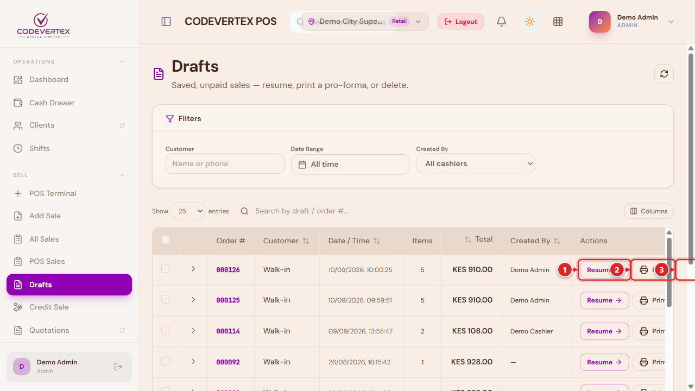

1. **Resume** — reopens the sale exactly where it was left off, on any till. Adding, removing, or
   adjusting an item after resuming always saves onto that same draft, however many changes you
   make — it never creates a separate replacement sale or leaves an orphaned copy behind.
2. **Print** — a pro-forma/quotation-style document (a draft has no payment yet, so this isn't a
   receipt).
3. **Delete** — removes the draft.

A draft never affects stock or appears in reports until it's actually completed and paid, and
never shows up in **All Sales** — that list is completed activity only, by design; look in
**Drafts** (or **Recent Transactions**' own Draft tab, from the terminal) for anything still
unpaid.

Whether a cashier sees **Resume** and **Delete** at all on this page — versus only a manager — is
a per-outlet setting your admin controls; see
[Team, Shifts & Cash Management](team-and-administration.md#roles-and-permissions).

## Taking payment

The payment row along the bottom of the terminal shows every tender your outlet has configured,
alongside **Draft**, **Quotation** (manager-gated, saves the sale as a formal quotation instead of
a till sale), and **Cancel**:

- **Cash** — enter the amount tendered; change is calculated automatically.
- **Card (PDQ)** — for a standalone card terminal that's already approved the swipe; this just
  records the reference.
- **M-Pesa Code** — the cashier types in a reference code the customer read out, for a till/paybill
  payment made outside the platform's own checkout.
- **STK Push** / **C2B** — M-Pesa handled through the platform itself: STK Push prompts the
  customer's phone directly; C2B matches a payment the customer already sent to your till number.
- **Credit Sale** (On Account) — bills the sale to a customer's account instead of collecting cash
  now. See [Payments & Treasury](payments-and-treasury.md#credit-sales-and-customer-accounts) for
  how this is tracked and settled later.
- **Multiple Pay** — splits one bill across more than one tender or more than one guest (part
  cash, part card; or itemised per person).
- **Apply Credit** and **Redeem Points** appear automatically when the attached customer has store
  credit or loyalty points available to use against this sale.
- **Room** (hospitality) — charges the sale to a guest's room folio.

Whichever tender is used, a successful payment prints (or offers to print) a receipt and, for a
credit sale, updates the customer's account balance — see
[Receipts & Printing](receipts-and-printing.md) and
[Payments & Treasury](payments-and-treasury.md).

## Common Issues

**How do I add customer details so they show on the receipt?** Search for them (or add them if
they're new) from the **Customer** field near the top of the terminal — see
[Attaching a customer](#attaching-a-customer) above. A sale with nobody attached prints as
"Walk-in customer" (or "Paid by" whoever settled it online), never a blank.

**Adding one more of an item that's already in the cart shows a manager-approval prompt instead
of just increasing the quantity.** You're trying to sell more than the outlet currently has on
hand — this is the out-of-stock guard, not a bug. A manager (or, if your role has been granted the
self-approve permission, you) can confirm the oversell; see
[Approvals & Manager Overrides](approvals-and-overrides.md#out-of-stock-overrides).

**A discount larger than usual won't apply, and a PIN/scan/code prompt appears instead.** Your
role's discount limit has been exceeded — this needs a manager's approval, the same three ways
described in [Approvals & Manager Overrides](approvals-and-overrides.md).

**Closed a Sale tab and now the items are gone.** If the tab had items, closing it should have
offered **Save to Drafts** first — check [Drafts](#drafts-held-sales) for it under its customer and
timestamp. If **Discard** was chosen instead, it's gone by design; a discarded draft can't be
recovered.

**A completed sale doesn't show a way to print a receipt.** Reprinting a completed sale's receipt
is done from **Recent Transactions**, **All Sales**, or **POS Sales**, not the terminal itself —
find the sale there and use its **Print** / **Print Receipt** action. See
[Receipts & Printing](receipts-and-printing.md).
