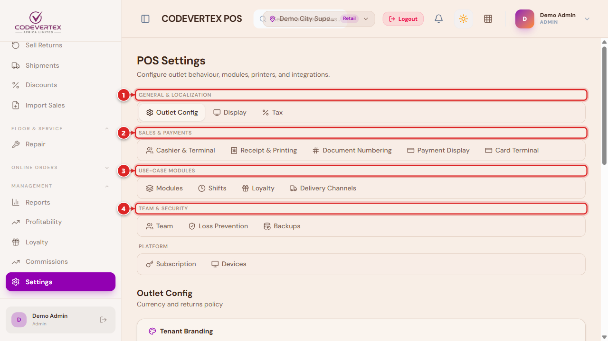
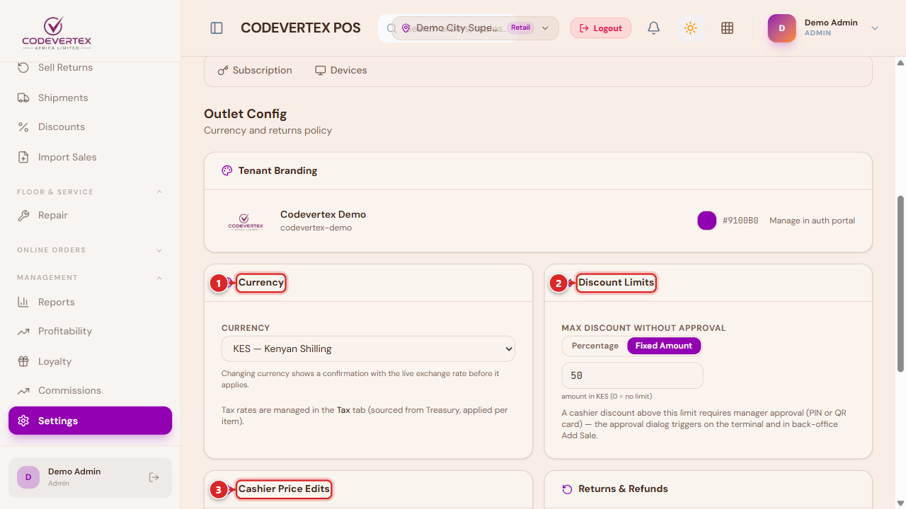
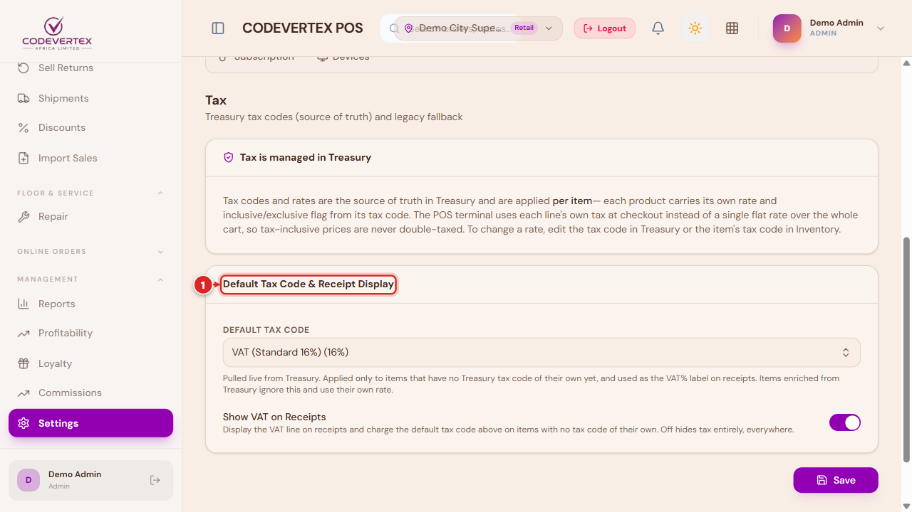
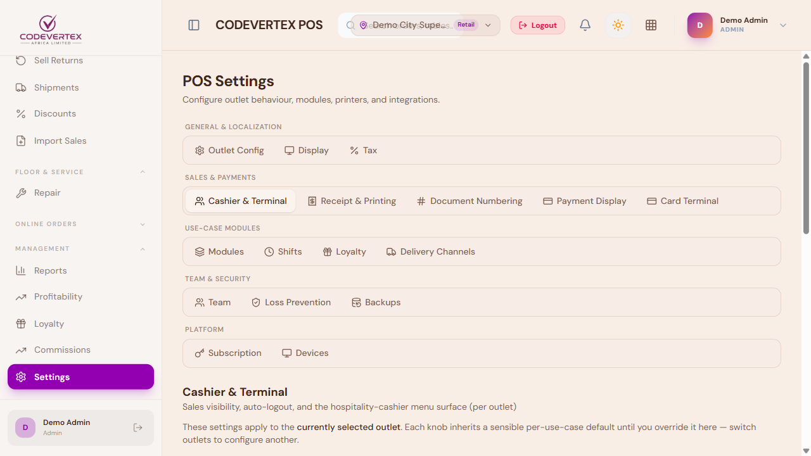
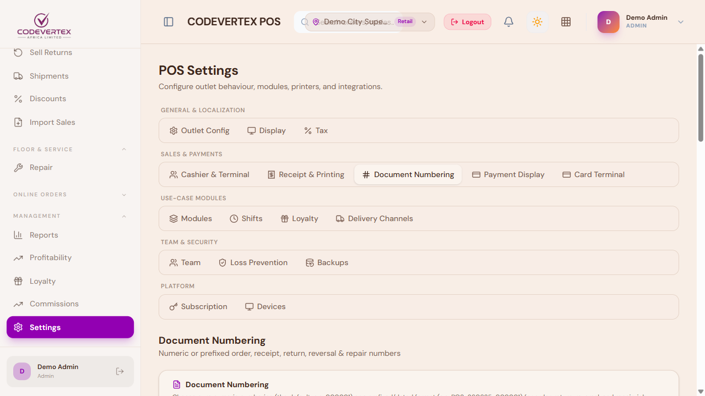
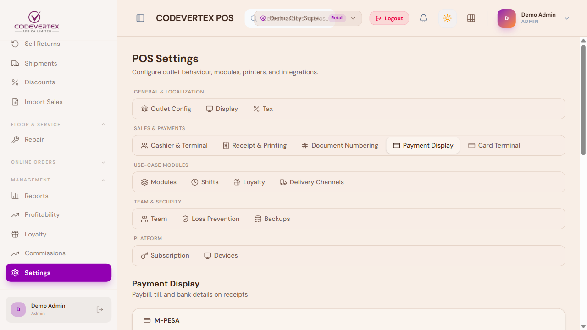
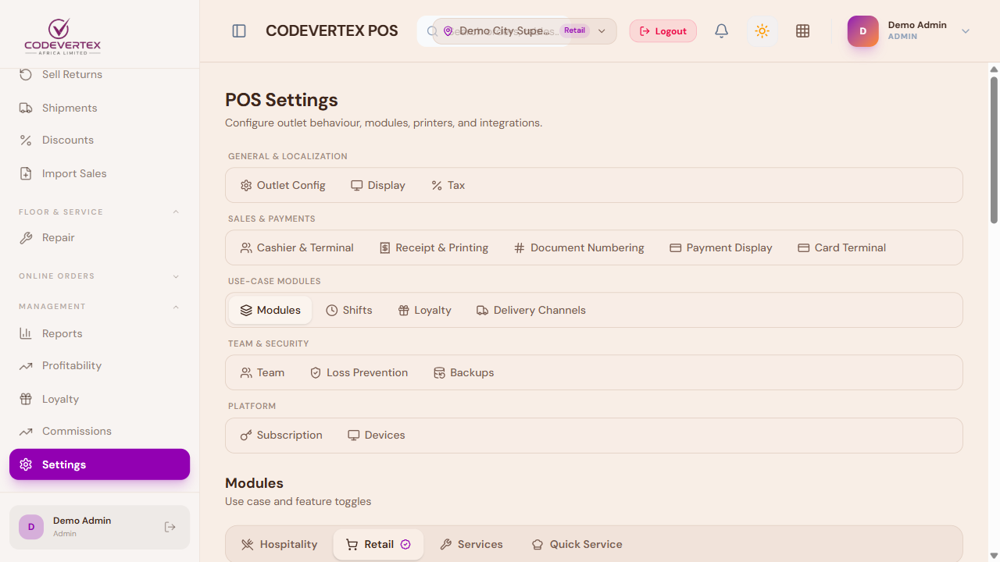

# Settings & Configuration

**Settings** (sidebar) is where a manager or tenant admin configures how a POS outlet behaves.
Every tab lives on one page, grouped by topic:

> **Direct link:** `https://pos.codevertexafrica.com/{your-tenant-slug}/settings`
> (demo: `https://pos.codevertexafrica.com/codevertex-demo/settings`)

1. **General & Localization** — Outlet Config, Display, Tax.
2. **Sales & Payments** — Cashier & Terminal, Receipt & Printing, Document Numbering, Payment
   Display, Card Terminal.
3. **Use-Case Modules** — Modules, Shifts, KDS Stations, Tables, Loyalty, Delivery Channels,
   Booking Policy — only the ones relevant to your outlet's use case show up.
4. **Team & Security** — Team, Loss Prevention, Backups.

Receipt & Printing has its own dedicated guide — see
[Receipts & Printing](receipts-and-printing.md) — and Team is covered in
[Team, Shifts & Cash Management](team-and-administration.md). This page covers the rest.

## Outlet Config (General)

1. **Currency** — changing it shows a confirmation with the live exchange rate before it applies.
   Tax itself is managed in the **Tax** tab, sourced from Treasury.
2. **Discount Limits** — **Max discount without approval**, as a percentage or a fixed amount. A
   cashier discount above this needs manager approval (PIN, QR card, or a shared one-time code) —
   see [Approvals & Manager Overrides](approvals-and-overrides.md).
3. **Cashier Price Edits** — two independent toggles: whether cashiers may sell **above** the
   catalog price freely (an up-sell), and whether selling **below** it needs manager approval.

A fourth card, **Returns & Refunds**, appears alongside these when relevant — a return window (in
days), and whether a return against an unpaid credit sale is restricted to reducing the customer's
credit balance rather than handing out cash (recommended, and on by default).

## Tax

Tax codes and rates are the source of truth in Treasury, applied **per item** — each product
carries its own rate from its own tax code, so the till uses each line's actual tax at checkout
rather than one flat rate over the whole cart.

1. **Default Tax Code** — applied only to items that don't have a Treasury tax code of their own
   yet, and used as the VAT% label on receipts.
2. **Show VAT on Receipts** — prints the VAT line and charges the default code on items with no
   tax code of their own. Off hides tax entirely, everywhere.

To change a rate, edit the tax code in Treasury, or the item's own tax code in Inventory.

## Cashier & Terminal

Per-outlet policy for how the till behaves for non-manager staff: whose sales a cashier can see
(their own, or the whole outlet's), whether they're logged out automatically after each sale, and
whether their terminal shows the full till or a simplified bills-only surface (a hospitality
outlet's Tables/My Bills view — see
[Hospitality: Tables, Kitchen & Bills](hospitality-tables-and-kitchen.md)). Sensible defaults
apply automatically based on your outlet's use case (hospitality, retail, quick-service, and so
on) — only change these if your organisation genuinely works differently.

## Document Numbering

Controls whether orders, returns, and other documents number sequentially (e.g. `000127`) or with
a prefix. The order number and the printed receipt number are always the same number — there's no
separate receipt sequence to configure.

## Payment Display

The paybill/till numbers and bank account details printed on a receipt under "How to pay" —
independent of which payment gateways are actually wired up for checkout, this is purely what's
shown to a customer who wants to pay you directly.

## Modules

Turns whole feature areas on or off for this outlet — Tables, KDS (kitchen display), Loyalty,
Delivery Channels, and similar. Toggling one on reveals its own dedicated settings tab under
**Use-Case Modules** above. Once **Tables** is on, its own settings tab covers the floor plan
editor (sections, tables, seat capacity) and the **Table Aging** threshold — see
[Hospitality: Tables, Kitchen & Bills](hospitality-tables-and-kitchen.md).

## Discounts and promotions {: #discounts-and-promotions }

Discounts themselves — the "Defined" tab a cashier picks from at checkout — are managed under
**Sell → Discounts**, not on this Settings page. See
[Team, Shifts & Cash Management](team-and-administration.md#discounts-and-promotions).

## Common Issues

**A setting I changed doesn't seem to apply at the till.** Most settings take effect immediately
for new activity but don't retroactively change a sale already in progress — start a fresh sale
(or refresh the terminal) after a settings change before assuming it isn't working.

**Cashier & Terminal policy looks different from what I expected for this outlet's use case.**
These fields are nullable and inherit a sensible per-use-case default when left unset — only an
explicit override shows here as a set value. Check whether it's genuinely been overridden before
assuming the default itself is wrong.

**A tab I need isn't showing (e.g. KDS Stations, Tables, Loyalty).** These live under
**Use-Case Modules** and only appear once the matching module is switched on under **Modules** —
turn on the feature there first.
