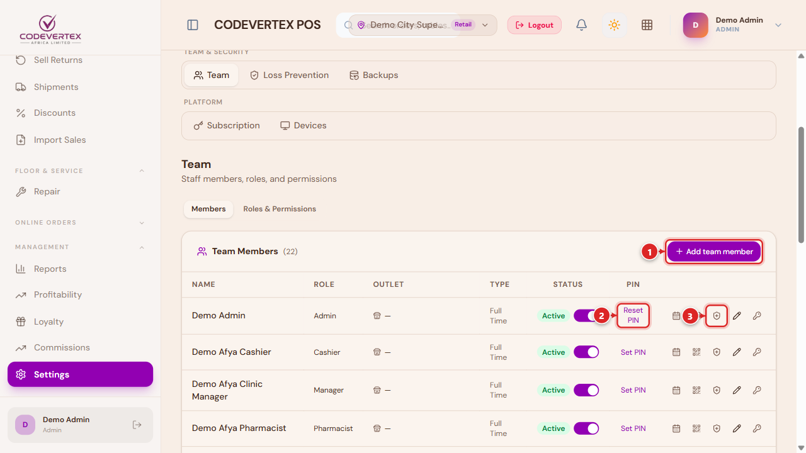
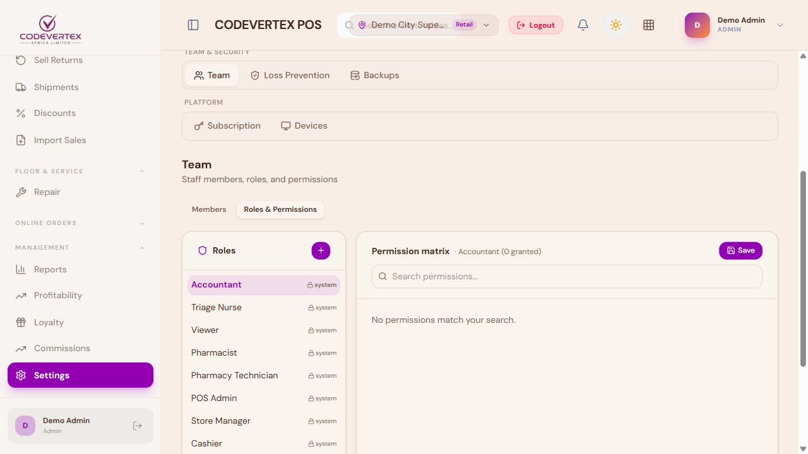
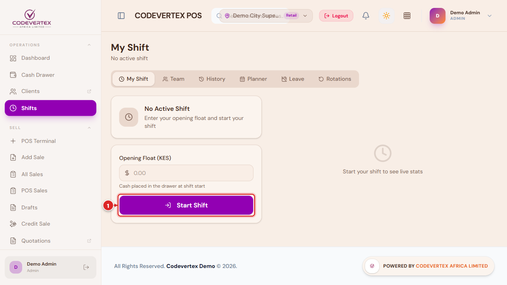
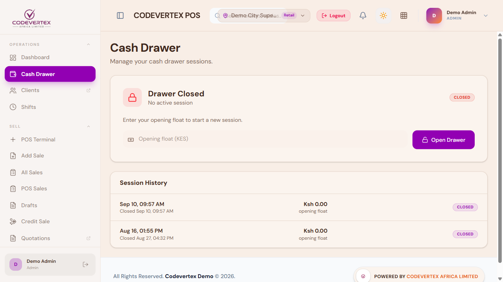
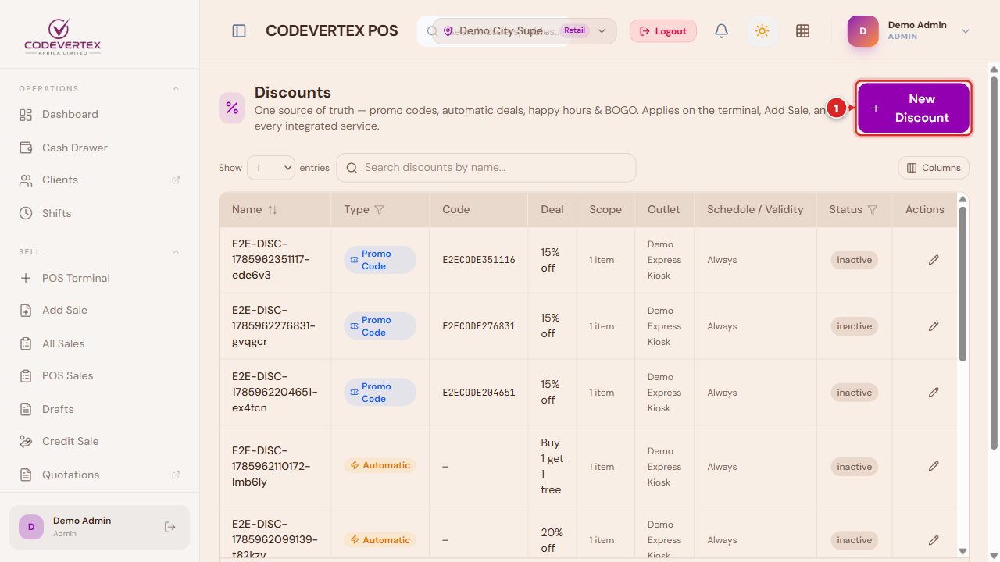
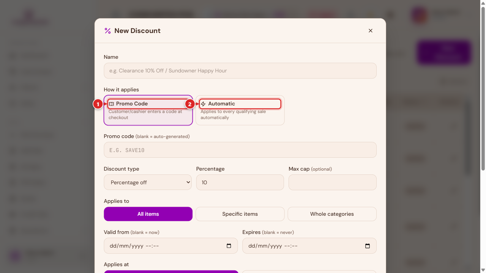

# Team, Shifts & Cash Management

This page covers the day-to-day management screens: who has access and to what, shift handovers,
the cash drawer, and setting up discounts and promotions. Staff accounts, organisation-level
roles, branches, and billing are managed separately in the centralized client portal — see
[Managing Your Organisation](../organisation/managing-your-organisation.md). This page's
**Team** section (below) is the POS-specific piece: which POS permissions a role has, and setting
an individual staff member's PIN.

## Team

> **Direct link:** `https://pos.codevertexafrica.com/{your-tenant-slug}/settings` (Team tab)

### Members

1. **Add team member** — invite someone new to POS access for this organisation.
2. **Reset PIN** (or **Set PIN** if they don't have one yet) — the PIN this person uses to log
   into a shared till or tablet throughout the rest of this guide.
3. **Extra roles** — grants ONE additional role's permissions on top of someone's base role,
   without changing their main role — for example, giving a specific waiter the ability to also
   see and settle every bill in the outlet ("super waiter"), rather than only their own tables.

### Roles & Permissions {: #roles-and-permissions }

Pick a role on the left, and its full permission matrix opens on the right — one row per module
(Orders, Payments, Catalog, Discounts, Reports, and so on), each with add/view/change/manage-style
toggles:

A role only sees and can act on what its permissions explicitly grant, module by module. Two
patterns worth knowing:

- **Self-approve permissions** (named `..._self`, e.g. voiding or overriding out-of-stock without
  a manager's sign-off) are separate, specific grants — not implied just by having a manager-level
  role. See [Approvals & Manager Overrides](approvals-and-overrides.md).
- **`pos.discounts.add`** is what lets a non-manager role apply discounts at all. Without it, the
  discount controls simply don't appear at their till — this isn't a bug, it's the intended way to
  extend discount rights to a trusted cashier without making them a manager.

New custom roles can be created directly from this screen for a permission combination your
organisation needs that doesn't match the built-in roles.

## Shifts

> **Direct link:** `https://pos.codevertexafrica.com/{your-tenant-slug}/shifts`

**Start Shift** records an **Opening Float** — the cash a cashier is handed to start the day —
and **End Shift** closes it out. Ending a shift with cash to reconcile opens a blind cash-up: you
count and submit what's actually in the drawer before you're shown the expected amount, so the
count reflects what you found, not what you assumed.

Roles that don't handle cash (waiter, kitchen, bar) get a simplified Start/End with no float step
at all.

## Cash Drawer

> **Direct link:** `https://pos.codevertexafrica.com/{your-tenant-slug}/drawer`

Shows whether the physical drawer is currently open or closed for this outlet, lets a cashier open
it with a starting float or close it out, and keeps a running history of past sessions. This is
the same drawer **Register Details** (on the terminal toolbar) reports against for the current
shift — see [Selling & Checkout](selling-and-checkout.md#register-details).

## Discounts and promotions {: #discounts-and-promotions }

> **Direct link:** `https://pos.codevertexafrica.com/{your-tenant-slug}/sell/discounts`

**New Discount** defines a reusable discount or promotion your team can apply at checkout (the
**Defined** tab in [Add discount](selling-and-checkout.md#discounts)), rather than a one-off
manual markdown:

Three kinds:

1. **Promo Code** — the customer or cashier types (or scans) a code at checkout.
2. **Automatic** — applies itself to a qualifying sale with no code needed.
3. **Time Window** — a happy-hour-style discount active only during configured hours (hospitality
   and quick-service outlets).

Each discount can be scoped to **all outlets** or just the one you're currently working in, and
can target specific items or categories rather than the whole sale.

## Common Issues

**A staff member can log in, but their role's permissions don't seem to be applied.** A role
change doesn't always take effect on an already-open session immediately — have them log out and
back in (or clear the app's cached data) after any role or permission change.

**I don't see a way to permanently delete a team member, only deactivate them.** That's expected —
permanently removing an account everywhere on the platform is a platform-level action, not a
regular admin capability here. Deactivating (rather than deleting) is the normal, reversible way
to remove someone's access.

**A promotion isn't applying automatically even though it should qualify.** Check that its
schedule (for a Time Window discount), outlet scope, and item/category targeting genuinely match
this sale — an automatic discount only fires when every one of its own conditions is met.

**A cashier can't see the discount button at all.** They need the **`pos.discounts.add`**
permission — see [Roles & Permissions](#roles-and-permissions) above. Without it, a non-manager
role has no discount controls at the till by design, not by accident.
