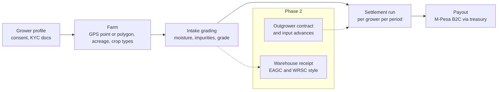
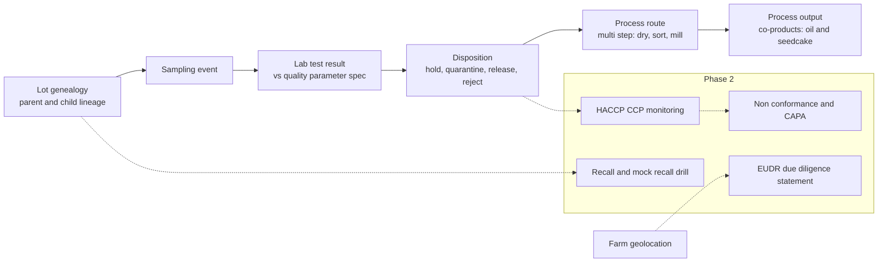
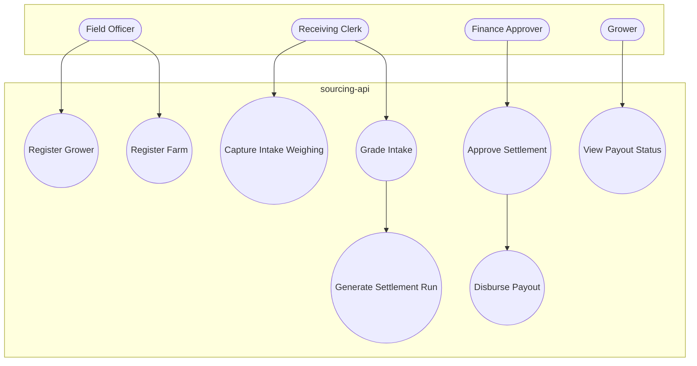
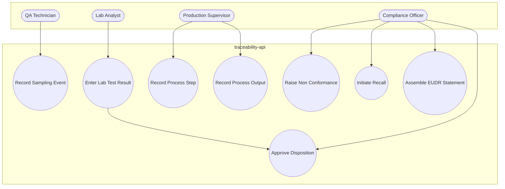
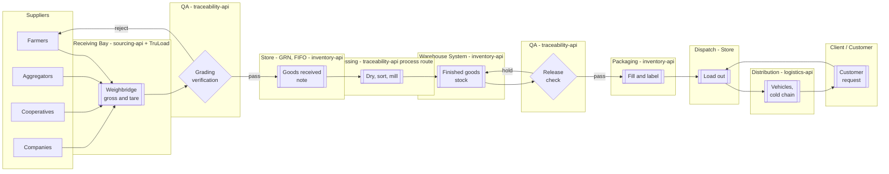
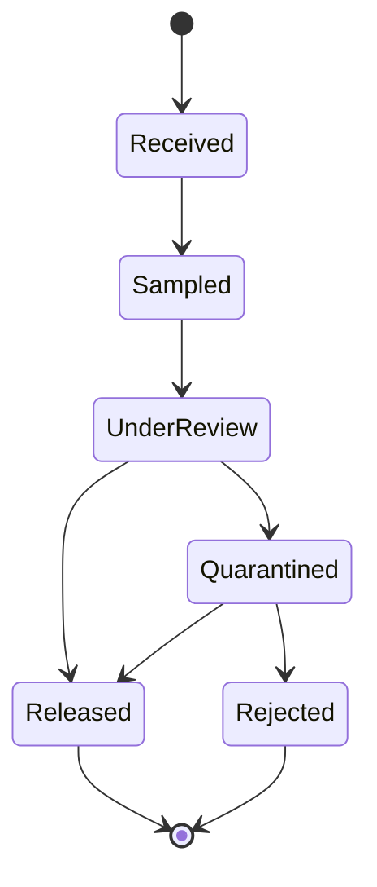
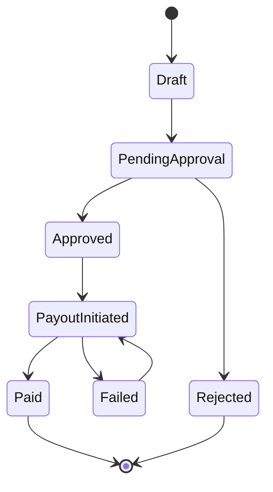
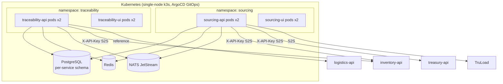

# Sourcing & Traceability Platform - Technology Architecture (Processa Integration)

<!-- Prepared by / Prepared for line + abstract -->

**Prepared by:** Codevertex Africa Limited &middot; Platform Engineering
**Prepared for:** Codevertex Engineering &mdash; ecosystem architecture record

This document defines how the agro-processing farm-to-shelf domain (grower sourcing, intake
grading, lot traceability, quality assurance, multi-step processing, packaging and distribution)
is integrated into the Codevertex micro-service ecosystem. It replaces **Processa** &mdash; a
standalone, ecosystem-unaware .NET/React ERP audited as part of this exercise &mdash; with a
reuse-first design: every capability Processa duplicates from the existing fleet (identity,
suppliers, purchase orders, goods-received notes, warehousing, stock, production, approvals,
finance) is dropped in favour of the fleet's own system of record, and only the genuinely new
ground becomes two new services: **`sourcing-api`** and **`traceability-api`**.

## Document Control

| Field | Value |
|---|---|
| Title | Sourcing & Traceability Platform - Technology Architecture |
| Version | 1.1 |
| Classification | Confidential |
| Integrator | Codevertex Africa Limited |
| Model | Reuse-first micro-service extension (two new Go/Next.js services) |
| Existing services touched | inventory-api, treasury-api, logistics-api, TruLoad, erp-api, auth-api, subscriptions-api, notifications-api |
| New services | sourcing-api / sourcing-ui, traceability-api / traceability-ui |
| Status | Architecture approved &middot; Phase 0 scaffolding in progress |

## 1. Executive Summary

Processa was built to solve a real problem: Kenyan sunflower-oil and maize-milling SMEs run
farmer intake, drying/milling, packaging and distribution on paper and spreadsheets, with no way
to prove where a batch of oil came from, no visibility into where losses occur between weighbridge
and warehouse, and no fast way to pay farmers what they are owed. Those problems are real and
worth solving. Processa's implementation is not: it was built with zero awareness of the
Codevertex ecosystem, and duplicates identity, RBAC, suppliers, purchase orders, goods-received
notes, warehouses, stock, production, quality, packaging, distribution, finance and approvals -
capabilities the fleet's `inventory-api`, `treasury-api`, `auth-api`, `logistics-api`, `erp-api`
and `TruLoad` already own, in most cases more completely than Processa itself.

- **The real gaps are narrower than Processa's feature list.** Grower/farm registry with
  geolocation, intake grading tied to a real weighbridge, lot genealogy with quality attributes,
  a lab/CoA/disposition workflow, multi-step multi-output process routes with mass balance, and a
  transparent grower-settlement-to-M-Pesa-payout loop - that is the entire genuinely new surface.
- **Almost everything else already exists**, often in a stronger form than Processa built: the
  fleet already runs a complete commercial weighbridge (TruLoad), a lab-test-with-reference-range
  engine (pos-api clinical module), cold-chain tracking (logistics-api), a financial approval
  engine with OTP (treasury-api), and a non-financial approval workflow engine (erp-api).
- **The plan**: reuse everything above as-is, make two small additive schema changes to
  `inventory-api` (lot lineage + quality attributes; GRN gross/tare weight), and stand up two new
  services - `sourcing-api` (grower/farm registry, intake grading, settlements + payouts) and
  `traceability-api` (lot genealogy, sampling/lab/CoA, process routes, HACCP, recall) - built to
  the exact same Go/Ent/Atlas/chi/NATS template as the fleet's most recent new service,
  `library-api`, with matching Next.js UIs that link out to `inventory-ui`/`treasury-ui`/
  `logistics-ui` rather than recreating their screens.

> Processa itself is not modified by this work. It is retired once a pilot tenant has been
> migrated onto the new architecture - a separate decommission step, deliberately out of scope
> for this build so it is not silently skipped.

## 2. The Industry Problem

Four regulatory and market forces make this more than a feature request:

- **KRA eTIMS (2026):** stock-in/stock-out records must sit behind every purchase; from January
  2026 KRA validates deducted costs against eTIMS data, and an uncertified movement gets its
  cost disallowed. `treasury-api` is already the fleet's single eTIMS fiscalisation point.
- **Kenya's Warehouse Receipt System (EAGC/WRSC):** a certified warehouse receipt lets a
  farmer or aggregator borrow 60 to 70 percent of deposited-grain value from a bank before sale -
  a real, government-backed financing instrument with no equivalent in Processa today.
- **KEBS aflatoxin limits + HACCP/FSSC 22000:** the maize aflatoxin limit is 10 micrograms per
  kilogram; digital lot traceability, CCP monitoring, non-conformance/CAPA and mock-recall drills
  are now the entry ticket to formal-channel and export buyers. Processa's quality check is
  pass/fail only, with no parameters, no CCPs, no CAPA and no recall.
- **EUDR (EU Deforestation Regulation):** binds micro/small operators from 30 December 2026 and
  requires plot-level geolocation (a point at six decimal places under four hectares, a polygon
  above) plus a due-diligence statement per export consignment. Kenya sits in the "standard risk"
  band with no relief.
- **Outgrower settlement trust:** the dominant Kenyan financing model for sunflower and sugar
  outgrowers is input-advance-now, deduct-at-settlement, and farmers commonly retain only 31 to
  34 percent of gross value precisely because the deduction math is opaque. A transparent
  settlement ledger with an M-Pesa B2C payout is the single highest-trust feature a processor can
  ship - and Processa has no payout side at all.

## 3. Current-State Ecosystem Map

The Codevertex fleet already owns almost every domain Processa reimplements. The diagram below
groups the fleet by the domain each service is the system of record for, and marks where the two
new services attach.

```mermaid
flowchart TB
    subgraph Identity["Identity & Platform"]
        AUTH[auth-api<br/>tenants, branding, users, RBAC, outlets]
        SUBS[subscriptions-api<br/>plans, tier limits, entitlements]
        NOTIF[notifications-api<br/>delivery + gating registry]
    end

    subgraph SupplyChain["Supply Chain & Manufacturing"]
        INV[inventory-api<br/>suppliers, PO, GRN, warehouses,<br/>stock, lots, production, recipes]
        LOG[logistics-api<br/>fleet, shipments, cold chain,<br/>chain of custody, routing]
        TRU[TruLoad<br/>commercial weighbridge<br/>two-pass weigh, tare history, tolerance]
    end

    subgraph Money["Money & People"]
        TRE[treasury-api<br/>invoices, AR/AP, GL, tax,<br/>KRA eTIMS, payouts]
        ERP[erp-api<br/>payroll, casual labour,<br/>ops approval workflows]
        POS[pos-api<br/>sales, clinical lab-test pattern]
    end

    subgraph NewServices["New: agro-processing domain"]
        SRC[sourcing-api<br/>grower and farm registry,<br/>intake grading, settlements, payouts]
        TRC[traceability-api<br/>lot genealogy, sampling and CoA,<br/>process routes, HACCP, recall]
    end

    SRC -->|S2S: create Supplier| INV
    SRC -->|S2S: create GRN| INV
    SRC -->|S2S: pull weigh ticket| TRU
    SRC -->|S2S: disburse payout| TRE
    TRC -->|S2S: reference lot| INV
    TRC -->|S2S: reference production batch| INV
    TRC -->|S2S: post co-product completion| INV
    TRC -->|reference shipment / cold chain| LOG
    SRC -->|auth| AUTH
    TRC -->|auth| AUTH
    SRC -->|entitlements| SUBS
    TRC -->|entitlements| SUBS
    SRC -->|events| NOTIF
    TRC -->|events| NOTIF
```

## 4. Technology Stack

| Layer | Technology |
|---|---|
| New backend services | Go 1.26, chi v5, Ent v0.14.5 + Atlas v1.1.0 (versioned migrations) |
| New frontend services | Next.js 16.2.3, React 19.2.4, TypeScript, Tailwind v4, `@bengo-hub/shared-ui-lib` |
| Data | PostgreSQL (per-service schema), Redis (tenant/branding cache), NATS JetStream (transactional outbox) |
| Shared libraries | `Bengo-Hub/httpware`, `Bengo-Hub/shared-events`, `Bengo-Hub/auth-client` (via `shared-auth-client` replace) |
| Auth | RS256 JWT/JWKS via `auth-api`, PIN/terminal HMAC fallback for factory-floor terminals |
| Existing weighbridge | .NET 8 (TruLoad), commercial weighing mode already shipped |
| Deployment | Docker, ArgoCD GitOps (`devops-k8s`), single generic Helm chart `charts/app` |
| Documents | `treasury-api` PDF/CSV/XLSX rendering engine (`internal/modules/docs`), per-service `DocumentSequence` |

## 5. New-Service Architecture

### 5.1 sourcing-api - grower & farm registry, intake, settlement, payout

`sourcing-api` never stores a duplicate supplier record. A grower is created as an `inventory-api`
Supplier (`category=Farmer|Aggregator|Cooperative`) via S2S; `sourcing-api` holds a thin overlay
keyed by `supplier_id`.

Module list: `growers`, `farms`, `contracts` (Phase 2), `intake`, `settlements`, `payouts`,
`warehouse-receipts` (Phase 2), plus the standard `platform/{cache,database,events,secrets}`,
`rbac`, `tenant`, `backup` modules every fleet service carries.

### 5.2 traceability-api - lot genealogy, quality, process, compliance

`traceability-api` references `inventory-api` lots and production batches by ID; it never forks
the stock ledger. Multi-output processing (a real gap: inventory's `ProductionBatch` is
single-output) is resolved by `traceability-api` owning the step/output ledger and posting one
inventory production-completion call per co-product on batch close.

Module list: `genealogy`, `sampling`, `quality-parameters`, `disposition`, `process-routes`,
`haccp` (Phase 2), `nonconformance` (Phase 2), `recall` (Phase 2), `eudr` (Phase 2), plus the same
standard platform modules as `sourcing-api`.

### 5.3 Scaffold pattern (both services)

Both services are built to the confirmed `library-api`/`library-ui` template:

- `module github.com/bengobox/{sourcing,traceability}-service`, Go 1.26, Ent v0.14.5 + Atlas v1.1.0
  (versioned migrations, `entrypoint.sh` runs migrate then serve - no raw `pg_advisory_lock`).
- `cmd/{api,migrate,seed}`, `internal/{app,config,ent/schema,events,http/{handlers,middleware,
  router},modules,platform/*}`.
- Router: `/{tenant}` group behind a four-layer gate - `RequireAnyAuth` (SSO JWT or terminal/PIN) -
  JIT user provisioning - `RequireActiveSubscriptionForMutationsWithGrace(7)` - Django-style
  `{service}.{module}.{view|manage}` permission gate. Unauthenticated: `/healthz`, `/readyz`,
  `/metrics`, `/v1/docs*`.
- Dockerfile: `golang:1.26-alpine` builder to `alpine:3.20` runtime, non-root uid 100 / gid 101.
- UI: Next.js 16.2.3 under `src/app/[orgSlug]/...`, SSO PKCE, `next-pwa`, linking out to
  `inventory-ui`/`treasury-ui`/`logistics-ui` for stock, money and shipment detail rather than
  recreating those screens.

## 6. Use Case Diagrams

Mermaid has no native UML use-case notation, so actors are drawn as stadium nodes and use cases as
circular nodes inside each service's boundary - the closest faithful rendering available in the
house diagram toolchain.

### 6.1 sourcing-api

### 6.2 traceability-api

## 7. Workflow & State Diagrams

### 7.1 Full farm-to-shelf workflow (swimlane view)

This mirrors the original whiteboard process map end to end, with each lane owned by an existing
or new service.

### 7.2 Lot disposition state machine

### 7.3 Settlement run state machine

## 8. Deployment & Infrastructure Architecture

| Control | Implementation |
|---|---|
| Registration | Drop `devops-k8s/apps/{sourcing,traceability}-{api,ui}/{app.yaml,values.yaml}` - the app-of-apps picks it up automatically, no registry edit |
| Secrets | Shared `INTERNAL_SERVICE_KEY` for S2S; per-service `TERMINAL_JWT_SECRET`; new `case` branches in `create-service-secrets.sh` |
| Ingress | nginx + `letsencrypt-prod`, hosts `sourcingapi`/`sourcing` and `traceabilityapi`/`traceability`.codevertexafrica.com |
| High availability | `replicaCount: 2`, `pdb.minAvailable: 1` per [[ha-min-2-pods-and-pdb]] |
| Migrations | Ent versioned migrations applied by `entrypoint.sh` before serving; no online-diff auto-migrate |

## 9. Data Ownership Matrix

The single governing rule: a service that already owns a domain keeps owning it. Neither new
service stores a second copy of any of the rows below.

| Domain | System of record | New service touches it via |
|---|---|---|
| Tenants, branding, users, RBAC, outlets | `auth-api` | JWT claims, JIT provisioning |
| Subscription plans, tier limits, entitlements | `subscriptions-api` | `ConsumerHasFeature` S2S |
| Supplier master (incl. KRA PIN, M-Pesa/bank payout fields) | `inventory-api` | S2S create/read `Supplier` |
| Purchase orders, GRN, 3-way match | `inventory-api` | S2S create GRN from intake grading |
| Warehouses, storage locations, stock balances, transfers, stock counts | `inventory-api` | reference only |
| Lots, serials, expiry | `inventory-api` | reference by `lot_id`; additive lineage/quality columns |
| Recipes/BOM, production work orders | `inventory-api` | reference `recipe_id`/`production_batch_id` |
| Machines/equipment | `inventory-api` (`Asset`) | reference `asset_id` |
| Commercial weighbridge (weigh, tare, tolerance, calibration) | TruLoad | S2S pull of weigh tickets |
| Vehicles, fleet KYC, shipments, cold chain, chain of custody | `logistics-api` | reference only |
| Customers/CRM | `marketflow-api` | `crm_contact_id` reference only, where applicable |
| Invoices, AR/AP, GL, tax, KRA eTIMS, payment/payout rails | `treasury-api` | S2S payout disburse; S2S document render |
| Payroll, casual labour, non-financial approval workflows | `erp-api` | not directly integrated in Phase 1 |
| Notification delivery + gating registry | `notifications-api` | new `sourcing/*`/`traceability/*` template IDs |

## 10. Security & Multi-Tenancy

- Identity, RBAC and tenant isolation are inherited entirely from `auth-api` - neither new service
  implements its own authentication. Terminal/PIN access (factory-floor receiving-bay and lab
  terminals) uses the same self-signed HMAC pattern as `library-api`/`pos-api`, never the shared
  platform key.
- Every mutating S2S call carries `X-API-Key` (the shared `INTERNAL_SERVICE_KEY`) plus an explicit
  `X-Tenant-ID` - the fleet-wide lesson from [[inventory-stock-depletion-model]] is that omitting
  the tenant header silently resolves to the platform tenant.
- No PII duplication: grower personal data (name, phone, national ID) lives once, on the
  `inventory-api` Supplier record; `sourcing-api` stores only the `supplier_id` reference plus
  consent metadata.
- Financial movement (settlement payouts) is executed exclusively by `treasury-api`; `sourcing-api`
  never talks to M-Pesa directly, closing the class of bug where a new service reimplements a
  payment rail with weaker idempotency than the incumbent.

## 11. Reliability & Operations

- Both new services publish to and consume from NATS JetStream via a transactional outbox,
  matching the fleet-wide idempotent `QueueSubscribe` pattern from [[project_events_uniformity]].
- Settlement runs and process mass-balance reconciliation are the two money/yield-critical
  calculations in this domain and require dedicated regression tests per
  [[feedback_workflow_rules]] before any push to main.
- Backups follow the tenant-scoped, service-owned pattern already standard across the fleet
  ([[feedback_tenant_scoped_backups]]) - no platform-wide dump exposed through either new UI.

## 12. Phased Implementation Plan

**Phase 0 - scaffolding.** Stand up `sourcing-api`/`sourcing-ui` and `traceability-api`/
`traceability-ui` from the `library-api`/`library-ui` template; wire S2S clients to inventory,
treasury, logistics, TruLoad, notifications, subscriptions; register both services in
`devops-k8s`, `subscriptions-api`'s feature catalog and `notifications-api`'s gating registry;
add the agro-processing tenant use-case to `auth-api`.

**Phase 1 - core farm-to-store loop.** Grower and farm registry; intake grading against a TruLoad
weigh ticket, creating the inventory GRN; the small additive `inventory-api` changes (lot parent
lineage, quality attributes, GRN gross/tare weight); lot genealogy, sampling/lab/CoA and
disposition; multi-step process route with multi-output mass balance; settlement run through to
treasury M-Pesa B2C payout; both UIs shipped end to end; full verification and this document's
first regeneration.

**Phase 2 - compliance & finance depth.** Outgrower contracts and input advances (deduction-at-
settlement); warehouse receipts (EAGC/WRSC style); HACCP CCP monitoring, non-conformance and
CAPA; recall and mock-recall drills; EUDR due-diligence statement assembly; cold/storage
compliance layered on `logistics-api`'s existing temperature fields.

**Processa decommission** (separate from this build). After Phase 1 is validated on a pilot
tenant, migrate that tenant's live data into the new architecture and retire the standalone
monolith.

## 13. Verification & Testing Strategy

- `go build ./... && go vet ./...` and a full `go test ./...` pass per new service, with
  dedicated use-case tests for settlement netting math and multi-output mass-balance
  reconciliation - both are money- or yield-critical.
- `pnpm build` green for both new UIs (never `npm`); Swagger regenerated and served at
  `/v1/docs/` for both APIs.
- An end-to-end pilot flow on a demo tenant: create grower, register farm, simulate a TruLoad
  weigh ticket, run intake grading, confirm the GRN lands in `inventory-api`, record lot
  genealogy and a lab result, release the disposition, run a multi-step multi-output process
  route, confirm co-products land in inventory stock, run a settlement, confirm the treasury
  M-Pesa B2C payout fires, confirm notifications are gated correctly, and confirm this document's
  PDFs regenerate cleanly.
- A duplication audit: spot-check that neither new service's tables hold anything beyond an ID or
  reference into `inventory-api`/`treasury-api`/`logistics-api`/`auth-api` - never a second copy of
  Supplier, GRN, stock or payment data.

## 14. Appendix - Processa Audit Summary

The full Processa codebase audit (backend `Processa.*` modules, frontend React/Vite pages,
security findings, and domain-correctness findings such as inventory valuation never recording a
unit cost, double-counted stock on receipt, and production cancellation silently destroying
inventory) is retained as a separate working document and is the source for the "reuse vs new"
classification in Section 9 of this architecture.

## 15. Declarations and Sign-Off

  

    
Architecture Approval

    

      
<label>Name</label>

      
<label>Role</label>

      
<label>Date</label>

    

  

