# Sourcing & Traceability Platform - Flow & BPMN Walkthrough

<!-- Each "## " heading below becomes one landscape slide. Keep sections short. -->

## Executive Summary

Processa proved the problem is real: Kenyan agro-processors need farm-to-shelf traceability,
weighbridge-accurate intake, quality-gated release, and transparent grower payouts. Its
implementation duplicated the Codevertex ecosystem instead of joining it.

- **Reuse everything that already exists**: identity, suppliers, purchase orders, GRN,
  warehouses, stock, production, weighbridge, cold chain, financial approvals, payouts.
- **Build only the genuinely new ground**: two services, `sourcing-api` and `traceability-api`.
- **Zero duplicate systems of record** - every new table holds an ID reference, never a copy.

## The Real Problem

- **eTIMS (2026)**: KRA validates stock movements against fiscal data - uncertified costs get
  disallowed. `treasury-api` is already the fleet's single fiscalisation point.
- **Warehouse Receipt System (EAGC/WRSC)**: a certified receipt unlocks 60 to 70 percent bank
  credit against deposited grain - a real Kenyan financing instrument, unmodelled today.
- **KEBS/HACCP/FSSC 22000**: aflatoxin limit 10 &micro;g/kg on maize; digital traceability, CCP
  monitoring, NC/CAPA and mock-recall drills are now the entry ticket to formal-channel buyers.
- **EUDR**: binds micro/small operators from 30 December 2026 - plot-level geolocation and a
  due-diligence statement per export consignment, no relief for Kenya.
- **Outgrower trust**: farmers often keep only 31 to 34 percent of gross value because settlement
  deductions are opaque - a transparent settlement ledger with M-Pesa payout is the single
  highest-trust feature a processor can ship.

## Reuse-First: The Current Ecosystem

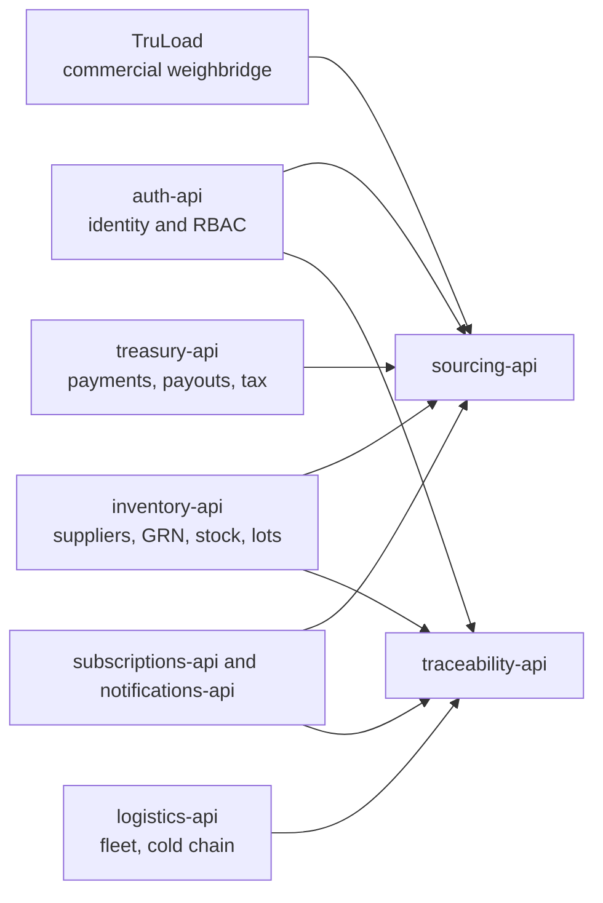

Nothing in this diagram is rebuilt. `sourcing-api` and `traceability-api` are the only new boxes.

## Use Case Diagram - sourcing-api

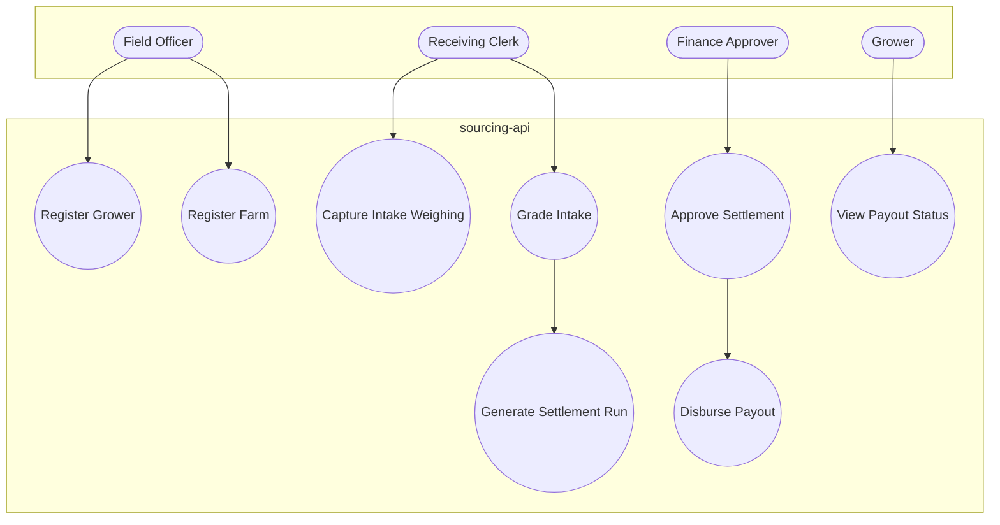

## Use Case Diagram - traceability-api

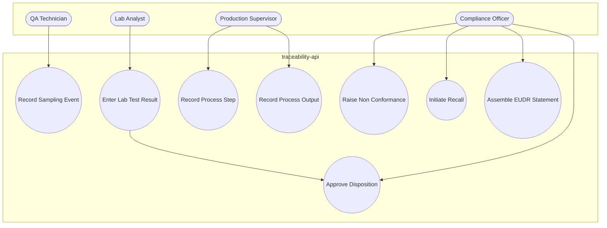

## Flow 1 - Grower Intake to Settlement (BPMN-style)

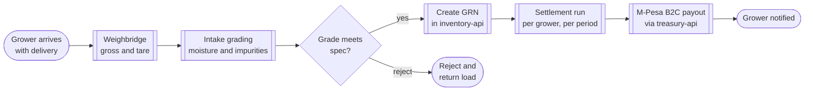

## Flow 2 - Lot Genealogy Through Dispatch (BPMN-style)

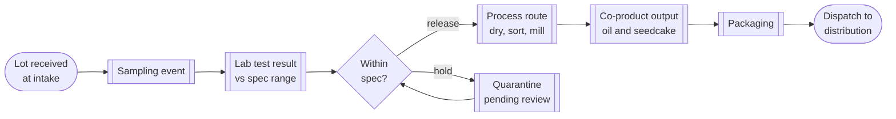

## Flow 3 - Recall & Mock-Recall Traversal

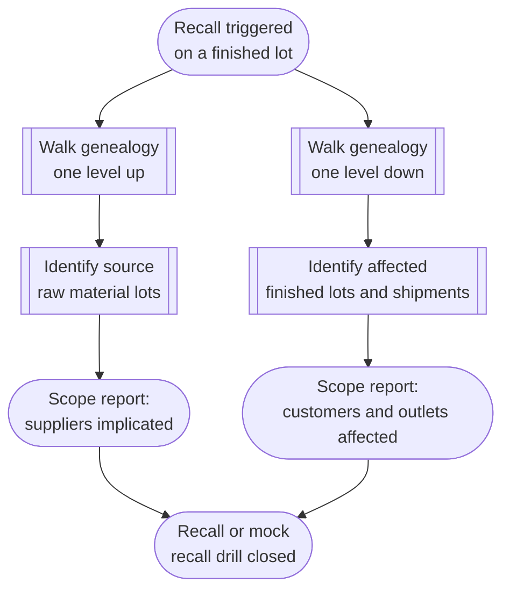

## Flow 4 - EUDR Due-Diligence Assembly (Phase 2)

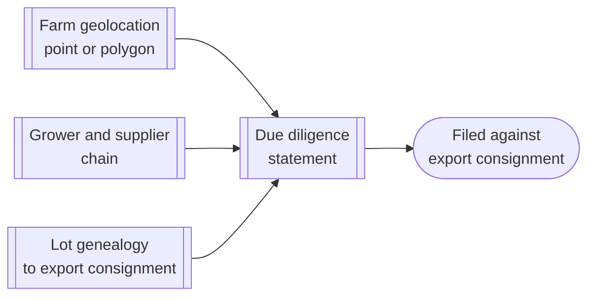

## Workflow - Full Farm-to-Shelf Swimlane

This mirrors the original whiteboard process map end to end, each lane owned by an existing or
new service.

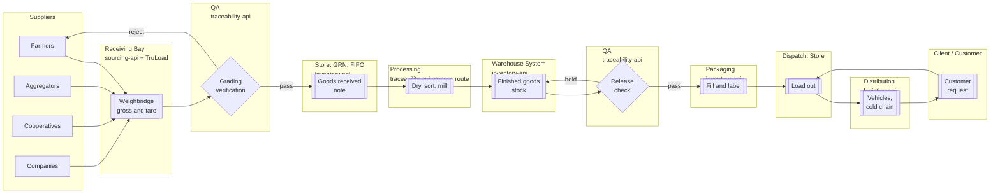

## Workflow - Lot Disposition State Machine

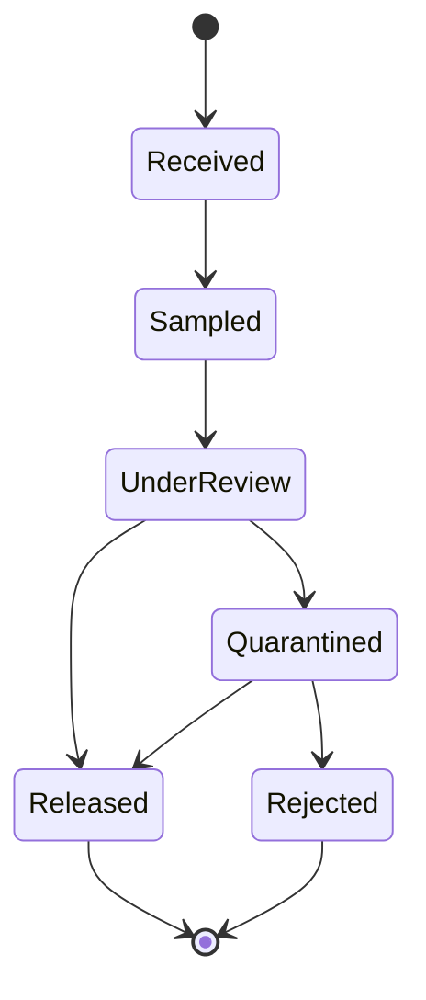

## Workflow - Settlement Run State Machine

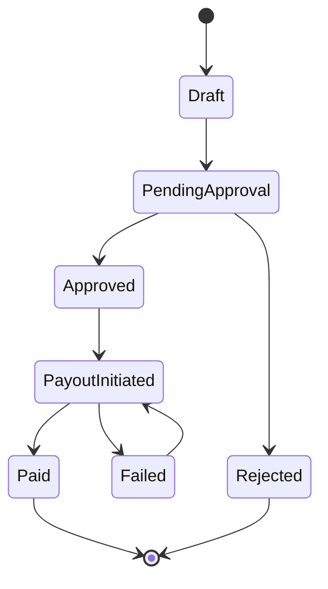

## Data Flow - Grower Registration

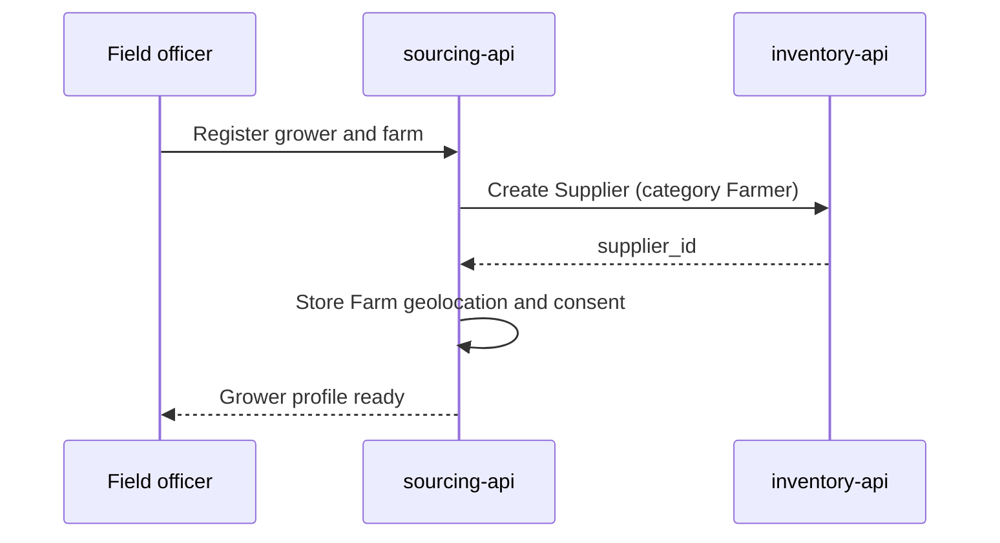

## Data Flow - Intake Grading & GRN

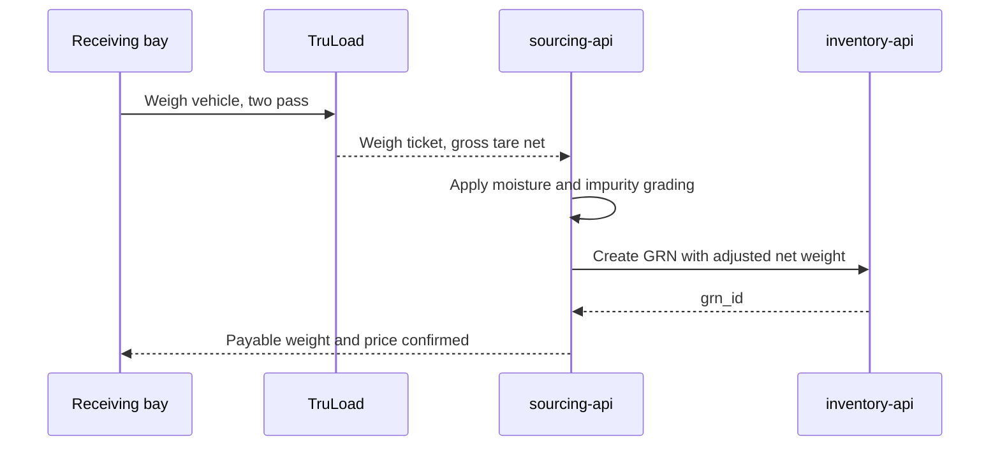

## Data Flow - Sampling, Lab & Disposition

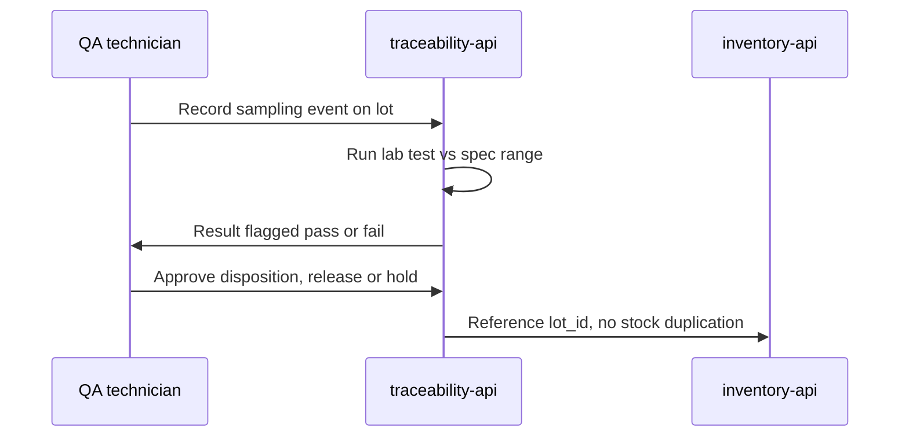

## Data Flow - Process Route & Mass Balance

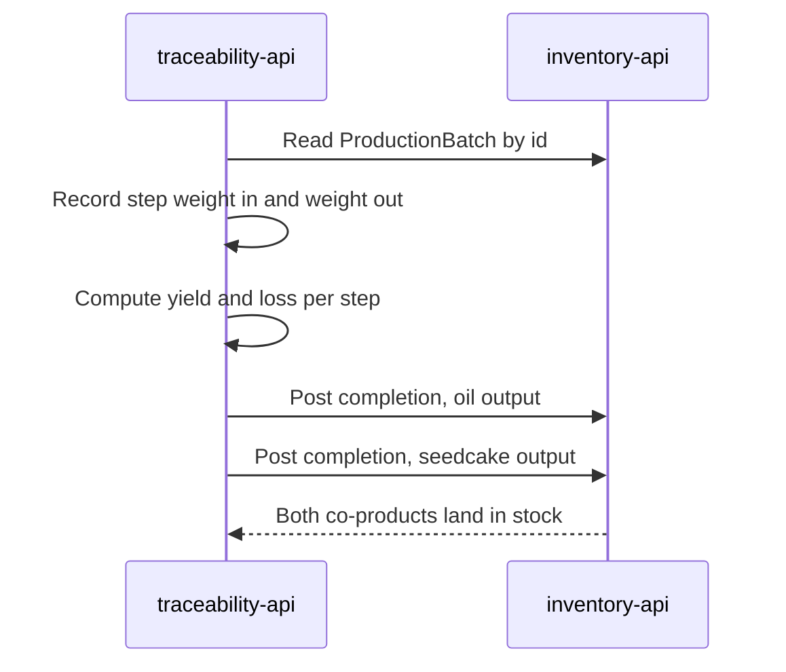

## Data Flow - Settlement & Payout

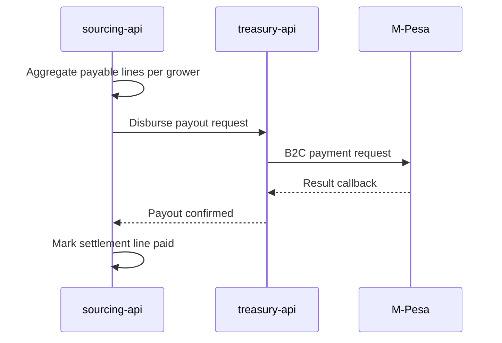

## New Services At a Glance

| Service | Owns | Never duplicates |
|---|---|---|
| `sourcing-api` | Grower overlay, farm geolocation, intake grading, settlement runs | Supplier master, GRN, payment rails |
| `traceability-api` | Lot genealogy, sampling/lab/CoA, process routes, HACCP (Phase 2) | Stock ledger, production batch, cold-chain data |

Both built on the confirmed `library-api`/`library-ui` template: Go 1.26, Ent + Atlas, chi,
NATS outbox, Next.js 16.2.3, SSO PKCE.

## Phased Implementation

| Phase | Scope |
|---|---|
| 0 | Scaffold both services, wire S2S clients, register in devops-k8s/subscriptions/notifications/auth |
| 1 | Grower and farm registry, intake grading, lot genealogy, sampling/lab/CoA, process route with mass balance, settlement and payout |
| 2 | Outgrower contracts, warehouse receipts, HACCP/CCP, NC/CAPA, recall drills, EUDR DDS |
| Decommission | Migrate a pilot tenant off Processa once Phase 1 is validated |

## Next Steps

- Approve Phase 0 scaffolding for `sourcing-api` and `traceability-api`.
- Confirm the additive `inventory-api` schema changes (lot lineage, quality attributes, GRN
  gross/tare weight) with the inventory-api maintainers.
- Confirm the TruLoad weigh-ticket S2S contract and the TruLoad-to-Codevertex tenant mapping.
- Schedule the Phase 1 end-to-end pilot on a demo tenant.
